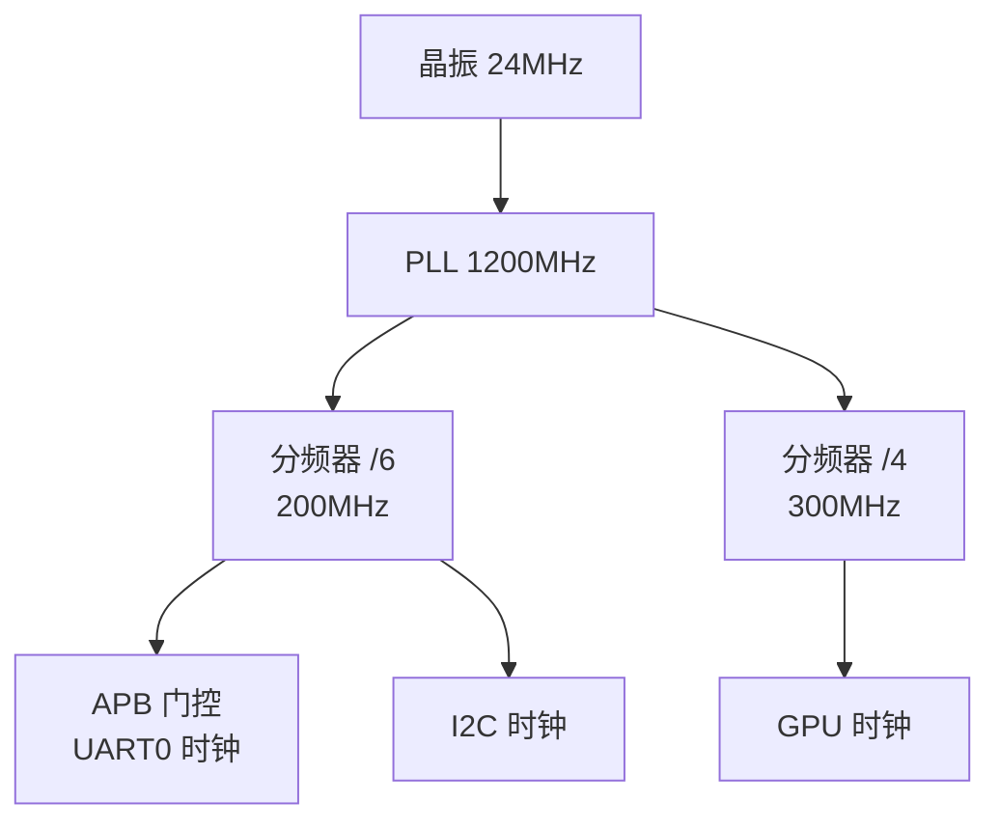

---
tags:
  - Linux
  - 内核
  - 驱动
title: Clock 与 Pinctrl 子系统
description: 时钟树与 CCF、clk 消费者 API、Pinctrl 引脚复用、与设备树的配合
date: 2026/06/06
---

# Clock 与 Pinctrl 子系统

几乎每个外设驱动都会用到这两个子系统：**Clock（时钟）** 控制外设的工作频率，**Pinctrl（引脚控制）** 配置引脚的复用功能。两者都通过设备树描述、通过 API 使用，是驱动开发的基础设施。

---

## 第一部分：Clock 子系统

### 1. 为什么需要 Clock 子系统

SoC 内部有一棵**时钟树**：有晶振（根时钟）、PLL（锁相环，倍频）、分频器、门控等节点。外设挂在时钟树的某个节点上，需要：
- **使能时钟**（开关，控制功耗）
- **查询/设置频率**
- **多级依赖**（父时钟使能，子时钟才能工作）

**CCF（Common Clock Framework）** 是 Linux 统一管理所有时钟的框架，驱动通过 `clk_*` API 使用时钟，不直接操作寄存器。

### 2. 时钟树示意



驱动只关心自己的那个节点，不需要了解整棵树的细节。

### 3. 设备树中声明时钟

```dts
/* 时钟提供者（由 BSP/SoC 厂商写，驱动开发者通常不需要写）*/
clk_apb: clock@ff100000 {
    compatible = "vendor,clk-apb";
    reg = <0xff100000 0x100>;
    #clock-cells = <1>;   /* 1 = 需要一个参数标识具体时钟 */
};

/* 时钟消费者（外设驱动对应的 DTS 节点）*/
uart0: serial@ff000000 {
    compatible = "vendor,uart";
    reg = <0xff000000 0x1000>;
    clocks = <&clk_apb 1>, <&clk_apb 2>;  /* 引用 clk_apb 的第 1 和第 2 个时钟 */
    clock-names = "apb_pclk", "uart_clk"; /* 名字，驱动通过名字获取 */
};
```

### 4. 消费者 API（驱动开发者常用）

```c
#include <linux/clk.h>

/* --- 获取时钟 --- */

/* 按名字获取（推荐，对应 clock-names 里的名字）*/
struct clk *clk = devm_clk_get(dev, "uart_clk");
if (IS_ERR(clk))
    return PTR_ERR(clk);

/* 如果时钟可选（DTS 里可能没有）*/
struct clk *clk = devm_clk_get_optional(dev, "baud_clk");
if (IS_ERR(clk))
    return PTR_ERR(clk);
/* clk 为 NULL 表示时钟不存在，可以继续 */

/* --- 使能/禁用 --- */

/* prepare_enable = prepare + enable（两步合一，大多数情况用这个）*/
int ret = clk_prepare_enable(clk);
if (ret) {
    dev_err(dev, "failed to enable clock: %d\n", ret);
    return ret;
}

/* 驱动 remove / suspend 时关闭 */
clk_disable_unprepare(clk);

/* --- 频率操作 --- */

/* 查询当前频率 */
unsigned long rate = clk_get_rate(clk);
dev_dbg(dev, "uart clock: %lu Hz\n", rate);

/* 设置频率（驱动请求，CCF 找最接近的实际频率）*/
int ret = clk_set_rate(clk, 115200 * 16);  /* UART 需要 baud * 16 的时钟 */

/* 查询 CCF 实际会设置的频率（不实际设置）*/
unsigned long actual = clk_round_rate(clk, 115200 * 16);
```

### 5. prepare 和 enable 的区别

| 操作 | 说明 |
|------|------|
| `clk_prepare` | 可能睡眠（等待锁相环锁定等），在进程上下文调用 |
| `clk_enable` | 不睡眠（只是开门控寄存器），可在中断上下文调用 |
| `clk_prepare_enable` | 两步合并，**只能在进程上下文**调用 |
| `clk_disable_unprepare` | 关闭，两步合并 |

### 6. devm 与 remove 时的资源管理

使用 `devm_clk_get` 后，不需要手动 `clk_put`，但仍需手动 `clk_disable_unprepare`（因为 CCF 不知道你 enable 了多少次）：

```c
/* 最优实践：用 devm_add_action_or_reset 注册 disable 回调 */
static void mydev_clk_disable(void *clk)
{
    clk_disable_unprepare(clk);
}

static int mydev_probe(struct platform_device *pdev)
{
    struct clk *clk = devm_clk_get(dev, "apb");
    ret = clk_prepare_enable(clk);
    if (ret) return ret;

    /* 注册 disable 回调，probe 失败或 remove 时自动调用 */
    ret = devm_add_action_or_reset(dev, mydev_clk_disable, clk);
    if (ret) return ret;

    /* 以下代码不需要 goto err 处理 clk 了 */
}
```

---

## 第二部分：Pinctrl 子系统

### 7. 为什么需要 Pinctrl

SoC 的引脚是**复用**的：同一个物理引脚可以是 GPIO、UART TX、I2C SDA、PWM 等不同功能。**Pinctrl 子系统**管理引脚的功能切换（mux）和电气特性（pull-up/down、驱动强度、电平标准）。

```text
物理引脚 PA12：
  - 功能 0：GPIO 输出
  - 功能 1：UART0_TX
  - 功能 2：I2C0_SDA
  - 功能 3：PWM0
```

### 8. 设备树中描述引脚配置

```dts
/* Pinctrl 节点（由 BSP 厂商写，描述所有可能的引脚状态）*/
&pinctrl {
    /* UART0 引脚配置 */
    uart0_pins_default: uart0-pins-default {
        pins = "PA12", "PA13";      /* 物理引脚名 */
        function = "uart0";         /* 切到 uart0 功能 */
        drive-strength = <4>;       /* 驱动强度（mA）*/
    };

    uart0_pins_sleep: uart0-pins-sleep {
        pins = "PA12", "PA13";
        function = "gpio";          /* 睡眠时切回 GPIO，省电 */
        bias-pull-down;             /* 下拉 */
    };

    /* I2C 引脚 */
    i2c0_pins: i2c0-pins {
        pins = "PA14", "PA15";
        function = "i2c0";
        bias-pull-up;               /* I2C 需要上拉 */
    };
};

/* 外设节点引用引脚状态 */
&uart0 {
    pinctrl-names = "default", "sleep";   /* 状态名列表 */
    pinctrl-0 = <&uart0_pins_default>;    /* state 0 = default */
    pinctrl-1 = <&uart0_pins_sleep>;      /* state 1 = sleep */
    status = "okay";
};
```

### 9. 驱动侧 API

**大多数情况下，驱动不需要手动操作 Pinctrl**——内核会自动在 `probe` 时切到 `default` 状态，在 `suspend` 时切到 `sleep` 状态。

只有当驱动需要**主动切换引脚状态**时，才用以下 API：

```c
#include <linux/pinctrl/consumer.h>

/* 获取 pinctrl 句柄（通常在 probe 里）*/
struct pinctrl *pctl = devm_pinctrl_get(dev);
if (IS_ERR(pctl))
    return PTR_ERR(pctl);

/* 获取状态句柄 */
struct pinctrl_state *state_default = pinctrl_lookup_state(pctl, "default");
struct pinctrl_state *state_active  = pinctrl_lookup_state(pctl, "active");

/* 切换状态 */
ret = pinctrl_select_state(pctl, state_active);
```

### 10. 常见电气属性

| DTS 属性 | 含义 |
|----------|------|
| `bias-pull-up` | 使能上拉电阻 |
| `bias-pull-down` | 使能下拉电阻 |
| `bias-disable` | 禁用上下拉（浮空）|
| `drive-strength = <N>` | 驱动强度（mA），常见 2/4/8/12 |
| `input-enable` | 使能输入功能 |
| `output-high` / `output-low` | 输出初始电平 |
| `slew-rate = <N>` | 上升/下降速率（影响 EMI）|

---

## 第三部分：Clock 与 Pinctrl 联合调试

### 11. 时钟调试

```bash
# 查看系统时钟树（需要 CONFIG_COMMON_CLK_DEBUG=y）
cat /sys/kernel/debug/clk/clk_summary
# 输出：
#                                 enable  prepare  protect                   rate   accuracy   phase
# clock                          count    count    count        (Hz)          (ppb)  (degrees)
# -----------------------------------------------------------------------------------------------------
# osc24m                             1        1        0    24000000            0         0
#    pll-cpu                         1        1        0  1200000000            0         0
#       apb-clk                      3        3        0   100000000            0         0

# 查看特定时钟
cat /sys/kernel/debug/clk/apb-clk/clk_rate
cat /sys/kernel/debug/clk/apb-clk/clk_enable_count
```

### 12. Pinctrl 调试

```bash
# 查看所有已注册的 pinctrl 设备
ls /sys/kernel/debug/pinctrl/

# 查看引脚状态（哪个引脚在哪个 mux 状态）
cat /sys/kernel/debug/pinctrl/pinctrl-rockchip/pinmux-pins

# 查看引脚组
cat /sys/kernel/debug/pinctrl/pinctrl-rockchip/pingroups
```

---

## 常见问题排查

| 问题 | 原因 | 排查 |
|------|------|------|
| `devm_clk_get` 返回 `-ENOENT` | DTS 里没有 `clocks` / `clock-names`，或名字不匹配 | 检查 DTS 节点和 `clock-names` |
| `clk_prepare_enable` 返回 `-EINVAL` | 时钟提供者未注册 | 确认 BSP 时钟驱动已加载（`dmesg | grep clk`）|
| Probe 成功但外设不工作 | 时钟频率不对 | `cat /sys/kernel/debug/clk/XXX/clk_rate` |
| I2C 通信失败/UART 乱码 | 引脚未切到正确功能（pinmux 错误）| 检查 pinctrl 节点，查 `/sys/kernel/debug/pinctrl/*/pinmux-pins` |
| 引脚电平浮动 | 没有配置 bias-pull-up/down | DTS 里添加 `bias-pull-up` 或 `bias-pull-down` |

---

## 延伸阅读

- [[linux/内核机制/设备树内核 API（OF API）]]（`devm_clk_get`、`devm_gpiod_get` 等 API 汇总）
- [[linux/内核机制/GPIO 与 gpiod 子系统]]（GPIO 专题）
- [[linux/驱动与模块/platform 驱动完整案例]]（综合案例）
- `Documentation/driver-api/clk.rst`（内核文档）
- `Documentation/devicetree/bindings/pinctrl/`（各 SoC pinctrl binding）
