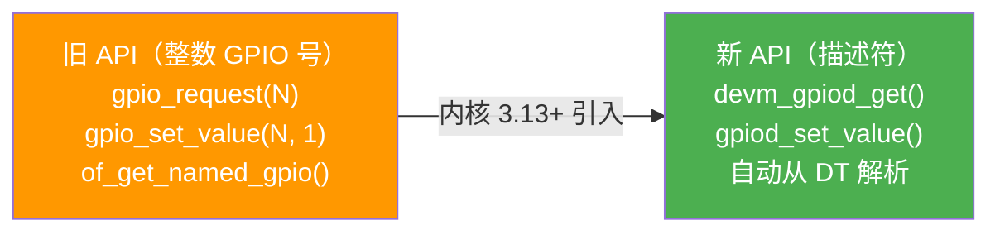

---
tags:
  - Linux
  - 内核
  - GPIO
title: GPIO 与 gpiod 子系统
description: gpiod descriptor API、设备树 GPIO 属性、GPIO 中断、调试工具与常见陷阱
date: 2026/06/06
---

# GPIO 与 gpiod 子系统

GPIO 是嵌入式驱动里使用最频繁的资源之一——复位引脚、片选、中断信号、电源使能都离不开它。Linux 内核经历了从旧整数 API 到现代 **descriptor（描述符）API** 的演进，新代码应该使用描述符 API。

---

## 1. 两套 API 的历史



**结论**：新驱动一律使用 `gpiod_*` API，旧代码看到 `gpio_request` / `of_get_named_gpio` 时要知道它们是旧风格。

---

## 2. 设备树中的 GPIO 属性

### 2.1 GPIO 属性命名规范

```dts
mydev {
    compatible = "vendor,mydev";

    /* 格式：<功能名>-gpios = <&控制器 引脚号 标志>; */
    reset-gpios  = <&gpio0 5 GPIO_ACTIVE_LOW>;   /* 低电平复位 */
    enable-gpios = <&gpio1 3 GPIO_ACTIVE_HIGH>;  /* 高电平使能 */
    cs-gpios     = <&gpio2 7 GPIO_ACTIVE_LOW>,   /* 多个同功能 GPIO */
                   <&gpio2 8 GPIO_ACTIVE_LOW>;
};
```

**GPIO 标志（第三个参数）：**

| 标志 | 含义 |
|------|------|
| `GPIO_ACTIVE_HIGH` | 高电平有效（0 = inactive，1 = active）|
| `GPIO_ACTIVE_LOW` | 低电平有效（0 = inactive = 物理高，1 = active = 物理低）|
| `GPIO_OPEN_DRAIN` | 开漏输出（可与 ACTIVE_LOW 组合）|
| `GPIO_OPEN_SOURCE` | 开漏输出（高电平驱动）|

**关键**：描述符 API 用**逻辑值**（0 = inactive，1 = active），自动处理 ACTIVE_LOW 的反转。不再需要驱动手动处理极性。

### 2.2 单个 GPIO vs 多个 GPIO

```dts
/* 单个 GPIO，功能名 "reset" */
reset-gpios = <&gpio0 5 GPIO_ACTIVE_LOW>;

/* 多个 GPIO（如 SPI 多片选），功能名 "cs" */
cs-gpios = <&gpio0 7 GPIO_ACTIVE_LOW>,
           <&gpio0 8 GPIO_ACTIVE_LOW>,
           <&gpio0 9 GPIO_ACTIVE_LOW>;
```

---

## 3. 描述符 API（驱动侧）

### 3.1 获取 GPIO

```c
#include <linux/gpio/consumer.h>

/* 按功能名获取（DTS 里 "reset-gpios" 对应功能名 "reset"）*/

/* 输出，初始低电平（逻辑 inactive）*/
struct gpio_desc *rst = devm_gpiod_get(dev, "reset", GPIOD_OUT_LOW);
if (IS_ERR(rst))
    return PTR_ERR(rst);

/* 输出，初始高电平（逻辑 active）*/
struct gpio_desc *en = devm_gpiod_get(dev, "enable", GPIOD_OUT_HIGH);

/* 输入 */
struct gpio_desc *irq_gpio = devm_gpiod_get(dev, "irq", GPIOD_IN);

/* 如果 GPIO 可选（DTS 里可能没有这个属性）*/
struct gpio_desc *opt = devm_gpiod_get_optional(dev, "power", GPIOD_OUT_LOW);
if (IS_ERR(opt))
    return PTR_ERR(opt);
/* opt 为 NULL 表示 GPIO 不存在，驱动跳过相关逻辑 */

/* 多 GPIO：获取第 N 个（0-based）*/
struct gpio_desc *cs0 = devm_gpiod_get_index(dev, "cs", 0, GPIOD_OUT_HIGH);
struct gpio_desc *cs1 = devm_gpiod_get_index(dev, "cs", 1, GPIOD_OUT_HIGH);
```

**初始化方向标志：**

| 标志 | 含义 |
|------|------|
| `GPIOD_OUT_LOW` | 输出，初始 inactive（对应 ACTIVE_LOW = 物理高，ACTIVE_HIGH = 物理低）|
| `GPIOD_OUT_HIGH` | 输出，初始 active |
| `GPIOD_IN` | 输入 |
| `GPIOD_ASIS` | 不改变方向（用于接管已配置的 GPIO）|

### 3.2 操作 GPIO

```c
/* 设置输出值（逻辑值：0 = inactive，1 = active）*/
gpiod_set_value(rst, 0);     /* inactive（释放复位）*/
gpiod_set_value(rst, 1);     /* active（进入复位）*/

/* 可能睡眠的版本（GPIO expander 通过 I2C 控制时必须用这个）*/
gpiod_set_value_cansleep(rst, 1);

/* 读输入值 */
int val = gpiod_get_value(irq_gpio);

/* 获取物理值（不做极性转换，诊断用）*/
int raw = gpiod_get_raw_value(rst);
```

### 3.3 GPIO 驱动一个典型复位序列

```c
/* 拉低复位引脚（assert reset）*/
gpiod_set_value_cansleep(priv->reset_gpio, 1);
msleep(10);  /* 保持 10ms */

/* 释放复位（deassert reset）*/
gpiod_set_value_cansleep(priv->reset_gpio, 0);
msleep(50);  /* 等待芯片启动 */
```

---

## 4. GPIO 中断

### 4.1 GPIO 转中断号

```c
/* 获取 GPIO 对应的中断号 */
int irq = gpiod_to_irq(priv->irq_gpio);
if (irq < 0) {
    dev_err(dev, "GPIO cannot generate interrupt\n");
    return irq;
}

/* 注册中断处理函数 */
ret = devm_request_irq(dev, irq, mydev_isr,
                       IRQF_TRIGGER_FALLING,  /* 下降沿触发 */
                       "mydev", priv);
if (ret)
    return ret;
```

### 4.2 DTS 中两种写法

**方法 1：DTS 里 interrupts 属性（硬件中断线接到 GIC）**

```dts
mydev {
    interrupts = <GIC_SPI 55 IRQ_TYPE_EDGE_FALLING>;
    /* 驱动用 platform_get_irq(pdev, 0) 获取 */
};
```

**方法 2：GPIO 引脚作为中断源（GPIO IRQ）**

```dts
mydev {
    irq-gpios = <&gpio0 10 GPIO_ACTIVE_LOW>;
    /* 驱动先 gpiod_get，再 gpiod_to_irq */
};
```

GPIO IRQ 适合 GPIO expander 或直接连到 SoC GPIO 控制器的信号。

### 4.3 中断触发类型

```c
/* 常用触发标志 */
IRQF_TRIGGER_RISING    /* 上升沿 */
IRQF_TRIGGER_FALLING   /* 下降沿 */
IRQF_TRIGGER_BOTH      /* 双边沿 */
IRQF_TRIGGER_HIGH      /* 高电平 */
IRQF_TRIGGER_LOW       /* 低电平 */
```

也可以在 DTS 里指定（`IRQ_TYPE_EDGE_FALLING` 等），然后驱动用 `IRQF_TRIGGER_NONE`（从 DTS 继承）。

---

## 5. GPIO 子系统调试

### 5.1 查看所有 GPIO 状态

```bash
# 查看所有注册的 GPIO（需要 CONFIG_GPIOLIB_IRQCHIP=y）
cat /sys/kernel/debug/gpio

# 输出示例：
# gpiochip0: GPIOs 0-31, parent: platform/ff720000.gpio, gpio0:
#  gpio-0   (                    |reset-gpio          ) out lo ACTIVE LOW
#  gpio-3   (                    |enable              ) out hi
#  gpio-10  (                    |irq-gpio            ) in  lo IRQ

# 字段含义：
# gpio-N   gpio 号
# (...)    driver name / consumer name
# out/in   方向
# lo/hi    当前电平
# ACTIVE LOW  低电平有效标志
# IRQ       配置为中断
```

### 5.2 用户态测试 GPIO（调试）

```bash
# 用户态 GPIO 控制（不推荐在生产代码中用，调试很方便）
# 使用 libgpiod 工具

# 查看 gpiochip
gpiodetect
# 输出：gpiochip0 [gpio0] (32 lines)

# 查看 GPIO 状态
gpioinfo gpiochip0

# 读 GPIO 值
gpioget gpiochip0 5

# 设置 GPIO 值（带 -l 表示低有效）
gpioset gpiochip0 3=1
gpioset --mode=time --usec=100000 gpiochip0 3=1  # 100ms 后恢复

# 监听 GPIO 中断
gpiomon gpiochip0 10
```

---

## 6. 常见陷阱

### 6.1 ACTIVE_LOW 混淆

```c
/* DTS：reset-gpios = <&gpio0 5 GPIO_ACTIVE_LOW>; */

/* 驱动逻辑：复位信号 active = 进入复位 */
gpiod_set_value(reset, 1);    /* ✅ 逻辑 1 = active = 物理低电平 */
gpiod_set_value(reset, 0);    /* ✅ 逻辑 0 = inactive = 物理高电平 */

/* 旧代码的错误写法（直接操作物理电平，忽略极性）*/
gpio_set_value(gpio_num, 0);  /* ❌ 直接写物理 0，需要自己记住这是低有效 */
```

### 6.2 在中断上下文操作可能睡眠的 GPIO

```c
/* ❌ GPIO expander（通过 I2C 控制）在中断上下文操作会死锁 */
static irqreturn_t my_isr(int irq, void *data)
{
    gpiod_set_value(priv->cs, 0);  /* 可能触发 I2C 睡眠，中断里禁止！*/
    return IRQ_HANDLED;
}

/* ✅ 用 threaded IRQ（线程化中断，在进程上下文执行）*/
ret = devm_request_threaded_irq(dev, irq,
    my_hardirq,   /* 硬中断：只做最少工作，返回 IRQ_WAKE_THREAD */
    my_thread_fn, /* 线程函数：可以睡眠 */
    IRQF_ONESHOT, "mydev", priv);
```

### 6.3 Pinctrl 与 GPIO 冲突

如果 DTS 里的 `pinctrl-0` 把某引脚配置为 UART 功能，但驱动又想用 `gpiod_get` 申请同一引脚为 GPIO，会失败。**解决**：在 Pinctrl 配置里明确把该引脚的功能改为 `gpio`。

---

## 7. 旧 API → 新 API 迁移对照

| 旧 API | 新 API |
|--------|--------|
| `of_get_named_gpio(np, "reset-gpios", 0)` | `devm_gpiod_get(dev, "reset", GPIOD_OUT_LOW)` |
| `gpio_request_one(N, GPIOF_OUT_INIT_LOW, "reset")` | `devm_gpiod_get(dev, "reset", GPIOD_OUT_LOW)` |
| `gpio_set_value(N, 1)` | `gpiod_set_value(gpiod, 1)` |
| `gpio_get_value(N)` | `gpiod_get_value(gpiod)` |
| `gpio_to_irq(N)` | `gpiod_to_irq(gpiod)` |
| `gpio_free(N)` | 无需（devm 自动管理）|

---

## 延伸阅读

- [[linux/内核机制/设备树内核 API（OF API）]]（GPIO 在 OF API 里的位置）
- [[linux/内核机制/Clock 与 Pinctrl 子系统]]（Pinctrl 配置 GPIO 复用功能）
- [[linux/内核机制/Linux 中断机制详解]]（threaded IRQ 原理）
- `Documentation/driver-api/gpio/consumer.rst`（内核官方文档）
