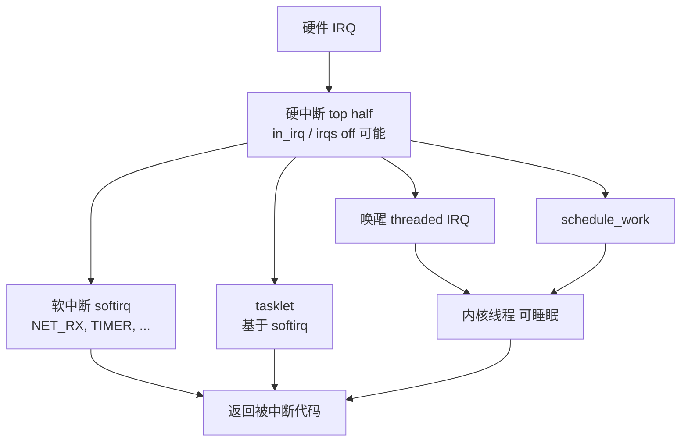
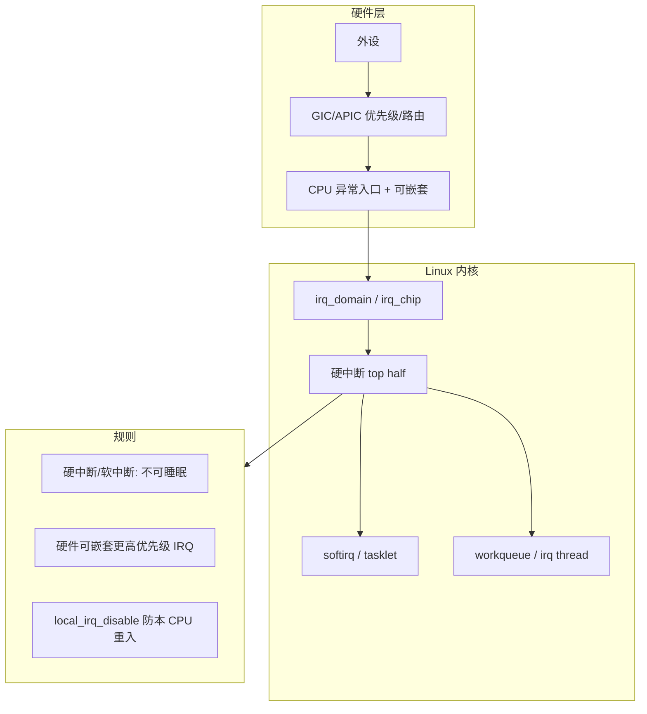

---
tags:
  - Linux
  - 中断
  - GIC
  - 驱动
title: Linux 中断机制详解
description: 从硬件 IRQ 到内核 irq 子系统、上下半部、软中断与中断嵌套的完整心智模型
date: 2026/05/21
---

# Linux 中断机制详解

若要把 Linux 中断理解透，需要同时握住 **四条线**：

1. **硬件**：外设 → 中断控制器 → CPU 异常入口  
2. **架构**：同步异常 vs 异步中断、特权级与向量表  
3. **内核子系统**：`irq_domain` / `irq_chip` / 硬中断 / 软中断  
4. **驱动契约**：top half 多短、下半部放哪、**嵌套时哪些锁能用**

本文按 **自底向上** 展开，**第七章专讲中断嵌套**（含 GIC 优先级与 Linux 栈）。  
配套短文：[[为什么 ISR 不能睡眠]]（为何不能阻塞）、[[linux/学习路径/中断与下半部机制]]（驱动选用表）。

---

## 1. 异常与中断：别混为一谈

| 类型 | 触发 | 与指令流关系 | 典型例子 |
|------|------|--------------|----------|
| **同步异常** | 执行某条指令 | 有因果关系 | 缺页、非法指令、**系统调用**、断点 |
| **异步中断** | 外设 / 定时器 / IPI | 与当前 PC **无关** | 网卡 RX、GPIO、时钟 tick |

**系统调用** 是「故意的异常」，进入内核后走 **syscall 分派**，不是 IRQ 号那条路。  
**中断** 是「硬件插队」：CPU 保存现场 → 跳向量 → 内核 IRQ 入口 → 驱动 handler。


硬件底座见 [[linux/学习路径/嵌入式体系结构入门]] §1.5。

---

## 2. 硬件路径：从引脚到 CPU

### 2.1 经典模型

```text
设备 ──IRQ 线──► 中断控制器 (PIC/GIC) ──► CPU 的 nIRQ/FIQ 输入
                      │
                      ├─ 使能/屏蔽 每位
                      ├─ 优先级 / 路由 (多核)
                      └─ 向 CPU 提供 IRQ 号 (hwirq)
```

- **ARM 嵌入式**：几乎全是 **GIC**（Generic Interrupt Controller）。  
  - **SPI**（Shared Peripheral Interrupt）：外设共用，如以太网、UART。  
  - **PPI**（Private Peripheral Interrupt）：每核私有，如 **per-CPU 定时器**。  
  - **SGI**（Software Generated Interrupt）：核间 **IPI**（调度、TLB shootdown、`smp_call_function`）。
- **x86**：本地 **APIC** + IOAPIC/MSI，概念类似：向量号 + 掩码 + 亲和性。

### 2.2 设备树里的中断

```dts
ethernet: mac@fe200000 {
    interrupts = <GIC_SPI 42 IRQ_TYPE_LEVEL_HIGH>;
    interrupt-parent = <&gic>;
};
```

- `interrupts` 单元格经 `interrupt-parent` 解析成控制器的 **hwirq** + 触发类型（电平/边沿）。  
- 内核再映射为全局 **`linux irq` 号**（`virq`），驱动 `request_irq(42, ...)` 用的是 **Linux IRQ 号**，不是 GIC 手册里的 SPI 编号（多数平台有 **irq_domain** 做映射）。

### 2.3 电平 vs 边沿

| 触发 | 行为 | 驱动注意 |
|------|------|----------|
| **电平** | IRQ 线保持有效直到源清除 | 必须先 **读状态/清源**，再 ack；否则 **风暴** |
| **边沿** | 跳变触发一次 | 丢失风险：处理慢时下一边沿已到 |

网卡、GPIO 常见电平；定时器、部分按键边沿。

---

## 3. CPU 进入中断时做了什么（架构层）

以 **AArch64 EL1** 为例（直觉与 ARM32/x86 相通）：

1. 硬件将 **PC、PSTATE** 等压入 **EL1 栈**（或专用中断栈，见 §7.3）。  
2. 跳到 **向量表** 对应条目（VBAR_EL1）。  
3. 内核入口保存 **通用寄存器**，进入 **IRQ 处理 C 代码**。  
4. 返回时 **恢复现场**，回到被打断的指令流（可能是用户态，也可能是 **另一条中断里**——即 **嵌套**）。

**关键认知**：中断打断了 **某个上下文**（用户进程、内核线程、甚至 **另一条 ISR**），但 **不会** 自动切换成「可睡眠的任务」。

---

## 4. Linux 通用 IRQ 子系统

现代内核用 **分层** 描述中断，便于 DT / ACPI / 多控制器：

```text
驱动 request_irq(virq)
    → irq_desc / irqaction 链表（可共享）
        → irq_chip::ack / mask / unmask / eoi
            → irq_domain (hwirq ↔ virq)
                → 硬件 GIC/APIC
```

| 概念 | 含义 |
|------|------|
| **hwirq** | 芯片手册里的中断号 |
| **virq** | Linux 全局 `irq` 编号，`/proc/interrupts` 第一列 |
| **irq_chip** | 控制器驱动：`gic_handle_irq` 等 |
| **irqaction** | 驱动注册的 handler + `dev_id` + `flags` |
| **irq_domain** | 设备树/ACPI 中断解析与映射 |

### 4.1 共享中断 IRQF_SHARED

多条设备可共享一根 IRQ 线（如 PCI legacy IRQ）：

- 每个驱动 `request_irq` 挂到同一 `virq` 的 **action 链表**。  
- 硬件触发时 **链上每个 handler** 被调用，返回 `IRQ_HANDLED` / `IRQ_NONE` 表示是否认领。  
- handler 必须 **快速区分** 是否自己的设备，避免误 ack。

### 4.2 threaded IRQ 与 IRQF_ONESHOT

```c
request_threaded_irq(irq, hard_handler, thread_fn, flags, name, dev);
```

| 部分 | 运行环境 | 作用 |
|------|----------|------|
| **hard_handler** | 硬中断 | 极短：mask/ack、`IRQ_WAKE_THREAD` |
| **thread_fn** | 内核线程 | 可睡眠：SPI、分配、协议栈片段 |

`IRQF_ONESHOT`：硬中断里 **屏蔽该线**，直到 `thread_fn` 结束由核心 **unmask**——适合 **电平触发** 且处理较慢的设备。

---

## 5. 内核里的「中断处理栈」：硬中断 → 软中断 → 进程

Linux 把异步工作拆成 **多层**，优先级与可阻塞性不同：



### 5.1 硬中断（Hard IRQ）

- 执行 **驱动注册的 top half**（或 GIC 封装后的 `handle_level_irq` 等）。  
- `in_interrupt()` 为真；`local_irq_disable()` 时 **本 CPU 不响应可屏蔽 IRQ**（细节见嵌套章）。  
- **不可睡眠**，见 [[为什么 ISR 不能睡眠]]。

### 5.2 软中断（Softirq）

- **内核预定义的 10 类**（如 `NET_RX`、`BLOCK`、`TIMER`），用于 **极热路径**（网络收包历史上大量在 softirq）。  
- 在 **硬中断返回前或返回路径** 上执行 `irq_exit()` → `invoke_softirq()`。  
- 仍 **不可睡眠**；与硬中断共享「原子侧」约束。  
- **同一 softirq 可在多 CPU 并行**（如 NET_RX），需 per-CPU 数据或锁。

### 5.3 tasklet

- 基于 **TASKLET_SOFTIRQ** 的「单实例」软中断：  
  - **同一 tasklet 不会并行**（即使多核）。  
  - 比 workqueue 轻，仍 **不可睡眠**。  
- 新代码更倾向 **threaded IRQ** 或 **workqueue**，但读老驱动必见 tasklet。

### 5.4 workqueue

- 把函数放到 **内核线程（进程上下文）** 执行 → **可睡眠**。  
- 系统默认 `system_wq` 或自定义 `alloc_workqueue`。

### 5.5 对照总表

| 层次 | 谁触发 | 可睡眠 | 可抢占（典型） | 延迟 |
|------|--------|--------|----------------|------|
| 硬中断 | 硬件 | 否 | 否（irqs off 段） | 最低 |
| softirq | 内核 | 否 | 部分可 | 很低 |
| tasklet | 内核 | 否 | 同左 | 低 |
| threaded IRQ / workqueue | 内核调度 | 是 | 是 | 较高 |

**网络收包** 路径（简化）：网卡 IRQ → 驱动 hardirq → NAPI `schedule` / softirq `NET_RX` → 协议栈；与用户态 **epoll** 路径见 [[网络与DPDK/网络编程/IO 多路复用：select、poll、epoll 与并发模型]]。

---

## 6. 观测：/proc/interrupts 与亲和性

```bash
cat /proc/interrupts
```

示例字段：

```text
 CPU0       CPU1
 42:   12345      0   GICv3  Level  eth0
```

- **每 CPU 计数**：IRQ 在哪颗核上处理（与 **affinity** 相关）。  
- **调整亲和**：

```bash
echo 2 > /proc/irq/42/smp_affinity   # 掩码，依平台
# 或
echo 1 > /sys/class/net/eth0/device/irq/42/smp_affinity_list
```

**工程意义**：

- 把 **网卡 IRQ** 与 **DPDK 绑核** 错开，避免和 [[网络与DPDK/实践/DPDK 性能剖析与绑核 checklist]] 数据面抢同一核。  
- **PREEMPT_RT** 下中断线程也可绑核，见 [[linux/内核机制/PREEMPT_RT 与 cyclictest 入门]]。

---

## 7. 中断嵌套：深度专题

「嵌套」分 **硬件嵌套** 与 **Linux 软件嵌套**，很多人只想到前者。

### 7.1 硬件嵌套：更高优先级 IRQ 打断当前 ISR

**GIC** 支持 **优先级分组**：

- 正在处理 **优先级 0xA0** 的 SPI 时，若 **0x80**（数值更小 = 更高优先级）的 IRQ 到达，CPU 可 **嵌套进入** 新向量。  
- **低优先级** IRQ 被 **屏蔽** 直到高优先级处理完（取决于 PMR/BPR 配置）。

```text
时间 ─────────────────────────────────────►

[ ISR_eth 开始 ]
    [ ISR_timer 嵌套进入 ]  ← 更高优先级
    [ ISR_timer 结束 ]
[ ISR_eth 继续 ]
[ ISR_eth 结束 ]
```

**认知要点**：

- 嵌套 **不** 意味着可以 `mutex_lock`：仍在 **中断上下文**，只是 **栈上多了一层中断帧**。  
- 每层 ISR 都应 **极短**；嵌套过深 → **栈消耗** 与 **延迟累积**。

**x86**：通过 **中断优先级** 与 **IF 标志**（可屏蔽中断）实现类似效果；**NMI** 等不可屏蔽。

### 7.2 软件关中断：`local_irq_disable` 与嵌套

驱动常用：

```c
unsigned long flags;
spin_lock_irqsave(&lock, flags);  /* 内部 local_irq_save */
/* 临界区 */
spin_unlock_irqrestore(&lock, flags);
```

| API | 行为 |
|-----|------|
| `local_irq_disable()` | 本 CPU **不再响应可屏蔽 IRQ**（计数嵌套） |
| `local_irq_enable()` | 配对恢复 |
| `local_irq_save(flags)` | 保存状态并 disable |
| `local_irq_restore(flags)` | 恢复 |

**嵌套计数**：连续两次 `disable` 要两次 `enable` 才真正打开——避免内层临界区误开中断。

在 `irqs_disabled()` 为真的区域：

- **不会** 被普通硬中断打断（同 CPU）；  
- 因此 **持 spinlock_irqsave 时** 更绝不能让出 CPU（睡眠），否则可能 **死锁**（见 [[linux/内核机制/内核同步机制总览]]）。

### 7.3 中断栈（IRQ stack）

为避免 **嵌套中断耗尽** 被中断进程的内核栈，许多架构有 **per-CPU 中断栈**：

- 第一次进硬中断：切换到 **irq stack**；  
- **嵌套硬中断**：仍在 irq stack 上叠帧；  
- 返回：回到 **被中断的 task 内核栈** 或用户态。

**深刻点**：你看到 `current` 仍指向 **被打断的进程**，但 **SP 可能已在 irq stack**——这是「中断上下文不是独立 task」的硬件体现。

### 7.4 Linux 的 `in_irq()` / `in_softirq()` / `preempt_count`

内核用 **preempt_count** 等字段标记当前上下文：

| 宏 / 状态 | 含义 |
|-----------|------|
| `in_irq()` | 在硬中断 handler 里 |
| `in_softirq()` | 在 softirq/tasklet 里 |
| `in_interrupt()` | 硬中断 **或** 软中断 |
| `might_sleep()` | 若 in_interrupt 则 warn |

**嵌套场景举例**：

1. 硬中断 A 执行中 → 硬件嵌套进硬中断 B → `in_irq()` 仍为真，**嵌套深度 +1**。  
2. 硬中断 A 返回前触发 **softirq** → `in_softirq()` 真，**仍不可睡眠**。  
3. softirq 里 **不会** 再进同 CPU 的硬中断（通常已 global 处理），设计避免无限递归。

### 7.5 软中断与硬中断的「逻辑嵌套」

典型顺序（`irq_exit` 路径）：

```text
leave hardirq handler
  → if softirq pending: invoke_softirq()
       → NET_RX 处理一批包
  → return to interrupted code
```

这不是硬件嵌套，而是 **延迟处理**：把「可延后」工作放在 **硬中断之后、返回用户之前**，降低硬件 IRQ 占用时间。

**副作用**：softirq 处理过久 → **`softirq` 占用 CPU** → 用户态与 **ksoftirqd** 饥饿，表现为 **ping 抖动、SSH 卡顿**。  
调优：`/proc/sys/net/core/dev_weight`、`ksoftirqd` CPU 占用、**NAPI 预算**。

### 7.6 threaded IRQ 下的「嵌套」心智模型

```text
硬中断（极短）→ wake threaded handler
                    ↓
              内核线程（可抢占、可睡眠）
```

- **硬中断** 仍可被 **更高优先级 IRQ 嵌套**（若未 mask）。  
- **thread_fn** 是 **普通内核线程**，可被 **调度器抢占**，与 **硬中断嵌套** 是两套机制。  
- `IRQF_ONESHOT` 保证 **thread_fn 跑完前** 线保持 masked，避免电平 IRQ **重入风暴**。

### 7.7 嵌套与锁：一张决策表

| 场景 | 推荐 |
|------|------|
| 硬中断 ↔ 硬中断（同数据） | `spin_lock_irqsave` |
| 硬中断 ↔ softirq | `spin_lock_bh` 或 `spin_lock_irqsave` |
| 硬中断 ↔ 进程 | `spin_lock_irqsave`（进程侧不能用 mutex 与 ISR 争用同一数据，应改设计） |
| softirq ↔ 进程 | `spin_lock_bh` / `local_bh_disable` |
| 可睡眠路径 | `mutex`，且 **只在 process/thread 上下文** |

**错误示范**：在 ISR 里 `mutex_lock` → 若进程持锁被 ISR 打断 → **死锁**。

### 7.8 中断嵌套深度与调试

- **ftrace**：`irqsoff`、`preemptoff` 追踪 **关中断时长**。  
- **/proc/interrupts** 计数异常飙高 → **风暴** 或 **未 ack**。  
- **crash**：irq stack overflow → 检查 ISR 过长或 **无限重入**（电平未清）。

```bash
# 需 debug 配置
cat /sys/kernel/debug/tracing/events/irq/enable
```

---

## 8. 延迟预算：从中断到业务

建立 **数量级** 直觉（因平台而异）：

| 阶段 | 典型量级 |
|------|----------|
| 硬件 + GIC 分发 | 数百 ns ～ 1 µs |
| 硬中断 top half | 1～30 µs（越短越好） |
| softirq 批处理 | 10 µs ～ 数百 µs |
| threaded / workqueue | 调度延迟 + 毫秒级业务 |

**实时系统**：硬实时闭环常放 **MCU**；Linux 侧用 **PREEMPT_RT + 线程化中断 + isolcpus** 压 **最坏延迟**，见 [[linux/内核机制/PREEMPT_RT 与 cyclictest 入门]]。

---

## 9. 驱动作者的「中断契约」清单

- [ ] 电平触发：**先清源** 再 `eoi`，或 ONESHOT + threaded  
- [ ] top half **< 几十微秒**（无 `printk` 洪水、无 `mdelay`）  
- [ ] 共享 IRQ：快速 `IRQ_NONE` vs `IRQ_HANDLED`  
- [ ] 与进程共享数据：**spinlock_irqsave** 或 **per-CPU 变量**  
- [ ] 耗时逻辑：**threaded IRQ / workqueue**  
- [ ] 多核：**IRQ affinity** 与业务绑核一致  
- [ ] 用 `request_threaded_irq` + `IRQF_ONESHOT` 处理 **慢设备 + 电平 IRQ**

---

## 10. 与站内其他笔记的关系

```text
体系结构入门 (异常/中断硬件)
        ↓
Linux 中断机制详解 (本文)
        ↓
   ┌────┴────┐
为什么 ISR 不能睡眠    中断与下半部机制 (驱动选用)
        ↓
内核同步机制总览 (spinlock_bh / irqsave)
        ↓
进程调度与绑核 / DPDK 性能 / 网络栈边界
```

---

## 11. 小结：一张总图



**三句话刻进脑子**：

1. **中断是硬件插队**，不是可调度任务。  
2. **嵌套** = 更高优先级 IRQ 或 `irqs_off` 下的分层执行，**不** 改变「不能睡眠」规则。  
3. **快在硬中断、重在下半部**，观测用 `/proc/interrupts` + tracing，调优用 affinity + NAPI/softirq 预算。

---

## 延伸阅读

- [[为什么 ISR 不能睡眠]]
- [[linux/学习路径/中断与下半部机制]]
- [[linux/内核机制/内核同步机制总览]]
- [[linux/学习路径/嵌入式体系结构入门]]
- [[linux/内核机制/进程调度与绑核]]
- [[linux/内核机制/DMA 与 Cache 一致性入门]]
- [[linux/驱动与模块/platform 驱动完整案例]]
