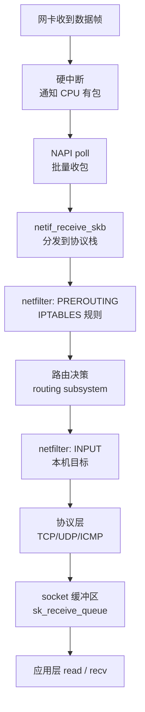
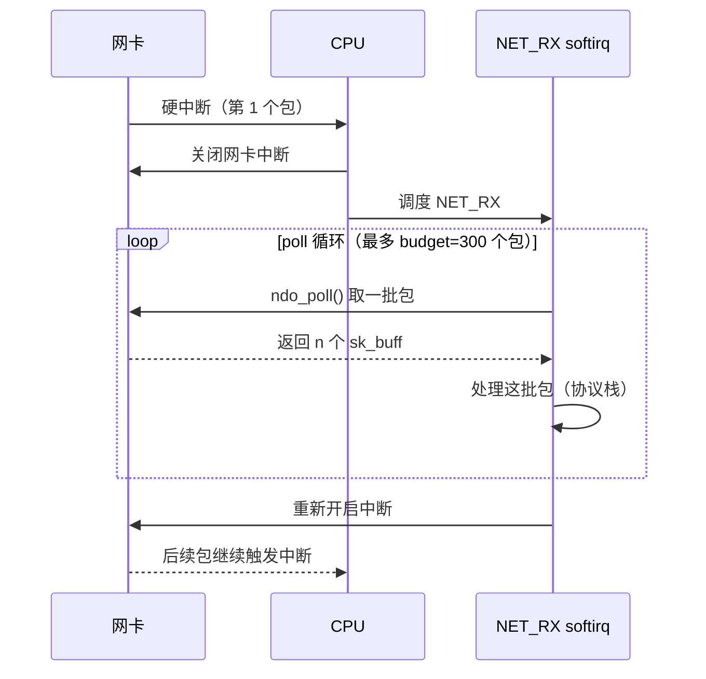
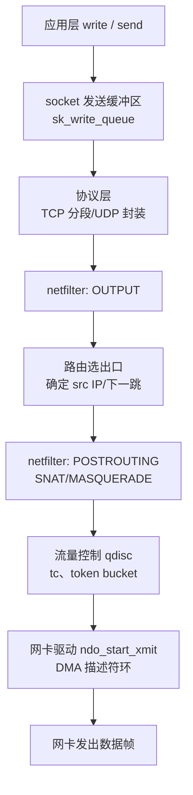
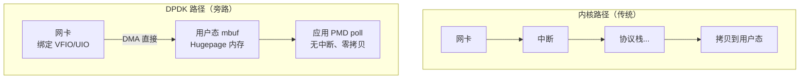
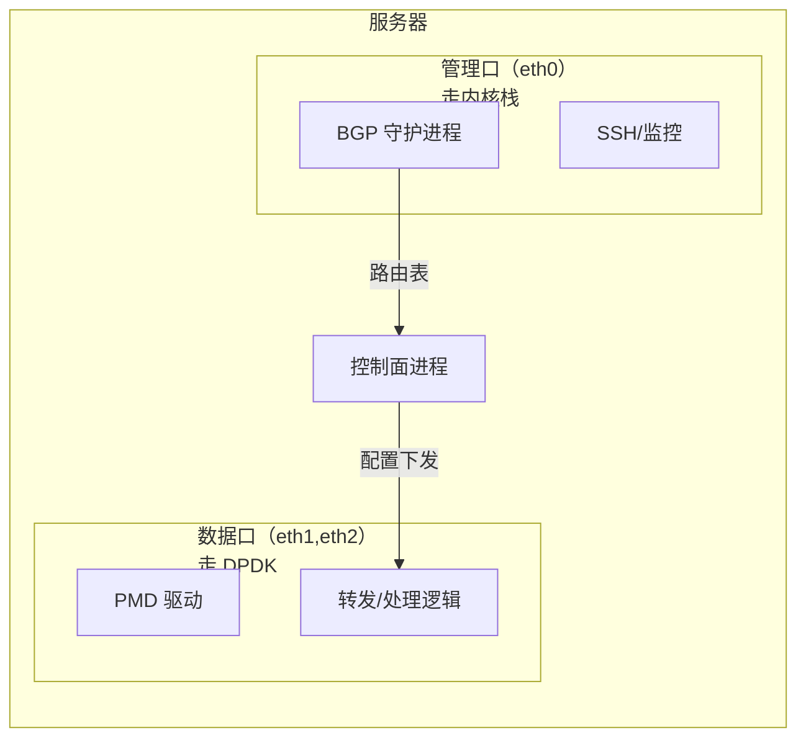

---
tags:
  - Linux
  - 网络
  - DPDK
title: Linux 内核网络栈与 DPDK 适用边界
description: 从 socket 到网卡驱动的完整内核路径、NAPI 收包机制，以及何时选 DPDK 旁路
date: 2026/05/16
---

# Linux 内核网络栈与 DPDK 适用边界

理解这篇文章能帮你回答两个工程问题：
1. 一个网络包从网卡到应用，经过了内核的哪些层次？
2. 什么时候这条路走不通，需要 DPDK 旁路？

---

## 1. 内核网络栈：完整路径

### 1.1 收包路径（RX）



**关键节点说明：**

| 节点 | 核心数据结构 | 说明 |
|------|------------|------|
| 网卡 DMA | `sk_buff`（skb） | 网络包的"万能容器"，贯穿整条路径 |
| NAPI poll | `napi_struct` | 批量收包，减少中断次数 |
| netfilter | `nf_hook_ops` | iptables/nftables 规则挂载点 |
| 路由 | `rtable` | 决定包送往本机还是转发 |
| TCP 层 | `tcp_sock`/`sock` | 连接状态机、拥塞控制 |
| socket 缓冲区 | `sk_receive_queue` | 应用 `recv()` 从这里取数据 |

### 1.2 NAPI：批量收包机制

**问题**：早期 Linux 每收一个包就触发一次硬中断，高流量时中断频率可达数十万次/秒，CPU 大量时间花在中断处理开销上。

**NAPI（New API）解法**：
1. 第一个包到来时触发硬中断
2. 硬中断里**关闭该网卡的中断**，调度 softirq `NET_RX`
3. softirq 里循环 `poll()`，**批量**取出所有待处理的包（最多 `netdev_budget` 个）
4. 处理完（或达到预算上限）后重新开启中断



**调优参数：**
```bash
# 每次 softirq 处理的最大包数（默认 300）
sysctl net.core.netdev_budget

# 每次 softirq 处理的最大时间（ns，防止饥饿）
sysctl net.core.netdev_budget_usecs

# 查看 softirq 统计
cat /proc/net/softnet_stat
# 各列含义：总包数 / 丢包数（预算耗尽）/ 节流次数
```

### 1.3 发包路径（TX）



### 1.4 sk_buff：理解包的表示

`sk_buff`（socket buffer，简称 skb）是内核网络栈的核心数据结构，代表一个网络包：

```c
struct sk_buff {
    // 包数据指针（各层共享同一内存，通过指针偏移分隔）
    unsigned char *head;   // 分配的内存起始
    unsigned char *data;   // 当前有效负载起始（随协议层移动）
    unsigned char *tail;   // 有效负载结束
    unsigned char *end;    // 分配内存结束

    // 链表（在队列中排队）
    struct sk_buff *next, *prev;

    // 元数据
    struct net_device *dev;     // 对应的网络设备
    __be16 protocol;            // 协议类型（ETH_P_IP 等）
    unsigned int len;           // 有效负载长度
    // ... 还有大量字段
};
```

**关键设计**：各层协议头不是复制，而是通过移动 `data` 指针来"添加/去除"头部：

```text
以太网层：[eth header][IP header][TCP header][data]
          ↑ data 指向 eth header

IP 层处理后：[eth header][IP header][TCP header][data]
                          ↑ data 指向 IP header

TCP 层处理后：[eth header][IP header][TCP header][data]
                                       ↑ data 指向 TCP header
```

---

## 2. 内核协议栈的性能瓶颈

经过上面的路径分析，内核协议栈在高吞吐场景下的开销来自：

| 瓶颈 | 原因 |
|------|------|
| **内核态↔用户态拷贝** | `recv()` 把 socket 缓冲区数据拷贝到用户 buffer |
| **中断与软中断开销** | 即使有 NAPI，高 PPS 时 softirq 仍占用大量 CPU |
| **协议栈每包开销** | 每个包都要经过路由查找、netfilter 规则匹配、TCP 状态机 |
| **锁竞争** | socket、路由表、ARP 表等需要加锁，多核扩展性受限 |
| **内存分配** | 每个包都需要 `sk_buff` 分配/释放 |

**量级参考**（因硬件和内核版本而异）：

| 场景 | 典型吞吐 |
|------|----------|
| 单核 UDP 收包 | ~3~5 Mpps（百万包每秒） |
| 10GbE 万兆网线速 | ~14.88 Mpps（64字节小包） |
| 内核协议栈理论上限 | ~5~8 Mpps（单核，经优化） |

**结论**：对于线速小包转发场景，内核协议栈力不从心。

---

## 3. DPDK：旁路内核的解法

### 3.1 核心思想



**DPDK 的关键优化：**

| 优化 | 说明 |
|------|------|
| **轮询模式（PMD）** | 应用程序轮询网卡而非等待中断，消除中断开销 |
| **零拷贝** | 包数据在 mbuf 中，应用直接访问，不再拷贝到 socket 缓冲区 |
| **Hugepage** | 减少 TLB miss，DMA 映射更简单 |
| **绑核（isolcpus）** | 数据面 CPU 专用，不被内核调度打断 |
| **per-lcore 内存池** | mempool 按 lcore 分配，减少锁竞争 |
| **批处理** | 每次处理 32 个包（rte_eth_rx_burst），摊薄开销 |

### 3.2 DPDK 路径（简化）

```text
应用（poll 模式）
  → rte_eth_rx_burst(port, queue, mbufs, MAX_PKT_BURST)
      → PMD（Poll Mode Driver）直接与网卡 RX 队列交互
          → mbuf 从 mempool 取得
              → 包数据由 DMA 直接写入 mbuf 数据区（hugepage）
  → 应用处理 mbuf（修改/查表/转发）
  → rte_eth_tx_burst(port, queue, mbufs, n)
      → PMD 把 mbuf 提交到 TX 队列
          → 网卡发出
```

---

## 4. 选型决策：内核栈 vs DPDK

### 4.1 一张决策表

| 维度 | 内核协议栈 | DPDK |
|------|-----------|------|
| **吞吐目标** | < 1~3 Mpps 小包 | 追求线速（10G/25G/100G） |
| **协议支持** | 完整 TCP/IP，TLS，HTTP 等 | 通常自建 L2/L3/L4，不含完整 TCP |
| **延迟特性** | 中断 + 调度，抖动较大（µs~ms） | 绑核轮询，延迟稳定（< 5µs） |
| **开发成本** | 低（标准 socket API） | 高（需理解 mbuf、mempool、队列管理） |
| **运维复杂度** | 低（iptables、ss、tcpdump 均可用） | 高（独占 CPU、hugepage、需专用调试工具） |
| **典型用途** | 应用服务器、管理口、控制面 | 数据平面转发、防火墙、负载均衡 |

### 4.2 典型混合架构

生产上最常见的是**双路架构**——控制面走内核栈，数据面走 DPDK：



**判断自己的场景：**

- 需要**标准 TCP** 的应用服务器 → 内核栈
- 需要**精确 QoS、流量整形** → 内核 tc qdisc 更成熟
- **管理口（SSH、运维）** → 永远走内核栈，不要碰 DPDK
- **云原生容器网络（CNI）** → eBPF + XDP，介于两者之间
- **线速小包转发、IPSec 加速、DPI** → DPDK

---

## 5. 中间地带：AF_XDP 与 eBPF/XDP

除了"全内核"和"全旁路（DPDK）"，还有中间路线：

| 方案 | 定位 |
|------|------|
| **XDP**（eXpress Data Path） | 在网卡驱动收包路径最早处挂 eBPF 程序，可丢包/修改/转发，不离开内核，延迟极低 |
| **AF_XDP** | 把 XDP 处理后的包送到用户态专用 socket，比内核栈快，比 DPDK 轻 |
| **io_uring + 网络** | 减少 syscall 开销，适合高并发连接而非高 PPS |

```text
吞吐    高←————————————————————→低
        DPDK    AF_XDP   内核栈
延迟    低←————————————————————→高
运维    难←————————————————————→易
```

见 [[网络与DPDK/实践/AF_XDP 适用场景]]。

---

## 6. 调试与观测工具

```bash
# 查看软中断统计（第2列是 softirq 处理失败/丢包）
cat /proc/net/softnet_stat

# 查看网卡收发包统计（含丢包）
ip -s link show eth0
ethtool -S eth0 | grep -i drop

# 查看 TCP 连接状态
ss -s

# 抓包（内核栈才能用）
tcpdump -i eth0 -n port 80

# 查看 netfilter 规则匹配次数
iptables -L -n -v

# 查看路由表
ip route show
ip route get 8.8.8.8
```

---

## 7. 与站内教程衔接

| 你想了解 | 去哪里 |
|----------|--------|
| Socket 编程基础 | [[网络与DPDK/网络编程/Socket 编程基础：TCP、UDP 与字节序]] |
| epoll 与并发模型 | [[网络与DPDK/网络编程/IO 多路复用：select、poll、epoll 与并发模型]] |
| DPDK 从零入门 | [[网络与DPDK/教程/DPDK 教程 1：Hugepage、绑核、dpdk-devbind 与跑通 testpmd]] |
| mbuf 与 mempool | [[网络与DPDK/教程/DPDK 教程 2：mbuf、mempool、ethdev 的数据路径]] |
| AF_XDP 适用场景 | [[网络与DPDK/实践/AF_XDP 适用场景]] |
| 性能剖析与绑核 | [[网络与DPDK/实践/DPDK 性能剖析与绑核 checklist]] |
| 中断与 softirq | [[linux/内核机制/Linux 中断机制详解]] |

---

## 实践清单

- [ ] 用 `tcpdump` 抓一条 TCP 三次握手，对应到收包路径每一层
- [ ] 用 `cat /proc/net/softnet_stat` 观察系统是否有 softirq 丢包
- [ ] 用 `testpmd` 跑 64 字节包吞吐，对比同机 `iperf` 万兆连接
- [ ] 画一张目标产品的**双口架构图**（管理口走内核栈，数据口 DPDK）
