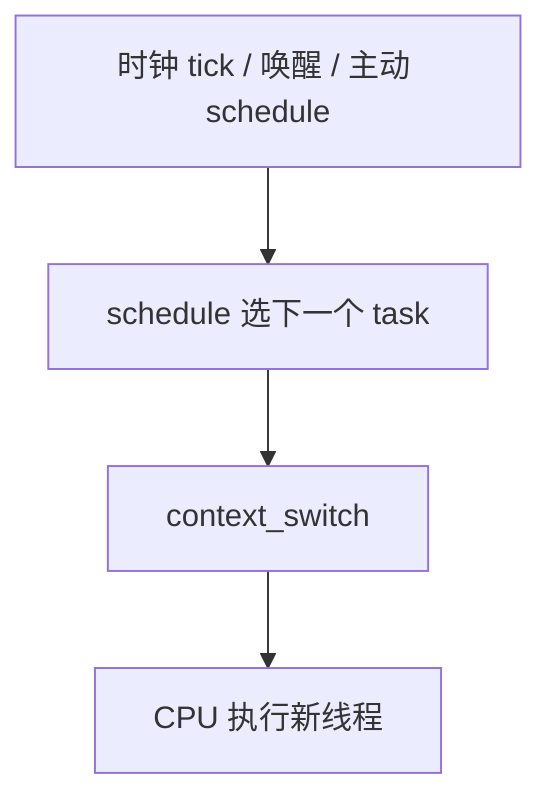
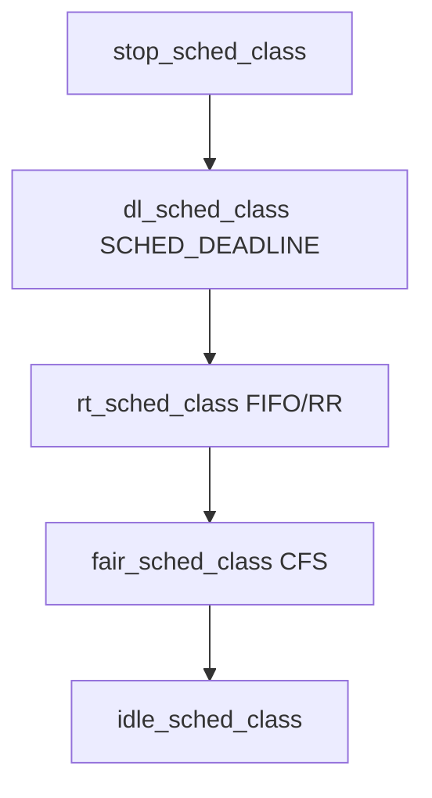
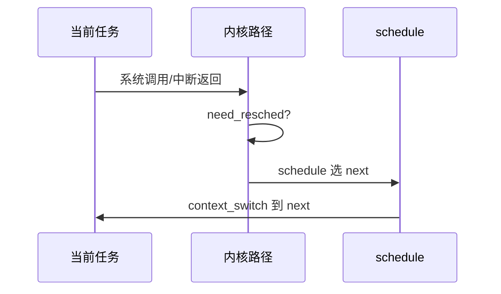
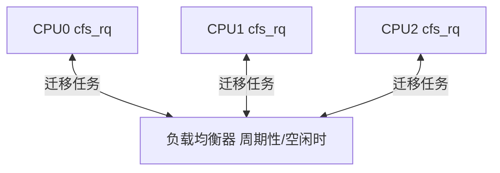

---
tags:
  - Linux
  - 内核
  - 调度
  - 面试
title: Linux 内核调度机制面试详解
description: CFS、实时类、runqueue、负载均衡与高频面试题速答（含命令与踩坑）
date: 2026/05/21
---

# Linux 内核调度机制面试详解

面试官问「Linux 调度」时，往往不是在背 **nice 范围**，而是看你能否串起：**进程状态 → 调度类 → CFS 账本 → 多核负载均衡 → 实时与反转 → 工程手段（绑核、cgroup）**。本篇按这条链展开；与 DPDK 绑核对照见 [[进程调度与绑核]]；切换成本见 [[深入了解上下文切换]]。

---

## 1. 读完能带走什么

- 能画 **从定时器/阻塞到 `schedule()`** 的触发路径。  
- 能解释 **CFS 为何没有固定时间片**、**vruntime** 与 **nice/权重** 的关系。  
- 能区分 **SCHED_FIFO / RR / DEADLINE / OTHER** 及适用风险。  
- 能答 **负载均衡、绑核、优先级反转、RT 带宽限制** 等高频题。  
- 能用 **命令 + /proc** 在现场验证说法。

---

## 2. 调度器要解决什么问题

| 约束 | 调度器要做的 |
|------|----------------|
| 多任务共享 CPU | 决定 **下一个运行谁** |
| 不同重要程度 | 普通公平 vs **实时** vs **节能/后台** |
| 多核 SMP / NUMA | 每核 **运行队列（runqueue）** + **迁移** |
| 阻塞与唤醒 | 睡眠任务出队；就绪任务入队 |
| 内核可抢占（视配置） | 高优先级或 tick 时 **抢占** 当前任务 |



---

## 3. 进程状态与 task（面试必背）

Linux 用 **`task_struct`** 表示 **调度实体**；用户态 **线程** 与内核 **task** 基本 **1:1**（NPTL）。

| 状态（示意） | 含义 | 面试一句话 |
|--------------|------|------------|
| **R（Running/Runnable）** | 就绪或正在跑 | 在 runqueue 或占着 CPU |
| **S（Interruptible sleep）** | 可中断睡眠 | 等 IO、锁、`sleep` |
| **D（Uninterruptible sleep）** | 不可中断睡眠 | 常见等块层 IO；**难杀** |
| **T/t（Stopped）** | 作业控制停止 | `SIGSTOP` |
| **Z（Zombie）** | 已退出未收尸 | 等父进程 `wait` |
| **I（Idle）** | 空闲相关 | 多指 idle 任务 |

查看：

```bash
ps -eo pid,stat,comm | head
# STAT: R S D Z T 等，带 < 高优先级、+ 前台进程组等修饰
```

**易错点**：**D 状态** 不是「死锁」本身，而是 **不可中断等待**；大量 D 常要查存储/驱动。

---

## 4. 调度类（sched_class）分层

现代内核用 **调度类** 插件化；**优先级从高到低** 依次尝试选下一个任务：



| 用户可见策略 | 调度类 | 典型场景 |
|--------------|--------|----------|
| **SCHED_OTHER** | CFS（公平类） | 默认普通进程 |
| **SCHED_BATCH** | CFS 变种 | 批处理，降低抢占频率 |
| **SCHED_IDLE** | CFS 变种 | 极低优先级后台 |
| **SCHED_FIFO / SCHED_RR** | 实时类 | 工业控制、低延迟线程 |
| **SCHED_DEADLINE** | 截止时间类 | 周期任务，带宽/周期约束 |
| （内核）**stop / idle** | 专用 | 迁移、停机、空闲 CPU |

查看进程策略：

```bash
chrt -p <pid>
ps -o pid,cls,pri,ni,rtprio,cmd -p <pid>
# CLS: TS 其它  FF fifo  RR  DL  ...
```

**面试答法**：「Linux 不是单一调度算法，而是 **按类排队**；同 CPU 上 **实时类先于 CFS**，CFS 里用 **vruntime** 选最该运行的。」

---

## 5. CFS：完全公平调度（核心）

**完全公平调度（CFS，Completely Fair Scheduler）** 是 **SCHED_OTHER** 的默认实现（2.6.23+ 起取代 O(1) 成为普通进程主力）。

### 5.1 设计目标

- **长期** 按 **权重（weight）** 比例分配 CPU，而不是每人固定 10ms 片。  
- **交互友好**：唤醒的任务有一定 **追赶** 机会（wakeup granularity）。  
- **实现**：每 CPU 一棵 **红黑树（red-black tree）**，按 **`vruntime`（virtual runtime，虚拟运行时间）** 排序。

### 5.2 vruntime 直觉（必考）

**物理时间** $\Delta_{\text{exec}}$ 是任务实际在 CPU 上跑的时间；**vruntime 增量** 与 **nice 权重** 成反比：

$$
\Delta vruntime \propto \frac{\Delta_{\text{exec}}}{\text{weight}}
$$

**三句话背下来**：

1. **谁 vruntime 最小，谁更该运行**（最「欠账」）。  
2. **nice 越小（优先级越高），weight 越大，vruntime 涨得越慢** → 同样跑 1ms，账本记更少 → 更容易再次被选中。  
3. **目标**：权重 2:1 的两任务，长期 CPU 时间约 2:1。


与 [[进程调度与绑核#CFS 虚拟运行时间（vruntime，virtual runtime）怎么理解「欠账」]] 同一套类比；本篇偏面试展开。

### 5.3 没有「固定时间片」意味着什么

| 老思路（时间片轮转） | CFS |
|----------------------|-----|
| 每进程固定 quantum | **动态** 决定何时切换 |
| 到期强制切换 | 尽量让所有 runnable **vruntime 接近** |
| 切换点易预测 | 随负载、唤醒、抢占变化 |

**面试题**：「CFS 时间片多大？」→ **没有固定片**；可提 **调度粒度（scheduling latency）** 与 **最小粒度（min granularity）** 影响「大概多久会考虑切换」，但本质是 **公平模型** 而非片长表。

相关内核参数（了解即可，不必背数值）：

```bash
sysctl kernel.sched_latency_ns
sysctl kernel.sched_min_granularity_ns
sysctl kernel.sched_wakeup_granularity_ns
```

### 5.4 nice 与静态优先级

| 概念 | 作用范围 |
|------|----------|
| **nice**（-20～19） | 主要影响 **CFS 权重** |
| **static_prio / rt_priority** | **实时类** 用 1～99（数字越大优先级越高） |
| **普通进程** | `ps` 里 PRI 多由 nice 推导展示，别和 RT 的 1～99 混谈 |

```bash
nice -n 10 ./work
renice -n -5 -p <pid>
```

**权限**：降低 nice（提高优先级）通常需 **CAP_SYS_NICE** 或 root。

### 5.5 CFS 带宽控制（cgroup）

除 nice 外，**cgroup v2** 的 `cpu.max` 可限制一组进程的 CPU 上限（面试常作「容器限 CPU」答法）。与 [[cgroup 使用指南]] 衔接。

---

## 6. 实时调度：FIFO、RR、DEADLINE

### 6.1 SCHED_FIFO 与 SCHED_RR

| 策略 | 行为 |
|------|------|
| **SCHED_FIFO** | 同优先级 **跑直到阻塞或主动让出**；无时间片轮转 |
| **SCHED_RR** | 同优先级带 **时间片**；片用完排到同优先级队尾 |

- 实时优先级 **1～99**，**数值越大越优先**。  
- **实时任务就绪时，可抢占 CFS 任务**。  
- 误用会导致 **普通任务饿死**、**软 lockup 告警**（系统长期无进展）。

```bash
chrt -f 50 ./low_latency_thread   # FIFO priority 50
chrt -r 30 ./rr_thread            # RR
```

### 6.2 RT 带宽限制（必知）

默认 **RT 不能占满所有 CPU**：

```bash
cat /proc/sys/kernel/sched_rt_runtime_us   # 如 950000
cat /proc/sys/kernel/sched_rt_period_us    # 如 1000000
# 约 95% 周期内可用于 RT，其余留给普通任务
```

**面试答法**：「即使用 `chrt -f 99`，内核仍可能通过 **sched_rt_runtime_us** 防止 RT 占死整机。」

### 6.3 SCHED_DEADLINE（加分项）

**截止时间调度（SCHED_DEADLINE）**：任务声明 **周期、运行时间、截止时间**（类似 sporadic task 模型）；调度器用 **EDF（Earliest Deadline First）** 思想选任务。适合 **有严格周期约束** 的实时任务；与 FIFO「一直跑」不同。

---

## 7. 何时调用 schedule()（触发点）

| 触发 | 例子 |
|------|------|
| **时钟 tick** | 重新计算时间片/检查抢占（CFS 更新 vruntime） |
| **阻塞** | `mutex_lock`、`read` 睡眠、`wait_event` |
| **唤醒** | `wake_up` 将就绪任务放入 runqueue，可能抢占 |
| **主动** | `sched_yield()` |
| **返回用户态前** | 部分路径检查 `_TIF_NEED_RESCHED` |



与 [[Linux系统调用：用户态陷入内核完整流程]]、[[深入了解上下文切换]] 串联。

---

## 8. 多核：runqueue 与负载均衡

### 8.1 每 CPU 一个 runqueue

- **CFS**：每 CPU `cfs_rq`，本地红黑树。  
- **RT**：每 CPU `rt_rq`。  
- **好处**：减少锁竞争；**代价**：负载不均时要 **迁移（migration）**。



### 8.2 负载均衡（面试简答）

- **何时**：定时器、空闲 CPU 找活、唤醒时 **wake_affine** 尝试放在缓存友好的 CPU。  
- **迁移什么**：可运行任务；**注意** 迁移有 **cache 冷** 成本。  
- **绑核后**：`taskset` / `cpuset` / `isolcpus` 限制迁移范围 → DPDK/低抖动常用。

### 8.3 NUMA（加分）

- 内存本地性：任务尽量在 **分配内存的 NUMA 节点** 上跑。  
- `numactl --membind`、`lscpu` 看拓扑；与 [[网络与DPDK/教程/DPDK 教程 4：Offload、Flow、NUMA、IOVA 与性能剖析]] 对照。

---

## 9. CPU 亲和性与隔离

| 手段 | 作用 |
|------|------|
| **`sched_setaffinity` / `taskset`** | 限制任务能在哪些 CPU 上跑 |
| **cgroup cpuset** |  cgroup 级 CPU/内存节点集合 |
| **`isolcpus=` 启动参数** | 将 CPU 从 **通用 CFS 负载均衡** 中隔离，专供指定任务 |
| **`nohz_full`** | 空闲核减少 tick 中断（低抖动） |

实践命令见 [[进程调度与绑核#绑核与隔离]]。

**面试题**：「`taskset` 和 `isolcpus` 区别？」→ `taskset` **限制某进程** 用哪些核；`isolcpus` **默认不让普通调度把杂务迁到这些核**，需主动把线程放上去，常与 **DPDK `-l`** 配合。

---

## 10. 优先级反转、饿死与对策

### 10.1 饿死（starvation）

- **CFS**：极低 nice 或 CPU 密集型长期占满，他人 **响应变慢**，但 RT 带宽与唤醒机制仍会给机会。  
- **SCHED_FIFO**：同优先级或更高 RT **一直就绪** → 低优先级 **永远轮不到** → 真饿死。

### 10.2 优先级反转（priority inversion）

**高优先级 H** 等锁，锁在 **低优先级 L** 手里，**中优先级 M** 抢占 L → H 被 M 间接阻塞。经典 **火星探路者** 案例。

| 对策 | 说明 |
|------|------|
| **优先级继承（PI）** | L 持锁期间提升到 H 的优先级 |
| **优先级天花板** | 拿锁前提到访问该锁任务的最高优先级 |
| **缩短临界区** | 驱动里尤其重要：持锁不睡眠、不耗时 IO |
| **RT Mutex + PI** | 内核 `CONFIG_RT_MUTEX_PI` |

用户态 `PTHREAD_PRIO_INHERIT`、驱动上下文区别见 [[进程调度与绑核#优先级反转（priority inversion）与对策]]、[[内核同步机制总览]]。

**面试答法**：「提高 H 的 nice **解决不了** 反转，关键是 **锁持有者与继承协议**。」

---

## 11. 内核抢占与 PREEMPT_RT（简述）

| 配置倾向 | 含义 |
|----------|------|
| **非抢占 / 有限抢占** | 内核态某些路径不可被抢占，延迟有上界但偏大 |
| **CONFIG_PREEMPT** | 多数内核路径可抢占，降低调度延迟 |
| **PREEMPT_RT** | 将大量锁改为可睡眠、线程化中断等，逼近 **硬实时** |

测量：`cyclictest`、[[PREEMPT_RT 与 cyclictest 入门]]。  
**嵌入式面试**：能说「产品是否打 RT patch、中断是否线程化」即可，不必背 patch 列表。

---

## 12. 与驱动、中断的关系（嵌入式常问）

| 上下文 | 能否睡眠 / 调度 |
|--------|------------------|
| **硬中断 ISR** | **不能** 睡眠、不能 `mutex_lock` 阻塞 → 不触发普通进程调度 |
| **软中断 / tasklet** | 仍非进程上下文 |
| **内核线程 kthread** | 可调度，如 `kworker` |
| **进程上下文驱动** | `probe`、`read/write` 可阻塞，参与 CFS |

见 [[为什么 ISR 不能睡眠]]、[[Linux 中断机制详解]]。

**面试题**：「中断里唤醒用户线程？」→ ISR **只做最少工作**，`wake_up` 或 schedule work；真正耗时的在 **进程上下文** 完成。

---

## 13. 现场验证命令（面试加分）

```bash
# 拓扑与隔离
lscpu
cat /sys/devices/system/cpu/isolated   # isolcpus 结果

# 当前进程调度信息
ps -eo pid,cls,pri,ni,rtprio,psr,comm | head
chrt -p <pid>
taskset -pc <pid>

# 调度统计（CFS 运行时间等）
cat /proc/<pid>/sched

# 内核调度器调试（需 CONFIG_SCHED_DEBUG）
mount -t debugfs none /sys/kernel/debug
cat /sys/kernel/debug/sched/domains/cpu*/domain*/flags
```

**psr** 列：进程 **当前运行在哪个 CPU**。

---

## 14. 高频面试题速答

### 14.1 概念类

| 问题 | 参考答案要点 |
|------|----------------|
| Linux 默认用什么调度？ | **CFS** + **SCHED_OTHER** |
| CFS 如何选下一个任务？ | 可运行实体中 **vruntime 最小**（红黑树最左） |
| nice 作用？ | 改 **权重**，不是固定时间片 |
| 进程和线程调度区别？ | Linux **调度 task**；线程是共享地址空间的 task |
| 用户态如何影响调度？ | `nice`/`renice`、`chrt`、`sched_setaffinity`、`sched_yield` |
| 上下文切换谁做？ | `schedule()` 选 next → **`context_switch`** 保存/恢复寄存器与必要时换地址空间 |

### 14.2 对比类

| 问题 | 参考答案要点 |
|------|----------------|
| CFS vs 实时？ | RT **先于** CFS；FIFO 可占满 CPU 直到阻塞 |
| 自愿切换 vs 抢占？ | 阻塞 vs tick/唤醒/更高优先级 **need_resched** |
| 负载均衡好坏？ | 提高利用率 vs **cache 冷、迁移成本** |
| O(1) 调度器为何被 CFS 取代？ | O(1) 常数优化交互差；CFS **公平模型** 更简单可扩展 |

### 14.3 场景类

| 问题 | 参考答案要点 |
|------|----------------|
| 延迟抖动大怎么查？ | `isolcpus`、`nohz_full`、中断亲和、避免 RT 误用、看 **cyclictest** |
| D 状态很多？ | 块层/驱动 **不可中断 IO**，查存储与驱动，不是调度器 bug |
| 火星探路者类问题？ | **优先级反转** → PI/天花板、缩短持锁 |
| 容器 CPU 限流？ | cgroup **cpu.max** / shares，与 nice 不同层 |

### 14.4 代码/内核类（进阶）

| 问题 | 参考答案要点 |
|------|----------------|
| `schedule()` 会睡眠吗？ | 在 **已有睡眠点** 调用；当前任务已处于或即将进入不可运行状态 |
| wake_up 后立刻运行吗？ | 不一定；若 **抢占条件满足** 且 next 更优，可能马上切换 |
| 内核线程与用户进程？ | 都链到 **task_struct**；`mm` 可能为 NULL（kthread） |

---

## 15. 常见误区（主动澄清加分）

| 误区 | 正解 |
|------|------|
| 「nice -20 一定先运行」 | 只对 **CFS 权重**；**RT 始终压过** 普通进程 |
| 「CFS 每进程 100ms 片」 | **无固定片**；看 vruntime 与粒度参数 |
| 「提高优先级能解决死锁」 | 死锁靠 **锁顺序**；反转靠 **PI/资源设计** |
| 「绑核等于 isolcpus」 | **taskset 限进程**；**isolcpus 限内核默认迁移** |
| 「中断里 schedule 很正常」 | ISR **不应** 走可睡眠调度路径 |

---

## 16. 与站内其他文章的分工

| 文章 | 侧重 |
|------|------|
| **本篇** | 机制 + **面试题** 体系化 |
| [[进程调度与绑核]] | **vruntime 直觉**、反转、**DPDK/isolcpus** 实践 |
| [[深入了解上下文切换]] | 切换时寄存器、TLB、性能 |
| [[PREEMPT_RT 与 cyclictest 入门]] | 实时内核与测量 |
| [[Linux 内核驱动面试知识点速览]] | 驱动岗总表 |

---

## 17. 复习检查清单

- [ ] 能不看笔记画出 **sched_class 顺序** 与 **CFS 选任务规则**  
- [ ] 能解释 **vruntime** 与 **nice** 的三句话模型  
- [ ] 能说出 **FIFO 风险** 与 **sched_rt_runtime_us**  
- [ ] 能区分 **反转 vs 饿死** 并提 **PI**  
- [ ] 能写三条命令：`chrt`、`taskset`、`ps` 看 CLS/PSR  
- [ ] 能说明 **ISR 为何不参与 CFS 睡眠**

---

*写完后可在 [[成长路径/index#五、嵌入式 Linux · 内核机制]] 勾选复习；疑问记入 [[学习疑问/疑问记录]]。*
