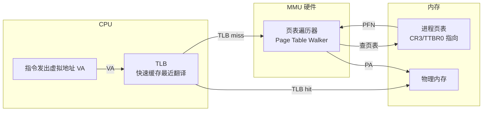
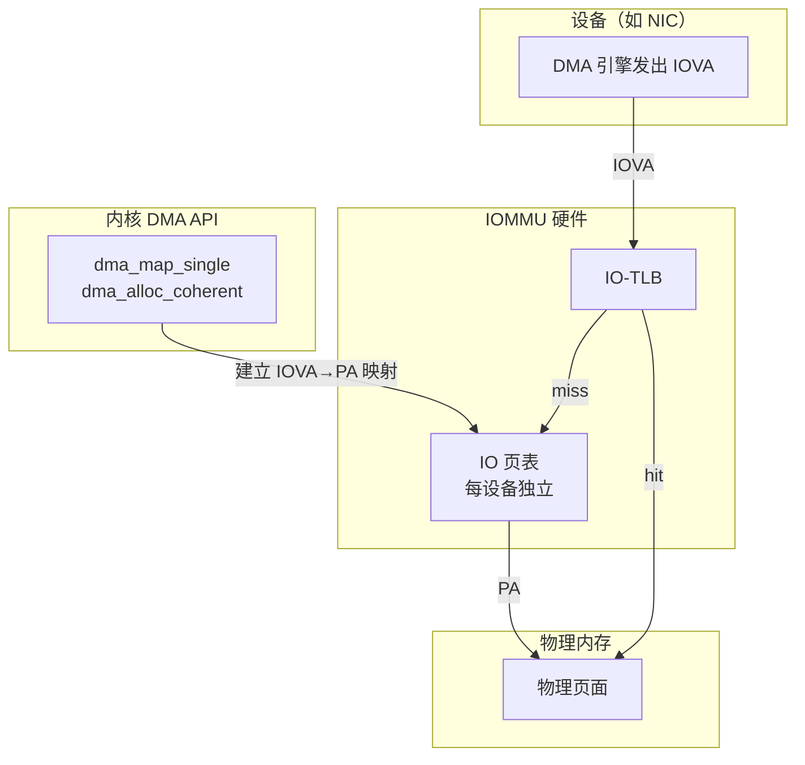
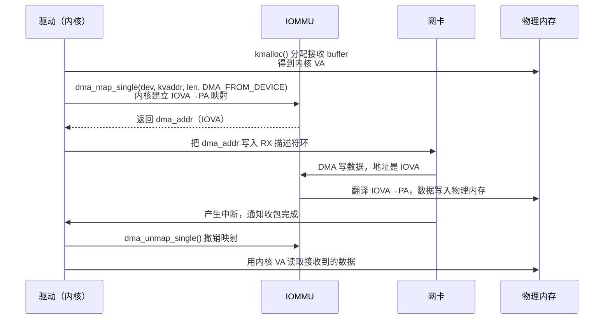

---
tags:
  - Linux
  - 内核
  - MMU
title: MMU 与 IOMMU 案例串联
description: 从虚拟地址到物理地址，再到设备 DMA 重映射；MMU/IOMMU 原理、对比与实际工程影响
date: 2026/05/16
---

# MMU 与 IOMMU 案例串联

很多人知道 MMU 做 CPU 地址翻译，但不清楚 IOMMU 是什么、为什么需要它、以及 DMA 地址和物理地址是不是同一回事。本文把这两个硬件单元串联起来，讲清楚它们各自解决什么问题、如何配合，以及对驱动开发的影响。

---

## 1. 两个问题，两个单元

| 单元 | 解决什么问题 | 谁在用 |
|------|-------------|--------|
| **MMU** | CPU 访问内存时的地址翻译（VA → PA） | 内核 + 用户进程 |
| **IOMMU** | 设备发起 DMA 时的地址翻译（IOVA → PA） | 网卡、GPU、PCIe 设备等 |

**核心类比**：
- MMU 是 CPU 的「地址翻译器」
- IOMMU 是设备的「地址翻译器」

---

## 2. MMU：CPU 视角的地址翻译

### 2.1 为什么需要 MMU

没有 MMU 时，每个程序都看到真实的物理地址：
- 程序 A 和程序 B 的地址空间可能重叠 → **相互干扰**
- 用户程序可以访问内核内存 → **安全问题**
- 内存碎片严重时，连续虚拟空间无法分配 → **碎片问题**

MMU 给每个进程提供独立的**虚拟地址空间**，隔离问题全部解决。

### 2.2 MMU 工作原理



**翻译过程（以 4 级页表为例）：**

```text
虚拟地址（64位）：
[63:48 符号扩展] [47:39 PML4] [38:30 PDPT] [29:21 PD] [20:12 PT] [11:0 页内偏移]
       ↓               ↓           ↓          ↓          ↓
    (忽略)        查 PML4 表   查 PDPT 表   查 PD 表   查 PT 表 → PFN
                                                              ↓
                                              PA = PFN × 4096 + 页内偏移
```

### 2.3 TLB 的作用

每次翻译都遍历 4 级页表需要 4 次内存访问，代价太高。**TLB（Translation Lookaside Buffer）** 缓存最近的 VA→PA 翻译结果：

- **TLB hit**：~1 个时钟周期
- **TLB miss**：需要页表遍历，~几十个时钟周期

**工程影响**：
- 进程切换时可能需要刷 TLB（取决于是否有 ASID/PCID）→ 这是上下文切换开销的重要组成部分
- 内存访问模式太随机 → TLB miss 率高 → 性能下降
- 使用**大页（2MB/1GB hugepage）** → TLB 一条项覆盖更大内存 → TLB miss 减少

---

## 3. IOMMU：设备视角的地址翻译

### 3.1 为什么需要 IOMMU

没有 IOMMU 时，设备（如网卡）做 DMA 直接用**物理地址**：

```text
问题1：安全 —— 恶意/bug 驱动可以让设备写任意物理地址（包括内核内存）
问题2：碎片 —— 设备通常需要物理连续的内存，但大块连续内存越来越难分配
问题3：虚拟化 —— Guest OS 里的 PA 不是真正的 HPA（Host Physical Address）
```

**IOMMU 解决方案**：设备看到的不是真实 PA，而是**IOVA（I/O Virtual Address）**，IOMMU 负责翻译。

### 3.2 IOMMU 工作原理



**关键点**：
- 驱动调用 `dma_map_*` → 内核在 IOMMU 里建立映射，返回 IOVA（称为 `dma_addr_t` 或 `dma_handle`）
- 驱动把 IOVA 写入设备寄存器/描述符
- 设备发起 DMA 时用 IOVA → IOMMU 翻译到 PA → 访问实际内存
- 驱动调用 `dma_unmap_*` → IOMMU 撤销映射

### 3.3 具体硬件实现

| 平台 | IOMMU 名称 |
|------|------------|
| ARM | **SMMU**（System Memory Management Unit） |
| x86 Intel | **VT-d**（Virtualization Technology for Directed I/O） |
| x86 AMD | **AMD-Vi** / **IOMMU** |

设备树中声明 SMMU：
```dts
smmu: iommu@fd800000 {
    compatible = "arm,smmu-v3";
    reg = <0x0 0xfd800000 0x0 0x20000>;
    #iommu-cells = <1>;
};

/* 网卡使用 SMMU */
eth0: ethernet@fe200000 {
    iommus = <&smmu 0x100>;   /* SMMU stream ID */
};
```

---

## 4. 完整地址链路：一个网卡收包的例子



**两套地址并存：**

```
内核侧: kmalloc VA ──MMU──→ PA（CPU 访问内存用这个）
设备侧: dma_addr（IOVA） ──IOMMU──→ PA（网卡 DMA 用这个）
```

---

## 5. 有 IOMMU vs 没有 IOMMU 的差异

| 场景 | 无 IOMMU | 有 IOMMU |
|------|----------|----------|
| `dma_alloc_coherent` 分配的地址 | `dma_addr` = 物理地址（直接映射） | `dma_addr` = IOVA（IOMMU 管理） |
| 散列内存做 DMA | 需要物理连续（`__get_free_pages`） | IOMMU 可以将离散物理页映射成**连续 IOVA** |
| 设备 bug 乱写内存 | 可能覆盖任意物理内存 | IOMMU 只允许写映射范围内的内存，**隔离损害** |
| 虚拟化 Guest DMA | Guest PA ≠ Host PA，设备会写错地方 | IOMMU 为 Guest 建立单独映射（VT-d / SMMU Stage 2） |

---

## 6. 驱动开发的实际影响

### 6.1 DMA API 是正确抽象

**无论有没有 IOMMU，驱动都应该用 DMA API，不要手算地址：**

```c
/* ✅ 正确：用 DMA API */
dma_addr_t dma_handle;
void *buf = dma_alloc_coherent(dev, size, &dma_handle, GFP_KERNEL);
/* dma_handle 给设备用，buf（CPU VA）给 CPU 用 */

/* ❌ 错误：手算物理地址喂给设备 */
phys_addr_t pa = virt_to_phys(kmalloc_ptr);
write_to_device_reg(pa);  /* 有 IOMMU 时这是错的！设备需要 IOVA，不是 PA */
```

### 6.2 流式 DMA 的 sync 操作

```c
/* CPU 写好数据，准备让设备读 */
dma_sync_single_for_device(dev, dma_addr, size, DMA_TO_DEVICE);
/* 启动 DMA */

/* 设备写完，CPU 准备读 */
dma_sync_single_for_cpu(dev, dma_addr, size, DMA_FROM_DEVICE);
/* 现在可以安全读 buf */
```

这些 sync 操作在不同平台上可能是：
- **无操作**（硬件一致性 + IOMMU）
- **Cache flush/invalidate**（非一致性内存）
- **IOMMU 映射更新**

### 6.3 scatter-gather DMA

IOMMU 的一个重要功能：将多个分散的物理页映射成**一段连续的 IOVA**，设备看到连续地址空间：

```c
struct scatterlist sg[4];
sg_init_table(sg, 4);
/* 填充 sg 各项 */

int nents = dma_map_sg(dev, sg, 4, DMA_TO_DEVICE);
/* 遍历映射后的 sg */
for_each_sg(sg, s, nents, i) {
    dma_addr_t iova = sg_dma_address(s);  /* IOVA */
    size_t len = sg_dma_len(s);
    /* 写入设备描述符 */
}
dma_unmap_sg(dev, sg, 4, DMA_TO_DEVICE);
```

---

## 7. 调试工具

```bash
# 查看物理内存布局
cat /proc/iomem

# 查看 IOMMU 域（Linux 5.x+）
cat /sys/kernel/iommu_groups/*/devices 2>/dev/null

# 查看 SMMU 故障（ARM，需 dmesg）
dmesg | grep -i smmu

# Intel VT-d 信息
dmesg | grep -i "iommu\|dmar"

# 查看 DMA 映射调试信息（需 CONFIG_IOMMU_DEBUG）
cat /sys/kernel/debug/iommu/domain_*/mappings 2>/dev/null
```

---

## 8. 总结：三层地址的关系

```text
┌─────────────────────────────────────────────────────────┐
│  用户进程 VA（进程虚拟地址）                             │
│      │ MMU（用户页表 TTBR0/CR3）                        │
│      ▼                                                   │
│  内核 VA（内核虚拟地址，kmalloc/vmalloc）                │
│      │ MMU（内核页表，线性映射 or vmalloc 区）           │
│      ▼                                                   │
│  PA（物理地址，DRAM 实际地址）                           │
│      ▲                                                   │
│      │ IOMMU（IO 页表，per device）                      │
│  IOVA（设备 DMA 地址，dma_addr_t）                      │
└─────────────────────────────────────────────────────────┘
```

**三句话记住：**
1. CPU 访问内存：VA → **MMU** → PA
2. 设备做 DMA：IOVA → **IOMMU** → PA（有 IOMMU 时）或直接 PA（无 IOMMU 时）
3. 驱动永远用 **DMA API**（`dma_map_*`），不要假设 IOVA == PA

---

## 延伸阅读

- [[linux/内核机制/如何通过虚拟地址查找物理地址]]
- [[linux/内核机制/DMA 与 Cache 一致性入门]]
- [[linux/内核机制/kmalloc 与 vmalloc]]
- [[网络与DPDK/教程/DPDK 教程 4：Offload、Flow、NUMA、IOVA 与性能剖析]]
