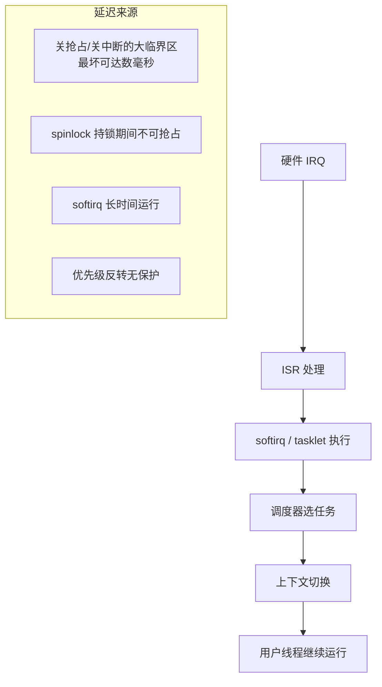

---
tags:
  - Linux
  - 实时
title: PREEMPT_RT 与 cyclictest 入门
description: 实时补丁原理、线程化中断、PI mutex 与最坏延迟测量
date: 2026/05/16
---

# PREEMPT_RT 与 cyclictest 入门

在工业控制、音视频采集、运动控制等场景，Linux 默认的抢占策略往往无法满足**硬实时**要求（最坏延迟 < 数十微秒）。**PREEMPT_RT 补丁**是让 Linux 逼近硬实时的主流方案。

本文讲清楚三件事：
1. PREEMPT_RT **改了什么**
2. 如何**测量**实时性（cyclictest）
3. **配套调优**才能真正压低抖动

---

## 1. 为什么普通 Linux 不满足实时要求

标准 Linux 是一个**分时系统**，不保证最坏响应时间。延迟来源主要有：



**最坏情况下**，Linux 内核在某些路径上会关闭抢占达数毫秒（如文件系统操作、内存回收），导致高优先级实时任务无法及时响应。

---

## 2. PREEMPT_RT 改了什么

PREEMPT_RT（也叫 `CONFIG_PREEMPT_RT`）是一个针对 Linux 内核的实时补丁集，核心目标是：**尽可能缩短不可抢占区间**。

### 2.1 主要改动

| 改动 | 原状态 | RT 状态 |
|------|--------|---------|
| **spinlock 转 RT mutex** | 持 spinlock 期间不可抢占 | 大多数 spinlock 改为可睡眠的 **RT mutex**（支持优先级继承） |
| **中断线程化** | 硬中断 ISR 运行在中断上下文，不可抢占 | 大多数中断转为**内核线程**，可被更高优先级线程抢占 |
| **关键区域缩短** | 内核某些路径关中断数百微秒 | 拆分、缩短不可中断区间 |
| **高分辨率定时器** | 默认 tick-based | 使用 `hrtimer`，定时精度从 ms 级到 µs 级 |
| **优先级继承（PI）** | 部分支持 | 全面启用 PI，缓解优先级反转 |

### 2.2 中断线程化（threaded IRQ）

这是 RT 补丁中最关键的改动之一。

**普通内核**：

```text
硬件 IRQ → CPU 进中断上下文 → 执行 ISR → 调度 softirq
               ↑
               此期间不可被高优先级任务抢占
```

**PREEMPT_RT**：

```text
硬件 IRQ → 极短的 hardirq top half（只做 ack）
             → 唤醒 IRQ 内核线程（RT 优先级）
                   → 线程可被更高优先级线程抢占
```

效果：设备驱动的中断处理变成了**普通（高优先级）内核线程**，实时任务可以抢占它。

```bash
# 查看中断线程
ps aux | grep irq
# 输出类似：
# root   123  99 RT   [irq/42-eth0]
# root   124  99 RT   [irq/43-spi0]
```

### 2.3 RT mutex 与优先级继承

**问题**：普通 spinlock 在 RT 内核里会成为优先级反转的源头（低优先级线程持锁，高优先级线程自旋等待，期间被中优先级线程抢占）。

**RT mutex 解法**：
- 当高优先级线程 H 等待低优先级线程 L 持有的锁时，L 的优先级被**临时提升**到 H 的优先级（优先级继承），让 L 尽快执行完释放锁。

```c
/* 内核里 RT mutex 用法（概念示意） */
DEFINE_RT_MUTEX(mylock);
rt_mutex_lock(&mylock);   /* 支持优先级继承 */
/* 临界区 */
rt_mutex_unlock(&mylock);
```

---

## 3. 如何获取 PREEMPT_RT 内核

### 3.1 方式一：使用发行版提供的 RT 内核

部分发行版提供现成的 RT 内核：

```bash
# Ubuntu
sudo apt install linux-lowlatency   # 低延迟（不是完整 RT）
# 或
sudo apt install linux-realtime     # 某些版本提供

# 查看已安装内核
uname -r   # 如输出 5.15.0-76-realtime 则表示 RT 内核
```

### 3.2 方式二：自己打补丁编译

```bash
# 1. 下载内核源码和对应 RT 补丁（版本必须匹配）
# 补丁下载：https://www.kernel.org/pub/linux/kernel/projects/rt/

wget https://cdn.kernel.org/pub/linux/kernel/v6.x/linux-6.6.tar.xz
wget https://cdn.kernel.org/pub/linux/kernel/projects/rt/6.6/patch-6.6-rt14.patch.xz

# 2. 打补丁
tar xf linux-6.6.tar.xz
cd linux-6.6
xzcat ../patch-6.6-rt14.patch.xz | patch -p1

# 3. 配置（关键选项）
make menuconfig
# 找到: General Setup → Preemption Model → Fully Preemptible Kernel (Real-Time)
# 找到: Processor type → Timer frequency → 1000 Hz（嵌入式可选）

# 4. 编译安装
make -j$(nproc)
sudo make modules_install install
```

**内核配置关键项：**

```
CONFIG_PREEMPT_RT=y              # 完全可抢占（RT 核心）
CONFIG_HZ_1000=y                 # 1000Hz tick（降低调度粒度）
CONFIG_HIGH_RES_TIMERS=y         # 高分辨率定时器（cyclictest 依赖）
CONFIG_NO_HZ_FULL=y              # 全动态 tick（配合 isolcpus）
CONFIG_CPU_ISOLATION=y           # CPU 隔离
```

---

## 4. cyclictest：测量实时延迟

`cyclictest` 是 RT-Linux 社区的标准延迟测量工具，原理是：
- 在指定 CPU 上运行一个高优先级（SCHED_FIFO）线程
- 线程每隔 `interval` 微秒唤醒一次，记录**实际唤醒时间 vs 期望唤醒时间之差**（即延迟）
- 统计最大延迟（Max）、平均延迟

### 4.1 安装与基础用法

```bash
# 安装
sudo apt install rt-tests

# 基础测试（单线程，优先级99，间隔1ms，运行10万次）
sudo cyclictest -p 99 -t 1 -n -i 1000 -l 100000

# 常用参数说明：
# -p 99     : 实时优先级 99（最高）
# -t 1      : 1个测试线程
# -n        : 使用 clock_nanosleep（更精确）
# -i 1000   : 唤醒间隔 1000µs = 1ms
# -l 100000 : 循环次数
# -a 2      : 绑定到 CPU2（配合 isolcpus）
```

### 4.2 典型输出解读

```text
# /dev/cpu_dma_latency set to 0us
policy: fifo: loadavg: 0.10 0.03 0.01 1/312 12345

T: 0 (12345) P:99 I:1000 C:100000 Min:    3 Act:    5 Avg:    6 Max:   87
```

| 字段 | 含义 |
|------|------|
| `P:99` | 实时优先级 99 |
| `I:1000` | 间隔 1000µs |
| `C:100000` | 完成次数 |
| `Min: 3` | 最小延迟 3µs |
| `Act: 5` | 当前延迟 5µs |
| `Avg: 6` | 平均延迟 6µs |
| **`Max: 87`** | **最坏延迟 87µs ← 这是最关键的指标** |

**判断标准：**
- Max < 100µs：轻量实时任务基本够用
- Max < 20µs：满足大多数工业控制需求
- Max < 5µs：硬实时需求（通常需要专用 MCU 或 FPGA 辅助）

### 4.3 压力测试（模拟真实场景）

测量延迟时必须同时制造系统压力，否则测出的数据没有参考价值：

```bash
# 终端1：施加 CPU/内存/IO 压力
stress-ng --cpu 4 --io 2 --vm 2 --vm-bytes 512M &

# 终端2：测量延迟（时间长一些，至少5分钟）
sudo cyclictest -p 99 -t 4 -n -i 200 -D 5m -a 4-7 --histogram=200

# -D 5m     : 持续 5 分钟
# -a 4-7    : 绑核到 CPU4~7（isolcpus 隔离的核）
# --histogram=200 : 输出延迟直方图（最大 200µs）
```

### 4.4 生成延迟直方图（可视化）

```bash
# 输出直方图数据
sudo cyclictest -p 99 -t 4 -i 200 -D 60 -m --histogram=1000 > histogram.txt

# 用 gnuplot 画图（可选）
# histogram.txt 格式可直接用 Python/gnuplot 处理
```

---

## 5. 配套调优：RT 内核单独不够

光打 RT 补丁是不够的，还需要系统级配套：

### 5.1 CPU 隔离（最重要）

```bash
# 启动参数（在 /etc/default/grub 里加）
GRUB_CMDLINE_LINUX="isolcpus=2,3 nohz_full=2,3 rcu_nocbs=2,3"
sudo update-grub && sudo reboot

# 效果：CPU2、CPU3 不参与通用调度，专供实时线程使用
# 实时线程再绑到这些核
sudo cyclictest -p 99 -a 2 -t 1 -i 200 -n
```

### 5.2 中断亲和性

```bash
# 把网卡中断从实时核移走
echo 1 > /proc/irq/42/smp_affinity  # 只允许 CPU0 处理 IRQ42

# 查看所有中断的 CPU 分布
cat /proc/interrupts
```

### 5.3 禁止 CPU 节能状态（C-states）

```bash
# CPU 节能状态（C2/C3）会引起唤醒延迟
# 临时禁用
sudo cpupower idle-set -D 0

# 或在启动参数里加
# intel_idle.max_cstate=0 processor.max_cstate=1
```

### 5.4 关闭 CPU 变频

```bash
# 设置 performance 模式（禁止变频）
sudo cpupower frequency-set -g performance

# 查看当前频率策略
cat /sys/devices/system/cpu/cpu0/cpufreq/scaling_governor
```

### 5.5 锁定内存（防止 page fault）

```bash
# 实时进程在启动时 mlockall，防止 page fault 引起抖动
```

```c
#include <sys/mman.h>
/* 在实时线程主函数开头调用 */
mlockall(MCL_CURRENT | MCL_FUTURE);
```

### 5.6 设置 CPU DMA 延迟

```bash
# cyclictest 启动时自动设置，也可手动
echo 0 | sudo tee /dev/cpu_dma_latency
```

---

## 6. RT vs DPDK：两种路线

| 维度 | PREEMPT_RT | DPDK（用户态轮询） |
|------|------------|-------------------|
| **适用** | 通用实时任务（控制、采集） | 极高吞吐网络数据面 |
| **延迟下界** | ~5~20µs（调好的系统） | ~1µs（轮询模式） |
| **CPU 开销** | 普通调度，不独占 CPU | **独占 CPU** 轮询 |
| **内核中断** | 线程化，参与调度 | **bypass 内核**，不经过中断 |
| **可组合** | 管理面/控制面用 RT | 数据面用 DPDK |

**可以组合**：实时控制面（PREEMPT_RT + isolcpus）+ 高速数据面（DPDK + 另一批隔离核）。

---

## 7. 调优效果参考

在典型 x86 服务器上（不同硬件差异大）：

| 状态 | Max 延迟（典型值） |
|------|-------------------|
| 标准内核（无压力） | ~200µs |
| 标准内核（有压力） | >1ms，不可预期 |
| PREEMPT_RT（无压力） | ~20µs |
| PREEMPT_RT + isolcpus + C-state 禁用（有压力） | ~30~50µs |
| PREEMPT_RT 精调（专用硬件） | <10µs |

---

## 8. 快速实验步骤

1. **确认内核**：`uname -r` 看是否含 `rt` 字样
2. **安装工具**：`sudo apt install rt-tests stress-ng`
3. **无压力基线**：`sudo cyclictest -p 99 -t 1 -n -i 1000 -l 100000`
4. **施压测试**：后台运行 `stress-ng --cpu 4`，再跑 cyclictest
5. **绑核优化**：用 `isolcpus` + `-a` 参数对比差异

---

## 延伸阅读

- [[linux/内核机制/进程调度与绑核]]（isolcpus、taskset 详解）
- [[linux/内核机制/Linux 内核调度机制面试详解]]（SCHED_FIFO、DEADLINE）
- [[linux/内核机制/Linux 中断机制详解]]（中断线程化原理）
- [[linux/内核机制/内核同步机制总览]]（RT mutex 与优先级继承）
- [[系统调试/内核卡死与 hung task 入门]]
- [RT-Linux Wiki](https://wiki.linuxfoundation.org/realtime/start)
