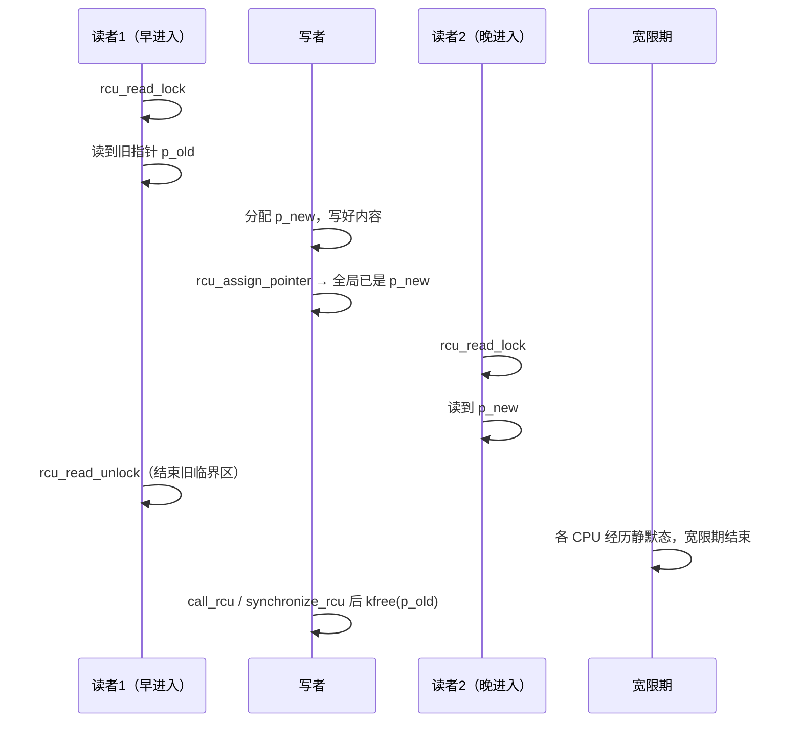
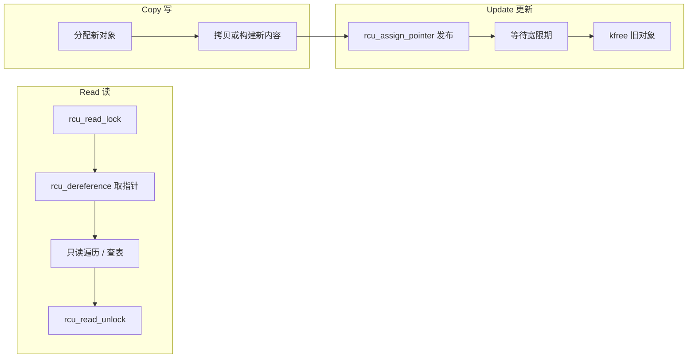
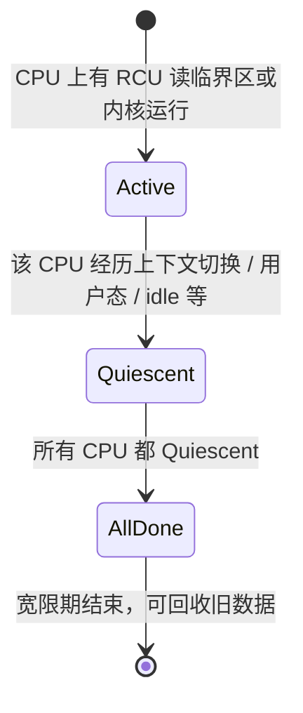

---
tags:
  - Linux
  - 内核
  - RCU
  - 同步
title: RCU 读拷贝更新机制详解
description: 宽限期、读侧无锁、写侧发布与延迟释放；修改者何时必须等待读者
date: 2026/05/21
---

# RCU 读拷贝更新机制详解

**RCU（Read-Copy-Update，读拷贝更新）** 是 Linux 内核里面向 **读多写少** 的同步方案：读路径尽量 **无锁**，写路径 **拷贝出新版本再切换指针**，旧数据在 **宽限期（grace period）** 结束后再释放。

---

## 1. 读完能带走什么

- RCU **不是**「写者等每个读者把旧数据读完」，而是等 **所有「曾可能看到旧指针」的读侧临界区结束**。  
- **新指针可以立刻发布**；必须等待的是 **释放旧内存**，否则读者仍拿着旧指针时会 UAF。  
- 等待方式：`synchronize_rcu()` 阻塞到宽限期结束，或 `call_rcu()` 异步回调释放。

---

## 2. 核心问题：修改者要不要等所有读者？

### 2.1 分两件事看

| 动作 | 要不要等读者？ | 说明 |
|------|----------------|------|
| **发布新数据**（改全局指针） | **一般不等** | `rcu_assign_pointer()` 后，**新读者**立刻看到新版本 |
| **释放旧数据**（`kfree`） | **必须等** | 要等 **宽限期**，保证没有读者仍处在「可能仍使用旧指针」的临界区内 |

所以更准确的说法是：

> 修改者 **可以马上把「当前版本」切到新对象**；  
> 但 **不能马上 `kfree` 旧对象**，必须等 RCU 确认：每个 CPU 上，所有 **旧的读侧临界区** 都已结束。

这不是「等读者把结构体字段读完」，而是「等 `rcu_read_lock` … `rcu_read_unlock` 这段保护结束」。

### 2.2 时序（一张图）



- **读者 1** 在切换指针 **之前** 进入临界区 → 合法地继续用 `p_old`。  
- **读者 2** 在切换 **之后** 进入 → 只看到 `p_new`。  
- 写者 **在 R1 解锁之后**（且宽限期完成）才能安全 `kfree(p_old)`。

---

## 3. 为什么叫 Read-Copy-Update



| 阶段 | 含义 |
|------|------|
| **Read** | 读者在临界区内读 **某一时刻的指针快照**，不与写者抢同一把锁 |
| **Copy** | 写者不原地改共享结构，而是 **新建一份** 改好 |
| **Update** | 原子地让全局指针指向新对象；旧对象延迟回收 |

「原地改链表」类结构也可以配合 RCU 的 **发布语义**，但思想仍是：**读者看到的是指针一致快照，写者用新副本替换**。

---

## 4. 读侧：无锁指什么

```c
rcu_read_lock();           /* 进入读侧临界区，可能禁止抢占等 */
p = rcu_dereference(head); /* 取指针；与写者的发布配对 */
/* 使用 p，但不要在临界区外长期持有 p 而不受保护 */
rcu_read_unlock();
```

- 读侧 **通常无 mutex/spinlock**，开销极低，适合 **路由表、哈希表遍历、网络 skb 路径** 等。  
- 「无锁」≠ 可以乱写共享数据：读侧 **只读**；写侧 **换指针 + 延迟释放**。  
- 临界区应尽量 **短**；在临界区内 **睡眠** 会拖死宽限期（甚至 **RCU stall**），见 [[系统调试/内核卡死与 hung task 入门]]。

---

## 5. 写侧：发布与回收

```c
struct foo *new, *old;

new = kmalloc(sizeof(*new), GFP_KERNEL);
/* 填充 new ... */

old = rcu_dereference_protected(head, lockdep_is_held(&update_lock));
rcu_assign_pointer(head, new);   /* 发布：之后的新读者见 new */

synchronize_rcu();               /* 等宽限期：所有旧临界区已结束 */
kfree(old);

/* 或异步：不阻塞当前线程 */
call_rcu(&old->rcu, foo_free_rcu);
```

| API | 作用 |
|-----|------|
| `rcu_dereference()` | 读侧在临界区内取指针 |
| `rcu_assign_pointer()` | 写侧发布新指针（带内存序） |
| `synchronize_rcu()` | **阻塞** 直到当前宽限期结束 |
| `call_rcu(head, func)` | 宽限期结束后在软中断上下文调 `func` 释放 |

**发布与释放解耦**：热路径常 `assign` + `call_rcu`，避免写线程长时间睡眠。

---

## 6. 宽限期（grace period）是什么

**宽限期**：从写者 **替换指针之后**，到内核确认 **每个 CPU** 都已发生过 **静默态（quiescent state）** 的时间段。



直觉：

- 每个 CPU 只要在某个时刻 **「重新来过」一次**（例如从内核态切到用户态），之前在该 CPU 上启动的 RCU 读临界区 **必然已经结束**。  
- 当 **所有 CPU** 都至少经历一次这样的状态，就不可能还有人卡在「旧指针仍有效」的临界区里 → 可以 `kfree`。

因此：**不是** 内核去枚举「还有几个读者在读字节」，而是 **用 CPU 级 quiescent state 推断** 全局读侧临界区已全部退出。

---

## 7. 与 mutex / spinlock 的对比

| 维度 | mutex / spinlock | RCU |
|------|------------------|-----|
| 读路径成本 | 加锁、可能争用 | 临界区极轻，无锁语义 |
| 写路径 | 原地改 + 持锁 | 分配新对象 + 换指针 + 等 GP |
| 读者阻塞写者？ | 会 | **不会**（读不持锁） |
| 写者阻塞读者？ | 会 | **发布不阻塞**；仅回收旧内存需等 GP |
| 内存 | 一份对象 | 短暂 **双份**（新旧并存） |
| 适用 | 读写都复杂、写频繁 | **读极多、写很少** |

---

## 8. 常见变体（知道名字即可）

| 类型 | 场景 |
|------|------|
| **树 RCU（Tree RCU）** | 通用内核、可抢占 |
| **SRCU（Sleepable RCU）** | 读侧临界区 **可睡眠**（需 `srcu_read_lock`） |
| **RCU-bh** | 与软中断边界配合 |
| **Tasks RCU** | 与进程生命周期相关 |

驱动里最常见的是 **全局指针 + `call_rcu`**；网络子系统、路由、`idr` 等大量用 RCU 链表/哈希。

---

## 9. 使用约束与坑

| 规则 | 原因 |
|------|------|
| 读侧临界区 **短**、**不睡眠**（除非 SRCU） | 否则宽限期永不结束 → RCU stall |
| 只在 `rcu_read_lock` 内 `rcu_dereference` 使用指针 | 临界区外使用可能已是悬空指针 |
| 写侧更新指针用 `rcu_assign_pointer` | 保证发布顺序，读者看到完整新对象 |
| 旧对象 **只** 在 `synchronize_rcu` / `call_rcu` 后释放 | 否则 UAF |
| 写太多、对象太大 | 内存峰值与 GP 延迟变差，不如 mutex |

**优先级反转**、**IRQ 上下文** 与锁的选用仍见 [[linux/内核机制/内核同步机制总览]]、[[linux/内核机制/进程调度与绑核]]。

---

## 10. 面试口述（30 秒）

> RCU 读侧 `rcu_read_lock` 里无锁读指针，写侧分配新对象、`rcu_assign_pointer` 发布，旧对象不能立刻释放，要等 **宽限期**——所有 CPU 都经过静默态，保证旧读临界区结束。所以 **切换指针不必等读者读完数据**，但 **释放旧内存必须等**。异步用 `call_rcu`。

---

## 11. 检查清单

- [ ] 能区分 **发布新指针** 与 **释放旧内存** 两个时间点  
- [ ] 能画出一个读者跨 `assign_pointer` 仍用旧对象的时序  
- [ ] 知道 `synchronize_rcu` 阻塞、 `call_rcu` 异步  
- [ ] 知道读侧睡眠会导致 RCU stall  

---

## 延伸阅读

- [[linux/内核机制/内核同步机制总览]]
- [[linux/内核机制/per-CPU 与 per-core 数据结构]]
- [[系统调试/内核卡死与 hung task 入门]]
- [[linux/学习路径/中断与下半部机制]]
