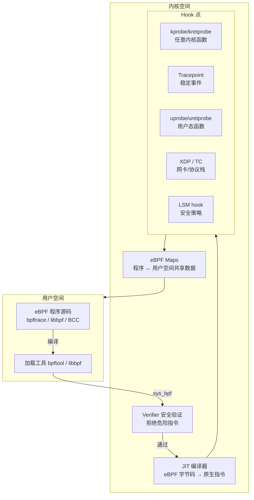
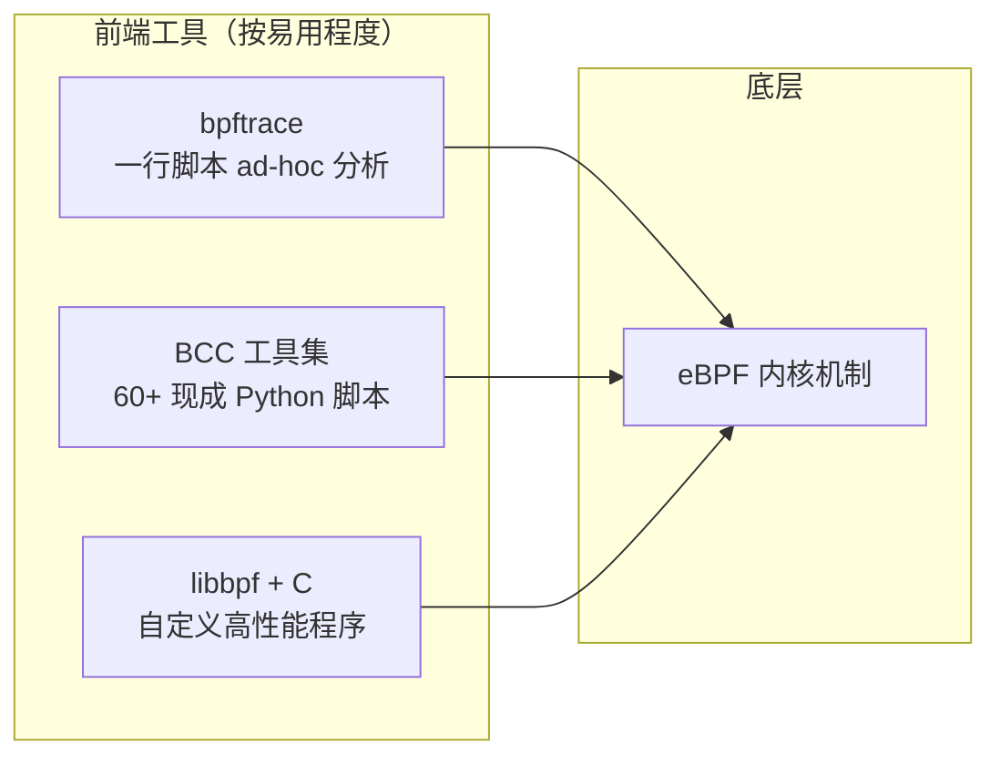

---
tags:
  - Linux
  - eBPF
title: eBPF 与 bpftrace 入门
description: eBPF 架构、hook 类型、bpftrace 语言基础与实战脚本
date: 2026/05/16
---

# eBPF 与 bpftrace 入门

eBPF 是 Linux 内核里 **最强大的可观测性工具**：它允许你把一段小程序注入到内核的关键路径上（系统调用、网络收包、函数入口等），**无需修改内核代码**，**无需重启**，就能收集任何你想要的数据。

本文分两部分：
1. **eBPF 是什么**（概念与架构）  
2. **bpftrace 实战**（最常用的 eBPF 前端工具）

---

## 1. eBPF 是什么

### 1.1 一句话定义

> **eBPF（extended Berkeley Packet Filter）** 是内核里内置的一个安全沙箱虚拟机，可以在不修改内核的情况下，把用户编写的小程序加载到内核的关键路径上运行。

最初的 BPF 是 1992 年 BSD 里用来过滤网络包的，Linux 3.x 把它大幅扩展（extended），现在它已经远不只是网络过滤——**几乎内核里任何你关心的事件都可以挂钩**。

### 1.2 架构图



**关键点**：
- **Verifier**：加载时静态检查，拒绝死循环、越界访问、无限制的内存操作 → 保证内核安全
- **JIT**：eBPF 字节码在运行时被编译成原生机器码，**接近原生性能**
- **Maps**：eBPF 程序与用户空间之间的数据通道（哈希表、数组、ring buffer 等）

### 1.3 为什么用 eBPF 而不是 printk / perf

| 方式 | 问题 | eBPF 优势 |
|------|------|-----------|
| `printk` 调试 | 要改代码重编译，生产不能用 | **无需改内核**，可在运行时挂载/卸载 |
| `perf stat` | 只有统计，不能定制逻辑 | 可以写 **自定义聚合逻辑**（直方图、过滤条件） |
| `strace` | 每次 syscall 都 ptrace，开销大 | eBPF 直接在内核里聚合，**开销极小** |
| 内核模块 | 可以访问所有内核，但 bug 会 panic | eBPF 被 Verifier 限制在安全范围内 |

### 1.4 主要 Hook 类型

| Hook | 触发时机 | 典型用途 |
|------|----------|----------|
| **kprobe** | 动态插入任意内核函数入口/返回 | 跟踪 `do_sys_open`、`tcp_connect` 等 |
| **tracepoint** | 内核预埋的稳定探针点 | `sched:sched_switch`、`block:block_rq_issue` |
| **uprobe** | 用户态函数入口/返回 | 跟踪 Go runtime、OpenSSL、业务函数 |
| **XDP** | 网卡驱动收包最早阶段 | 高速包过滤、DDoS 防护、负载均衡 |
| **socket filter** | socket 收发包 | 流量监控 |
| **LSM** | 内核安全钩子 | 细粒度访问控制 |

---

## 2. bpftrace：最简单的 eBPF 前端

bpftrace 是一个基于 eBPF 的**高级跟踪语言**，语法类似 awk + DTrace，专门用于 **ad-hoc 内核观测**——不需要 C 代码，一行命令就能完成很多分析。

### 2.1 前置条件

```bash
# 检查 bpftrace 是否可用
bpftrace -V
# 需要内核 >= 4.9，推荐 5.x+；需要 CONFIG_BPF=y, CONFIG_BPF_SYSCALL=y
# BTF（BPF Type Format）支持更好的类型信息：CONFIG_DEBUG_INFO_BTF=y

# 安装（Ubuntu/Debian）
sudo apt install bpftrace

# 查看可用 tracepoint
bpftrace -l 'tracepoint:syscalls:*' | head -20
```

嵌入式板若内核过旧或裁剪过度，可能不支持 bpftrace，先在**桌面/VM** 上练习。

### 2.2 语言基础

bpftrace 脚本的基本结构：

```
probe_type:event_name /filter/ {
    action;
}
```

- **probe_type**：`kprobe`、`kretprobe`、`tracepoint`、`uprobe`、`interval` 等
- **filter**：布尔表达式，为真才执行 action（可省略）
- **action**：可以用内置变量、函数、Maps

**内置变量速查：**

| 变量 | 含义 |
|------|------|
| `pid` | 当前进程 PID |
| `tid` | 当前线程 ID |
| `comm` | 当前进程名 |
| `nsecs` | 当前时间（纳秒） |
| `cpu` | 当前 CPU 编号 |
| `retval` | 函数返回值（kretprobe 里用） |
| `args` | tracepoint 的参数结构体 |

**内置函数速查：**

| 函数 | 说明 |
|------|------|
| `printf(fmt, ...)` | 打印（类似 C printf） |
| `hist(val)` | 2 的幂次直方图 |
| `lhist(val, min, max, step)` | 线性直方图 |
| `count()` | 计数 |
| `sum(val)` | 求和 |
| `avg(val)` | 均值 |
| `max(val)` / `min(val)` | 最大/最小值 |
| `stack` | 内核调用栈 |
| `ustack` | 用户态调用栈 |
| `str(ptr)` | 读取字符串（C 字符串指针） |
| `delete(@map[key])` | 删除 Map 条目 |

### 2.3 实战脚本

#### 示例 1：统计每个进程的 syscall 次数（1 秒快照）

```bash
bpftrace -e '
tracepoint:raw_syscalls:sys_enter { @[comm] = count(); }
interval:s:1 { print(@); clear(@); }
'
```

输出示例：
```
@[sshd]: 34
@[nginx]: 128
@[python3]: 512
```

#### 示例 2：syscall 延迟直方图（按进程）

```bash
bpftrace -e '
tracepoint:raw_syscalls:sys_enter { @start[tid] = nsecs; }
tracepoint:raw_syscalls:sys_exit /@start[tid]/ {
  @us[comm] = hist((nsecs - @start[tid]) / 1000);
  delete(@start[tid]);
}'
```

执行后 Ctrl+C，会打印每个进程的 syscall 延迟分布（单位 µs）：
```
@us[nginx]:
[0, 1)               842 |@@@@@@@@@@@@@@@@@@  |
[1, 2)              1024 |@@@@@@@@@@@@@@@@@@@@|
[2, 4)               234 |@@@@@               |
[4, 8)                56 |@                   |
...
```

#### 示例 3：跟踪文件打开（哪个进程打开了什么文件）

```bash
bpftrace -e '
tracepoint:syscalls:sys_enter_openat {
  printf("%-8s %s\n", comm, str(args->filename));
}'
```

输出：
```
nginx    /etc/nginx/nginx.conf
sshd     /etc/passwd
python3  /tmp/data.csv
```

#### 示例 4：磁盘 I/O 延迟分布（按设备）

```bash
bpftrace -e '
tracepoint:block:block_rq_issue {
  @start[args->dev, args->sector] = nsecs;
}
tracepoint:block:block_rq_complete /@start[args->dev, args->sector]/ {
  @io_ms = hist((nsecs - @start[args->dev, args->sector]) / 1000000);
  delete(@start[args->dev, args->sector]);
}'
```

#### 示例 5：TCP 连接跟踪（目标 IP + 端口）

```bash
bpftrace -e '
kprobe:tcp_connect {
  $sk = (struct sock *)arg0;
  $dport = ($sk->__sk_common.skc_dport >> 8) | (($sk->__sk_common.skc_dport & 0xff) << 8);
  printf("%-8s → %s:%d\n", comm,
    ntop(AF_INET, $sk->__sk_common.skc_daddr), $dport);
}'
```

#### 示例 6：内存分配热点（kmalloc 调用栈）

```bash
bpftrace -e '
kprobe:__kmalloc {
  @[kstack] = sum(arg0);
}
interval:s:5 {
  print(@);
  clear(@);
}'
```

这会打印 5 秒内各调用栈的 kmalloc 总字节数，帮你找内存分配热点。

#### 示例 7：找出持锁时间最长的进程

```bash
bpftrace -e '
kprobe:mutex_lock { @lock_start[arg0, tid] = nsecs; }
kretprobe:mutex_unlock /@lock_start[arg0, tid]/ {
  @held_us[comm] = max((nsecs - @lock_start[arg0, tid]) / 1000);
  delete(@lock_start[arg0, tid]);
}'
```

### 2.4 .bt 脚本文件

脚本较长时可以写成文件：

```bash
# latency.bt
#!/usr/bin/env bpftrace

BEGIN { printf("Tracing sys_read latency...\n"); }

tracepoint:syscalls:sys_enter_read { @start[tid] = nsecs; }
tracepoint:syscalls:sys_exit_read /@start[tid]/ {
  $lat = (nsecs - @start[tid]) / 1000;
  if ($lat > 1000) {   /* 只记录 > 1ms 的 */
    @slow[comm] = lhist($lat, 0, 100000, 1000);
  }
  delete(@start[tid]);
}

END {
  printf("\nSlow read latency (us):\n");
  print(@slow);
}
```

运行：

```bash
chmod +x latency.bt
sudo ./latency.bt
```

---

## 3. eBPF 工具生态



**推荐路线**：
- **新手**：先用 `bpftrace` 做观测，成本最低
- **需要更多功能**：`BCC` 的 `execsnoop`、`opensnoop`、`biolatency` 等开箱即用
- **生产嵌入**：`libbpf` + CO-RE（Compile Once, Run Everywhere），适合做成守护进程

**BCC 常用工具速查：**

| 工具 | 作用 |
|------|------|
| `execsnoop` | 跟踪所有 exec 调用 |
| `opensnoop` | 跟踪文件打开 |
| `biolatency` | 块设备 I/O 延迟直方图 |
| `tcpconnect` | 跟踪 TCP 连接 |
| `tcpretrans` | 跟踪 TCP 重传 |
| `runqlat` | 进程在 runqueue 里等待时间 |
| `offcputime` | 进程在哪里 off-CPU（被调度出去） |
| `memleak` | 用户态/内核态内存泄漏检测 |

---

## 4. 生产环境注意事项

| 注意点 | 说明 |
|--------|------|
| **开销** | kprobe 热路径（如 tcp_sendmsg）可能有 1~5% 开销，观测完要卸载 |
| **权限** | 需要 root 或 `CAP_BPF`；部分发行版默认限制 |
| **内核版本** | bpftrace 需要 >= 4.9，完整功能需 5.x+；BTF 支持需 5.2+ |
| **嵌入式** | 资源受限板子内核通常裁掉了 BPF，先在 VM 上练 |
| **tracepoint 稳定性** | tracepoint 接口稳定；kprobe 挂的是内核函数，函数名可能随版本变 |
| **生产验证** | 先在测试机上验证脚本不会 panic，再上生产 |

---

## 5. 快速参考：场景 → 工具

| 场景 | 推荐命令 |
|------|----------|
| 哪个进程 syscall 最多？ | `bpftrace -e 'tracepoint:raw_syscalls:sys_enter { @[comm] = count(); }'` |
| 某函数调用了多少次？ | `bpftrace -e 'kprobe:vfs_read { @[comm] = count(); }'` |
| 磁盘 I/O 延迟分布 | `sudo biolatency -m`（BCC） |
| TCP 重传是哪个进程？ | `sudo tcpretrans`（BCC） |
| 进程调度延迟 | `sudo runqlat`（BCC） |
| 内存分配热点 | `bpftrace -e 'kprobe:__kmalloc { @[kstack] = sum(arg0); }'` |
| 生产级 eBPF 程序 | 用 `libbpf` + `bpftool` skeleton |

---

## 延伸阅读

- [[系统调试/排障 SOP：日志、perf 与反汇编]]
- [[系统调试/排障工具链一张图]]
- [[linux/内核机制/Linux 中断机制详解]]（中断路径上的 tracepoint 实例）
- [bpftrace 官方文档](https://github.com/bpftrace/bpftrace/blob/master/docs/reference_guide.md)
- [BCC 工具集](https://github.com/iovisor/bcc/blob/master/docs/tutorial.md)
