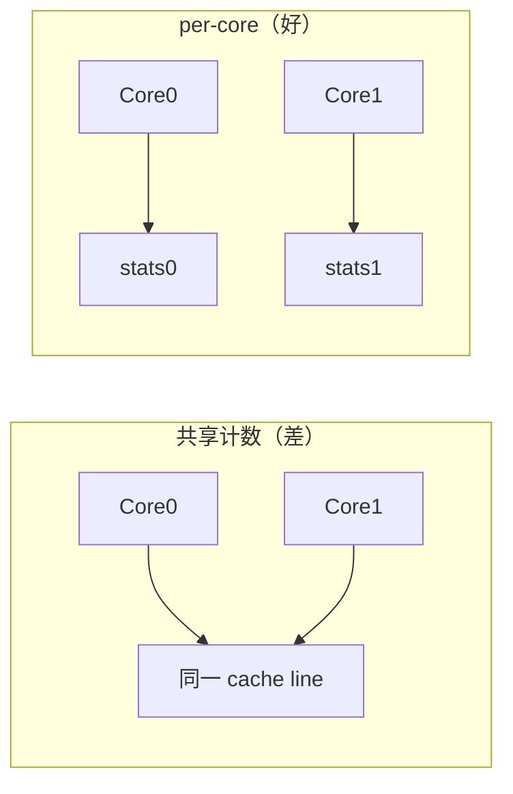

---
tags:
  - Linux
  - 内核
  - SMP
  - DPDK
title: per-CPU 与 per-core 数据结构
description: 每核一份数据的动机、内核与 DPDK 用法、false sharing 与汇总
date: 2026/05/21
---

# per-CPU 与 per-core 数据结构

**per-CPU / per-core** 指：**每个逻辑 CPU 一份独立副本**，热路径上当前核只读写 **本核那份**，从而少抢锁、少伪共享。  
内核里常说 **per-CPU**；DPDK 里常说 **per-lcore**（logical core）。思想相同。

---

## 1. 为什么要「每核一份」

| 问题 | 多核共享一个 `counter` | 每核一个 `counter[i]` |
|------|------------------------|------------------------|
| 更新计数 | 要原子操作或锁 | 本核直接 `++`，无锁 |
| Cache | 多核写同一行 → **false sharing** | 各写各的 cache line |
| 扩展性 | 核越多争用越严重 | 近似线性扩展（再汇总） |



**代价**：内存 × CPU 数；读 **全局总和** 时要遍历或定期汇总。

---

## 2. 核心心智模型

1. **写路径**：`cpu = smp_processor_id()`（内核）或 `rte_lcore_id()`（DPDK）→ 只碰 `data[cpu]`。  
2. **读路径**：  
   - 只关心本核 → 直接读 `this_cpu` / 本 lcore 变量；  
   - 要全局统计 → `for_each_possible_cpu` 累加，或后台线程汇总。  
3. **禁止**：A 核写 `stats[1]`、B 核写 `stats[0]` 可以；**同一元素被多核写** 又回到争用。

---

## 3. Linux 内核中的 per-CPU

### 3.1 静态 per-CPU 变量

```c
#include <linux/percpu.h>

DEFINE_PER_CPU(long, irq_count);

void in_isr(void)
{
    this_cpu_inc(irq_count);   /* 当前 CPU 的那份 +1 */
}

void show_total(void)
{
    long sum = 0;
    int cpu;
    for_each_possible_cpu(cpu)
        sum += per_cpu(irq_count, cpu);
    pr_info("total irqs: %ld\n", sum);
}
```

| API | 作用 |
|-----|------|
| `DEFINE_PER_CPU(type, name)` | 编译期分配每 CPU 一份 |
| `this_cpu_read/write/inc` | 当前 CPU 访问，快 |
| `per_cpu(var, cpu)` | 指定 CPU 访问（需配合抢占/迁移注意） |
| `get_cpu_var` / `put_cpu_var` | 禁止抢占期间安全访问 |

### 3.2 动态分配

```c
struct stats *s = alloc_percpu(struct stats);
struct stats *p = this_cpu_ptr(s);
p->packets++;
free_percpu(s);
```

### 3.3 实现原理（直觉）

- 链接为 **`.data..percpu` / `.bss..percpu`** 段：链接脚本把「每 CPU 模块」排成数组，启动时按 CPU 数 **复制/重定位**。  
- 访问时通过 **per-CPU 偏移** 加到当前 CPU 基址（`__per_cpu_offset[cpu]`）。  
- **不是** 简单 `global_array[cpu]`，但你可以把它想成 **逻辑上等价的二维结构**。

### 3.4 与中断、抢占

- 进程上下文迁移到另一 CPU 后，`this_cpu_*` 指向 **新 CPU** 的副本——统计要按「每 CPU」语义设计，不要假设「跟线程走」。  
- 硬中断里可用 `this_cpu_inc`（中断发生在当前 CPU 上）。  
- 详见 [[linux/内核机制/Linux 中断机制详解]]、[[linux/内核机制/为什么 ISR 不能睡眠]]。

---

## 4. DPDK 中的 per-lcore

DPDK 数据面假设 **worker 绑核**，对象常 **按 lcore 私有**：

```c
static struct port_stats stats[RTE_MAX_LCORE];

static inline void count_rx(unsigned lcore, uint64_t n)
{
    stats[lcore].rx += n;   /* 仅本 lcore 写 */
}
```

| 机制 | 说明 |
|------|------|
| `RTE_PER_LCORE(name)` | 宏生成每 lcore 副本 |
| `rte_lcore_id()` | 当前 worker 的 lcore 编号 |
| `__rte_cache_aligned` | 结构体按 cache line 对齐，避免与邻域伪共享 |

**mempool** 每核 **local cache** 也是 per-core 思想：本核优先从本地 cache 取 mbuf，减少全局环锁。见 [[网络与DPDK/教程/DPDK 教程 2：mbuf、mempool、ethdev 的数据路径]]、[[网络与DPDK/实践/多 worker 与 mempool 并发假设]]。

---

## 5. 用户态通用写法（非 DPDK）

```c
#include <pthread.h>

static __thread int tls_counter;          /* 每线程一份，绑核时常 1:1 线程-核 */

static struct {
    uint64_t n;
} __attribute__((aligned(64))) per_cpu_cnt[MAX_CPUS];

void bump(int cpu_id) {
    per_cpu_cnt[cpu_id].n++;   /* 调用方保证只有该核上的线程写 */
}
```

| 方式 | 适用 |
|------|------|
| `__thread` / `thread_local` | 每线程私有，配合 **CPU 亲和性** |
| `array[cpu_id]` | 明确按 CPU 索引，DPDK/内核风格 |
| 对齐到 64B | 避免 false sharing |

---

## 6. false sharing（伪共享）

两核写 **不同变量**，若在 **同一 cache line（通常 64B）** 内，硬件仍要来回无效化缓存行，性能像「在抢一把锁」。

**对策**：

- `__rte_cache_aligned` / `____cacheline_aligned_in_smp`（内核）  
- 热字段单独成结构并按 line 对齐  
- 见 [[网络与DPDK/实践/DPDK 性能剖析与绑核 checklist]]

---

## 7. 何时用 / 不用

| 适合 per-core | 不适合 |
|---------------|--------|
| 高频统计（包数、中断次数） | 低频、必须强一致的全局计数 |
| 每核独占队列 / 池 | 大量跨核传递 mbuf（需 ring 或 mp-safe） |
| 无锁热路径 | 需要任意核读写同一复杂结构 |

**汇总策略**：

- 控制面每秒读一次各核计数相加；  
- 或仅本核读本核，SNMP/日志在管理核聚合。

---

## 8. 与绑核、IRQ 亲和的关系

| 机制 | 作用 |
|------|------|
| `taskset` / `isolcpus` | 线程/进程固定 CPU → per-core 写与执行核一致 |
| 网卡 IRQ `smp_affinity` | 中断在固定核处理 → `this_cpu` 统计与处理同核 |
| DPDK `-l` 掩码 | worker 与 mempool cache 绑定 |

见 [[linux/内核机制/进程调度与绑核]]、[[网络与DPDK/实践/DPDK 性能剖析与绑核 checklist]]。

---

## 9. 面试口述模板

> per-CPU 就是每个 CPU 一份数据副本，热路径用 `this_cpu` 或本 lcore 下标更新，避免锁和 cache line 争用；要全局值时再遍历各 CPU 累加。注意结构体对齐防止 false sharing，并保证 **谁分配谁释放**（DPDK mbuf）或 **同核读写** 的 ownership。

---

## 延伸阅读

- [[linux/内核机制/内核同步机制总览]]
- [[编程语言/C++/无锁编程]]
- [[网络与DPDK/实践/多 worker 与 mempool 并发假设]]
- [[linux/驱动与模块/Linux 内核驱动面试知识点速览]]
