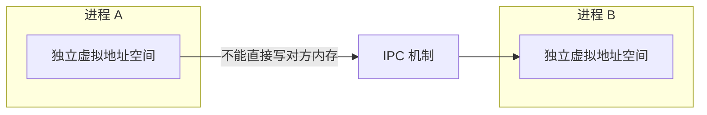
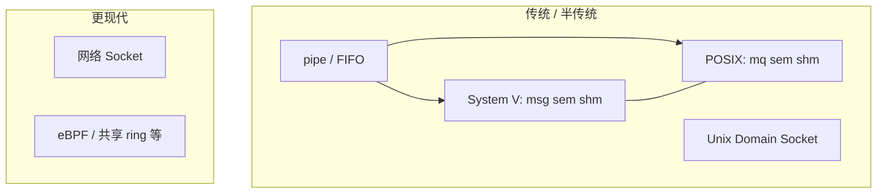

---
tags:
  - Linux
  - IPC
  - 进程
title: 传统 IPC：System V 与 POSIX
description: 管道、消息队列、信号量、共享内存；两套 API 对比与选型
date: 2026/05/21
---

# 传统 IPC：System V 与 POSIX

**IPC（Inter-Process Communication，进程间通信）** 让 **独立地址空间** 的进程交换数据、同步。Linux 上除 **Socket** 外，「传统 IPC」主要指 **管道** 以及 **System V IPC**、**POSIX IPC** 两套内核接口。

---

## 1. 读完能带走什么

- 能画 **管道 → 消息队列 / 共享内存 + 信号量** 的分工。  
- 区分 **System V**（`ftok` + `msgget`/`semget`/`shmget`）与 **POSIX**（`mq_open`/`sem_open`/`shm_open`）。  
- 知道 **谁最快、谁最易用、谁该淘汰**。

---

## 2. 为什么需要 IPC



| 场景 | 典型 IPC |
|------|----------|
| 父子 / 兄弟进程传字节流 | **pipe**、**FIFO** |
| 结构化消息、多读者 | **消息队列** |
| 大块数据、低延迟 | **共享内存** + **信号量** |
| 跨主机 / 通用 | **Socket**（见 [[网络与DPDK/网络编程/Socket 编程基础：TCP、UDP 与字节序]]） |

线程共享地址空间，用 mutex 即可；**进程必须 IPC**，见 [[编程语言/C++/C++多线程与多进程编程]]。

---

## 3. 机制总览



| 机制 | 数据形态 | 内核拷贝 | 典型同步 |
|------|----------|----------|----------|
| **pipe / FIFO** | 字节流 | 是 | 阻塞读写 |
| **消息队列** | 离散消息 | 是 | 队列满/空阻塞 |
| **共享内存** | 任意结构 | **否**（映射同物理页） | **信号量** / mutex（`pthread` in shm） |
| **信号量** | 仅计数 | — | P/V 操作 |
| **Socket** | 字节流 / 报文 | 是 | poll/epoll |

---

## 4. 管道（pipe）与命名管道（FIFO）

### 4.1 匿名管道 `pipe`

- **单向**字节流；**亲缘进程**（fork 后）最常用。  
- `pipefd[0]` 读端，`pipefd[1]` 写端；**半双工**。

```c
#include <unistd.h>

int pipefd[2];
pipe(pipefd);
if (fork() == 0) {
    close(pipefd[1]);
    read(pipefd[0], buf, sizeof(buf));
    close(pipefd[0]);
} else {
    close(pipefd[0]);
    write(pipefd[1], "hello", 5);
    close(pipefd[1]);
}
```

### 4.2 命名管道 FIFO

- 路径在文件系统（如 `/tmp/myfifo`），**无亲缘关系** 的进程可通信。  
- `mkfifo(path, mode)` → 一端 `open(O_RDONLY)`，一端 `open(O_WRONLY)`。

| 对比 | pipe | FIFO |
|------|------|------|
| 标识 | fd | 路径名 |
| 范围 | 通常父子 | 任意本机进程 |
| 方向 | 单向 | 单向 |

---

## 5. System V IPC

System V IPC 用 **`key_t`（键）** 标识对象，常由 **`ftok(path, id)`** 从路径生成；通过 **`msgget` / `semget` / `shmget`** 创建或打开，用 **`ipcs` / `ipcrm`** 管理。


### 5.1 消息队列（Message Queue）

- 内核维护 **消息链表**；每条消息有 **类型（long mtype）** 与正文。  
- `msgsnd` / `msgrcv`；可按类型选择性接收。

```c
#include <sys/msg.h>

struct msgbuf {
    long mtype;
    char mtext[256];
};

int msqid = msgget(key, IPC_CREAT | 0666);
struct msgbuf msg = { .mtype = 1, .mtext = "hi" };
msgsnd(msqid, &msg, strlen(msg.mtext) + 1, 0);
```

**特点**：带边界的消息、可优先级（type）；**数据要拷贝进内核**。

### 5.2 信号量（Semaphore）

- **计数器**，用于 **同步** 与 **互斥**（需设计成互斥用法）。  
- **System V 信号量** 常以 **数组** 形式：`semget` 一次创建多个 sem。  
- `semop` 做 **P/V**（`sem_op` 结构）；`SEM_UNDO` 可在进程退出时回滚。

```c
#include <sys/sem.h>

union semun { int val; struct semid_ds *buf; unsigned short *array; };
int semid = semget(key, 1, IPC_CREAT | 0666);
union semun arg = { .val = 1 };
semctl(semid, 0, SETVAL, arg);

struct sembuf op = { 0, -1, 0 };  /* P */
semop(semid, &op, 1);
/* 临界区 */
op.sem_op = 1;                     /* V */
semop(semid, &op, 1);
```

常与 **共享内存** 配对：shm 负责数据，sem 负责「谁可以读/写」。

### 5.3 共享内存（Shared Memory）

- **最快**：两进程 **映射同一物理页**，读写 **不经过额外拷贝**（仍可能有 cache 一致性开销）。  
- `shmget` → `shmat` 挂接 → 使用 → `shmdt` 分离 → `shmctl(IPC_RMID)` 删除段。

```c
#include <sys/shm.h>

int shmid = shmget(key, 4096, IPC_CREAT | 0666);
void *addr = shmat(shmid, NULL, 0);
/* 读写 addr */
shmdt(addr);
```

**注意**：共享内存 **不提供内置互斥**，必须配 **信号量 / 文件锁 / 原子变量**。

---

## 6. POSIX IPC

POSIX IPC 用 **名字**（类似路径，多在 `/dev/mps/` 或 `/dev/shm/` 下）和 **文件描述符** 风格 API，接口更统一，**新项目更推荐**（在仍需传统 IPC 时）。

| System V | POSIX | 打开 | 删除 |
|----------|-------|------|------|
| `msgget` | **`mq_open`** | 名字 + `O_CREAT` | `mq_unlink` |
| `semget` + `semop` | **`sem_open`** + `sem_wait`/`sem_post` | 名字 | `sem_unlink` |
| `shmget` + `shmat` | **`shm_open`** + **`mmap`** | 名字 | `shm_unlink` |

### 6.1 POSIX 消息队列

```c
#include <mqueue.h>

mqd_t mq = mq_open("/my_mq", O_CREAT | O_RDWR, 0666, NULL);
mq_send(mq, "hi", 3, 0);
char buf[64];
mq_receive(mq, buf, sizeof(buf), NULL);
mq_close(mq);
```

- 支持 **优先级**、**异步通知**（`mq_notify`）；比 System V 消息队列现代。

### 6.2 POSIX 信号量

```c
#include <semaphore.h>

sem_t *sem = sem_open("/mysem", O_CREAT, 0666, 1);
sem_wait(sem);
/* 临界区 */
sem_post(sem);
sem_close(sem);
```

- **无名信号量** `sem_init` 还可用于 **线程** 或 **共享内存内** 的进程间同步。

### 6.3 POSIX 共享内存

```c
#include <sys/mman.h>
#include <sys/stat.h>
#include <fcntl.h>

int fd = shm_open("/myshm", O_CREAT | O_RDWR, 0666);
ftruncate(fd, 4096);
void *p = mmap(NULL, 4096, PROT_READ | PROT_WRITE, MAP_SHARED, fd, 0);
/* 使用 p */
munmap(p, 4096);
shm_unlink("/myshm");
```

- 与 **mmap** 统一，更灵活（大小、`MAP_SHARED` 语义清晰）。

---

## 7. System V vs POSIX 怎么选

| 维度 | System V | POSIX |
|------|----------|-------|
| 历史 | 更老，大量旧代码 / 教材 | 新标准，API 一致 |
| 命名 | 数字 id + `key` | 字符串名字 |
| 共享内存 | `shmat` | `shm_open` + `mmap` |
| 信号量 | 数组、`semop` 复杂 | `sem_wait/post` 直观 |
| 可移植性 | Unix 常见 | POSIX 兼容系统 |
| 建议 | **维护旧系统** | **新组件优先** |

**实践建议**：

- 简单父子通信 → **pipe**。  
- 无关进程、单向流 → **FIFO** 或 **Unix Domain Socket**。  
- 大数据低延迟 → **POSIX shm + sem**（或 mmap 文件）。  
- 跨机器 → **Socket**；高性能本机可考虑 **memfd + mmap**、**D-Bus**、**gRPC** 等。  
- 避免在新代码里继续扩散 **System V msg/sem/shm**，除非对接遗留。

---

## 8. 与内核视角的对应

| 用户 API | 内核侧（直觉） |
|----------|----------------|
| pipe | 内核缓冲区 + vfs |
| msgget | 消息链表 + 拷贝 |
| shmget / shm_open | shmem / tmpfs 文件 + 页表映射 |
| semget / sem_open | 内核计数器 + 等待队列 |

调试：

```bash
ipcs          # System V 对象
ipcs -m -s -q
ls /dev/shm   # POSIX 共享内存常见挂载
```

权限、**RLIMIT**、**`/proc/sys/kernel`** 下部分参数会影响队列长度、shm 上限。

---

## 9. 常见坑

| 坑 | 说明 |
|----|------|
| shm 无锁 | 必须自备同步，否则数据竞争 |
| 忘记 `close` / `IPC_RMID` | 泄漏内核对象；`ipcrm` 清理 |
| pipe 写端未关导致 **EOF 不来** | 读端一直阻塞 |
| `ftok` 碰撞 | 不同项目同 path+id 可能冲突 |
| System V sem **不是** pthread mutex | API 与语义不同，勿混用 |
| 大小 / 消息长度限制 | `msgsnd`、`mq_send` 可能 `EAGAIN` |

---

## 10. 面试口述（30 秒）

> Linux 传统 IPC 有管道、System V 和 POSIX 三套。管道适合字节流；消息队列传带类型消息；共享内存最快但要配信号量。System V 用 key 和 msgget/shmget/semget；POSIX 用名字和 mq_open/shm_open/sem_open，接口更现代。新代码优先 POSIX 或 Socket，System V 多用于兼容旧系统。

---

## 11. 检查清单

- [ ] 能说出 pipe vs FIFO vs socket 的适用边界  
- [ ] 能解释共享内存为什么必须额外同步  
- [ ] 能列举 System V 与 POSIX 各三个 API  
- [ ] 知道用 `ipcs` 排查遗留 IPC 对象  

---

## 延伸阅读

- [[linux/内核机制/进程调度与绑核]]
- [[linux/内核机制/内核同步机制总览]]
- [[linux/内核机制/深入了解上下文切换]]
- [[编程语言/C++/C++多线程与多进程编程#1.3.2 进程间通信（IPC）]]
- [[网络与DPDK/网络编程/Socket 编程基础：TCP、UDP 与字节序]]
