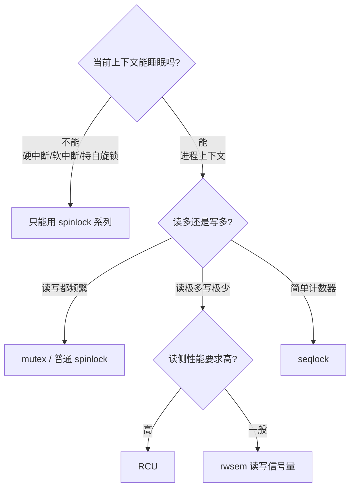
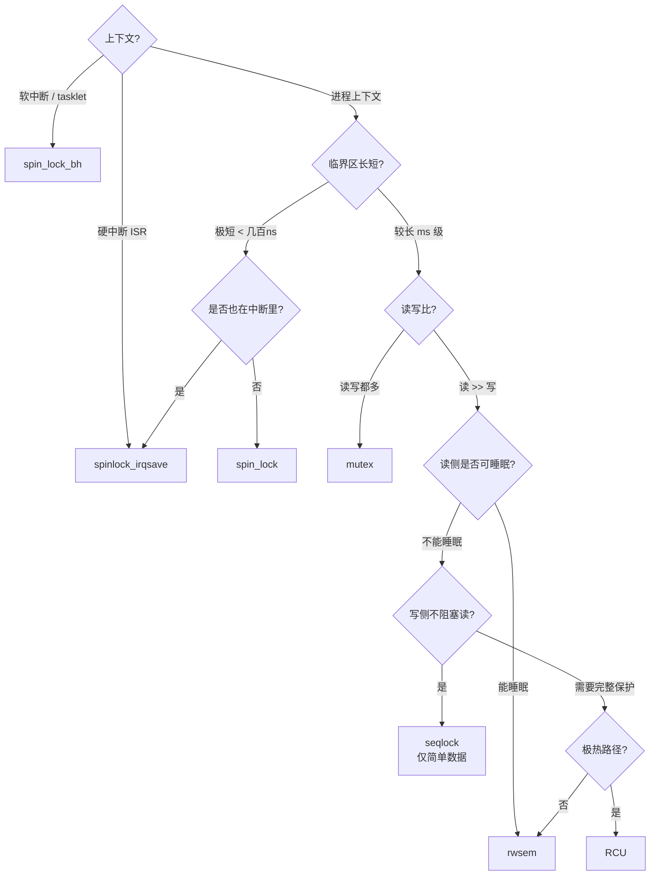

---
tags:
  - Linux
  - 内核
  - 同步
title: 内核同步机制总览
description: spinlock、mutex、rwlock、seqlock、RCU 选用原则、lockdep 典型报告解读
date: 2026/05/16
---

# 内核同步机制总览

内核同步机制的选用是驱动和内核模块开发中的高频错误来源。核心原则只有一条：**根据上下文（是否能睡眠）和读写比例，选择合适的锁类型**。

本文把所有常用机制放在一张心智模型里，并重点讲 lockdep 的使用。

---

## 1. 两条基本线

在选锁之前，先确认两件事：



---

## 2. 按上下文选用总表

| 机制 | 可睡眠 | 可用于硬中断 | 可用于软中断 | 典型用途 |
|------|--------|------------|------------|----------|
| **spinlock** | ❌ | ✅（`_irqsave`）| ✅（`_bh`）| 极短临界区，驱动 ISR 与进程共享数据 |
| **mutex** | ✅ | ❌ | ❌ | 进程上下文，较长临界区 |
| **rwsem**（读写信号量）| ✅ | ❌ | ❌ | 读多写少，可睡眠路径 |
| **rwlock**（读写自旋锁）| ❌ | ✅ | ✅ | 读多写少，不可睡眠路径（旧代码较多）|
| **seqlock** | 写：❌ | 部分 | 部分 | 简单的读多写少，写不阻塞读 |
| **RCU** | 读：无锁 | 特殊 | ✅ | 读极多写极少，遍历 |
| **atomic_t** | ❌ | ✅ | ✅ | 单个计数器/标志 |

---

## 3. spinlock：最基础的锁

### 3.1 变体选择（最重要）

spinlock 有多个变体，根据**竞争对手是谁**来选：

| 变体 | 使用场景 | 示例 |
|------|----------|------|
| `spin_lock` | 进程上下文之间 | 两个内核线程共享数据 |
| `spin_lock_bh` | 进程上下文 + 软中断 | 进程和 softirq 共享数据 |
| `spin_lock_irq` | 进程上下文 + 硬中断（已知中断开启）| |
| `spin_lock_irqsave` | 进程上下文 + 硬中断（保存中断状态）| **驱动里最常用** |

**黄金规则**：如果数据在**硬中断（ISR）**里被访问，进程侧必须用 `spin_lock_irqsave`；否则可能死锁：进程持锁时被中断打断，中断里再申请同一把锁 → 永久等待。

```c
/* ✅ 正确：进程与 ISR 共享数据 */
spinlock_t my_lock;
unsigned long flags;

/* 进程上下文 */
spin_lock_irqsave(&my_lock, flags);
/* 临界区 */
spin_unlock_irqrestore(&my_lock, flags);

/* 硬中断 ISR */
spin_lock(&my_lock);  /* ISR 里不需要 irqsave，中断本身已被 CPU 禁用 */
/* 临界区 */
spin_unlock(&my_lock);
```

### 3.2 spinlock 三条铁律

1. **不能在持锁时睡眠**（包括 `kmalloc(GFP_KERNEL)`、`copy_from_user`、`mutex_lock`）
2. **临界区尽量短**：spinlock 期间其他 CPU 在原地自旋，拖垮系统
3. **不能递归加锁**：同一 CPU 重复申请同一 spinlock → 死锁

---

## 4. mutex：进程上下文的首选

```c
struct mutex my_mutex;
mutex_init(&my_mutex);

mutex_lock(&my_mutex);     /* 睡眠等待，直到获得锁 */
/* 临界区（可以睡眠、可以访问用户内存）*/
mutex_unlock(&my_mutex);
```

**mutex 与 spinlock 的核心区别**：
- mutex 等待时**放弃 CPU**，切换到其他任务（休眠）
- spinlock 等待时**持续检查**，不切换（忙等/自旋）

**适用**：字符设备 `file_operations`（`read`/`write`/`ioctl`）、总线驱动等**进程上下文路径**，临界区相对较长。

---

## 5. rwsem：读写分离的睡眠锁

当**读操作远多于写操作**，用 `rwsem`（读写信号量）让多个读者并发：

```c
struct rw_semaphore my_rwsem;
init_rwsem(&my_rwsem);

/* 读者路径（多个读者可以并发）*/
down_read(&my_rwsem);
/* 只读访问共享数据 */
up_read(&my_rwsem);

/* 写者路径（独占）*/
down_write(&my_rwsem);
/* 修改共享数据 */
up_write(&my_rwsem);
```

---

## 6. seqlock：写不阻塞读的计数器

**seqlock 适合**：小的、简单的数据结构，读非常频繁，写很少，且写不能被读阻塞。

经典例子：`jiffies`（系统时钟计数）。

**原理**：维护一个顺序号（seqcount），写者每次写前后各加一次，读者读前后各记录顺序号，若不一致说明被写者打断，重试。

```c
seqlock_t my_seqlock;
seqlock_init(&my_seqlock);

/* 写者（不阻塞读者，但读者可能需要重试）*/
write_seqlock(&my_seqlock);  /* 顺序号 +1（变为奇数）*/
/* 修改数据 */
write_sequnlock(&my_seqlock); /* 顺序号 +1（变为偶数）*/

/* 读者（乐观读，可能重试）*/
unsigned int seq;
do {
    seq = read_seqbegin(&my_seqlock);  /* 记录当前顺序号 */
    /* 读取数据（快照）*/
    /* ... */
} while (read_seqretry(&my_seqlock, seq)); /* 若被写者打断则重试 */
```

**注意**：
- 读取的数据中**不能有指针解引用**（可能读到中间状态的指针导致崩溃）
- 适合 **POD 类型**（整数、结构体值拷贝）

---

## 7. RCU：读极多场景的终极武器

RCU 详见 [[linux/内核机制/RCU 读拷贝更新机制详解]]，这里只给选型要点：

```c
/* 读侧：极轻（通常只是禁止抢占）*/
rcu_read_lock();
p = rcu_dereference(global_ptr);  /* 安全读取指针 */
/* 使用 p */
rcu_read_unlock();

/* 写侧：分配新对象，原子替换，等宽限期后释放 */
new = kmalloc(...);
/* 填充 new */
old = rcu_dereference_protected(global_ptr, lockdep_is_held(&update_lock));
rcu_assign_pointer(global_ptr, new);
synchronize_rcu();   /* 等所有"看到旧指针"的读者退出临界区 */
kfree(old);
```

**RCU 选型要点**：
- 读路径极热（路由表查找、进程列表遍历）
- 写路径较冷
- 读侧临界区短，**不能睡眠**（否则宽限期卡住 → RCU stall）

---

## 8. 对比一览：何时用哪个



---

## 9. lockdep：死锁检测神器

**lockdep** 是内核内置的死锁/违规检测工具，开发阶段必须开启。

### 9.1 开启方法

内核配置：
```
CONFIG_LOCKDEP=y
CONFIG_PROVE_LOCKING=y
CONFIG_DEBUG_ATOMIC_SLEEP=y   # 检测在原子上下文里睡眠
CONFIG_DEBUG_MUTEXES=y
```

> 开启 lockdep 对性能有影响（约 10~30%），只在**开发/调试内核**中使用。

### 9.2 死锁检测：AB-BA 环

最常见的死锁模式——两个任务以不同顺序申请两把锁：

```text
Task A:  lock(L1) → ... → lock(L2)
Task B:  lock(L2) → ... → lock(L1)
→ A 持 L1 等 L2，B 持 L2 等 L1 → 死锁！
```

lockdep 检测到此模式时的输出：

```text
============================================
WARNING: possible circular locking dependency detected
5.15.0 #1 SMP
--------------------------------------------
task_a/1234 is trying to acquire lock:
ffff8880xxxxx (L2){+.+.}-{3:3}, at: function_b+0x40/0x100

but task task_b/5678 is holding lock:
ffff8880yyyyy (L2){+.+.}-{3:3}

and is waiting for lock:
ffff8880zzzzz (L1){+.+.}-{3:3}, at: function_a+0x20/0x100

which is held by:
task_a/1234

other info that might help us debug this:
 Possible unsafe locking scenario:
       CPU0                    CPU1
       ----                    ----
  lock(L1);
                               lock(L2);
                               lock(L1);  ← 会死锁！
  lock(L2);
```

**解读顺序**：
1. 看**锁链**：谁持着 L1 在等 L2，谁持着 L2 在等 L1
2. 看**上下文**：hardirq/softirq/process 各在哪层
3. **修复**：统一所有代码中 L1 → L2 的加锁顺序（不能有 L2 → L1 的路径）

### 9.3 IRQ 上下文违规检测

常见错误：在硬中断里申请 mutex（或在持 spinlock 时调用可睡眠函数）：

```text
BUG: sleeping function called from invalid context at kernel/mutex.c:142
in_atomic(): 1, irqs_disabled(): 1, non_block: 0, pid: 0, name: swapper/0
...
Call trace:
 mutex_lock+0x40/0x80
 my_driver_isr+0x60/0x100  ← ISR 里调用了 mutex_lock！
 ...
```

这就是 `CONFIG_DEBUG_ATOMIC_SLEEP` 的检测结果——它检查在 `in_atomic()`（持自旋锁或在中断上下文）时调用会睡眠的函数。

### 9.4 常见 lockdep 标注含义

```text
lock_name{+.+.}-{3:3}
         ^ ^ ^   ^ ^
         | | |   | 硬件层级
         | | |   内核层级
         | | read
         | write
         hardirq-safe
```

| 符号 | 含义 |
|------|------|
| `+` | 在硬中断上下文里被加锁过 |
| `.` | 没有在硬中断里加锁过 |
| `W` | 在写锁状态下 |
| `R` | 在读锁状态下 |

---

## 10. 实践建议

### 加锁顺序规则

在模块里如果有多把锁，**固定加锁顺序**，文档化在代码注释中：

```c
/*
 * 锁获取顺序（防止死锁）：
 *   dev->lock → port->lock → queue->lock
 * 永远不要逆序！
 */
```

### per-CPU 变量替代锁

高频计数器（如收包统计）用 per-CPU 变量完全避免锁：

```c
DEFINE_PER_CPU(u64, rx_packets);
this_cpu_inc(rx_packets);   /* 无锁，只在本 CPU 上操作 */
```

详见 [[linux/内核机制/per-CPU 与 per-core 数据结构]]。

---

## 11. 与 DPDK 无锁的边界

| 环境 | 建议 |
|------|------|
| 内核驱动 | 用上述锁 + RCU；避免套用用户态无锁套路 |
| DPDK 数据面 | `rte_ring`（MPMC ring）、per-lcore 变量，见 [[编程语言/C++/无锁编程]] |
| 跨核共享计数 | 内核用 `atomic_t`；DPDK 用 `rte_atomic64_t` 或 per-lcore 累加 |

---

## 延伸阅读

- [[linux/内核机制/RCU 读拷贝更新机制详解]]
- [[linux/内核机制/Linux 中断机制详解]]（spinlock 变体与中断关系）
- [[linux/内核机制/per-CPU 与 per-core 数据结构]]
- [[linux/内核机制/进程调度与绑核]]（优先级反转与 PI mutex）
- [[linux/驱动与模块/Linux 内核模块开发实战]]
