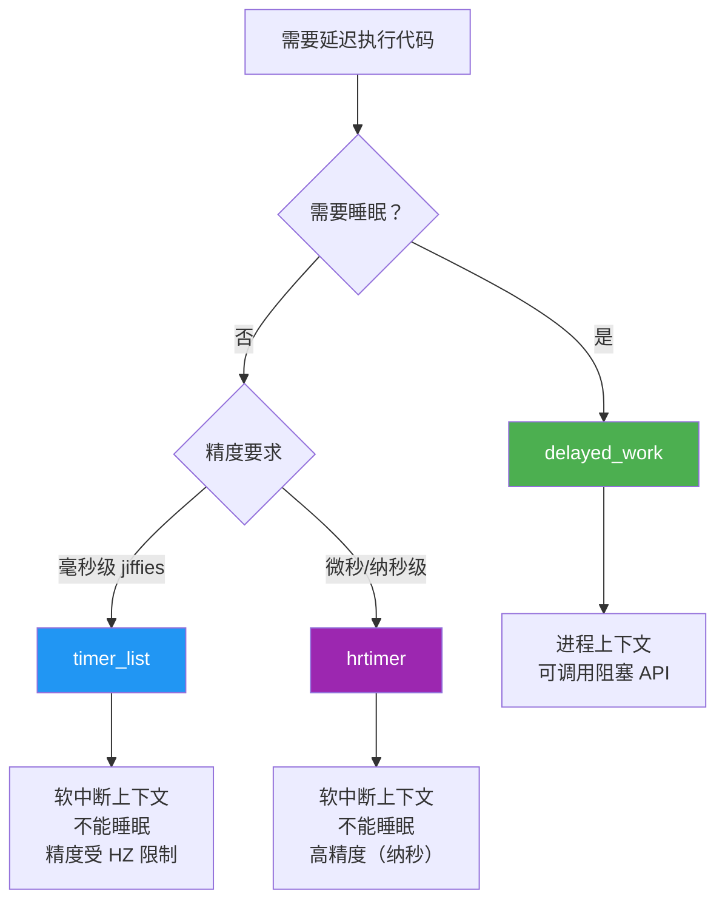

---
tags:
  - Linux
  - 内核
  - 定时器
title: 内核定时器与时间管理
description: jiffies/HZ、timer_list、hrtimer、ktime_t、delayed_work 与时间管理 API
date: 2026/06/06
---

# 内核定时器与时间管理

Linux 内核有多套时间管理机制，适用于不同精度和上下文的需求。理解它们的差异能避免在驱动里用错。

---

## 1. 时间基础：jiffies 与 HZ

### 1.1 HZ 与 jiffies

```c
/* HZ：系统定时器每秒中断次数（CONFIG_HZ，典型值 100/250/1000）*/
/* 嵌入式设备常用 CONFIG_HZ=100（10ms 精度）*/
/* 桌面常用 CONFIG_HZ=250 或 1000 */

extern unsigned long volatile jiffies;  /* 系统启动以来的 tick 数 */

/* jiffies 与时间的转换 */
jiffies + HZ        /* 1 秒后 */
jiffies + HZ/10     /* 100ms 后 */
jiffies + HZ*2      /* 2 秒后 */

/* 安全的 jiffies 比较（处理回绕问题）*/
time_after(a, b)    /* a > b（在 jiffies 回绕安全的情况下）*/
time_before(a, b)   /* a < b */
time_after_eq(a, b) /* a >= b */

/* 示例：等待超时 */
unsigned long deadline = jiffies + HZ;   /* 1 秒超时 */
while (!condition_met()) {
    if (time_after(jiffies, deadline)) {
        pr_err("timeout!\n");
        return -ETIMEDOUT;
    }
    schedule();  /* 让出 CPU */
}
```

### 1.2 jiffies 与 ms/us 的换算

```c
#include <linux/jiffies.h>

/* jiffies → ms */
unsigned long ms = jiffies_to_msecs(jiffies);

/* ms → jiffies */
unsigned long j = msecs_to_jiffies(100);  /* 100ms → jiffies 数 */

/* 延迟（进程上下文，可睡眠）*/
msleep(100);      /* 100ms，允许调度 */
msleep_interruptible(100);  /* 可被信号中断 */
usleep_range(1000, 2000);   /* 1-2ms，省电首选 */

/* 延迟（中断/原子上下文，忙等，不可睡眠，只用于极短时间）*/
udelay(10);   /* 10µs，忙等 */
mdelay(1);    /* 1ms，忙等，慎用 */
```

---

## 2. 低分辨率定时器：`timer_list`

适用于**粗精度**（jiffies 级别，10ms~几十ms）、**单次或周期触发**的场景，如超时检测、轮询保护。

### 2.1 使用方式

```c
#include <linux/timer.h>

struct my_dev {
    struct timer_list poll_timer;
    /* ... */
};

/* 定时器回调（在软中断上下文执行，不能睡眠）*/
static void my_timer_fn(struct timer_list *t)
{
    struct my_dev *dev = from_timer(dev, t, poll_timer);

    /* 处理超时或轮询逻辑 */
    handle_poll(dev);

    /* 周期触发：重新 mod_timer */
    mod_timer(&dev->poll_timer, jiffies + HZ/10);  /* 100ms 后再触发 */
}

static int my_probe(struct platform_device *pdev)
{
    struct my_dev *dev = /* ... */;

    /* 初始化定时器，绑定回调 */
    timer_setup(&dev->poll_timer, my_timer_fn, 0);

    /* 启动定时器，1 秒后触发 */
    mod_timer(&dev->poll_timer, jiffies + HZ);

    return 0;
}

static int my_remove(struct platform_device *pdev)
{
    struct my_dev *dev = /* ... */;

    /* 必须在 remove 里删除定时器！否则回调可能在设备释放后执行 */
    del_timer_sync(&dev->poll_timer);
    /* del_timer_sync：等待正在执行的回调完成后再返回 */

    return 0;
}
```

### 2.2 timer_list API 速查

| 函数 | 作用 |
|------|------|
| `timer_setup(t, fn, flags)` | 初始化，绑定回调，`flags` 通常为 0 |
| `mod_timer(t, expires)` | 启动或修改超时时间（常规方法）|
| `add_timer(t)` | 首次启动（只能在未激活状态调用）|
| `del_timer(t)` | 删除，不等待回调（可能回调正在运行）|
| `del_timer_sync(t)` | 删除，等待回调结束（驱动 remove 时用）|
| `timer_pending(t)` | 检查定时器是否已排队 |
| `from_timer(var, t, field)` | 从 `timer_list*` 反向得到外层结构体指针 |

---

## 3. 高分辨率定时器：`hrtimer`

适用于**高精度**（纳秒级）、**实时要求**的场景，如 PWM 模拟、精确采样间隔。

### 3.1 ktime_t — 内核高精度时间

```c
#include <linux/ktime.h>

ktime_t t;

/* 获取当前时间 */
t = ktime_get();           /* CLOCK_MONOTONIC，单调递增 */
t = ktime_get_real();      /* CLOCK_REALTIME，墙上时钟 */
t = ktime_get_boottime();  /* 包含 suspend 时间 */

/* 构造 ktime_t */
ktime_t interval = ktime_set(0, 500000);   /* 500µs（秒, 纳秒）*/
ktime_t interval = ms_to_ktime(10);        /* 10ms */

/* 时间运算 */
ktime_t later = ktime_add(t, interval);
ktime_t diff  = ktime_sub(t2, t1);
s64 ns = ktime_to_ns(diff);
s64 us = ktime_to_us(diff);
```

### 3.2 hrtimer 使用方式

```c
#include <linux/hrtimer.h>

struct my_dev {
    struct hrtimer sample_timer;
    ktime_t        interval;
    /* ... */
};

/* 回调（高分辨率软中断上下文，不能睡眠）*/
static enum hrtimer_restart my_hrtimer_fn(struct hrtimer *timer)
{
    struct my_dev *dev = container_of(timer, struct my_dev, sample_timer);

    /* 采集数据 */
    do_sample(dev);

    /* 周期触发：forward 比 restart 更精确（补偿执行时间）*/
    hrtimer_forward_now(timer, dev->interval);
    return HRTIMER_RESTART;

    /* 单次触发：return HRTIMER_NORESTART; */
}

static int my_probe(struct platform_device *pdev)
{
    struct my_dev *dev = /* ... */;

    dev->interval = ms_to_ktime(1);  /* 1ms 采样间隔 */

    hrtimer_init(&dev->sample_timer, CLOCK_MONOTONIC, HRTIMER_MODE_REL);
    dev->sample_timer.function = my_hrtimer_fn;

    /* 启动（相对时间触发）*/
    hrtimer_start(&dev->sample_timer, dev->interval, HRTIMER_MODE_REL);

    return 0;
}

static int my_remove(struct platform_device *pdev)
{
    struct my_dev *dev = /* ... */;
    hrtimer_cancel(&dev->sample_timer);  /* 取消并等待回调完成 */
    return 0;
}
```

### 3.3 hrtimer 精度档位

```c
HRTIMER_MODE_ABS          /* 绝对时间触发 */
HRTIMER_MODE_REL          /* 相对时间（从现在起）*/
HRTIMER_MODE_PINNED       /* 绑定到当前 CPU */
HRTIMER_MODE_ABS_PINNED   /* 绑定 + 绝对 */
```

---

## 4. 工作队列延迟：`delayed_work`

**timer_list / hrtimer 的回调在软中断上下文执行，不能睡眠，不能调用阻塞 API。**
如果延迟执行的工作需要睡眠（如 I2C 操作、mutex 锁），使用 `delayed_work`。

### 4.1 使用方式

```c
#include <linux/workqueue.h>

struct my_dev {
    struct delayed_work init_work;
    /* ... */
};

/* 工作函数：在内核线程（进程上下文）里执行，可以睡眠 */
static void my_delayed_fn(struct work_struct *work)
{
    struct my_dev *dev = container_of(work, struct my_dev,
                                      init_work.work);

    /* 可以睡眠，可以调用 I2C/SPI 等阻塞操作 */
    i2c_configure_chip(dev);
    msleep(50);
}

static int my_probe(struct platform_device *pdev)
{
    struct my_dev *dev = /* ... */;

    INIT_DELAYED_WORK(&dev->init_work, my_delayed_fn);

    /* 100ms 后执行（在系统工作队列，system_wq）*/
    schedule_delayed_work(&dev->init_work, msecs_to_jiffies(100));

    return 0;
}

static int my_remove(struct platform_device *pdev)
{
    struct my_dev *dev = /* ... */;

    /* 取消并等待工作函数完成 */
    cancel_delayed_work_sync(&dev->init_work);
    return 0;
}
```

### 4.2 简单工作队列（无延迟）

```c
struct work_struct my_work;

INIT_WORK(&my_work, my_work_fn);
schedule_work(&my_work);         /* 立即提交到工作队列 */
flush_work(&my_work);            /* 等待完成 */
cancel_work_sync(&my_work);      /* 取消并等待 */
```

---

## 5. 选哪个？决策树



---

## 6. 常见陷阱

### 6.1 忘记取消定时器（use-after-free）

```c
/* ❌ remove 时没有 del_timer_sync */
static int my_remove(struct platform_device *pdev)
{
    kfree(priv);
    return 0;   /* 定时器回调仍可能在另一个 CPU 上触发！*/
}

/* ✅ 必须先取消定时器，再释放内存 */
static int my_remove(struct platform_device *pdev)
{
    del_timer_sync(&priv->timer);   /* 等待回调完成 */
    kfree(priv);
    return 0;
}
```

### 6.2 在原子上下文睡眠

```c
/* ❌ timer 回调里调用 msleep */
static void my_timer_fn(struct timer_list *t)
{
    msleep(10);   /* BUG: sleeping in atomic context! */
}

/* ✅ 改用 delayed_work 或在回调里触发 work */
static void my_timer_fn(struct timer_list *t)
{
    struct my_dev *dev = from_timer(dev, t, timer);
    schedule_work(&dev->work);   /* 把需要睡眠的部分丢给工作队列 */
}
```

### 6.3 jiffies 精度不满足需求

```c
/* ❌ HZ=100 时，jiffies 精度 10ms，无法满足 1ms 定时需求 */
mod_timer(&t, jiffies + 1);  /* 实际误差 0~10ms */

/* ✅ 改用 hrtimer */
hrtimer_start(&t, ms_to_ktime(1), HRTIMER_MODE_REL);
```

---

## 7. 内核时间相关调试

```bash
# 查看当前 HZ
grep CONFIG_HZ /boot/config-$(uname -r)

# 查看 hrtimer 分辨率
cat /proc/timer_list | grep resolution

# 查看定时器统计（需要 CONFIG_TIMER_STATS，4.x 后已移除）
cat /proc/timer_stats

# 用 ftrace 追踪定时器
echo 1 > /sys/kernel/debug/tracing/events/timer/timer_start/enable
echo 1 > /sys/kernel/debug/tracing/events/timer/timer_expire_entry/enable
cat /sys/kernel/debug/tracing/trace
```

---

## 延伸阅读

- [[linux/内核机制/设备树内核 API（OF API）]]
- [[linux/内核机制/GPIO 与 gpiod 子系统]]（gpiod_to_irq + delayed_work 组合）
- [[linux/内核机制/内核链表与常用数据结构]]
- `Documentation/timers/timers-howto.rst`（内核官方文档）
