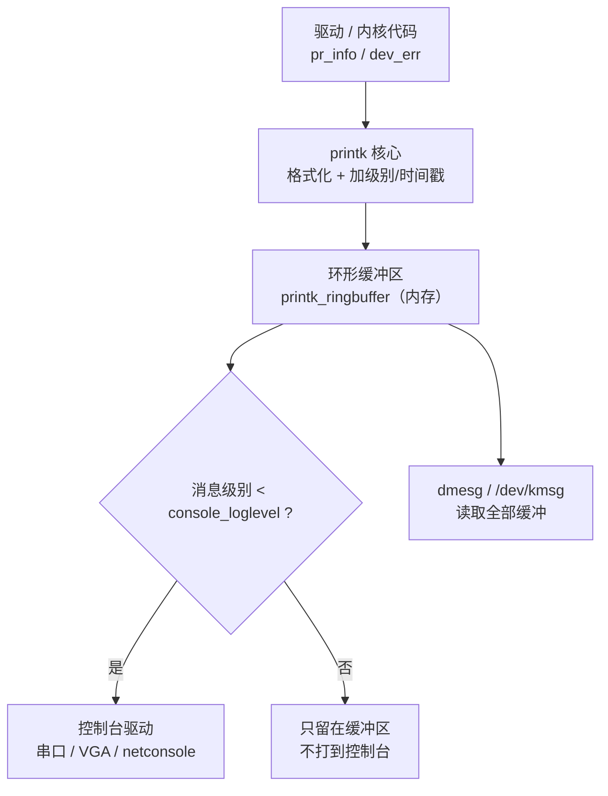
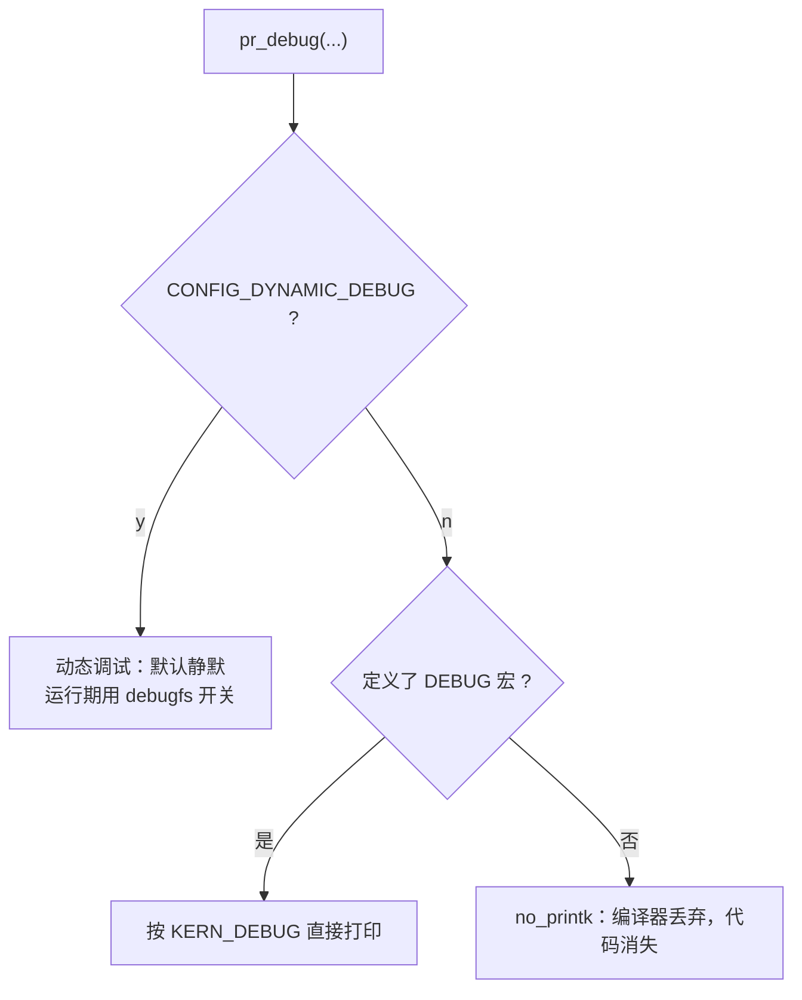
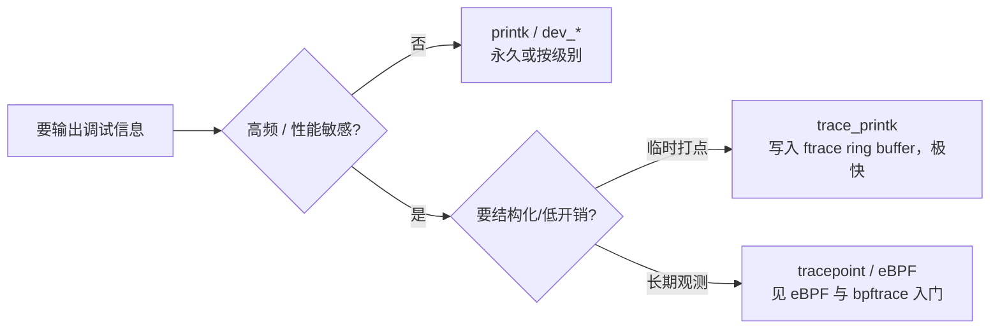

---
tags:
  - Linux
  - 内核
  - printk
  - 调试
title: 内核日志与 printk 机制
description: printk 日志级别、环形缓冲区、console_loglevel、限速、dev_dbg 与 dmesg 排障全解
date: 2026/07/01
---

# 内核日志与 printk 机制

驱动里一句 `pr_info("hello\n")`，到底经过了什么才出现在 `dmesg` 里？为什么有时候串口刷屏、有时候 `pr_debug` 又一声不吭？本篇把 **printk 日志级别、环形缓冲区（ring buffer）、控制台输出门限、限速与动态调试** 串成一条完整链路，配合排障命令，让你在板子上「看得懂、控得住」内核日志。

与 [[sysfs 与 proc 调试接口#1.5 Dynamic Debug（dynamic_debug）]]（动态开关 `pr_debug`）、[[系统调试/排障 SOP：日志、perf 与反汇编]]（排障流程）配合阅读。

---

## 1. 读完能带走什么

- 记得 **8 个日志级别** 与 `pr_*` / `dev_*` 宏族怎么选。  
- 能画出 `printk` → **环形缓冲区** → 控制台/`dmesg` 的数据流。  
- 会用 `console_loglevel` 与 `/proc/sys/kernel/printk` 控制「什么级别打到串口」。  
- 会用 **限速** 防日志刷屏，知道 `dev_dbg` 与 `trace_printk` 的分工。  
- 有一套 `dmesg` 排障命令与面试速答。

---

## 2. 为什么内核不能直接用 printf

用户态 `printf` 依赖 **glibc + stdio 缓冲 + `write` 系统调用**；内核在 **任意上下文**（含硬中断、持锁、调度器内部）都可能要打日志，不能依赖这些：

| 约束 | printk 的应对 |
|------|----------------|
| 可能在 **中断上下文** 调用 | 不能睡眠、不能触发缺页 |
| 多 CPU 并发打印 | 需要可并发写入的缓冲区 |
| 控制台（串口）**很慢** | 先写内存缓冲，再异步刷到控制台 |
| 崩溃后要能看日志 | 日志存在固定内存区，`dmesg` / crash 工具可读 |

所以 printk 的核心是：**先把消息写进一块内核内存里的环形缓冲区，再由控制台按门限异步输出**。

---

## 3. 日志级别（loglevel）

printk 消息带一个 **级别（level）**，共 8 档，数字越小越紧急：

| 宏 | 值 | 含义 |
|----|----|------|
| `KERN_EMERG` | 0 | 系统不可用（panic 前） |
| `KERN_ALERT` | 1 | 必须立即处理 |
| `KERN_CRIT` | 2 | 严重错误（硬件/驱动崩） |
| `KERN_ERR` | 3 | 一般错误 |
| `KERN_WARNING` | 4 | 警告 |
| `KERN_NOTICE` | 5 | 正常但重要 |
| `KERN_INFO` | 6 | 一般信息 |
| `KERN_DEBUG` | 7 | 调试信息 |

裸 `printk` 写法（旧）与推荐的 `pr_*` 宏（新）对应：

```c
printk(KERN_ERR "mydrv: probe failed %d\n", ret);   /* 旧写法 */
pr_err("mydrv: probe failed %d\n", ret);            /* 推荐：等价且简洁 */
```

| `pr_*` 宏 | 级别 | `dev_*` 宏（有 struct device 时优先） |
|-----------|------|----------------------------------------|
| `pr_emerg` | 0 | `dev_emerg` |
| `pr_alert` | 1 | `dev_alert` |
| `pr_crit` | 2 | `dev_crit` |
| `pr_err` | 3 | `dev_err` |
| `pr_warn` | 4 | `dev_warn` |
| `pr_notice` | 5 | `dev_notice` |
| `pr_info` | 6 | `dev_info` |
| `pr_debug` | 7 | `dev_dbg` |

**写驱动的经验**：有 `struct device *dev` 就优先用 `dev_err(dev, ...)` —— 输出会自动带上 **设备名前缀**（如 `mmc0: ...`），排障时一眼看出是哪个设备。用 `pr_fmt` 宏可给整模块日志统一加前缀：

```c
#define pr_fmt(fmt) "debris: " fmt   /* 放在所有 #include 之前 */
#include <linux/kernel.h>
...
pr_info("loaded\n");   /* 实际输出 "debris: loaded" */
```

---

## 4. 核心机制：环形缓冲区与数据流

`printk` 把格式化后的消息写入一块 **内核内存的环形缓冲区**（历史名 `__log_buf`，5.10+ 改为无锁 ringbuffer `printk_ringbuffer`）。控制台输出是 **另一条路径**，按门限异步进行：



两个关键点：

1. **写入缓冲区** 和 **打到控制台** 是分开的。所有消息（无论级别）都进缓冲区，`dmesg` 都能读到；但**只有级别高于门限的才输出到控制台**（串口）。
2. 缓冲区是 **环形** 的：满了会覆盖最老的消息。缓冲区大小由 `CONFIG_LOG_BUF_SHIFT` 决定（如 $2^{17}=128\text{KB}$），启动参数 `log_buf_len=1M` 可调大。

### 4.1 dmesg 读的是缓冲区

```bash
dmesg                 # 打印整个环形缓冲区
dmesg -w              # 跟随（follow），像 tail -f
dmesg -T              # 人类可读时间戳
dmesg -l err,warn     # 只看 err 和 warn 级别
dmesg -H              # 分页 + 颜色 + 相对时间
dmesg --clear         # 清空缓冲区（root）
```

底层是 `/dev/kmsg`（写入可注入日志）和 `/proc/kmsg`（读取），`dmesg` 是它们的封装。

---

## 5. 控制台门限：console_loglevel

「哪些级别会打到串口/控制台」由 **`console_loglevel`** 控制。规则：**消息级别数值 < `console_loglevel` 才输出到控制台**。

查看与设置（`/proc/sys/kernel/printk` 是四元组）：

```bash
cat /proc/sys/kernel/printk
# 输出示例：  7    4    1    7
#          当前  默认  最小  启动默认
#         current default minimum boot-default
```

| 字段 | 含义 |
|------|------|
| **current** | 当前 `console_loglevel`：级别 < 它 → 打到控制台 |
| **default** | 未指定级别的消息用的默认级别 |
| **minimum** | 允许设置的最小值 |
| **boot** | 启动时的默认值 |

```bash
# 让所有级别（含 KERN_DEBUG=7）都打到控制台：设为 8
echo 8 > /proc/sys/kernel/printk

# 只看警告及以上（安静模式，减少串口刷屏）：设为 4
echo 4 > /proc/sys/kernel/printk
```

启动参数也能控制：

| 启动参数 | 作用 |
|----------|------|
| `loglevel=7` | 设置初始 `console_loglevel` |
| `quiet` | 等价于把 loglevel 压到很低（安静启动） |
| `ignore_loglevel` | **忽略门限，全部打到控制台**（调 bring-up 神器） |
| `earlycon` / `earlyprintk` | 在正式控制台就绪前就能看串口日志 |

> **bring-up 场景**：新板串口啥也不输出时，先在 bootargs 加 `ignore_loglevel earlycon`，把所有日志逼到串口，见 [[linux/学习路径/启动排障手册]]、[[linux/学习路径/新板 Bring-up 检查清单]]。

---

## 6. pr_debug 为什么默认不输出

`pr_debug` / `dev_dbg` 级别是 7，但它**特殊**：是否编译进、是否输出，取决于两个编译配置：



这正是 [[sysfs 与 proc 调试接口#1.5 Dynamic Debug（dynamic_debug）]] 讲的动态调试：

```bash
# 运行期打开某文件的 pr_debug（无需重编）
echo 'file mydriver.c +p' > /sys/kernel/debug/dynamic_debug/control
```

所以 `pr_debug` 沉默不代表代码没执行——它可能被编成 `no_printk` 或等你去 debugfs 里 `+p`。

---

## 7. 限速：防止日志刷屏

高频路径（中断、收包、轮询）里裸打日志会**淹没缓冲区**、拖慢系统，甚至掩盖真正重要的日志。用 **限速（rate limit）** 版本：

```c
/* 默认 5 秒内最多 10 条，超出的丢弃并计数 */
pr_err_ratelimited("myrq: overflow on cpu %d\n", cpu);
dev_warn_ratelimited(dev, "fifo full\n");

/* 只打一次（例如某告警只需提示一次） */
pr_warn_once("legacy path hit, please upgrade\n");

/* 自定义限速窗口 */
static DEFINE_RATELIMIT_STATE(rs, 5 * HZ, 3);   /* 5s 内 3 条 */
if (__ratelimit(&rs))
    pr_info("...\n");
```

| 后缀 | 行为 |
|------|------|
| `_ratelimited` | 按默认窗口限速，超出丢弃 |
| `_once` | 整个内核生命周期只打一次 |
| `_ratelimited` + 自定义 `ratelimit_state` | 精确控制窗口与条数 |

**中断上下文尤其要注意**：ISR 里刷日志会显著拉长关中断时间，见 [[为什么 ISR 不能睡眠]]、[[Linux 中断机制详解]]。

---

## 8. printk 家族与 tracing 的分工

调试信息不是只有 printk 一条路。按「是否要长期留、是否高频」选：



| 手段 | 适用 | 开销 |
|------|------|------|
| `pr_info` / `dev_err` | 常规日志、错误、状态 | 中（走控制台时慢） |
| `pr_debug` / `dev_dbg` | 可开关的调试 | 极小（关时） |
| `*_ratelimited` | 高频但仍想看 | 小 |
| `trace_printk` | **临时** 高频打点（调完删） | 很小（不走控制台） |
| **tracepoint / eBPF** | 生产可观测、长期 | 小 | 

`trace_printk` 的输出在 `/sys/kernel/debug/tracing/trace`，不是 `dmesg`；它专为「热路径临时调试」设计，**不应留在正式代码**。长期观测用 tracepoint 或 [[eBPF 与 bpftrace 入门]]。

---

## 9. 常见误区

| 误区 | 正解 |
|------|------|
| 「`dmesg` 没有 = 没打日志」 | 可能级别低于 `console_loglevel` 只是没上串口；`dmesg` 其实有 |
| 「`pr_debug` 不输出 = 代码没跑」 | 多半是没开动态调试或被编成 `no_printk` |
| 「日志少了几条」 | 环形缓冲区被覆盖，调大 `log_buf_len` 或及时抓取 |
| 「串口太慢拖累系统」 | 降 `console_loglevel`、用限速、热路径改 `trace_printk` |
| 「忘了换行 `\n`」 | printk 无 `\n` 不会立即成行，多条会拼在一起 |
| 「在 ISR 里大量打印」 | 拉长关中断窗口，务必限速或挪到下半部 |

---

## 10. 排障命令速查

```bash
# 看门限与缓冲
cat /proc/sys/kernel/printk
dmesg -T | tail -50

# 临时全量输出到控制台（调试）
echo 8 > /proc/sys/kernel/printk

# 只看错误/警告
dmesg -l err,warn -T

# 跟随新日志
dmesg -wH

# 开某驱动的 pr_debug
echo 'module mydrv +p' > /sys/kernel/debug/dynamic_debug/control

# 缓冲区大小（启动后）
dmesg | wc -c
# 启动参数调大： log_buf_len=1M

# 用户态往内核日志注入（测试）
echo "hello from userspace" > /dev/kmsg
```

---

## 11. 面试速答

| 问题 | 要点 |
|------|------|
| printk 和 printf 区别？ | printk 可在任意上下文、带级别、先写环形缓冲再异步输出到控制台 |
| 日志级别有几个？ | 8 个，`KERN_EMERG`(0) ~ `KERN_DEBUG`(7) |
| 消息为什么没打到串口？ | 级别 ≥ `console_loglevel`；调 `/proc/sys/kernel/printk` |
| `dmesg` 数据从哪来？ | 内核环形缓冲区（`/dev/kmsg` / `/proc/kmsg`） |
| `pr_debug` 怎么开？ | 动态调试 debugfs `+p`，需 `CONFIG_DYNAMIC_DEBUG` |
| 高频路径怎么打日志？ | `*_ratelimited` 限速，或 `trace_printk` |
| 缓冲区满了会怎样？ | 环形覆盖最老消息；`log_buf_len` 调大 |
| 驱动里优先用哪个宏？ | 有 device 用 `dev_*`（带设备名前缀），否则 `pr_*` + `pr_fmt` |

---

## 12. 相关链接

- [[sysfs 与 proc 调试接口]]（动态调试、debugfs）
- [[系统调试/排障 SOP：日志、perf 与反汇编]]
- [[Linux 内核模块开发实战]]（`pr_info` 实战）
- [[eBPF 与 bpftrace 入门]]（结构化观测）
- [[linux/学习路径/启动排障手册]]（earlycon / ignore_loglevel）
- [[Linux 内核驱动面试知识点速览]]

---

*高频路径日志务必限速；`trace_printk` 调完即删，不要留进正式代码。*
