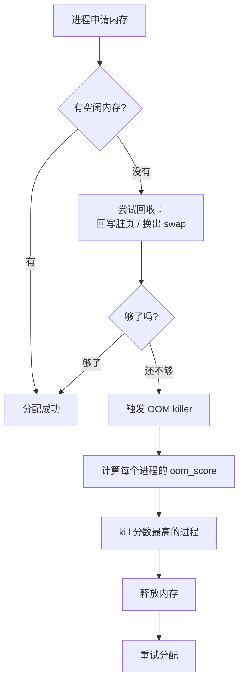

---
tags:
  - Linux
  - 内存
title: 小内存板 OOM 行为
description: OOM killer 算法、oom_score_adj 调优、dmesg 分析与嵌入式缓解策略
date: 2026/05/16
---

# 小内存板 OOM 行为

嵌入式设备常见 256MiB ~ 1GiB 内存，在运行多个服务时容易触发 **OOM（Out-Of-Memory，内存不足）**。理解 OOM killer 的工作原理，才能在设备上做出正确的保护策略。

---

## 1. OOM killer 是什么

当系统可用内存耗尽，无法满足新的内存分配请求时，内核会启动 **OOM killer**：



**OOM killer 不是 bug**，而是内核在极端情况下的最后手段——牺牲一个进程，让系统继续运行，而不是整机死机。

---

## 2. OOM score：谁最先被杀

内核给每个进程计算一个 **oom_score**（0～1000），分数越高越先被杀。

### 2.1 分数计算逻辑

```text
oom_score 基于：
  - 进程占用的内存大小（包括子进程）→ 内存越大，分数越高
  - 进程运行时间 → 运行越久（消耗越多 CPU），分数越高
  - oom_score_adj 调整量（-1000 ～ +1000）→ 由用户/管理员配置
```

**实际上**：内核最优先考虑的是**内存占用大**的进程，因为杀掉它能释放最多内存。

```bash
# 查看某进程的 oom_score（越高越危险）
cat /proc/<pid>/oom_score

# 批量查看所有进程的分数
for pid in /proc/[0-9]*; do
  score=$(cat $pid/oom_score 2>/dev/null)
  comm=$(cat $pid/comm 2>/dev/null)
  echo "$score $comm"
done | sort -rn | head -20
```

### 2.2 oom_score_adj：人工干预

`oom_score_adj` 是你能控制的旋钮（范围 -1000 ～ +1000）：

| 值 | 效果 |
|----|------|
| **-1000** | **绝对不能被杀**（内核守护进程常用） |
| **-500 ~ -100** | 降低被杀概率（重要业务进程） |
| **0** | 默认，不调整 |
| **+500 ~ +900** | 优先被杀（后台任务、可重启的服务） |
| **+1000** | **最先被杀** |

```bash
# 查看某进程的 adj 值
cat /proc/<pid>/oom_score_adj

# 设置（需 root）
echo -500 > /proc/<pid>/oom_score_adj

# 永久设置（在进程启动脚本里）
echo -500 > /proc/$$/oom_score_adj
exec my_critical_daemon
```

**嵌入式常见策略：**

```bash
# 保护关键服务（如通信守护进程）
echo -500 > /proc/$(pgrep my_critical_daemon)/oom_score_adj

# 标记可牺牲的缓存进程
echo 800 > /proc/$(pgrep cache_worker)/oom_score_adj
```

---

## 3. OOM 触发时的 dmesg 日志解读

OOM 发生后，`dmesg` 会输出大量信息。以下是典型格式及解读：

```bash
dmesg | grep -A 50 "Out of memory"
# 或
dmesg | grep -i oom
```

典型日志：

```text
[12345.678901] Out of memory: Kill process 1234 (my_app) score 823 or sacrifice child
[12345.678910] Killed process 1234 (my_app) total-vm:524288kB, anon-rss:480000kB, file-rss:4096kB, shmem-rss:0kB
[12345.678920] oom_reaper: reaped process 1234 (my_app), now anon-rss:0kB, file-rss:0kB, shmem-rss:0kB
```

**字段解读：**

| 字段 | 含义 |
|------|------|
| `score 823` | 该进程的 oom_score |
| `total-vm:524288kB` | 虚拟内存总量（包括未实际分配的） |
| `anon-rss:480000kB` | 实际占用的匿名内存（堆、栈）← **最关键** |
| `file-rss:4096kB` | 映射文件占用的内存 |
| `shmem-rss:0kB` | 共享内存 |

**还能看到内存全局快照：**

```text
[12345.678800] Mem-Info:
[12345.678801] active_anon:98304 inactive_anon:65536 isolated_anon:0
[12345.678802]  active_file:4096 inactive_file:2048 isolated_file:0
[12345.678803]  unevictable:1024 dirty:0 writeback:0
[12345.678804]  slab_reclaimable:8192 slab_unreclaimable:4096
[12345.678805]  mapped:16384 shmem:0 pagetables:1024 bounce:0
[12345.678806] Normal free:2048kB min:1024kB low:2048kB high:3072kB ...
```

快速分析脚本：

```bash
# 提取 OOM 事件摘要
dmesg | grep -E "Out of memory|Killed process|anon-rss"
```

---

## 4. 压测触发 OOM（开发/调试用）

在开发板上故意触发 OOM，观察系统行为：

```bash
# 先 sync，防止文件系统损坏
sync

# 方式1：stress-ng（控制内存量）
stress-ng --vm 1 --vm-bytes 80% --vm-keep --timeout 30s

# 方式2：小 C 程序（更可控）
cat > /tmp/oom_test.c << 'EOF'
#include <stdlib.h>
#include <string.h>
#include <stdio.h>
int main() {
    size_t total = 0;
    while (1) {
        void *p = malloc(1024 * 1024);  /* 每次分配 1MB */
        if (!p) break;
        memset(p, 1, 1024 * 1024);     /* 必须 touch，否则不占实际物理内存 */
        total += 1;
        printf("Allocated %zuMB\r", total);
        fflush(stdout);
    }
    return 0;
}
EOF
gcc -o /tmp/oom_test /tmp/oom_test.c && /tmp/oom_test
```

> ⚠️ 仅在**开发板或 VM** 上实验，生产环境禁止。

---

## 5. 缓解策略

### 5.1 cgroup 内存限制（最佳实践）

用 cgroup 给每个服务设内存上限，让 OOM 精准触发在**指定服务**上，而不是随机杀进程：

```bash
# cgroup v2（现代系统）
mkdir /sys/fs/cgroup/my_service
echo "+memory" > /sys/fs/cgroup/cgroup.subtree_control
echo "256M" > /sys/fs/cgroup/my_service/memory.max
echo $SERVICE_PID > /sys/fs/cgroup/my_service/cgroup.procs

# 超过 256MB 时，只有这个 cgroup 内的进程被 OOM kill
# 不影响系统其他进程
```

详见 [[linux/内核机制/cgroup 使用指南]]。

### 5.2 调整 overcommit 策略

内核的 **内存超分（overcommit）** 策略决定是否允许分配超过实际物理内存的虚拟内存：

```bash
# 查看当前策略
cat /proc/sys/vm/overcommit_memory
# 0 = 启发式（默认）：允许部分 overcommit
# 1 = 总是允许（用于科学计算）
# 2 = 严格限制，不超过 swap + RAM * overcommit_ratio

cat /proc/sys/vm/overcommit_ratio  # 默认 50（即 50%）

# 嵌入式保守策略：严格不 overcommit
echo 2 > /proc/sys/vm/overcommit_memory
echo 80 > /proc/sys/vm/overcommit_ratio
```

> `overcommit_memory=2` 会导致 malloc 在内存不足时直接返回 NULL，而不是等到使用时 OOM kill——这样应用有机会优雅处理内存不足，而不是被强制杀死。

### 5.3 zram（压缩内存）

小内存板没有足够磁盘做 swap 时，**zram** 用 CPU 换内存：

```bash
# 加载 zram 模块
modprobe zram

# 创建 64MB 的压缩内存设备
echo 64M > /sys/block/zram0/disksize

# 格式化为 swap
mkswap /dev/zram0
swapon /dev/zram0 -p 10  # 优先级 10

# 查看效果
free -h
zramctl
```

**权衡**：压缩比通常 2~3x，但占用 CPU；对 CPU 较忙的嵌入式设备需实测。

### 5.4 减少内存占用

| 手段 | 说明 |
|------|------|
| **减小 DPDK mempool** | 按实际需要设置 `rte_mempool_create` 的 `n` 参数 |
| **裁剪内核** | `CONFIG_MODULES=n`、去掉不用的文件系统/驱动 |
| **共享库复用** | 避免多个进程各加载同一大库的私有副本 |
| **关闭 kdump** | 嵌入式上 kdump 保留区可能占几十 MB |
| **tmpfs 限制** | `/tmp` 等 tmpfs 默认占物理内存 50%，可显式限制 |

```bash
# 限制 /tmp 大小
mount -o remount,size=32M /tmp
```

---

## 6. 实际记录模板

| 总 RAM | 触发 OOM 场景 | 被杀进程（score） | anon-rss | 措施 |
|--------|---------------|-------------------|----------|------|
| 256MiB | 并发 8 路视频 | my_encoder (856) | 180MB | 加 cgroup 限制到 128MB |
| 512MiB | 跑 stress-ng 80% | oom_test (960) | 400MB | 加 zram 64MB |

---

## 7. 监控告警（提前发现内存压力）

```bash
# 实时查看内存水位
watch -n 1 'free -m && echo "---" && cat /proc/meminfo | grep -E "MemFree|MemAvailable|Cached|SwapFree"'

# 内存不足告警脚本
THRESHOLD=50  # 剩余内存低于 50MB 时告警
FREE_MB=$(free -m | awk '/^Mem:/{print $7}')
if [ "$FREE_MB" -lt "$THRESHOLD" ]; then
    logger -t oom-monitor "WARNING: only ${FREE_MB}MB available"
fi
```

---

## 延伸阅读

- [[linux/内核机制/kmalloc 与 vmalloc]]
- [[linux/内核机制/cgroup 使用指南]]
- [[linux/内核机制/进程调度与绑核]]
