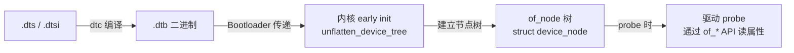

---
tags:
  - Linux
  - 内核
  - 设备树
title: 设备树内核 API（OF API）
description: 驱动侧读取设备树属性的完整 API——of_property_read_*、GPIO/IRQ/Clock 获取、节点遍历与 devm 封装
date: 2026/06/06
---

# 设备树内核 API（OF API）

[[linux/学习路径/设备树实战指南]] 讲了**怎么写 DTS**；本文讲**驱动怎么读**——即内核 `of_*` 函数族的完整用法。掌握这套 API 后，你能在 `probe` 函数里从设备树取出任何资源。

---

## 1. 全局视角：DT 数据流



每个设备树节点在内核里是一个 `struct device_node`，属性是 `struct property`（名字 + 二进制值）。`of_*` 函数族提供了类型安全的读取接口。

---

## 2. 基础属性读取

### 2.1 整数属性

```c
#include <linux/of.h>

struct device_node *np = pdev->dev.of_node;  /* 获取节点指针 */

/* 读 u32（最常用）*/
u32 val;
ret = of_property_read_u32(np, "clock-frequency", &val);
if (ret) {
    dev_err(dev, "missing clock-frequency\n");
    return ret;
}

/* 读 u64 */
u64 big_val;
of_property_read_u64(np, "size", &big_val);

/* 读 u32 数组 */
u32 arr[4];
ret = of_property_read_u32_array(np, "reg", arr, ARRAY_SIZE(arr));

/* 读 s32（有符号整数）*/
s32 signed_val;
of_property_read_s32(np, "some-offset", &signed_val);
```

### 2.2 字符串属性

```c
const char *str;
ret = of_property_read_string(np, "status", &str);
/* str 指向 DTB 内部，只读，不要 kfree */

/* 读字符串数组（compatible 就是字符串列表）*/
const char *compatible;
of_property_read_string_index(np, "compatible", 0, &compatible);

/* 字符串列表遍历 */
const char *s;
int i = 0;
of_property_for_each_string(np, "clock-names", prop, s) {
    dev_dbg(dev, "clock[%d] = %s\n", i++, s);
}
```

### 2.3 布尔属性（空属性）

```c
/* 判断属性是否存在（DTS 里写 some-flag; 而不带值）*/
bool flag = of_property_read_bool(np, "some-flag");
```

---

## 3. GPIO 获取

### 3.1 描述符 API（推荐，新代码用这个）

```c
#include <linux/gpio/consumer.h>

/* 获取 GPIO（name 对应 DTS 里的 xxx-gpios 属性）*/
struct gpio_desc *gpiod = devm_gpiod_get(dev, "reset", GPIOD_OUT_LOW);
if (IS_ERR(gpiod))
    return PTR_ERR(gpiod);

/* 操作 */
gpiod_set_value(gpiod, 1);      /* 拉高 */
gpiod_set_value_cansleep(gpiod, 0);  /* 可能睡眠（I2C GPIO expander）*/
int val = gpiod_get_value(gpiod);    /* 读输入 */
```

**DTS 对应：**
```dts
mydev {
    compatible = "vendor,mydev";
    reset-gpios = <&gpio0 5 GPIO_ACTIVE_LOW>;
    enable-gpios = <&gpio1 3 GPIO_ACTIVE_HIGH>;
};
```

`devm_gpiod_get(dev, "reset", ...)` → 自动找 `reset-gpios` 属性。

### 3.2 GPIO 转中断

```c
/* GPIO 引脚的中断号 */
int irq = gpiod_to_irq(gpiod);
if (irq < 0)
    return irq;

ret = devm_request_irq(dev, irq, my_handler,
                       IRQF_TRIGGER_RISING, "mydev-gpio", priv);
```

### 3.3 旧 API（of_get_named_gpio，老代码常见）

```c
#include <linux/of_gpio.h>

int gpio_num = of_get_named_gpio(np, "reset-gpios", 0);  /* 第 0 个 */
if (!gpio_is_valid(gpio_num))
    return -EINVAL;

ret = devm_gpio_request_one(dev, gpio_num, GPIOF_OUT_INIT_LOW, "reset");
gpio_set_value(gpio_num, 1);
```

新驱动请用描述符 API（`gpiod_*`），旧 API 在新内核里逐步弃用。

---

## 4. 中断获取

### 4.1 从 platform_device 获取（最简单）

```c
int irq = platform_get_irq(pdev, 0);  /* 第 0 个中断 */
if (irq < 0)
    return irq;

ret = devm_request_irq(dev, irq, my_irq_handler,
                       IRQF_SHARED, "mydev", priv);
```

**DTS：**
```dts
mydev@10000000 {
    interrupts = <GIC_SPI 55 IRQ_TYPE_LEVEL_HIGH>;
    interrupt-parent = <&gic>;
};
```

### 4.2 多个中断（按名字）

```c
/* DTS：interrupt-names = "rx", "tx"; */
int irq_rx = platform_get_irq_byname(pdev, "rx");
int irq_tx = platform_get_irq_byname(pdev, "tx");
```

### 4.3 直接从 of_node 获取

```c
int irq = of_irq_get(np, 0);
/* 或 */
int irq = of_irq_get_byname(np, "rx");
```

---

## 5. 时钟获取

```c
#include <linux/clk.h>

/* 获取时钟（name 对应 clock-names）*/
struct clk *clk = devm_clk_get(dev, "apb");  /* devm 版，probe 失败自动释放 */
if (IS_ERR(clk))
    return PTR_ERR(clk);

/* 标准流程：prepare → enable（合并为 prepare_enable）*/
ret = clk_prepare_enable(clk);
if (ret)
    return ret;

/* 获取当前频率 */
unsigned long rate = clk_get_rate(clk);

/* 设置频率（需时钟支持）*/
clk_set_rate(clk, 100000000);  /* 100 MHz */

/* remove 时关闭 */
clk_disable_unprepare(clk);
/* 或用 devm_add_action_or_reset 注册 disable 回调，不用手动 */
```

**DTS：**
```dts
mydev@10000000 {
    clocks = <&clk_apb>, <&clk_core>;
    clock-names = "apb", "core";
};
```

---

## 6. Regulator（电源）获取

```c
#include <linux/regulator/consumer.h>

struct regulator *vdd = devm_regulator_get(dev, "vdd");
if (IS_ERR(vdd))
    return PTR_ERR(vdd);

regulator_enable(vdd);
/* ... 设备工作 ... */
regulator_disable(vdd);
```

**DTS：**
```dts
mydev {
    vdd-supply = <&reg_3v3>;
};
```

`devm_regulator_get(dev, "vdd")` → 找 `vdd-supply` 属性。

---

## 7. 节点引用（phandle）

### 7.1 of_parse_phandle：获取被引用节点

```c
/* DTS：some-node = <&uart0>; */
struct device_node *uart_np = of_parse_phandle(np, "some-node", 0);
if (!uart_np)
    return -ENODEV;

/* 使用完必须 put */
of_node_put(uart_np);
```

### 7.2 带参数的 phandle（specifier）

```c
/* DTS：dmas = <&dma 1 2>, <&dma 3 4>; */
struct of_phandle_args args;
ret = of_parse_phandle_with_args(np, "dmas", "#dma-cells", 0, &args);
/* args.np = &dma 节点, args.args[0] = 1, args.args[1] = 2 */
of_node_put(args.np);
```

---

## 8. 节点遍历

```c
/* 遍历所有子节点 */
struct device_node *child;
for_each_child_of_node(np, child) {
    const char *name;
    of_property_read_string(child, "label", &name);
    /* 每次迭代 child 引用计数自动管理，不用 of_node_put */
}

/* 按 compatible 查找特定子节点 */
struct device_node *led_np;
for_each_compatible_node(np, NULL, "gpio-leds") {
    /* ... */
}

/* 全局查找（从根节点）*/
struct device_node *found = of_find_node_by_name(NULL, "leds");
of_node_put(found);  /* 全局查找需要 put */
```

---

## 9. devm 资源管理的规则

`devm_*` 系列函数把资源与 `struct device` 生命周期绑定：

```text
probe 成功 → 资源被 device 管理
probe 失败 → 已 devm_ 分配的资源自动释放（不需要手动 goto err:）
remove 时  → 所有 devm_ 资源按逆序自动释放
```

```c
/* devm_ 版 vs 手动版 */
void __iomem *base;

/* 手动版（旧风格，需要在 remove/error 路径释放）*/
res = platform_get_resource(pdev, IORESOURCE_MEM, 0);
base = ioremap(res->start, resource_size(res));
/* ... 需要 iounmap(base) in remove */

/* devm 版（推荐）*/
base = devm_platform_ioremap_resource(pdev, 0);
if (IS_ERR(base))
    return PTR_ERR(base);
/* 不需要手动 iounmap */
```

---

## 10. 完整 probe 示例

把上述 API 串联成真实的 `probe` 函数：

```c
static int mydev_probe(struct platform_device *pdev)
{
    struct device *dev = &pdev->dev;
    struct device_node *np = dev->of_node;
    struct mydev_priv *priv;
    int ret;

    priv = devm_kzalloc(dev, sizeof(*priv), GFP_KERNEL);
    if (!priv)
        return -ENOMEM;

    /* 1. 读属性 */
    ret = of_property_read_u32(np, "fifo-depth", &priv->fifo_depth);
    if (ret) {
        dev_err(dev, "missing fifo-depth\n");
        return ret;
    }

    /* 2. MMIO */
    priv->base = devm_platform_ioremap_resource(pdev, 0);
    if (IS_ERR(priv->base))
        return PTR_ERR(priv->base);

    /* 3. 时钟 */
    priv->clk = devm_clk_get(dev, "apb");
    if (IS_ERR(priv->clk))
        return PTR_ERR(priv->clk);
    ret = clk_prepare_enable(priv->clk);
    if (ret)
        return ret;

    /* 4. GPIO */
    priv->reset_gpio = devm_gpiod_get_optional(dev, "reset", GPIOD_OUT_HIGH);
    if (IS_ERR(priv->reset_gpio)) {
        ret = PTR_ERR(priv->reset_gpio);
        goto err_clk;
    }

    /* 5. 中断 */
    priv->irq = platform_get_irq(pdev, 0);
    if (priv->irq < 0) {
        ret = priv->irq;
        goto err_clk;
    }
    ret = devm_request_irq(dev, priv->irq, mydev_isr, 0, "mydev", priv);
    if (ret)
        goto err_clk;

    platform_set_drvdata(pdev, priv);
    dev_info(dev, "mydev probed, fifo=%u\n", priv->fifo_depth);
    return 0;

err_clk:
    clk_disable_unprepare(priv->clk);
    return ret;
}
```

---

## 11. 常用 API 速查表

| 需求 | API |
|------|-----|
| 读 u32 属性 | `of_property_read_u32(np, "name", &val)` |
| 读字符串属性 | `of_property_read_string(np, "name", &str)` |
| 检查属性是否存在 | `of_property_read_bool(np, "flag")` |
| 获取 GPIO | `devm_gpiod_get(dev, "reset", GPIOD_OUT_LOW)` |
| 获取中断号 | `platform_get_irq(pdev, 0)` |
| 获取时钟 | `devm_clk_get(dev, "apb")` |
| 获取 MMIO | `devm_platform_ioremap_resource(pdev, 0)` |
| 获取 regulator | `devm_regulator_get(dev, "vdd")` |
| 引用其他节点 | `of_parse_phandle(np, "some-node", 0)` |
| 遍历子节点 | `for_each_child_of_node(np, child)` |

---

## 延伸阅读

- [[linux/学习路径/设备树实战指南]]（DTS 语法与编译）
- [[linux/内核机制/Clock 与 Pinctrl 子系统]]（时钟树与引脚复用原理）
- [[linux/内核机制/GPIO 与 gpiod 子系统]]（GPIO descriptor API 深入）
- [[linux/驱动与模块/platform 驱动完整案例]]（完整案例代码）
- `Documentation/driver-api/driver-model/devres.rst`（devm 机制说明）
