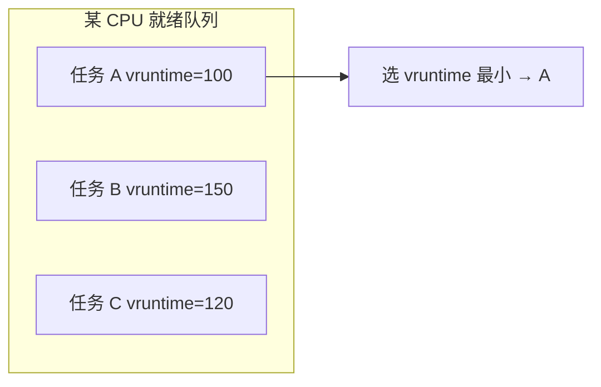
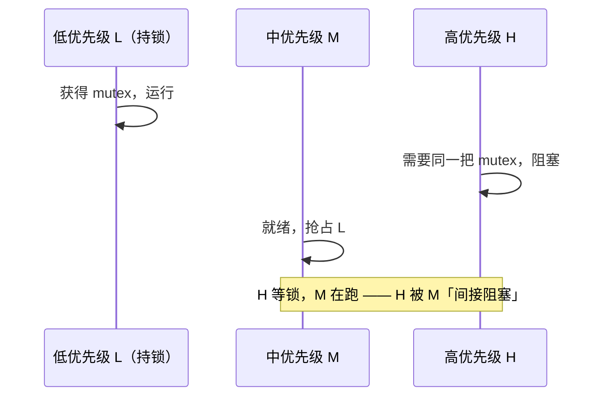

---
tags:
  - Linux
  - 内核
  - 调度
title: 进程调度与绑核
description: CFS、nice、SCHED_FIFO 与 DPDK isolcpus 对照
date: 2026/05/21
---

# 进程调度与绑核

本文对应 [[成长路径/index|成长路径]] **高优先级**：理解 **CFS** 与 **实时调度类**，并能与 **DPDK 绑核**、`isolcpus` 对照使用。

---

## 学习目标

- 说明 **CFS** 如何分配 CPU 时间，**nice** 与 **权重** 的关系。
- 使用 `chrt`、`SCHED_FIFO` 时注意 **饿死** 与 **优先级反转**。
- 配置 `isolcpus`、`taskset` 与 DPDK `-l` 掩码一致。

---

## 调度类概览

| 策略 | 适用 | 要点 |
|------|------|------|
| **SCHED_OTHER** (CFS) | 普通进程 | 默认，公平共享 CPU |
| **SCHED_FIFO / RR** | 实时 | 高优先级先运行，需 CAP_SYS_NICE |
| **SCHED_DEADLINE** | 周期性实时 | 带宽/周期约束 |
| **SCHED_BATCH / IDLE** | 后台 | 降低干扰 |

查看：

```bash
chrt -p <pid>
ps -o pid,cls,pri,ni,cmd -p <pid>
```

---

## CFS 与 nice

**完全公平调度（CFS，Completely Fair Scheduler）** 是默认 **SCHED_OTHER** 策略背后的算法：目标不是「每人固定 10ms 时间片」，而是 **长期按权重平分 CPU**。

- **nice** 范围 -20～19（越小越优先），改变 **权重（weight）** 而非固定时间片。
- **多核** 下每 CPU 一个 **运行队列（runqueue）**；负载均衡会迁移任务。

调试：

```bash
nice -n 10 ./workload
renice -n -5 -p <pid>
```

### CFS 虚拟运行时间（vruntime，virtual runtime）怎么理解「欠账」

**物理运行时间** 是任务在 CPU 上真实跑过的纳秒；**vruntime** 是按优先级 **折算后的「账本」**。

可以记三句话：

1. **谁 vruntime 最小，谁下次更该上 CPU** —— 调度器在就绪队列里挑 **最「欠账」** 的（实际跑得相对最少、按权重该得却没给够的那个）。
2. **nice 越小（优先级越高），vruntime 涨得越慢** —— 同样跑 1ms 物理时间，高优先级任务账本只记更少的 vruntime，所以更容易再次被选上。
3. **CFS 追求长期比例公平** —— 若 A 权重是 B 的 2 倍，理想状态下 A 累计得到的 CPU 时间也应约为 B 的 2 倍。



**「欠账」类比**：三人分蛋糕，按体重（权重）决定每人 **应得份额**。谁 **实际吃的相对自己的份额最少**，谁就最该先吃下一口——对应 **vruntime 最小**。

与 **固定时间片** 的区别：

| 固定时间片（老思路） | CFS |
|----------------------|-----|
| 到期强制切换 | 尽量让 vruntime 接近 |
| 高优先级 = 更长片 | 高优先级 = **vruntime 增速更慢** |
| 切换点可预测 | 切换点随负载变化 |

实现上，就绪任务常放在 **红黑树（red-black tree）** 里，按 vruntime 排序，取最左（最小）节点运行；运行一段时间后 vruntime 增加，再重新插入树中。用户态无需关心树，理解 **「最小 vruntime 优先」** 即可。

**权重与 nice**（直觉，不必背公式）：nice 每差 1 档，权重约变化 ~10%；nice=0 的进程 vruntime 增速为 1×，nice=19 的低速任务增速更快，所以它们 **更少占 CPU**，把机会让给高优先级任务。

---

## 优先级反转（priority inversion）与对策

**优先级反转**：表面上 **高优先级任务 H** 在等锁，实际被 **中优先级任务 M** 间接拖住——因为 **低优先级任务 L** 占着锁，M 又能抢占 L，H 只能干等。



经典案例：**火星探路者（Mars Pathfinder）** 因互斥与优先级组合导致周期性复位；嵌入式 RT 教材常讲此例。

### 和「饿死」的区别

| 现象 | 原因 |
|------|------|
| **饿死（starvation）** | 高优先级一直就绪，低优先级永远轮不到 CPU |
| **优先级反转** | 高优先级在等 **低优先级占有的资源**，中间还被 **中优先级** 插队 |

提高 H 的优先级 **不能** 单独解决反转：关键在 **锁在谁手里**。

### 常见对策

| 方法 | 思路 |
|------|------|
| **优先级继承（PI，priority inheritance）** | L 持锁期间，**临时**把 L 提升到等锁者 H 的优先级，让 L 尽快跑完释放锁 |
| **优先级天花板（priority ceiling）** | 拿锁前把线程提到 **访问该锁的所有任务中的最高优先级**，减少持锁期间被插队 |
| **缩短持锁时间** | 临界区只做最少工作，耗时放锁外（workqueue 等） |
| **避免跨优先级共享 mutex** | 用消息队列、无锁环、per-CPU 数据降低争用 |
| **统一加锁顺序** | 防死锁，也减少复杂等待链 |

**Linux 内核**：配置 **RT Mutex** 与 **优先级继承**（`CONFIG_RT_MUTEX_PI` 等）时，部分 **实时互斥** 路径支持 PI；驱动里 **进程上下文** 的 `mutex` 与 **中断上下文** 不能混用，见 [[linux/内核机制/内核同步机制总览]]。

**用户态 pthread**（glibc）：

```c
pthread_mutexattr_setprotocol(&attr, PTHREAD_PRIO_INHERIT);
pthread_mutex_init(&m, &attr);
```

**SCHED_FIFO** 线程若与 **普通 CFS** 线程共锁，仍可能发生反转；所以文档里写 RT 要配合 **PI** 或 **严格隔离资源**，见下文实时调度风险。

---

## 实时调度风险

**SCHED_FIFO** 在同优先级下 **一直运行** 直到阻塞或让出；错误使用会导致 **软 lockup**（其他任务饿死）。

建议：

- 仅对 **明确周期、短临界** 的线程使用 RT。
- 记录 `/proc/sched_rt_runtime_us`（RT 带宽限制，默认 95%）。
- 与 **优先级继承 mutex** 配合，避免反转。

---

## 绑核与隔离

### taskset（用户态）

```bash
taskset -c 2,3 ./app
```

### isolcpus（内核启动参数）

```text
isolcpus=2,3 nohz_full=2,3 rcu_nocbs=2,3
```

将 CPU 从 **通用 CFS 迁移** 中隔离，供 **DPDK polling** 或 **低抖动** 线程专用。

### 与 DPDK 对照

| Linux 侧 | DPDK 侧 |
|----------|---------|
| `isolcpus` 保留核 | `lcore` 掩码 `-l 2-3` |
| 管理进程跑在非隔离核 | `testpmd` / 业务线程占满隔离核 |
| 中断可 **smp_affinity** 到非数据面核 | **RSS** 将流量分到数据队列 |

避免 **同一物理核** 既跑 **内核软中断** 又跑 **busy poll**，见 [[网络与DPDK/教程/DPDK 教程 4：Offload、Flow、NUMA、IOVA 与性能剖析]]。

---

## 上下文切换关联

调度切换涉及 **寄存器、栈、MMU ASID** 等，见 [[linux/内核机制/深入了解上下文切换]]。

---

## 实践清单

- [ ] 用 `chrt -f 50` 跑一小段循环，观察其他进程延迟（实验后恢复）
- [ ] 画一张本机 **CPU 拓扑**（`lscpu`）并标出 DPDK / 内核线程占用的核
- [ ] 对照一次 `/proc/interrupts` 与网卡队列亲和

---

## 延伸阅读

- [[linux/内核机制/内核同步机制总览]]
- [[网络与DPDK/教程/index]]
- [[编程语言/C++/无锁编程]]
