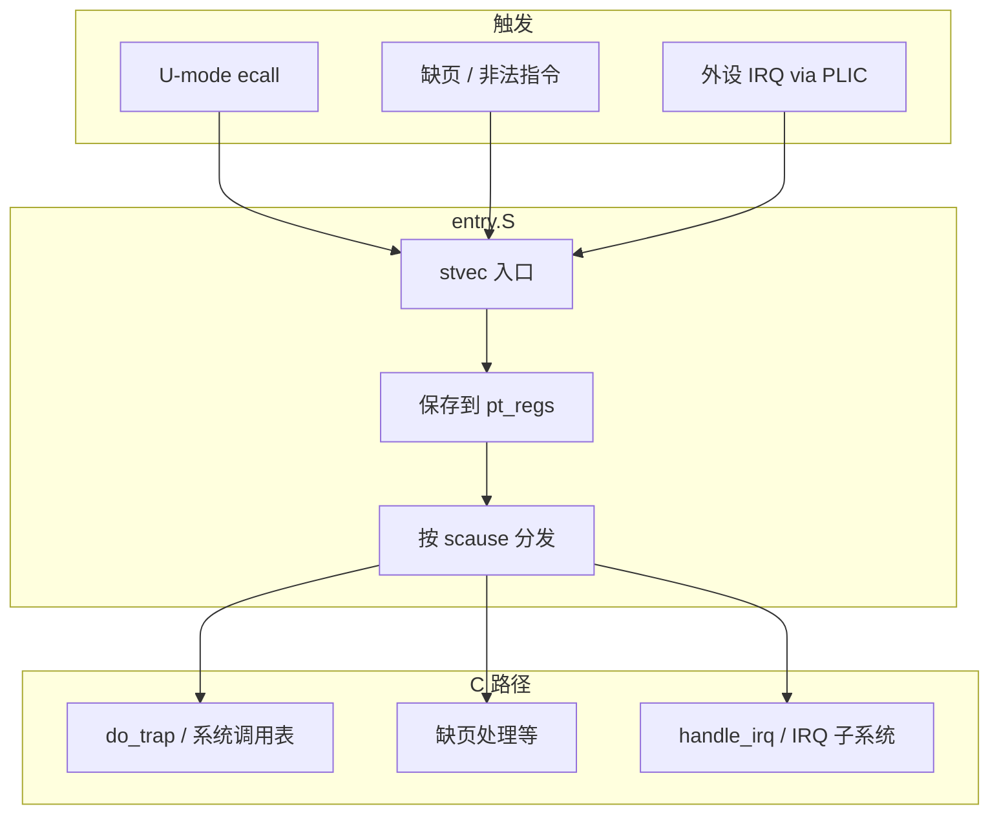
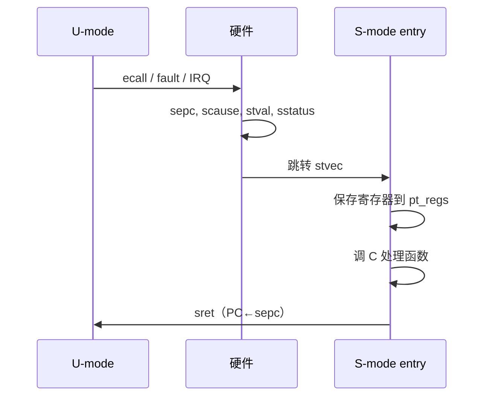
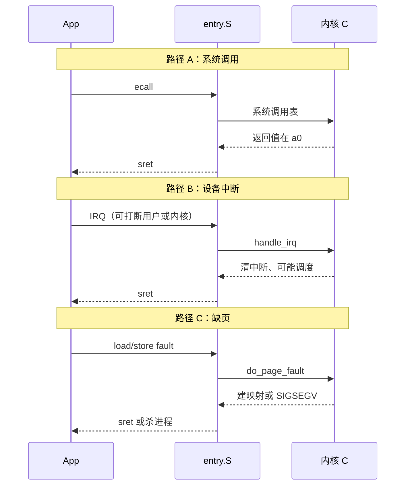

---
tags:
  - Linux
  - RISC-V
  - 内核
  - 异常
title: RISC-V 异常入口与 entry.S 精读
description: stvec 入口、scause 分发、pt_regs 保存与 sret 返回；对照系统调用与中断
date: 2026/07/21
---

# RISC-V 异常入口与 entry.S 精读

[[linux/学习路径/RISC-V 特权模式与 OpenSBI]] 已建立 **M/S/U** 与 CSR 直觉。本篇进入学习路线 Phase 2 后半：打开内核里的 **`arch/riscv/kernel/entry.S`（及同目录 trap 相关文件）**，把一次 **trap（陷入）** 从硬件向量走到 C 语言处理函数、再 `sret` 回去的路径讲清。

通用「系统调用是后门」叙事见 [[linux/内核机制/Linux系统调用：用户态陷入内核完整流程]]（偏 x86 寄存器）；本文换成 **RISC-V `ecall` + `scause`**。中断下半部约束见 [[linux/学习路径/中断与下半部机制]]。

> 内核版本差异：Duo S 日志为 **5.10**；上游 6.x 文件名/宏可能微调，但 **CSR 语义与「保存 pt_regs → 分发 → 恢复 → sret」** 骨架稳定。阅读时以你 BSP 树里的源码为准。

---

## 1. 读完能带走什么

- 能画出：**硬件写 CSR → `stvec` 入口 → 保存上下文 → 按 `scause` 分发 → 恢复 → `sret`**。  
- 能区分三类常见 trap：**用户态 `ecall`（系统调用）**、**异常（缺页等）**、**中断（IRQ）**。  
- 面试时能指着 `sepc` / `scause` / `sstatus` / `sscratch` 说明各自职责，而不背行号。

---

## 2. 场景与问题

驱动里 `pr_info`、用户态 `read()`、定时器滴答，最终都可能走进 **同一套异常入口**。若只停留在「会写 `request_irq`」，遇到 **oops 里的 `sepc`/`scause`** 或「系统调用怎么进内核」就会断档。



---

## 3. 硬件先做的事

Trap 发生时，**硬件**（在已委托给 S-mode 的前提下）大致：

1. 把当前 PC 写入 **`sepc`**  
2. 把原因写入 **`scause`**（最高位常表示「中断 vs 异常」）  
3. 可能把出错地址等写入 **`stval`**  
4. 更新 **`sstatus`**（如保存先前特权级、关中断等，依实现）  
5. 特权级切到 **S-mode**，跳转到 **`stvec`** 指向的入口

| CSR | 读入口时你在看什么 |
|-----|-------------------|
| `sepc` | 「从哪条指令掉进来的」；系统调用返回前常 **+4** 跳过 `ecall` |
| `scause` | 异常码 / 中断号，决定走哪条 C 路径 |
| `stval` | 缺页地址、非法指令相关信息等 |
| `sstatus` | 能否嵌套中断、先前模式（SPP）等 |
| `sscratch` | 常用来交换栈指针：从用户栈切到内核栈 |



---

## 4. `stvec`：向量怎么安的

启动早期，架构代码把 **S-mode trap 入口** 写入 `stvec`。常见两种模式（以手册为准）：

| 模式 | 含义 |
|------|------|
| **Direct** | 所有 trap 进同一入口，靠软件读 `scause` 分支 |
| **Vectored** | 基址 + 原因偏移，硬件选不同入口 |

Linux RISC-V 传统上以 **统一入口 + 软件分发** 好理解：`entry.S` 里一个（或少量）符号，例如历史上的 `handle_exception` 一类标签——**以你树中符号名为准**。

板上验证直觉（不必改内核）：

```bash
# 仅示意：有的环境可通过调试器读 CSR；日常用 oops / 源码对照即可
dmesg | grep -iE 'scause|sepc|Oops'
```

---

## 5. `entry.S` 在干什么（逻辑骨架）

把汇编想象成固定四段，而不是背每一条 `sd`/`ld`：


### 5.1 换栈与 `sscratch`

从 **用户态** 陷入时，当前 `sp` 还是用户栈，不能在上面随便建内核帧。典型手法：

- `sscratch` 里预先放好 **指向当前任务内核信息 / 内核栈** 的指针  
- 入口用 `csrrw` 一类指令 **交换** `sp` 与 `sscratch`  
- 之后在 **内核栈** 上分配一块 **`struct pt_regs`**

从 **内核态** 再陷入（内核缺页、中断嵌套等）时，路径会检查「是否已在内核栈」，避免错误交换——这是入口里常见的分支，也是 oops 分析时要意识到的细节。

### 5.2 保存 `pt_regs`

**`pt_regs`** 是架构相关结构，保存 trap 瞬间的通用寄存器与部分 CSR 快照，供：

- 系统调用取参数（RISC-V Linux 约定用 **`a0`–`a7`** 等，具体以 ABI/内核文档为准）  
- 信号、ptrace、oops 打印  
- 返回时原样（或按语义修改后）恢复

### 5.3 分发：读 `scause`

伪代码级逻辑：

```text
cause = CSR(scause)
if (cause 是中断) {
    走 do_IRQ / handle_arch_irq → IRQ 子系统
} else if (cause == 用户态 ecall) {
    sepc += 4
    查系统调用号 → sys_call_table[...]
} else {
    走 do_trap / 缺页 do_page_fault 等
}
```

| `scause` 直觉分类 | 后续 |
|-------------------|------|
| 中断（最高位为 1） | PLIC/IMSIC 等 → `irq_desc` → 你的 handler |
| Environment call from U | 系统调用 |
| Load/Store/Instruction page fault | MMU / VMA 路径 |
| 其它异常 | `die` / 信号 / 修复 |

系统调用与 ioctl 的层次关系（ioctl 也是一种 syscall）见 [[linux/内核机制/Linux系统调用：用户态陷入内核完整流程#1.1 一、先理清核心误区：系统调用和 ioctl 的关系]]。

### 5.4 返回：`sret`

处理结束后：

1. 从 `pt_regs` **恢复** 通用寄存器  
2. 必要时恢复 `sstatus` 等  
3. 执行 **`sret`**：硬件用 `sepc` 恢复 PC，并切回先前特权级（如 U-mode）

若系统调用忘记把 `sepc` 指到 `ecall` **下一条**，会 **反复执行同一条 ecall**——这是经典坑。

---

## 6. 三条路径对照



驱动开发者日常写的 **`request_irq` 回调**，落在路径 B 的后半；**ISR 不能睡** 的原因仍是：你可能仍处在 **原子上下文 / 关抢占** 路径上（[[linux/内核机制/为什么 ISR 不能睡眠]]）。

---

## 7. 怎么读你树里的源码（实操）

在 Duo BSP / 主线内核中：

```bash
# 路径因版本略有差异
find arch/riscv -name 'entry.S' -o -name 'entry.S.inc'
ls arch/riscv/kernel/ | grep -iE 'trap|entry|syscall'
```

建议阅读顺序：

1. 搜 **`stvec`** 写入点（boot / trap 初始化）  
2. 打开 **`entry.S`**，标出：换栈、存 `pt_regs`、跳转到 C、恢复、`sret`  
3. 打开 **`traps.c` / `syscall.c`**（名称以树为准），看 `scause` 到 C 函数的表  
4. 对照一次真实 **`read()`** 或自写 **非法地址访问** 制造的 oops，看打印里的 `sepc`/`scause`

板级练习（学习路线原文）：在模块里用内联汇编读 **`cycle`** CSR，确认内核态可读；与「用户态直接读特权 CSR 可能 illegal」对照，加深特权边界——见 [[RISC-V 特权模式与 OpenSBI#8. 板上最小验证建议]]。

---

## 8. 与 OpenSBI 的边界（再钉一次）

| 动作 | 特权级切换 |
|------|------------|
| 应用 `ecall` | **U → S**（Linux 系统调用） |
| 内核 `ecall` 调 SBI | **S → M**（OpenSBI） |
| `sret` | 回到陷入前的模式 |

入口汇编处理的是 **S-mode 可见的 trap**；M-mode 自己还有 `mtvec` / `mcause` 一套，通常在 OpenSBI 里，驱动岗默认不改。

---

## 9. 检查清单

- [ ] 能默写 trap 时硬件更新的四个名字：`sepc`、`scause`、`stval`、`sstatus`  
- [ ] 能说明 `sscratch` 与 **内核栈切换** 的关系  
- [ ] 能区分系统调用 / 中断 / 缺页三条分发  
- [ ] 知道系统调用返回前为何要调整 `sepc`  
- [ ] 在自己的 `arch/riscv/kernel/entry.S` 里能标出「保存 / 调用 C / 恢复 / sret」四段  

---

## 10. 相关链接

| 文档 | 用途 |
|------|------|
| [[linux/学习路径/RISC-V 特权模式与 OpenSBI]] | 特权级与 SBI |
| [[linux/内核机制/Linux系统调用：用户态陷入内核完整流程]] | 系统调用概念（x86 示例） |
| [[linux/内核机制/Linux 中断机制详解]] | IRQ 子系统 |
| [[linux/驱动与模块/riscv-驱动开发日志/学习路线]] | Phase 2 目标与面试题 |
| 规范 | [RISC-V Privileged Spec](https://github.com/riscv/riscv-isa-manual) |

*读源码时把文件路径与符号记进 [[linux/驱动与模块/riscv-驱动开发日志/index|开发日志]]，比只收藏链接更有用。*
