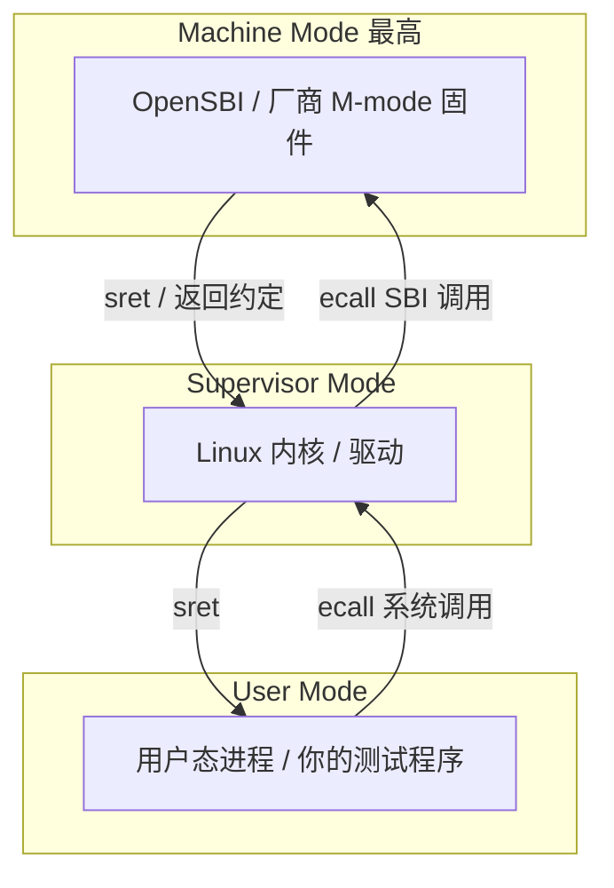
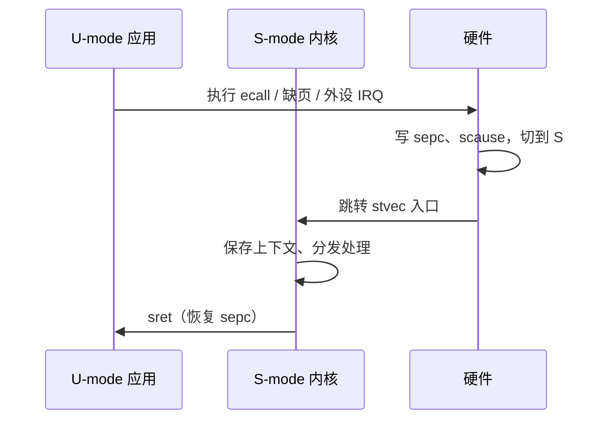
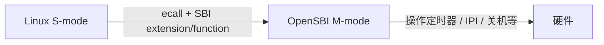

---
tags:
  - Linux
  - RISC-V
  - 内核
  - 嵌入式
title: RISC-V 特权模式与 OpenSBI
description: M/S/U 特权级、异常陷入、SBI 调用与 Duo S 启动链直觉
date: 2026/07/21
---

# RISC-V 特权模式与 OpenSBI

在 Milk-V Duo S 这类 **RISC-V** 板上做驱动时，串口里先蹦出一串 OpenSBI / 内核的日志，再进入用户态。若分不清 **机器模式（M-mode，Machine Mode）**、**监管模式（S-mode，Supervisor Mode）**、**用户模式（U-mode，User Mode）**，后面的「为什么模块里不能乱碰 CSR」「`ecall` 进了谁」都会含糊。

本文把 [[linux/驱动与模块/riscv-驱动开发日志/学习路线|RISC-V 学习路线]] **Phase 2** 收成一篇可复习长文；通用 MMU/异常直觉仍见 [[linux/学习路径/嵌入式体系结构入门]]。

---

## 1. 读完能带走什么

- 能画出 **M / S / U** 谁跑 OpenSBI、谁跑 Linux、谁跑应用。  
- 能讲清一次 **异常 / 中断** 如何经 `scause` / `sepc` / `stvec` 进入内核，再用 `sret` 返回。  
- 知道 **SBI（Supervisor Binary Interface）** 解决什么问题，以及驱动开发通常 **停在 S-mode API**，不必自己写 M-mode 固件。

---

## 2. 场景与问题

| 你在板上看到 | 背后在问 |
|--------------|----------|
| 上电后先 OpenSBI banner，再 Linux | 谁在最高特权级？内核为何不是一上电就跑？ |
| 用户程序 `read()` → 进内核 | U→S 靠什么指令？返回靠什么？ |
| 驱动里关中断、读 `CSR` | 哪些寄存器属于 S-mode？M-mode 的谁在管？ |

不解决：具体 SoC 的 PLIC 寄存器级驱动、H 扩展全套虚拟化实现（概念见学习路线 Phase 4）。

---

## 3. 三种特权模式



| 模式 | 典型软件 | 能做什么（直觉） |
|------|----------|------------------|
| **M** | OpenSBI、部分 boot ROM | 管平台、时钟、IPI、部分早期 console；可委托异常给 S |
| **S** | Linux | 页表（`satp`）、处理来自 U 的 trap、驱动、调度 |
| **U** | 应用 | 不能直接碰设备 MMIO / 特权 CSR；通过系统调用 |

**权衡**：把「脏活」放在 M-mode + SBI，内核才能在不同厂商板上用 **同一套 SBI 编号** 调「关核间中断 / 设定时器」等，而不是每颗 SoC 抄一份汇编。

Duo S（CV1800B）上你日常写的 **out-of-tree `.ko`**，运行在 **S-mode 内核上下文**（或代表进程的内核态），与 x86/ARM 上「驱动在内核态」同一层。

---

## 4. 关键 CSR（控制状态寄存器）

**CSR（Control and Status Register）** 是 RISC-V 的特权状态窗口。驱动/内核适配常接触 **S 系**；M 系多在 OpenSBI。

| CSR | 模式 | 作用 |
|-----|------|------|
| `sstatus` | S | 全局中断使能等状态位 |
| `stvec` | S | trap 入口基址（直接/向量模式） |
| `sepc` | S | 陷入时保存的 PC，`sret` 回去用 |
| `scause` | S | 异常/中断原因编码 |
| `stval` | S | 附加信息（如出错地址） |
| `satp` | S | 页表基址 + 模式（如 Sv39） |
| `mstatus` / `mtvec` / `mepc` / `mcause` | M | M-mode 对应物 |
| `medeleg` / `mideleg` | M | 把哪些异常/中断 **委托** 给 S |

读 CSR 的内联汇编形态（示意，以内核头文件为准）：

```c
unsigned long sstatus;
asm volatile("csrr %0, sstatus" : "=r"(sstatus));
```

板级练习可放在字符设备 ioctl 里读 `cycle` 等计数 CSR（见学习路线 Phase 2 实战），注意：**不是所有 CSR 用户态可读**，模块里也要确认当前 privilege 与委托配置。

---

## 5. 异常与中断：一条陷入路径

### 5.1 因果链



1. 触发源：系统调用 `ecall`、页故障、设备中断（经 **PLIC（Platform-Level Interrupt Controller）** 等）。  
2. 硬件保存现场到 CSR，切换特权级到 S（若已委托）。  
3. 从 `stvec` 进入 `arch/riscv/kernel/entry.S` 一类入口（精读：[[linux/学习路径/RISC-V 异常入口与 entry.S 精读]]）。  
4. 处理完执行 `sret`，回到 `sepc`。

与「ISR 里不能睡」同一套内核约束：你仍在 **原子/中断或内核路径** 上，见 [[linux/内核机制/为什么 ISR 不能睡眠]]、[[linux/学习路径/中断与下半部机制]]。

### 5.2 和系统调用的关系

用户态 `ecall` → 内核系统调用表，是 **U→S**；内核再 `ecall` 进 OpenSBI，是 **S→M**。两层都叫 ecall，**目标特权级不同**。完整「用户陷入内核」叙事可对照 [[linux/内核机制/Linux系统调用：用户态陷入内核完整流程]]（文中以通用 Linux 为主，RISC-V 把 `syscall` 换成 `ecall` 即可对齐）。

---

## 6. OpenSBI 是什么

**OpenSBI** 是开源的 **SBI 参考实现**，跑在 M-mode，给 S-mode 提供稳定「平台调用」：



类比（帮助记忆，非严格等价）：

| 角色 | 粗类比 |
|------|--------|
| OpenSBI | 平台固件服务（有点像「给内核用的 BIOS 调用」） |
| Linux | OS |
| 应用 | 用户程序 |

**面试口径**：OpenSBI 屏蔽厂商 M-mode 差异；内核通过 **SBI 扩展号 + 功能号** 请求服务，而不是直接依赖每家私有监控模式调用约定。

启动链直觉（具体镜像因 BSP 而异）：

```text
ROM / 一级 boot →（可能有 U-Boot）→ OpenSBI → Linux（S-mode）→ userland
```

Duo S 实践日志里环境与模块加载见 [[linux/驱动与模块/riscv-驱动开发日志/index]]；内核版本可用 `uname -r` 对照（日志中常见 `5.10.x` + `riscv64`）。

---

## 7. 对驱动与设备树的含义

| 日常工作 | 落在哪一层 |
|----------|------------|
| 写 `platform_driver` / I²C client | **S-mode 内核**，用 Linux 子系统 API |
| 改 `.dts` 的 `compatible` / `reg` / `interrupts` | 描述硬件给内核；中断号最终接到 PLIC 等控制器 |
| 早期串口 `earlycon` | 启动早期打印，常在架构适配阶段打通 |
| 自己写 OpenSBI 扩展 | **很少**；岗位若是「架构适配」才会碰到 M-mode / 委托位 |

设备树与 probe 流程仍走站内主线：[[linux/学习路径/设备树实战指南]]、[[linux/驱动与模块/platform 驱动完整案例]]。

**RISC-V 相对 ARM 的常见差异（面试够用版）**：

- 中断控制器生态以 **PLIC / APLIC** 等标准为中心，SoC 粘合细节仍要看 TRM。  
- 硬件描述几乎总是 **Device Tree**（无 ACPI 那条桌面路径）。  
- M-mode + SBI 是启动与平台服务的一等公民。

---

## 8. 板上最小验证建议

不要求改 OpenSBI，只验证「特权级心智」：

1. 串口抓 **OpenSBI 版本行** 与内核 `Booting Linux on ...` 的先后顺序。  
2. `cat /proc/cpuinfo`（若 BSP 提供）确认 `isa` / `mmu` 等信息。  
3. 在已有字符设备模块里增加「读 `rdcycle`」类 ioctl，确认 **内核态可读、用户态直接读可能 illegal instruction**（依委托与 CSR 权限）。  
4. 对照 `dmesg` 看 PLIC / 时钟相关初始化是否成功——为后续中断驱动做准备。

日志写法继续用 [[linux/驱动与模块/riscv-驱动开发日志/日志模板|日志模板]]，专题结论链回本文。

---

## 9. 边界与常见误区

| 误区 | 纠正 |
|------|------|
| 「驱动跑在 M-mode」 | 普通 Linux 驱动在 **S-mode 内核** |
| 「SBI 就是系统调用」 | 系统调用是 U→S；SBI 是 **S→M 平台调用** |
| 「会了 CSR 就能跳过设备树」 | 外设资源与中断路由仍靠 DT + 总线框架 |
| 「虚拟化 H 扩展必须先会」 | 岗位主线先把 M/S/U + 驱动跑通；H 扩展是加分项 |

---

## 10. 检查清单

- [ ] 能默画 M（OpenSBI）/ S（Linux）/ U（应用）三层及两种 `ecall`  
- [ ] 能解释 `stvec`、`sepc`、`scause` 在一次 trap 里的分工  
- [ ] 能说明为何嵌入式驱动岗 **优先学 Linux 驱动 + DT**，而不是先改 OpenSBI  
- [ ] 在 Duo S 日志里至少标记过一次「OpenSBI → 内核」启动顺序  

---

## 11. 延伸阅读

| 主题 | 文档 |
|------|------|
| 12 周路线 Phase 2–4 | [[linux/驱动与模块/riscv-驱动开发日志/学习路线]] |
| 异常入口精读 | [[linux/学习路径/RISC-V 异常入口与 entry.S 精读]] |
| 板级流水 | [[linux/驱动与模块/riscv-驱动开发日志/index]] |
| 中断上下半部 | [[linux/学习路径/中断与下半部机制]] |
| MMU / VA→PA | [[linux/内核机制/如何通过虚拟地址查找物理地址]] |
| 规范 | [RISC-V ISA Manual](https://github.com/riscv/riscv-isa-manual)、[OpenSBI](https://github.com/riscv-software-src/opensbi) |

*本文补齐成长路径中 RISC-V 架构专题的教程型入口；实践勾选仍以开发日志与 [[成长路径/index#六、嵌入式 Linux · 驱动与模块]] 为准。*
