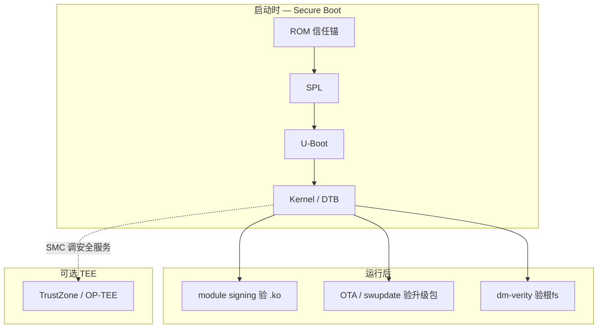
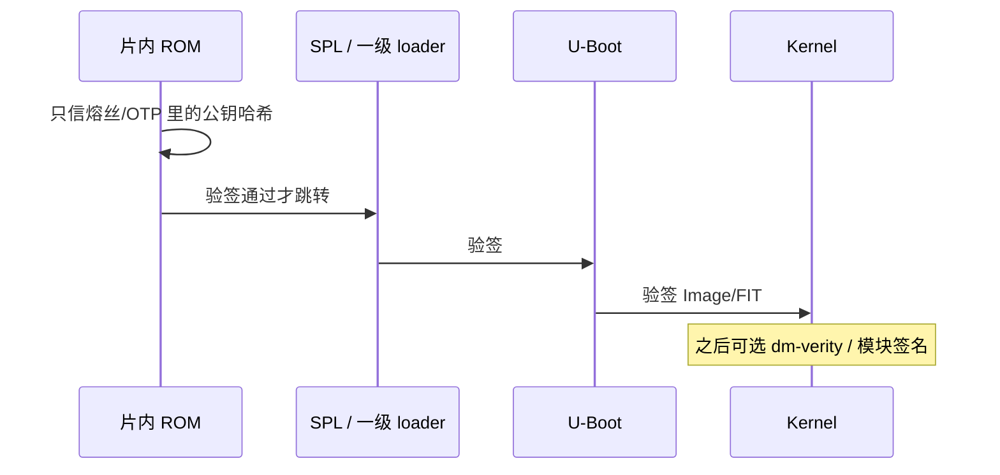

---
tags:
  - Linux
  - 安全
  - TrustZone
  - Secure Boot
title: TrustZone 与安全启动概念
description: 安全世界、启动验签链、与模块签名/OTA 的分层，以及 BSP 责任边界
date: 2026/05/16
---

# TrustZone 与安全启动概念

量产板上常听到「开了 Secure Boot」「密钥在 TrustZone」——三者并不等同。本文把 **ARM TrustZone（可信执行环境）**、**安全启动（Secure Boot）验签链**、以及运行后的 **内核模块签名** 拆开，讲清各自解决什么问题、谁负责什么，对应 [[成长路径/index|成长路径]] 中优先级。

不要求你从零实现完整 TEE；目标是：**面试能分层讲清，改 BSP 时知道别碰哪些分区**。

---

## 1. 读完能带走什么

- 能区分 **TrustZone / Secure Boot / module signing / OTA 签名** 各自验什么。  
- 能画出一条典型启动验签链：ROM → SPL → U-Boot → Kernel →（可选）dm-verity。  
- 知道签名完整性靠的是 **密码学哈希 + 非对称验签**，不是 CRC。  
- 说清芯片厂 / 方案商 / 产品侧在密钥与工具上的分工。

---

## 2. 场景与问题

| 现象 | 真正要问的 |
|------|------------|
| 换个未签名内核起不来 | Secure Boot 在哪一层拒的？ |
| root 仍能 `insmod` 任意 `.ko` | 模块签名开了没有？和 Secure Boot 是否同一把钥匙？ |
| OTA 包写上去变砖 | 升级包有没有签？A/B 切换前谁验？ |
| 「密钥在 TrustZone」 | 是启动验签用公钥，还是业务加解密用私钥？ |



---

## 3. TrustZone：两个「世界」

**TrustZone** 是 ARM 的硬件隔离机制，把 CPU/外设分成：

| 世界 | 英文 | 典型软件 |
|------|------|----------|
| **普通世界** | Normal World | Linux、多数 U-Boot、应用 |
| **安全世界** | Secure World | 安全监控、**OP-TEE**、密钥与敏感运算 |

Linux 通过 **SMC（Secure Monitor Call）** 陷入 Monitor，再进入安全世界服务。对驱动开发者而言：日常代码跑在 Normal World；只有「存密钥、做密封存储、远程证明」等才进 TEE。

**权衡**：TEE 提升密钥保护，但 BSP 复杂、调试难、量产注入密钥流程重——消费电子未必全开，工业/支付更常见。

> RISC-V 上对应思路是 **PMP / IOPMP / 厂商 TEE 方案**，不必硬套 TrustZone 名词，但「普通 OS vs 安全固件」分层仍适用。见 [[linux/学习路径/RISC-V 特权模式与 OpenSBI]]。

---

## 4. 安全启动链：谁验谁

**安全启动（Secure Boot）** 的核心是 **信任链（chain of trust）**：每一级用上一级信任的公钥（或公钥哈希）验证下一级镜像签名。



典型路径（细节因 SoC 而异）：

```text
ROM (公钥 hash 在 OTP) → 校验 SPL → 校验 U-Boot → 校验 kernel/dtb → (可选) dm-verity rootfs
```

任一环失败：**拒绝启动** 或进 **recovery**。这保证「起来的内核不是被换包的」；**不自动保证** root 不能再加载恶意模块——那是下一层的事。

### 4.1 完整性靠什么

验签时常见流程：对镜像算 **SHA-256** 等密码学哈希，用 **RSA/ECDSA 公钥** 验证附带的签名是否匹配该哈希。

- **不是 CRC**：CRC 可被篡改后重算；哈希 + 私钥签名不能。  
- 模块侧同理，见 [[内核模块签名机制#3. 完整性是 CRC 吗]]。

---

## 5. 与「模块签名 / OTA」分层

| 层级 | 签什么 | 谁验 | 防什么 |
|------|--------|------|--------|
| Secure Boot | 启动镜像 | ROM / Bootloader | 换核、换 DT |
| **Module signing** | `.ko` | **已运行的内核** | 任意 `insmod` rootkit |
| OTA（如 swupdate CMS） | `.swu` 升级包 | 升级器 / 恢复环境 | 假升级包 |
| dm-verity | 根文件系统块哈希 | 内核 verity | 根fs 被改 |

四层可独立开关。产品常：**Secure Boot + OTA 签名** 必做；模块强制签名与 verity 按威胁模型加。专文：[[内核模块签名机制]]、[[linux/OTA/swupdate 入门]]、[[linux/OTA/A-B 分区与回滚策略]]。

---

## 6. BSP 责任边界

| 提供方 | 通常交付 |
|--------|----------|
| **芯片厂** | ROM 逻辑、签名工具（如 NXP CST）、参考 Secure Boot 文档、熔丝位说明 |
| **方案商** | 量产烧录、密钥注入夹具、关闭「开发态跳过验签」的流程 |
| **产品** | 私钥保管（HSM/线下）、OTA 签名策略、现场吊销与轮换预案 |

应用 / 驱动开发者多数只需：

- 知道 **开/关 Secure Boot** 对调试镜像的影响；  
- **不要随意改** 已签名分区布局；  
- 发版镜像走 **同一套签名流水线**。

---

## 7. 与 OTA、调试的交叉

- 升级包必须 **用与设备信任的同一信任锚对应的私钥** 重签；A/B 切换依赖 bootloader 对 **目标 slot** 的校验，见 [[A-B 分区与回滚策略]]。  
- 开发阶段：常用「未熔丝 / 开发密钥 / 关闭 FORCE」；量产：**熔丝 + 强制验签**，两套环境密钥分离。  
- 合规检查项汇总：[[安全启动与合规实践]]。

---

## 8. 检查清单

- [ ] 能默画 ROM→…→Kernel 验签链，并指出失败时的行为  
- [ ] 能一句话区分 TrustZone（运行时隔离）与 Secure Boot（启动验签）  
- [ ] 知道 root 仍可能加载模块，除非开了 module signing force  
- [ ] 清楚自己项目里私钥存在哪、谁有权限签正式镜像  

---

## 9. 延伸阅读

- [[内核模块签名机制]]  
- [[安全启动与合规实践]]  
- [[linux/OTA/index]]  
- [[成长路径/index]] 第 4 季度「安全启动 / 合规」  
- [[linux/学习路径/嵌入式体系结构入门]]（TrustZone 在体系结构中的位置）
