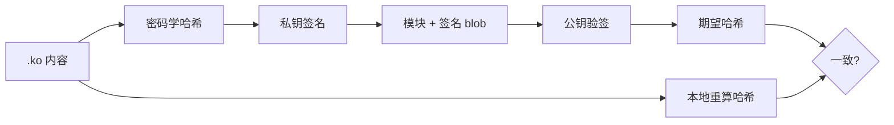
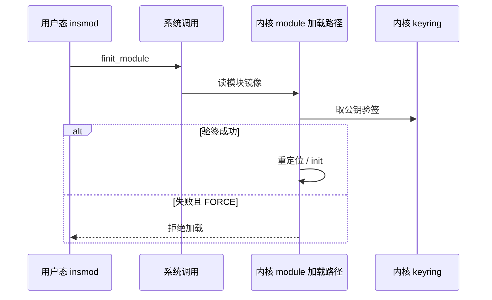

---
tags:
  - Linux
  - 安全
  - 内核
  - 模块
title: 内核模块签名机制
description: module signing 的作用、哈希验签流程、配置项、与 Secure Boot/CRC 的边界
date: 2026/07/23
---

# 内核模块签名机制

开启 **内核模块签名（module signing）** 后，未持有正确私钥的人即使拿到 root，也难以把任意 `.ko` 塞进内核。本文讲清：**签名解决什么、实现链路、和 Secure Boot / CRC 的区别**，以及嵌入式上调试与量产如何折中。

概念分层见 [[TrustZone 与安全启动概念]]；OTA 包签名见 [[linux/OTA/swupdate 入门]]。

---

## 1. 读完能带走什么

- 能说明模块签名的 **完整性 + 来源可信** 两个作用。  
- 能画出：编译签 `.ko` → 加载时用内核 keyring 验签 → 失败则拒绝。  
- 明确：**完整性不是 CRC**，而是 **密码学哈希 + 非对称验签**。  
- 知道 `CONFIG_MODULE_SIG` / `MODULE_SIG_FORCE` 与开发/量产策略怎么选。

---

## 2. 场景与问题

| 没有模块签名时 | 风险 |
|----------------|------|
| root 可 `insmod` 任意模块 | 提权后植入 rootkit、挂钩系统调用 |
| 只靠 Secure Boot | 只保证「内核镜像」可信，**不限制** 运行后加载的代码 |

模块签名回答的是：**已经跑起来的这颗内核，还允不允许执行「额外编译进来的内核代码」**。

---

## 3. 完整性是 CRC 吗

**不是。**

| 机制 | 用途 | 对抗篡改 |
|------|------|----------|
| CRC / 简单 checksum | 检传输噪声、坏块 | 攻击者改数据后 **重算 CRC** 即可蒙混 |
| **SHA-256 等哈希 + 私钥签名** | 安全完整性 + 认证 | 无私钥无法伪造「合法签名」 |



CRC 若出现在驱动/Flash 路径，多半是 **非安全检错**，与 module signing 无关。

---

## 4. 实现链路

### 4.1 构建侧

1. 生成密钥对（RSA / ECDSA 等，视内核配置）。  
2. **公钥** 编入内核（或可加载到系统 keyring，视版本与发行策略）。  
3. 构建系统调用 `scripts/sign-file`（或等价包装）对每个需签名的 `.ko` 附加签名（常见为 PKCS#7 / CMS 风格 blob）。

### 4.2 运行侧



关键配置（名称以你内核 `menuconfig` 为准）：

| 选项 | 含义 |
|------|------|
| `CONFIG_MODULE_SIG` | 启用模块签名支持 |
| `CONFIG_MODULE_SIG_FORCE` | **强制**：无签名或验失败则拒绝 |
| `CONFIG_MODULE_SIG_ALL` | 构建时自动签所有模块 |
| 哈希算法选项 | 如 SHA-256，须与 `sign-file` 一致 |

---

## 5. 与 Secure Boot 的关系

| | Secure Boot | Module signing |
|--|-------------|----------------|
| 时机 | **启动前/启动中** | **内核已运行** |
| 对象 | Image / FIT / UKI 等 | `.ko` |
| 验证者 | ROM / U-Boot | 内核 |

两者密钥可以同源管理，但 **机制独立**：只开 Secure Boot，root 仍可能加载未签模块（若未 FORCE）。

---

## 6. 嵌入式实践建议

| 阶段 | 建议 |
|------|------|
| 开发 | 可关 FORCE，或使用开发密钥；方便 out-of-tree 调试 |
| 量产 | 开 FORCE；私钥进 CI Secrets / HSM；板端只留公钥 |
| 现场升级 | 新 `.ko` 必须进同一签名流水线，再随镜像或独立包下发 |

排障：

```bash
# 加载失败时看内核日志（文案因版本而异）
dmesg | grep -iE 'module.*sign|PKCS|key'
modinfo your.ko   # 查看是否有 signature 相关信息（视工具版本）
```

常见失败原因：用了另一套密钥签的模块、哈希算法不一致、模块被截断/二次 strip 破坏签名尾部。

---

## 7. 检查清单

- [ ] 能向别人讲清：签名 ≠ 加密，防的是篡改与冒充  
- [ ] 能区分 CRC 与哈希验签  
- [ ] 知道本项目是否 `MODULE_SIG_FORCE`  
- [ ] 开发密钥与量产密钥是否分离  

---

## 8. 延伸阅读

- [[TrustZone 与安全启动概念]]  
- [[安全启动与合规实践]]  
- [[linux/驱动与模块/Linux 内核模块开发实战]]  
- 内核文档：`Documentation/admin-guide/module-signing.rst`（路径随版本略有差异）
