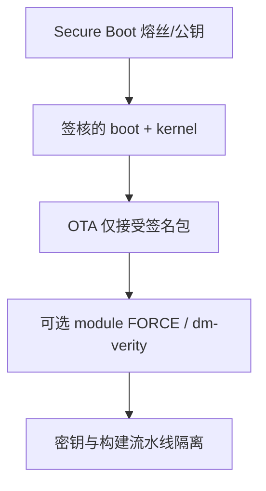

---
tags:
  - Linux
  - 安全
  - 合规
title: 安全启动与合规实践
description: 签名链落地检查项、SBOM 与产品交付审计备忘
date: 2026/05/16
---

# 安全启动与合规实践

概念层有 [[TrustZone 与安全启动概念]]、[[内核模块签名机制]] 之后，产品还要把安全与合规收成 **可勾选的交付项**。本文对应 [[成长路径/index|成长路径]] 第 4 季度：技术开关 + 流程审计，按项目裁剪，不作法律意见。

---

## 1. 读完能带走什么

- 有一份 **发布前检查清单**（启动链、OTA、密钥、默认口令）。  
- 知道 SBOM / 许可证与「签名安全」是不同维度，但常一起验收。  
- 能按消费类 / 工业 调整优先级，而不是一次做完所有项。

---

## 2. 安全启动（技术落地）

| 项 | 参考文 | 落地动作 |
|----|--------|----------|
| 信任链概念 | [[TrustZone 与安全启动概念]] | 文档记录本 SoC 的验签级数 |
| 模块签名 | [[内核模块签名机制]] | 量产开 FORCE；开发密钥分离 |
| OTA 签名 | [[swupdate 入门]]、[[A-B 分区与回滚策略]] | CI 签 `.swu`；板端拒未签包 |
| 根fs 完整性 | dm-verity / 只读根 | 按产品威胁模型可选 |

调试镜像与量产镜像 **配置分离**：避免「实验室关验签」的配置流进产线。

---

## 3. 合规（流程）

| 项 | 说明 | 参考 |
|----|------|------|
| **开源许可证清单** | GPL 内核模块、用户态库传染性 | [[工程基础/许可证与 SBOM 入门]] |
| **SBOM** | 组件名、版本、来源，随版本归档 | 同上 |
| **第三方二进制** | 闭源 blob 的合同与更新渠道 | 供应商条款 |
| **加密出口声明** | 含强加密模块时的法务流程 | 公司法务 |
| **漏洞响应** | LTS 内核、CVE 订阅、补丁窗口 | 版本策略文档 |

签名解决「是不是我们签过的」；SBOM 解决「里面有什么开源组件」——验收时常两张表。

---

## 4. 产品交付前检查（示例）

### 4.1 构建与密钥

- [ ] 发布镜像 **可复现**（记录 commit、toolchain、defconfig）  
- [ ] 量产私钥仅在 **CI Secrets / HSM**，不进 git  
- [ ] 开发密钥无法启动已熔丝量产板（或策略上等价隔离）  

### 4.2 运行面

- [ ] 默认口令已改 / debug 口关闭或鉴权  
- [ ] OTA **仅接受签名** 包；失败有日志  
- [ ] A/B 回滚在掉电与坏包场景验证过  
- [ ] （可选）`MODULE_SIG_FORCE`、dm-verity  

### 4.3 合规交付物

- [ ] **SBOM** 与许可证通知随版本归档  
- [ ] 第三方 blob 列表与更新责任人  

### 4.4 数据

- [ ] 隐私 / 凭证 **加密存储**（若适用）  
- [ ] 日志不含密钥明文  

---

## 5. 「按工作需求」裁剪

| 产品类型 | 往往更严的部分 |
|----------|----------------|
| 消费电子 | OTA 签名、账户与隐私、默认口令 |
| 工业网关 | Secure Boot、远程审计日志、长期内核维护 |
| 车规 / 高安全 | 全链验签、密钥托管、变更审计（另遵客户规范） |

以 **客户审计表** 为准；本站条目是技术备忘，不是认证替代。

---

## 6. 延伸阅读

- [[TrustZone 与安全启动概念]]  
- [[内核模块签名机制]]  
- [[linux/OTA/index]]  
- [[工程基础/许可证与 SBOM 入门]]  
- [[成长路径/index]]
