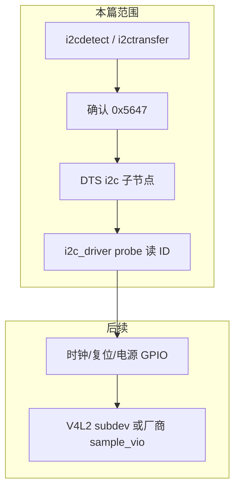
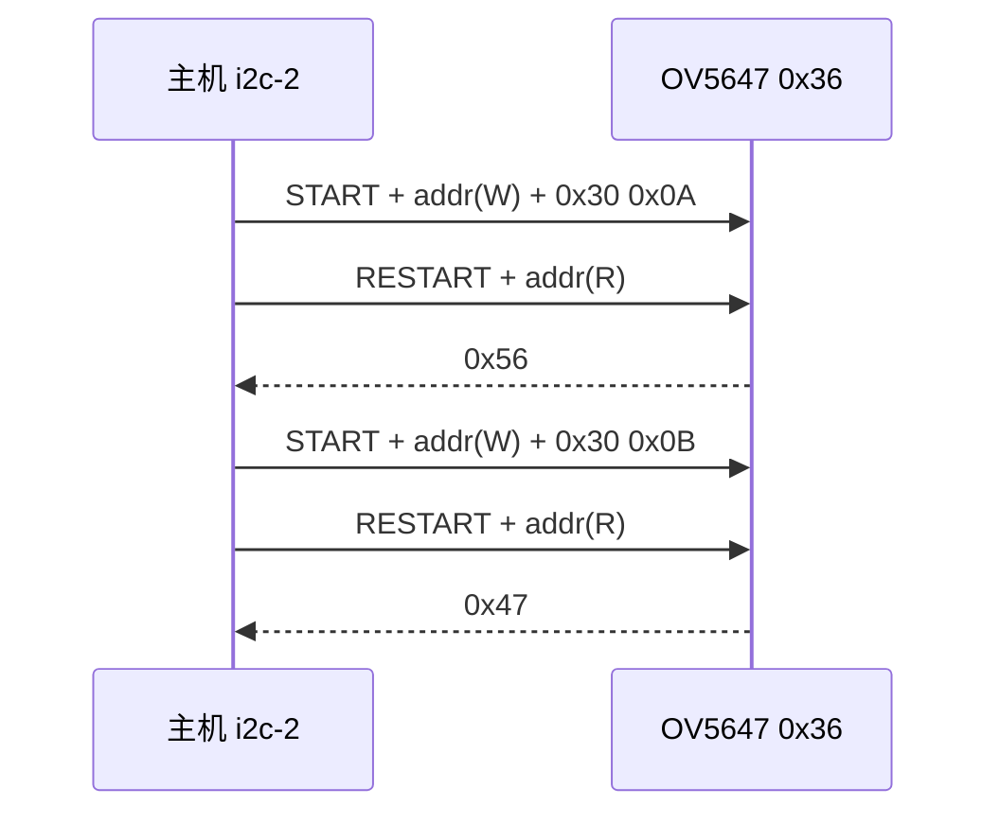
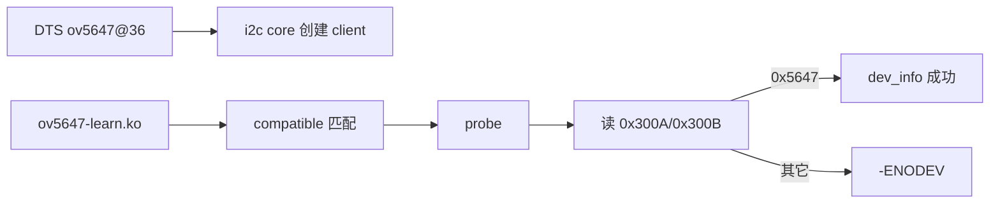

---
tags:
  - Linux
  - 驱动
  - I2C
  - RISC-V
  - 摄像头
title: Duo S 上 OV5647：从 i2cdetect 到 I2C 驱动骨架
description: 基于 0x36 / Chip ID 0x5647 的 bring-up：用户态确认、设备树、i2c_driver 与厂商 SDK 边界
date: 2026/07/21
---

# Duo S 上 OV5647：从 i2cdetect 到 I2C 驱动骨架

[[linux/驱动与模块/riscv-驱动开发日志/2026-06-05|2026-06-05 日志]] 已在 Milk-V Duo S 的 **i2c-2** 上扫到地址 **`0x36`**，并用 `i2ctransfer` 读出 Chip ID **`0x5647`**——这是 **OV5647** 的典型指纹。本文把流水账收成 **可复现的 bring-up + 最小 `i2c_driver`**，对应学习路线 **项目 B（I²C 设备驱动）** 的前半段：先证明「总线通、ID 对、probe 能绑」，再谈 MIPI / V4L2 出图。

总线模型总览仍见 [[linux/学习路径/I2C 与 SPI 驱动选学]]；特权级背景见 [[linux/学习路径/RISC-V 特权模式与 OpenSBI]]。

---

## 1. 读完能带走什么

- 能用 **`i2cdetect` / `i2ctransfer`** 独立确认 OV5647，并解释为何有时是 `UU`、有时看不到节点。  
- 能写 **设备树子节点 + `i2c_driver`**，在 `probe` 里读 Chip ID 判活。  
- 分清三条路径：**用户态试探**、**自研 i2c client**、**厂商 `snsr_i2c` + `sample_vio`**，避免和 BSP 抢同一从地址。

---

## 2. 场景与问题

| 现象（日志） | 要回答的问题 |
|--------------|--------------|
| `i2c-2` 上 `36` | 哪条 adapter？地址 7-bit 还是 8-bit 写法？ |
| `0x300A/0x300B` → `0x56`/`0x47` | 是否就是 OV5647？下一步写驱动还是跟 vendor？ |
| `lsmod` 里有 `snsr_i2c`、`cvi_mipi_rx` | 内核是否已占用该从设备？自研驱动会不会 `-EBUSY`？ |
| 无 `/dev/video*` | 出图链路（VI / MIPI / 时钟 / reset）是否未启用？ |

**不解决**：完整 MIPI CSI 时序调参、厂商 ISP pipeline 内部实现、生产级 AE/AWB。



---

## 3. 核心概念

| 概念 | 本场景落点 |
|------|------------|
| **I2C 从地址** | OV5647 常见 **`0x36`**（7-bit）；`i2cdetect` 表上显示的就是它 |
| **16-bit 寄存器地址** | Chip ID 在 **`0x300A`（高）**、**`0x300B`（低）**；合起来期望 **`0x5647`** |
| **Adapter vs Client** | Duo 的 DesignWare adapter 已在 BSP；你写的是 **client 驱动** |
| **占用（UU）** | 内核驱动已 bind 该地址时，`i2cdetect` 常显示 `UU`，用户态再开 `/dev/i2c-N` 可能失败 |
| **Sensor vs Pipeline** | I2C 只配 sensor；像素走 **MIPI / VI**，厂商侧常见 `cvi_mipi_rx` + `sample_vio` |

---

## 4. 用户态确认（先于写驱动）

环境以日志为准：内核 **`5.10.4-tag-`**、板卡 **milkv-duo**、总线 **`i2c-2`**。

### 4.1 扫总线

```bash
for b in 1 2 3 4; do
  echo "=== i2c-$b ==="
  i2cdetect -y $b
done
```

期望：某一总线上出现 `36`（你的记录在 **i2c-2**）。出现 `UU` 表示已被内核驱动占用——先查：

```bash
ls /sys/bus/i2c/devices/
cat /sys/bus/i2c/devices/*/name
lsmod | grep -iE 'snsr|sensor|ov|cvi'
```

### 4.2 读 Chip ID（16-bit 寄存器地址）

OV5647 要用 **先写 2 字节寄存器地址、再读 1 字节**（不是简单的 `i2cget` 单字节寄存器）：

```bash
i2ctransfer -y 2 w2@0x36 0x30 0x0a r1   # 期望 0x56
i2ctransfer -y 2 w2@0x36 0x30 0x0b r1   # 期望 0x47
```



若读出 `0x00` / `NACK`：优先查 **供电、PWDN/RESET、XCLK**，而不是先改驱动代码（树莓派系模块常见「regulator GPIO 未拉高则总线上无设备」）。

### 4.3 对照厂商路径

日志里已有 `snsr_i2c`、`sample_vio` 等——说明 **出图可以先走 SDK sample**，自研驱动用于 **学习 I2C client / 面试手写骨架**，两者目标不同：

| 目标 | 建议 |
|------|------|
| 尽快出图 / 验证硬件 | `sample_vio` / `sample_sensor_test`（厂商文档） |
| 掌握 `i2c_driver` + DT | 本篇骨架；或 upstream `drivers/media/i2c/ov5647.c`（需 V4L2/media 依赖） |
| 与 BSP 共存 | **不要**在同一 `reg=<0x36>` 上叠两个 client；改地址占用或 `status="disabled"` 其中一个 |

---

## 5. 设备树：挂上 client 节点

示意（总线 phandle、时钟、复位脚以 **你的 Duo S DTS** 为准；先最小节点跑通 probe）：

```dts
&i2c2 {
	clock-frequency = <400000>;
	status = "okay";

	ov5647@36 {
		compatible = "ovti,ov5647";
		reg = <0x36>;
		/* 按原理图补：
		 * reset-gpios = <&porte 2 GPIO_ACTIVE_LOW>;
		 * pwdn-gpios  = <&porte 3 GPIO_ACTIVE_HIGH>;
		 * clocks = <&clk_cam_mclk>;
		 * clock-names = "xclk";
		 */
		status = "okay";
	};
};
```

要点：

- `compatible` 必须与驱动 `of_match_table` **字符串一致**。  
- `reg` 是 **7-bit 从地址**。  
- 若 BSP 已有 `sensor@36` / `snsr` 节点，先 **`status = "disabled"`** 再启用你的节点，避免双 bind。

编译 DTB、替换、重启后的排障习惯见 [[linux/学习路径/设备树实战指南]]、[[linux/学习路径/启动排障手册]]。

---

## 6. 最小 `i2c_driver`：probe 读 ID

学习向骨架（out-of-tree 模块即可；**不是**完整 V4L2 subdev）：

```c
#include <linux/module.h>
#include <linux/i2c.h>
#include <linux/of.h>

#define OV5647_REG_CHIP_ID_H	0x300A
#define OV5647_REG_CHIP_ID_L	0x300B
#define OV5647_CHIP_ID		0x5647

static int ov5647_read16_reg(struct i2c_client *client, u16 reg, u8 *val)
{
	u8 addr[2] = { reg >> 8, reg & 0xff };
	struct i2c_msg msgs[2] = {
		{ .addr = client->addr, .flags = 0,          .len = 2, .buf = addr },
		{ .addr = client->addr, .flags = I2C_M_RD,   .len = 1, .buf = val  },
	};

	return i2c_transfer(client->adapter, msgs, 2) == 2 ? 0 : -EIO;
}

static int ov5647_probe(struct i2c_client *client, const struct i2c_device_id *id)
{
	u8 hi, lo;
	u16 chip_id;
	int ret;

	ret = ov5647_read16_reg(client, OV5647_REG_CHIP_ID_H, &hi);
	if (ret)
		return ret;
	ret = ov5647_read16_reg(client, OV5647_REG_CHIP_ID_L, &lo);
	if (ret)
		return ret;

	chip_id = ((u16)hi << 8) | lo;
	if (chip_id != OV5647_CHIP_ID)
		return dev_err_probe(&client->dev, -ENODEV,
				     "chip id 0x%04x, expect 0x%04x\n",
				     chip_id, OV5647_CHIP_ID);

	dev_info(&client->dev, "OV5647 detected (id=0x%04x) on i2c-%d addr 0x%02x\n",
		 chip_id, client->adapter->nr, client->addr);
	return 0;
}

static void ov5647_remove(struct i2c_client *client)
{
	dev_info(&client->dev, "ov5647 removed\n");
}

static const struct of_device_id ov5647_of_match[] = {
	{ .compatible = "ovti,ov5647" },
	{ /* sentinel */ }
};
MODULE_DEVICE_TABLE(of, ov5647_of_match);

static struct i2c_driver ov5647_driver = {
	.probe  = ov5647_probe,
	.remove = ov5647_remove,
	.driver = {
		.name = "ov5647-learn",
		.of_match_table = ov5647_of_match,
	},
};
module_i2c_driver(ov5647_driver);

MODULE_LICENSE("GPL");
MODULE_DESCRIPTION("Minimal OV5647 I2C detect for learning");
```



验证：

```bash
insmod ov5647-learn.ko
dmesg | tail
# 期望：OV5647 detected (id=0x5647) on i2c-2 addr 0x36
```

与字符设备练习的衔接：前期 `debris` 模块练的是 **fops / waitqueue / hrtimer**（[[2026-06-03 —— 学习并发、中断与定时器]]）；本篇换成 **总线 client**。两者最后在「帧生产 → 用户态读」汇合，但 **不要**一上来把 ISP 全塞进字符设备。

---

## 7. 进阶方向（按目标选一条）

| 方向 | 做什么 | 参考 |
|------|--------|------|
| **A. 继续自研学习** | 加 `reset-gpios` / `pwdn-gpios`、`clk_prepare_enable`；用 `regmap`/`cci` 风格整理寄存器表 | upstream `ov5647.c`；[[Runtime PM 与休眠唤醒入门]] |
| **B. V4L2 subdev** | 实现 format / stream on；对接 CSI receiver | 内核 `Documentation/driver-api/media/` |
| **C. 产品出图** | 跟通 `sample_vio`，弄清 sensor 索引与 lane 配置 | Duo 官方文档 + 日志里的 `/mnt/system/usr/bin/sample_*` |

面试时用 STAR 描述建议锚定 **A**：扫到 `0x36` → 读出 `0x5647` → DT + `i2c_driver` probe 成功；出图作为「已知厂商路径可验证硬件」。

---

## 8. 边界与排障

| 现象 | 检查顺序 |
|------|----------|
| `i2cdetect` 无 `36` | 排线、供电、PWDN/RESET、是否插错座、adapter `status` |
| 有 `36` 但 ID 为 0 | 寄存器地址字节序、是否需先退出 soft reset/standby、XCLK |
| probe 不进 | `compatible` 拼写、DTB 未更新、节点在错误 `&i2cX` 下 |
| `-EBUSY` / `UU` | 卸载或 disable 厂商 `snsr_i2c` 占用 |
| Quick Write warning | 正常：部分地址 SMBus quick 不安全，`i2cdetect` 会跳过；用 `i2ctransfer` 更可靠 |

---

## 9. 检查清单

- [ ] 能复述日志结论：`i2c-2` + `0x36` + Chip ID `0x5647` = OV5647  
- [ ] 不看文档能写出 **16-bit 寄存器地址** 的 `i2c_msg` 两段式读写  
- [ ] DTS `reg` / `compatible` 与驱动一致，且不与 BSP sensor 双绑定  
- [ ] `insmod` 后 `dmesg` 有 detect 成功；失败时能区分总线问题 vs ID 不匹配  
- [ ] 能用一句话说清：本篇到「I2C 活了」，出图还要 **MIPI + 时钟复位 +（V4L2 或厂商）pipeline**  

---

## 10. 相关链接

| 文档 | 用途 |
|------|------|
| [[linux/驱动与模块/riscv-驱动开发日志/2026-06-05]] | 原始扫描与 ID 读数 |
| [[linux/学习路径/I2C 与 SPI 驱动选学]] | 总线模型与 bring-up 习惯 |
| [[linux/驱动与模块/platform 驱动完整案例]] | 对照：platform vs i2c client |
| [[linux/驱动与模块/riscv-驱动开发日志/学习路线]] | Phase 5 项目 B |
| upstream | [`drivers/media/i2c/ov5647.c`](https://github.com/torvalds/linux/blob/master/drivers/media/i2c/ov5647.c) |

*实践进度勾选见 [[成长路径/index#六、嵌入式 Linux · 驱动与模块]]；新板日志继续追加到 [[riscv-驱动开发日志/index]]。*
