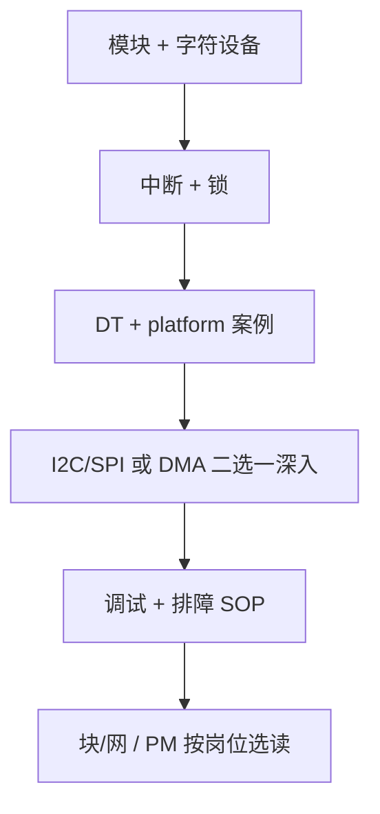

---
tags:
  - Linux
  - 驱动
  - 面试
title: Linux 内核驱动面试知识点速览
description: 嵌入式 Linux 驱动岗常见考点、口述提纲与站内延伸阅读
date: 2026/05/21
---

# Linux 内核驱动面试知识点速览

面向 **嵌入式 Linux 驱动 / BSP** 岗位面试：按「**几乎必问 → 常问 → 加分**」整理，每条尽量对应本站已有笔记，便于突击复习。

---

## 1. 读完能答什么

- 说清 **用户态 / 内核态 / 中断上下文** 各能用什么 API。
- 讲通 **字符设备 + platform + 设备树** 一条完整 bring-up 链。
- 应对 **中断、DMA、锁、电源、调试** 类追问题。
- 知道 **块设备 / 网络驱动** 与字符驱动的边界（不必全会写网卡驱动）。

---

## 2. 几乎必问（基础层）

### 2.1 内核与用户态

| 考点 | 要点 | 站内 |
|------|------|------|
| 系统调用路径 | 陷入内核、保存现场、分派、返回 | [[linux/内核机制/Linux系统调用：用户态陷入内核完整流程]] |
| 为何 `copy_from_user` | 用户指针不可信、缺页、安全 | [[linux/学习路径/嵌入式体系结构入门]] §MMU |
| 模块 vs 驱动 | 模块是加载机制；驱动是 `file_operations` + 总线模型 | [[linux/驱动与模块/Linux 内核模块开发实战]] |

**口述一句**：驱动跑在内核态，不能直接访问用户缓冲区，要通过 `copy_from_user` / `get_user` 等接口。

### 2.2 字符设备（char device）

| 考点 | 要点 | 站内 |
|------|------|------|
| `file_operations` | `open/read/write/ioctl/release`、`llseek` | [[linux/学习路径/字符设备驱动入门]] |
| 主设备号 / 次设备号 | `alloc_chrdev_region`、`cdev_add` | 同上 |
| `ioctl` 设计 | 命令编码、`_IO/_IOR/_IOW`、兼容 32/64 位 | 同上 |
| `mmap` | 何时映射 DMA buffer / 寄存器（谨慎） | [[linux/内核机制/如何通过虚拟地址查找物理地址]] |

**常考题**：`insmod` 之后发生了什么？→ 模块入口、符号解析、与正在运行的内核 **VERMAGIC** 匹配。

### 2.3 中断与下半部

| 考点 | 要点 | 站内 |
|------|------|------|
| 为何 ISR 不能睡眠 | 原子上下文、死锁、延迟 | [[linux/内核机制/为什么 ISR 不能睡眠]] |
| 硬中断 / 软中断 / workqueue | 谁能 `mutex`、谁能 `schedule` | [[linux/内核机制/Linux 中断机制详解]]、[[linux/学习路径/中断与下半部机制]] |
| `request_threaded_irq` | 上半部 ack、下半部可睡眠 | [[linux/学习路径/中断与下半部机制]] |
| 共享 IRQ | `IRQF_SHARED`、快速区分设备 | 中断详解 §4.1 |

**追问题**：中断嵌套？→ [[linux/内核机制/Linux 中断机制详解#7. 中断嵌套：深度专题]]

### 2.4 同步

| 考点 | 要点 | 站内 |
|------|------|------|
| spinlock vs mutex | 上下文、睡眠、持锁时间 | [[linux/内核机制/内核同步机制总览]] |
| `spin_lock_irqsave` | 与 ISR 共享数据 | 同上 |
| 优先级反转（PI） | RT 线程 + 互斥 | [[linux/内核机制/进程调度与绑核#优先级反转（priority inversion）与对策]] |

**陷阱题**：中断里用 `mutex`？→ **不行**；用 `spinlock_irqsave` 或改设计。

---

## 3. 嵌入式常问（平台层）

### 3.1 设备树（DT）与 platform

| 考点 | 要点 | 站内 |
|------|------|------|
| `compatible` 匹配 | `of_match_table` → `probe` | [[linux/学习路径/设备树实战指南]]、[[linux/驱动与模块/platform 驱动完整案例]] |
| `reg` / `interrupts` / `clocks` | 资源获取、`devm_*` 管理 | platform 案例 |
| `probe` / `remove` 顺序 | 分配 → 注册 → 反向释放 | platform 案例 |

**口述链**：DT 描述硬件 → 内核解析 → platform 驱动 `probe` 里 `platform_get_resource` / `devm_ioremap`。

### 3.2 总线驱动 I2C / SPI

| 考点 | 要点 | 站内 |
|------|------|------|
| 适配器 vs 设备驱动 | `i2c_client`、`spi_device` | [[linux/学习路径/I2C 与 SPI 驱动选学]] |
| 传输 API | `i2c_transfer`、`spi_sync` | 同上 |
| 与 GPIO 位bang 区别 | 控制器硬件 vs 软件模拟 | 同上 |

### 3.3 DMA 与 Cache

| 考点 | 要点 | 站内 |
|------|------|------|
| 为何用 `dma_map_*` | IOMMU、一致性、可移植 | [[linux/内核机制/DMA 与 Cache 一致性入门]] |
| 一致性 | CPU write → `dma_sync` for device | 同上 |
| `dma-coherent` | DT 属性、SoC 是否硬件一致 | 同上 |

**陷阱题**：`kmalloc` 物理地址直接给 DMA？→ **错**，走 DMA API。

### 3.4 电源管理

| 考点 | 要点 | 站内 |
|------|------|------|
| `runtime_pm` | 按需上电、引用计数 | [[linux/驱动与模块/Runtime PM 与休眠唤醒入门]] |
| 系统休眠 | `suspend` / `resume` 回调 | 同上 |

---

## 4. 中高级 / 追问（按岗位）

### 4.1 内存与调度（理解即可）

| 考点 | 要点 | 站内 |
|------|------|------|
| `kmalloc` vs `vmalloc` | 物理连续、高端映射 | [[linux/内核机制/kmalloc 与 vmalloc]] |
| CFS / 绑核 | 与中断亲和、DPDK 对照 | [[linux/内核机制/进程调度与绑核]] |
| OOM | 小内存板行为 | [[linux/内核机制/小内存板 OOM 行为]] |

### 4.2 块设备 / 网络（选型向）

| 考点 | 要点 | 站内 |
|------|------|------|
| 块 vs 字符 | 请求队列、`bio`、分区 | [[linux/驱动与模块/块设备与网络驱动选型指南]] |
| 网卡驱动边界 | NAPI、与内核协议栈 | [[linux/内核机制/Linux 内核网络栈与 DPDK 适用边界]] |

不必面试前写完整网驱，但要能 **说清数据路径**。

### 4.3 调试与排障

| 考点 | 要点 | 站内 |
|------|------|------|
| `dmesg` / `dynamic_debug` | 驱动日志 | [[linux/驱动与模块/sysfs 与 proc 调试接口]] |
| `sysfs` / `debugfs` | 用户态调参 | 同上 |
| 反汇编 / addr2line | 崩溃 PC 定位 | [[系统调试/反汇编在嵌入式问题定位中的应用：环境、工具与可读性]] |
| 排障 SOP | 日志 → perf → 汇编 | [[系统调试/排障 SOP：日志、perf 与反汇编]] |

**现场题**：驱动 probe 失败你怎么查？→ `dmesg`、DT `status`、时钟/电源、`compatible`、`-EPROBE_DEFER`。

---

## 5. 经典手写 / 口述题（无白板代码也要讲清思路）

1. **写一个最小字符设备需要哪些步骤？**  
   分配设备号 → `cdev_init` / `cdev_add` → 填 `file_operations` → `class_create` + `device_create`（可选 sysfs）。

2. **中断里收到数据后如何交给用户态？**  
   ISR 唤醒下半部 → 内核缓冲 → `read` 阻塞唤醒，或 `poll` / `epoll` + `kill_fasync` 异步通知。

3. **`insmod` 与 `modprobe` 区别？**  
   `modprobe` 解析依赖、`modules.dep`；`insmod` 单文件加载。

4. **如何减少驱动里的内存泄漏？**  
   优先 `devm_*`；`remove` 与 `probe` 对称；`kref` 管理对象生命周期。

5. **用户态 `open("/dev/xxx")` 到驱动哪个函数？**  
   `chrdev_open` → 你的 `fops->open`。

---

## 6. 按面试深度的复习顺序（建议 1～2 周）

与 [[成长路径/index]] **§六 驱动与模块**、**§五 内核机制** 清单一一对应。

---

## 7. 面试时不必深钻（除非 JD 写明）

- 完整 **TCP/IP 协议栈实现**（会用 [[linux/内核机制/Linux 内核网络栈与 DPDK 适用边界]] 讲边界即可）。
- **DPDK 数据面**（网驱岗可能问 NAPI，不必会 `rte_eth`）。
- **文件系统 ext4/UBI 实现细节**（存储岗另说）。

---

## 8. 自检清单（考前过一遍）

- [ ] 能画 **open → read → ioctl** 到驱动的调用链
- [ ] 能解释 **ISR / tasklet / workqueue / threaded IRQ** 选型
- [ ] 能口述 **probe 里获取 IRQ、IO 内存、clock** 的流程
- [ ] 能说明 **dma_map_single** 与 **cache sync** 时机
- [ ] 能举 **优先级反转** 例子与 PI 思路
- [ ] 能讲一次你 **用 dmesg + DT + 示波器/逻辑分析仪** 定位过的 bug（准备真实故事）

---

## 延伸阅读

- [[linux/驱动与模块/index]]
- [[linux/学习路径/index]]
- [[linux/概览/嵌入式Linux基础知识]]
- [[工程基础/嵌入式代码评审清单]] — 面试常问「常见坑」
