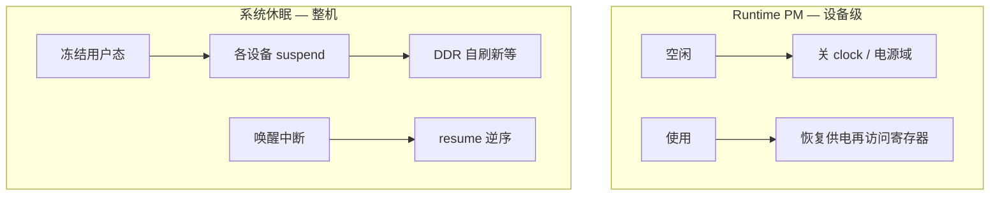

---
tags:
  - Linux
  - 驱动
  - 电源
  - PM
title: Runtime PM 与休眠唤醒入门
description: runtime_pm、系统休眠、唤醒源与驱动 suspend/resume 排障
date: 2026/05/16
---

# Runtime PM 与休眠唤醒入门

板子「待机电流高」或「`echo mem` 醒不过来」，多半落到 **运行时电源管理（Runtime PM）** 与 **系统休眠（system sleep）** 两条线。本文对应 [[成长路径/index|成长路径]] 中优先级：把 API、设备树唤醒源和排障顺序讲清，便于对照 [[platform 驱动完整案例]] 补全驱动。

---

## 1. 读完能带走什么

- 分清 **Runtime PM**（单设备空闲关电/关钟）与 **系统休眠**（整机进 mem/disk）。  
- 会在驱动里配对 `pm_runtime_get/put`，并实现 `runtime_suspend` / `runtime_resume`。  
- 知道唤醒源如何在 DT / `enable_irq_wake` 侧声明。  
- 有一套 `dmesg` / sysfs 排查「谁拒绝 suspend」的顺序。

---

## 2. 场景与问题

| 现象 | 可能原因 |
|------|----------|
| 空闲电流下不来 | 设备未 `runtime_put`、时钟未关、被别的消费者 `get` 住 |
| `echo mem` 失败 | 某驱动 `suspend` 返回错误；唤醒中断未配置 |
| 休眠后无法唤醒 | 无 `wakeup-source`、IRQ 未 `enable_irq_wake`、电源域切错 |



---

## 3. Runtime PM

目标：设备 **暂时不用** 时关掉 **时钟（clock）** / **电源域（power domain）**，用时再开，降低漏电与动态功耗。

```c
pm_runtime_enable(&pdev->dev);
pm_runtime_get_sync(&pdev->dev);  /* 使用前：同步 resume */
/* 访问 MMIO / 启动传输 */
pm_runtime_put(&pdev->dev);       /* 用完：允许 idle 后 suspend */
```

驱动需实现 **`runtime_suspend` / `runtime_resume`**（经 `dev_pm_ops`）：

| 回调 | 典型工作 |
|------|----------|
| `runtime_suspend` | 停 DMA、关中断、`clk_disable_unprepare`、掉电 |
| `runtime_resume` | 上电、开钟、恢复寄存器上下文 |

**权衡**：`get_sync` 路径有延迟；热路径可考虑 `pm_runtime_get` 异步 + 状态机，但正确性更难。优先保证 **get/put 配对**，避免泄漏引用计数。

推荐使用 **`pm_runtime_*` + `devm_`** 管理的资源；探测失败路径记得 `pm_runtime_disable`。

---

## 4. 系统休眠（system sleep）

| 状态 | 说明 | 嵌入式常见度 |
|------|------|----------------|
| **freeze** | 冻结用户进程，设备可浅睡 | 调试、部分 RT |
| **mem** | Suspend-to-RAM | 最常见 |
| **disk** | Suspend-to-disk / hibernate | 需交换分区，板端少 |

驱动通过同一套 `dev_pm_ops` 提供 **`suspend` / `resume`**，以及更细的 `suspend_late` / `suspend_noirq` 等（中断关闭后的阶段）。顺序由内核 PM 核心按依赖排序；**resume 大致逆序**。

与 Runtime PM 关系：系统休眠时，内核会协调设备进入 suspend；实现上常复用「关设备」逻辑，但 **系统休眠还可以关掉更多总线/CPU 热插拔路径**，不要假定「只会走 runtime_*」。

---

## 5. 唤醒源与设备树

用户按键、RTC alarm、网口 WoL、GPIO 等可作为 **wakeup source（唤醒源）**：

```dts
/* 示意：具体 binding 以文档为准 */
gpio-keys {
    compatible = "gpio-keys";
    power {
        gpios = <&gpio0 5 GPIO_ACTIVE_LOW>;
        linux,code = <KEY_POWER>;
        wakeup-source;
    };
};
```

驱动侧常见：

```c
enable_irq_wake(irq);   /* 允许该 IRQ 把系统从 sleep 拉起 */
```

未声明唤醒源时：系统能睡，但 **只能靠非预期复位**「醒」——产品上等于失败。

---

## 6. 调试命令

```bash
# 支持的休眠状态
cat /sys/power/state

# 尝试 mem（需 root；确认硬件与调试器连接策略）
echo mem > /sys/power/state

# Runtime PM 状态（路径因设备而异）
grep -R . /sys/devices/.../power/ 2>/dev/null | head
```

失败时：

1. `dmesg` 搜 `suspend` / `failed` / 设备名——**哪个驱动返回了错误**。  
2. 临时 `echo 0 > /sys/module/...` 或卸载可疑模块对比。  
3. 确认唤醒 IRQ：`/proc/interrupts`、`cat /sys/kernel/debug/wakeup_sources`（若开启 debugfs）。

串口在深度休眠时可能关掉：排障期保留 **始终供电的 debug UART** 或依赖 RTC 日志缓冲。

---

## 7. 检查清单

- [ ] 每个 `pm_runtime_get*` 都有对应 `put`，错误路径不泄漏  
- [ ] `runtime_suspend` 里不访问已关电的寄存器  
- [ ] 产品按键 / RTC 已标 `wakeup-source` 并 `enable_irq_wake`  
- [ ] 量产镜像测过「睡得着、醒得来、电流达标」  

---

## 8. 延伸阅读

- [[linux/驱动与模块/platform 驱动完整案例]]  
- [[linux/学习路径/设备树实战指南]]  
- [[linux/内核机制/Clock 与 Pinctrl 子系统]]  
- 内核文档：`Documentation/driver-api/pm/`、`Documentation/power/`
