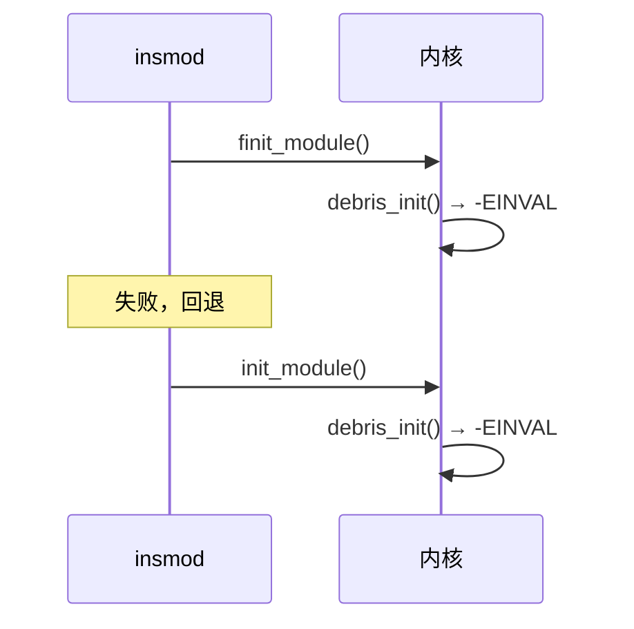

# 1 2026-05-31 — 创建字符设备文件

板级验证：加载 `debris.ko`、生成 `/dev/debris_kernel`，并通过 proc/debugfs 读统计。**dynamic debug（动态调试）** 在本篇 §4 记录现场命令；机制与面试要点见 [[sysfs 与 proc 调试接口#Dynamic Debug（dynamic_debug）]]。

---

## 1.1 目标

- 编译并加载 ko，生成字符设备节点
- 验证 read/write、`/proc/debris`、`/sys/kernel/debug/debris/stats`
- 掌握 **运行期** 开关 `pr_debug` 日志（无需重编 ko）

---

## 1.2 环境快照

| 项 | 值 |
|----|-----|
| 板卡 | Milk-V Duo |
| 内核 | （见 [[2026-05-30 — 环境搭建]]） |
| 模块 | `debris.ko`（字符设备 + proc + debugfs） |

---

## 1.3 编译与基本功能

传入正确参数，插拔 ko，读写 `/dev/debris_kernel` 正常：

```shell
# 设置免密登录
ssh-copy-id root@192.168.42.1

[root@milkv-duo]~# insmod debris.ko buf_size=256
[root@milkv-duo]~# dmesg | grep debris
[ 6501.557744] debris: proc/debugfs initialized successfully
[ 6501.557762] debris: loaded successfully, major=240 buf_size=256
[root@milkv-duo]~# echo "hello debris" > /dev/debris_kernel
[root@milkv-duo]~# cat /dev/debris_kernel
hello debris
[root@milkv-duo]~# ls /dev/ | grep debris
debris_kernel
[root@milkv-duo]~# cat /proc/debris
read_count  : 1
write_count : 1
data_len    : 13
buf_size    : 256
[root@milkv-duo]~# cat /sys/kernel/debug/debris/stats
=== debris debug stats ===
read_count  : 1
write_count : 1
data_len    : 13 / 256 bytes
[root@milkv-duo]~# rmmod debris
[root@milkv-duo]~# cat /proc/debris
cat: /proc/debris: No such file or directory
```

`rmmod` 后 proc/debugfs 节点消失，说明卸载路径清理正确。

---

## 1.4 Dynamic Debug 实践（本篇重点）

### 1.4.1 现场命令

默认 `pr_debug()` **不输出**；通过 debugfs **按文件/函数/模块** 打开，**无需重新编译**：

```shell
# 开启 debris_fops.c 内所有 pr_debug
echo 'file debris_fops.c +p' > /sys/kernel/debug/dynamic_debug/control

cat /dev/debris_kernel    # dmesg 可见 debris: open / release 等

# 关闭
echo 'file debris_fops.c -p' > /sys/kernel/debug/dynamic_debug/control

# 查看当前开关状态（=p 开，=_ 关）
cat /sys/kernel/debug/dynamic_debug/control | grep debris
```

| 过滤示例 | 含义 |
|----------|------|
| `file debris_fops.c +p` | 该源文件内所有调试点 |
| `func debris_read +p` | 单个函数 |
| `module debris +p` | 整个模块 |
| `line 40-60 +p` | 行号范围 |

**前提**：板子内核 `CONFIG_DYNAMIC_DEBUG=y` 且 debugfs 已挂载（`/sys/kernel/debug` 存在）。验证：

```shell
zcat /proc/config.gz 2>/dev/null | grep DYNAMIC_DEBUG
# 或
grep DYNAMIC_DEBUG /boot/config-$(uname -r) 2>/dev/null
```

机制说明、与 `#ifdef DEBUG` 对比、release 内核限制 → [[sysfs 与 proc 调试接口#Dynamic Debug（dynamic_debug）]]。

### 1.4.2 驱动里应写什么

高频路径用 `pr_debug()` / `dev_dbg()`，**不要** 用裸 `printk` 刷屏；出问题时在板子上 `echo ... +p` 即可。与 [[Linux 内核模块开发实战]]、[[sysfs 与 proc 调试接口]] 一致。

---

## 1.5 踩坑：非法参数时 dmesg 打印两次

```shell
[root@milkv-duo]~# insmod debris.ko buf_size=8192
insmod: can't insert 'debris.ko': Invalid argument
[root@milkv-duo]~# dmesg | grep debris | tail -3
[ 6819.365867] debris: buf_size must be between 1~4096
[ 6819.400650] debris: buf_size must be between 1~4096
```

**原因**：BusyBox `insmod` 的两阶段加载，与驱动逻辑无关：



`module_init` 因此执行 **两次**，各打一条日志。用 **kmod insmod**（完整 util-linux）通常只走一条路径。

---


phase 1 完结：
![[Pasted image 20260603020216.png]]

## 1.6 结论与下一步

- **结果**：字符设备、proc/debugfs、module 参数校验均 OK；dynamic debug 可在板子上按文件开关 `pr_debug`。
- **下一步**：设备树 + platform 匹配，或把 `dev_dbg()` 与 `device` 绑定（见 [[设备树实战指南]]）。

---

## 1.7 参考

- [[riscv-驱动开发日志/index]]
- [[2026-05-30 — 环境搭建]]
- [[sysfs 与 proc 调试接口#Dynamic Debug（dynamic_debug）]]
- [[linux/学习路径/字符设备驱动入门]]
