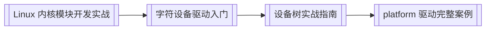

# RISC-V 驱动开发日志

本目录用于记录在 **RISC-V 开发板** 上做 **Linux 内核驱动** 的 **开发日志**（环境搭建、模块加载、设备树、调试过程、结论）。与 [[linux/驱动与模块/index|驱动与模块]] 里的 **教程型长文** 分开：这里允许 **按日期碎片化** 记录，便于复盘。

---

## 1. 板卡与环境（请自行补全）

在首篇日志或 [[日志模板]] 里填写，后文可引用「见 000 篇」。

| 项 | 你的记录 |
|----|----------|
| **开发板 / SoC** | （例：某某 K210 / VisionFive / 自研板） |
| **内核版本** | `uname -r` / 厂商 BSP 分支 |
| **工具链 triplet** | 例：`riscv64-linux-gnu-` |
| **根文件系统** | Buildroot / 厂商镜像 / NFS 挂载 |
| **串口** | 波特率、设备节点 |
| **源码树** | 内核 `ARCH=riscv` 路径、是否 out-of-tree 模块 |

---

## 2. 日志怎么写

### 2.1 文件命名

| 形式 | 示例 |
|------|------|
| **日期 + 主题**（推荐） | `2026-05-21-字符设备-hello.md` |
| **序号 + 主题** | `001-环境搭建.md` |

复制 [[日志模板]] 新建文件，写完后在下方 **日志列表** 加一行链接。

### 2.2 建议每篇包含

- **目标**：今天要验证什么（如 `insmod` 成功、`/dev/xxx` 可读写）。  
- **步骤**：命令、改动的文件路径（内核树内相对路径即可）。  
- **现象**：`dmesg` 片段、报错原文。  
- **结论**：成功 / 失败原因 / 下一步。

不必写成教程；踩坑原文比 polished  prose 更有用。

---

## 3. 日志列表

（有新篇后在此追加 wikilink，按时间 **倒序** 或 **正序** 自选一种并保持一致。）

| 日期 | 日志 |
|------|------|
| — | *尚无条目；从 [[日志模板]] 复制第一篇* |

---

## 4. 学习主线（教程，非本目录）

写驱动前可按需复习站内长文：

| 主题 | 文章 |
|------|------|
| 模块与 sysfs | [[Linux 内核模块开发实战]] |
| 字符设备 | [[linux/学习路径/字符设备驱动入门]] |
| 设备树（DT） | [[linux/学习路径/设备树实战指南]] |
| platform 总线 | [[platform 驱动完整案例]] |
| 调试接口 | [[sysfs 与 proc 调试接口]] |
| 交叉编译 | [[linux/学习路径/应用交叉编译实战指南]]、[[linux/平台与构建/嵌入式场景下的交叉编译]] |
| RISC-V 体系 | [[linux/学习路径/嵌入式体系结构入门]] |
| 面试复习 | [[Linux 内核驱动面试知识点速览]] |

**RISC-V 注意点**（写日志时可对照）：

- 系统调用 / 模块 ABI 随 **riscv** 调用约定，与 ARM64 寄存器分配不同。  
- 设备树：`arch/riscv/boot/dts/` 或厂商 BSP 下的 `.dts` / `.dtsi`。  
- 模块编译：`make ARCH=riscv CROSS_COMPILE=riscv64-linux-gnu- M=$PWD modules`（路径以你内核树为准）。

---

## 5. 与成长路径

实战记录进度可在 [[成长路径/index#六、嵌入式 Linux · 驱动与模块]] 勾选；专题教程仍写在 `linux/驱动与模块/` 或 `linux/学习路径/`。

---

*本页仅索引；正文写在同目录下各篇日志中。*
