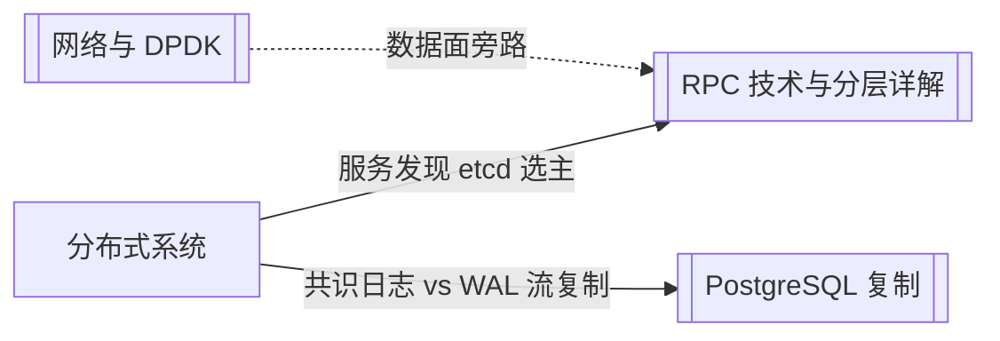

# 分布式系统

面向 **多节点协作** 的笔记：选主、复制日志、一致性边界。与 [[网络与DPDK/index|网络与 DPDK]]（报文与吞吐）、[[数据库/index|数据库]]（具体产品的 WAL/复制）区分——本目录讲 **抽象机制** 与工程落地（etcd、Raft 等）。

---

## 子目录

| 目录 | 说明 |
|------|------|
| [[分布式系统/共识算法/index|共识算法]] | Paxos、Raft、Quorum、与复制/WAL 的边界 |

---

## 与站内其他模块的关系

| 模块 | 分工 |
|------|------|
| **网络与 DPDK** | Socket、TCP、DPDK 数据路径 |
| **RPC 实践** | 调用分层、序列化、传输；元数据常依赖共识组件 |
| **数据库** | 单库复制、选型、嵌入式存储 |
| **本目录** | 多数派如何对 **同一份有序日志** 达成一致 |

---

## 学习入口

- 路线图与待补清单：[[成长路径/index#十一·五、分布式系统]]
- 共识专题索引：[[分布式系统/共识算法/index]]
