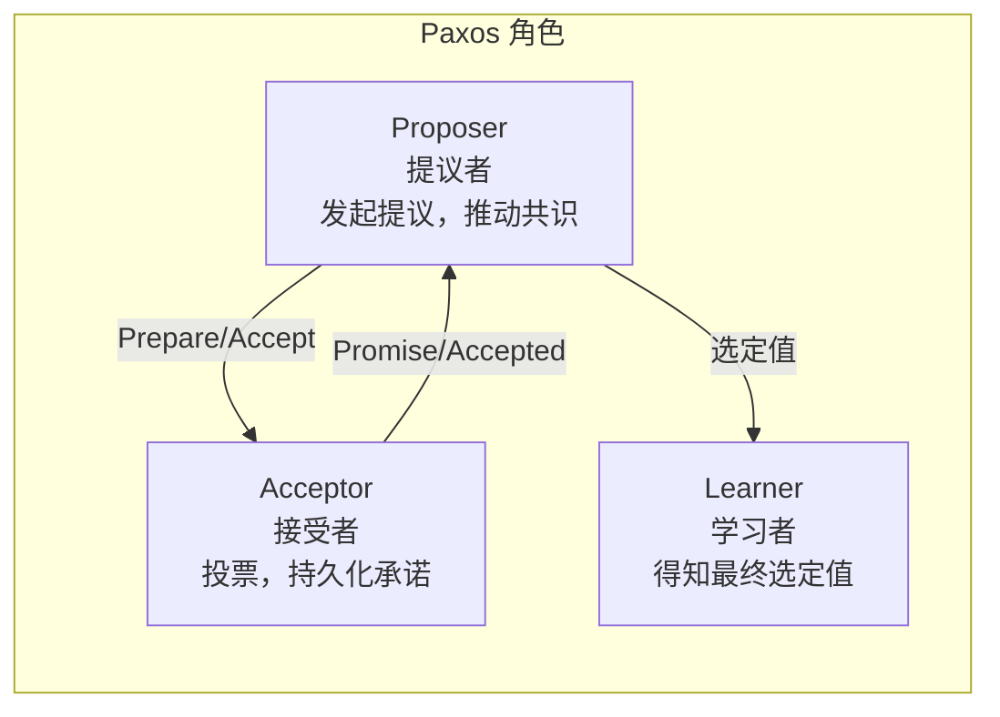
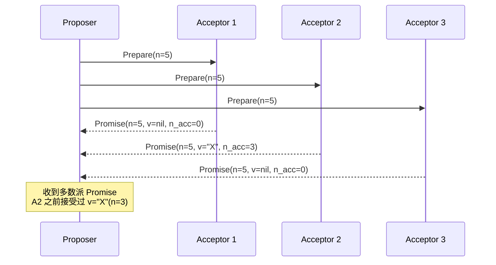
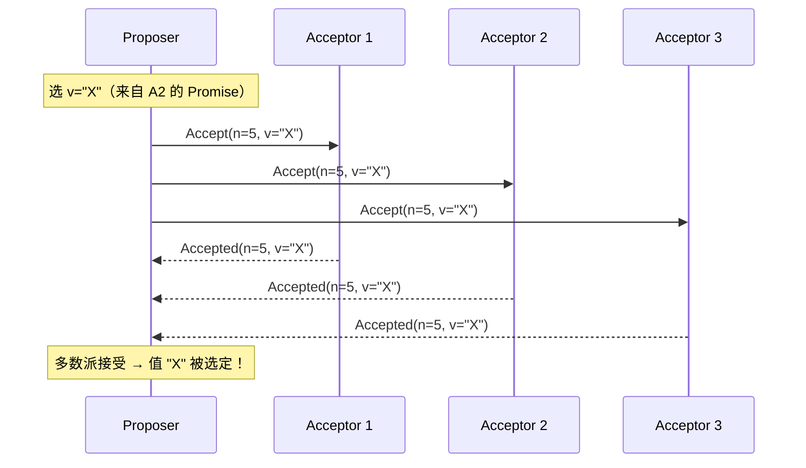

---
tags:
  - 分布式
  - 共识
  - Paxos
title: Paxos 与 Multi-Paxos 速览
description: 两阶段协议、角色分工、Multi-Paxos 优化与工程意义
date: 2026/06/02
---

# Paxos 与 Multi-Paxos 速览

Paxos 是分布式共识领域的「鼻祖」算法，1989 年由 Leslie Lamport 提出。它以**理论严谨**著称，但以**难以理解和工程化**著名——Lamport 自己也在论文中调侃过这一点。

本篇目标：建立 Paxos 的**直觉模型**，理解它解决了什么、代价是什么，以及 Multi-Paxos 如何让它能用于实际系统。

---

## 1. Paxos 解决什么问题

**共识问题**：$N$ 个节点，每个节点有自己的初始提议值，最终需要就**同一个值**达成一致，且这个值必须是**某个节点真正提议过的**。

形式化要求：
- **安全性（Safety）**：不会同时有两个节点认为不同的值被选定（不会分裂）
- **活性（Liveness）**：在网络可以工作的情况下，最终总能选定某个值（不会卡死）
- **容错**：$N$ 个节点中最多 $\lfloor (N-1)/2 \rfloor$ 个节点宕机时，协议仍能继续

---

## 2. 角色与基本概念

Paxos 把节点分成三种角色（一个节点可同时扮演多个角色）：



| 角色 | 职责 |
|------|------|
| **Proposer** | 选一个提案编号，向多数派 Acceptor 发消息，推动某个值被选定 |
| **Acceptor** | 收到提案后决定是否承诺/接受，必须持久化承诺（崩溃恢复后仍有效） |
| **Learner** | 一旦某个值被多数派接受，通知 Learner 得知结果 |

**提案编号 $n$**（Proposal Number）：全局唯一的递增数字，用于区分新旧提案，解决并发冲突。通常用 `(轮次, 节点ID)` 组合保证唯一。

---

## 3. 基础 Paxos：两个阶段

### 阶段一：Prepare（准备阶段）

**Proposer 做的事：**

1. 选一个提案编号 $n$（比自己见过的所有编号都大）
2. 向**多数派**（Quorum，超过半数）Acceptor 发送 `Prepare(n)`

**Acceptor 收到 `Prepare(n)` 后：**

- 如果 $n$ 大于自己见过的最大编号：
  - **承诺**：不再接受编号 $< n$ 的提案
  - 回复 `Promise(n, v_accepted, n_accepted)`，其中 `v_accepted` 是自己之前接受过的值（若有）
- 否则：忽略或拒绝



### 阶段二：Accept（接受阶段）

**Proposer 收到多数派 Promise 后：**

- 如果所有 Promise 中 `v_accepted` 都为空：Proposer 可以**自由选择**提议值（用自己的初始值）
- 如果有非空 `v_accepted`：必须使用**编号最大的那个**已接受值（保证安全性的关键！）

然后向多数派发送 `Accept(n, v)`

**Acceptor 收到 `Accept(n, v)` 后：**

- 如果 $n \geq$ 自己承诺的最小编号：接受这个值，回复 `Accepted(n, v)`
- 否则：拒绝



---

## 4. 为什么必须用已有的最大编号值（安全性证明直觉）

这是 Paxos 最难理解的一点。

**假设**：Acceptor A2 已经在轮次 3 接受了值 `"X"`，说明在轮次 3 时已有多数派可能接受了 `"X"`。  
**如果** Proposer 在轮次 5 不沿用 `"X"` 而是用新值 `"Y"`，就可能出现：轮次 3 和轮次 5 各自有多数派认为自己的值被选定——**违反安全性**（两个不同的值都被选定）。

**关键规则**：一旦某个值在某个 Quorum 里有被接受的迹象，后续任何提案只能延续它。

---

## 5. 活锁问题

两个 Proposer 互相抢编号，都无法完成：

```text
P1 发 Prepare(n=1) → A1,A2,A3 承诺
P2 发 Prepare(n=2) → A1,A2,A3 承诺（撤销对n=1的承诺）
P1 发 Accept(n=1)  → 被拒绝（Acceptor 已承诺n=2）
P1 发 Prepare(n=3) → A1,A2,A3 承诺（撤销对n=2的承诺）
P2 发 Accept(n=2)  → 被拒绝
... 无限循环
```

**工程解法**：限制同时只有一个 Proposer（**Leader 选举**），或加随机退避延迟。这正是 Multi-Paxos 的动机之一。

---

## 6. Multi-Paxos：让 Paxos 实用

基础 Paxos 每次只能就**一个值**达成共识，而实际系统需要对**一系列命令**（日志条目）依次达成共识——这就是 **Multi-Paxos**。

### 6.1 核心优化：稳定 Leader

选出一个稳定的 **Leader（主 Proposer）**：

- Leader 在第一次成功后，**缓存提案编号**，后续不再需要 Prepare 阶段
- 直接进入 Accept 阶段，**每条日志只需一轮消息**（而不是两轮）

```text
基础 Paxos：每个值都需要 2 轮（Prepare + Accept）
Multi-Paxos：Leader 稳定时，每个值只需 1 轮（直接 Accept）
```

### 6.2 日志复制模型

```mermaid
flowchart TB
  subgraph leader["Leader（稳定 Proposer）"]
    CMD[客户端命令: cmd1, cmd2, cmd3...]
    LOG_L[本地日志: [cmd1][cmd2][cmd3]...]
  end
  subgraph followers["Followers（Acceptors）"]
    LOG_F1[副本1: [cmd1][cmd2][cmd3]...]
    LOG_F2[副本2: [cmd1][cmd2]...]
  end
  CMD --> LOG_L
  LOG_L -->|Accept 复制| LOG_F1
  LOG_L -->|Accept 复制| LOG_F2
  Note["多数派 Accepted → 提交"]
```

每个日志**槽位（slot）** 单独运行一次 Paxos 实例，各槽位独立但共用一个 Leader。

### 6.3 Multi-Paxos 与 Raft 的关系

| 维度 | Multi-Paxos | Raft |
|------|-------------|------|
| 核心思想 | 相同（Leader + 复制日志 + 多数派提交） | 相同 |
| Leader 选举 | 协议本身未完全规定（需要工程补充） | **明确规定**（任期+投票） |
| 日志一致性 | 允许日志有"空洞"，复杂 | 日志严格顺序，简单 |
| 工程实现 | 灵活但有歧义，难以独立实现 | **设计目标就是易于工程化** |
| 代表系统 | Chubby（Google），早期 ZooKeeper | etcd、TiKV、CockroachDB |

> Raft 的论文标题就叫 *"In Search of an Understandable Consensus Algorithm"*——就是针对 Paxos 难理解而设计的。

---

## 7. Paxos 的工程难点

Lamport 的论文只描述了**单值共识**，工程上要用还需要解决很多问题（论文没有说）：

| 问题 | 需要额外设计 |
|------|--------------|
| **Leader 选举** | 谁来当 Proposer，怎么检测 Leader 宕机 |
| **日志压缩** | 日志无限增长，需要快照（Snapshot） |
| **成员变更** | 增减节点时如何保持安全性 |
| **持久化** | Acceptor 的承诺必须写盘，崩溃后恢复 |
| **多值序列** | 单值 Paxos → Multi-Paxos 的细节 |

这些问题催生了 Raft 的诞生——Raft 在设计时就明确规定了这些细节。

---

## 8. 直觉记忆（30 秒版）

> Paxos 分两阶段：**Prepare**（拿到多数派承诺）→ **Accept**（推动多数派接受某值）。  
> 关键约束：如果有节点已接受过某值，后续提案必须沿用**编号最大的已接受值**，确保不会选出两个不同的值。  
> Multi-Paxos 加了稳定 Leader 优化，省掉 Prepare 阶段，是实用系统的基础。

---

## 延伸阅读

- [[分布式系统/共识算法/Raft 原理与工程实现]]（更工程化的版本）
- [[分布式系统/共识算法/分布式共识算法概览]]（CAP、Quorum 入门）
- [[分布式系统/共识算法/etcd 与 Raft 案例]]（实际系统）
- Lamport 原论文：*Paxos Made Simple*（2001，比 1989 版更易读）
