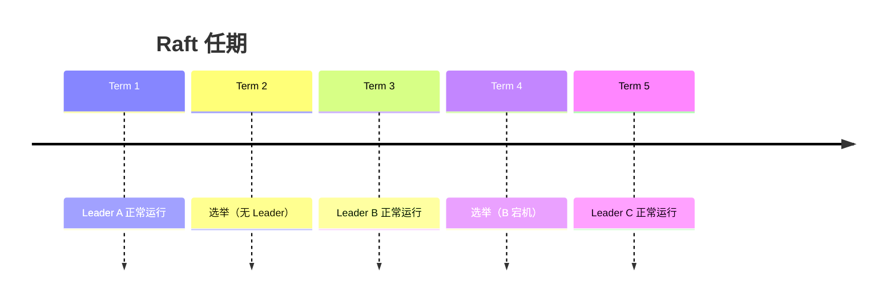
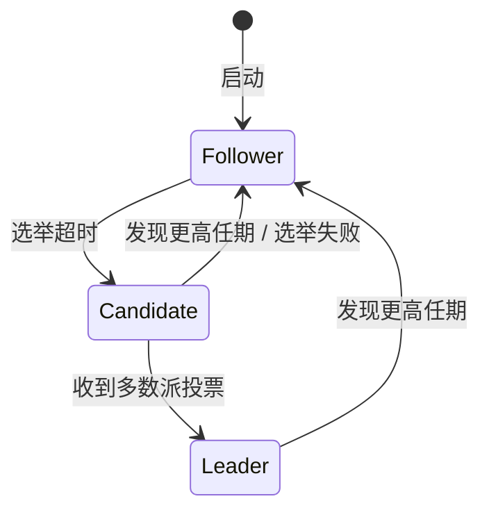
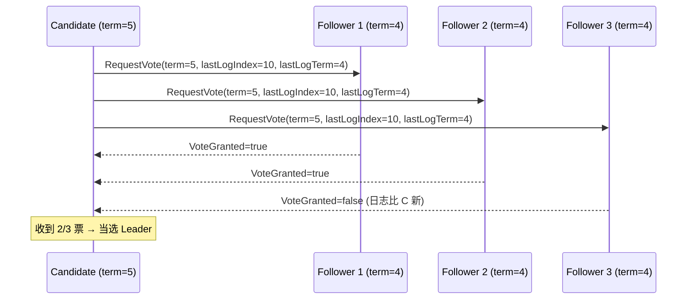
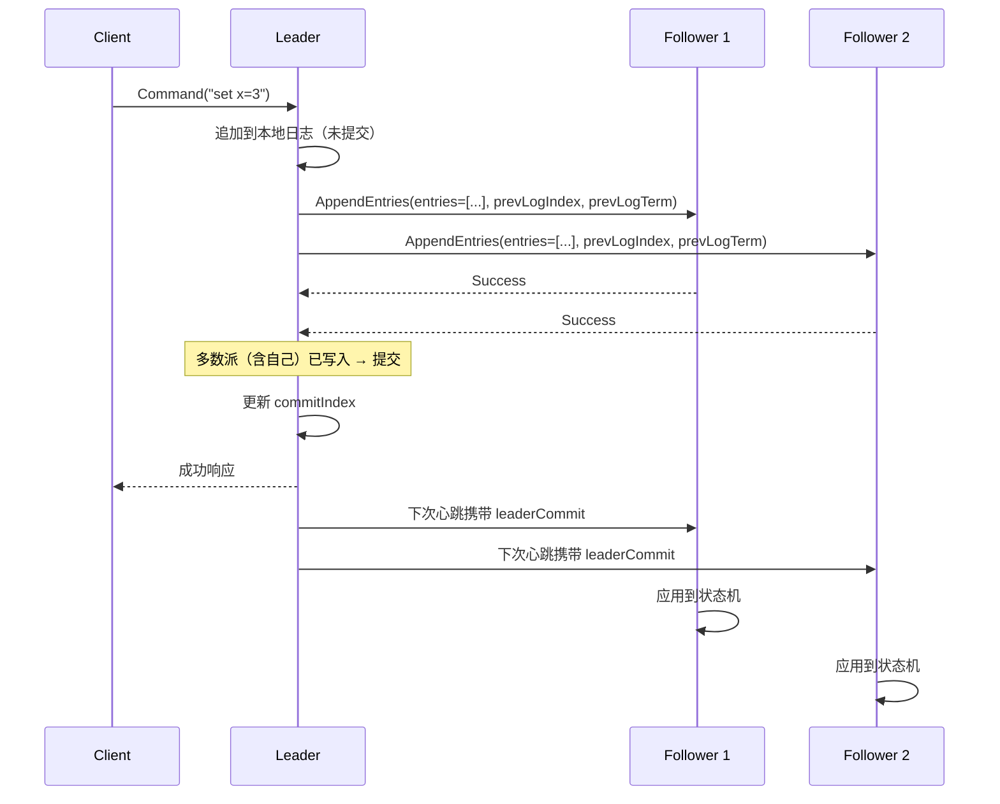

---
tags:
  - 分布式
  - 共识
  - Raft
title: Raft 原理与工程实现
description: 选举、日志复制、提交规则、快照与成员变更；对照 etcd 的工程细节
date: 2026/06/02
---

# Raft 原理与工程实现

Raft 是 2014 年 Diego Ongaro 等人在 *"In Search of an Understandable Consensus Algorithm"* 中提出的共识算法。它的核心设计目标就一个字：**易懂**——通过明确定义每个子问题（选举、日志、快照、成员变更），让工程实现有清晰的规范可循。

---

## 1. 核心概念：任期（Term）

Raft 把时间划分成连续的**任期（Term）**，每个任期从一次选举开始：



- 每个节点维护**当前任期号**（单调递增）
- 任期号是 Raft 中的逻辑时钟——收到更高任期的消息时，立刻更新自己的任期，降级为 Follower
- 任期号可以跳跃（选举失败时），不必连续

---

## 2. 三种角色



| 角色 | 职责 | 数量 |
|------|------|------|
| **Leader** | 接收所有客户端请求，管理日志复制 | 同一时刻最多 1 个 |
| **Follower** | 被动响应 Leader 和 Candidate 的消息 | 多数 |
| **Candidate** | 发起选举，竞争成为 Leader | 过渡状态 |

---

## 3. Leader 选举

### 3.1 触发条件

Follower 在**选举超时（election timeout）**内没有收到 Leader 的心跳，就认为 Leader 已宕机，发起选举：

1. 将自己的任期号 +1，转变为 Candidate
2. 给自己投票
3. 向所有节点发送 `RequestVote` 请求

### 3.2 投票规则（关键！）

节点 B 会投票给 Candidate A，**当且仅当**：
1. A 的任期号 ≥ B 的当前任期号
2. B 在本任期内还没有投过票（每个任期只能投一票）
3. **A 的日志至少和 B 一样新**（这一条保证了已提交的日志不会丢失）

**"日志至少一样新"** 的判断规则：
- 比较最后一条日志的任期号，任期号更大的更新
- 任期号相同时，日志更长的更新



### 3.3 随机超时防止平票

所有 Follower 的选举超时时间**随机化**（如 150~300ms），确保不会同时发起选举，避免所有节点都获得同等票数无法选出 Leader。

---

## 4. 日志复制

### 4.1 日志结构

每条日志条目（Log Entry）包含：
- **Index**：在日志中的位置（从 1 开始）
- **Term**：写入这条日志时的任期号
- **Command**：状态机命令（如 `set x = 3`）

```text
Index:  1    2    3    4    5    6
Term:  [1]  [1]  [2]  [2]  [3]  [3]
Cmd:   [A]  [B]  [C]  [D]  [E]  [F]
                           ↑
                      commit index（已提交到这里）
```

### 4.2 复制流程



**关键**：Leader 在**多数派写入后**才提交（回复客户端），但 Follower 的提交是异步的（通过心跳中的 `leaderCommit` 更新）。

### 4.3 日志一致性保证：AppendEntries 一致性检查

每次 `AppendEntries` 都会携带 `(prevLogIndex, prevLogTerm)`——紧接在新条目之前的那条日志的 Index 和 Term。

Follower 在接受新条目前，**检查自己在 `prevLogIndex` 处的日志 Term 是否等于 `prevLogTerm`**：
- 匹配 → 接受
- 不匹配 → 拒绝，Leader 回退 `nextIndex` 再重试

这个检查保证了：**如果两个日志在某个位置的 (Index, Term) 相同，则之前的所有条目也完全相同。**（数学归纳法可证）

---

## 5. 提交规则：为什么不能提交旧任期的日志

这是 Raft 中最反直觉的规则，也是面试中最常考的点。

**规则**：Leader 只能通过**提交当前任期的日志**来间接提交旧任期的日志，不能直接提交旧任期的条目（即使已经被多数派复制）。

**为什么？** 看这个反例：

```text
时间 t1：
  Leader S1 (term=2): log=[1,1,2]   ← 已复制到 S1,S2（多数派）
  S2 (term=2):        log=[1,1,2]
  S3 (term=1):        log=[1]
  S4 (term=1):        log=[1]
  S5 (term=2):        log=[1,1]

时间 t2：S1 宕机，S5 成为 term=3 的 Leader
  S5 开始复制 log=[1,1,3]（term=3 的新日志）
  覆盖 S2 的 log[2]（term=2 的旧日志）
  
→ 如果 t1 时就把 term=2 的 log[2] 标记为已提交，t2 就会丢失已提交的数据！
```

**正确做法**：S1 必须在 term=2 里再写一条新日志（即使是 no-op），通过提交这条 term=2 的新日志，才能安全地提交之前的旧条目。

---

## 6. 日志压缩：快照（Snapshot）

日志会无限增长，需要**快照**机制定期压缩：

```text
快照前：
  log: [1][2][3][4][5][6][7][8][9][10]
       ← 已应用 ─────────────────────→

快照后：
  snapshot: {x=3, y=7} (包含 index=1~8 的结果)
  log: [9][10]
```

快照包含：
- `lastIncludedIndex`：快照覆盖到的最后一条日志 Index
- `lastIncludedTerm`：对应的 Term
- 状态机的完整状态

当 Leader 的 Follower 落后太多时，直接发送 `InstallSnapshot` RPC 而不是逐条补日志。

---

## 7. 成员变更

动态增减节点是生产系统的刚需，但直接切换配置会引起"脑裂"：

```text
旧配置：{S1, S2, S3}，多数派 = 2
新配置：{S1, S2, S3, S4, S5}，多数派 = 3

如果切换不原子：S1+S2 可能用旧配置选出 Leader，S3+S4+S5 也能用新配置选出 Leader
→ 两个 Leader 同时存在！
```

**联合共识（Joint Consensus）**：Raft 的解法，引入一个过渡配置 $C_{old,new}$，要求在此期间所有决策都需要旧配置和新配置**各自多数派同时同意**。

现代实现（如 etcd）用更简单的**单步成员变更**：每次只增减一个节点，可以证明不会产生两个合法多数派。

---

## 8. 工程实现要点

### 8.1 持久化状态

必须在回复 RPC 之前写盘（崩溃后恢复）：

| 必须持久化 | 原因 |
|------------|------|
| `currentTerm` | 防止以旧 term 重新投票 |
| `votedFor` | 防止同一 term 投两次票 |
| `log[]` | 已接受的日志条目 |

**不需要**持久化：`commitIndex`、`lastApplied`（可从日志重建）

### 8.2 幂等性与线性一致性

- 客户端命令可能因 Leader 宕机而重发 → 需要**客户端 ID + 请求序列号**去重
- 只读请求要注意：不能直接读本地状态（可能是旧 Leader）→ 需要 **ReadIndex** 或 **LeaseRead** 机制

### 8.3 典型参数（参考 etcd）

| 参数 | 典型值 | 说明 |
|------|--------|------|
| 心跳间隔 | 100ms | Leader 发心跳频率 |
| 选举超时 | 150~300ms（随机） | Follower 等待心跳的超时 |
| 提议超时 | 5s | 客户端写操作超时 |

经验法则：选举超时 ≈ 心跳间隔 × 10，给网络抖动留余量。

---

## 9. Raft 面试常见题速答

| 问题 | 要点 |
|------|------|
| Raft 为何分 Leader/Follower/Candidate？ | 简化问题：所有写操作走 Leader，避免多 Proposer 冲突 |
| 为什么需要随机选举超时？ | 避免所有节点同时发起选举导致平票 |
| 如何保证日志不丢？ | 投票时检查日志新旧，只有日志最新的才能当 Leader |
| 什么是 commitIndex？ | 已在多数派写入并可安全应用的最大日志 Index |
| 为什么不能提交旧任期日志？ | 可能被新 Leader 覆盖，间接提交才安全 |
| 网络分区后，少数派能提供读服务吗？ | 默认不能（可能读到旧数据）；需要 ReadIndex 保证线性一致 |
| 3 节点能容忍几个宕机？ | 1 个（需要 2/3 多数派） |
| 5 节点能容忍几个宕机？ | 2 个（需要 3/5 多数派） |

---

## 10. 与 Paxos 的一句话对比

> Raft 和 Multi-Paxos 的核心机制**高度相似**（Leader + 复制日志 + 多数派提交）。最大区别在于 Raft 把所有细节（选举规则、日志一致性、成员变更）都明确规定，使得工程实现有规范可循，而 Multi-Paxos 留了太多"自由发挥"空间。

---

## 延伸阅读

- [[分布式系统/共识算法/Paxos 与 Multi-Paxos 速览]]
- [[分布式系统/共识算法/etcd 与 Raft 案例]]（Raft 的工业级实现）
- [[分布式系统/共识算法/共识与复制边界]]
- Raft 原论文：*In Search of an Understandable Consensus Algorithm*（2014）
- [Raft 可视化动画](https://raft.github.io)（强烈推荐，直观理解选举和日志复制）
