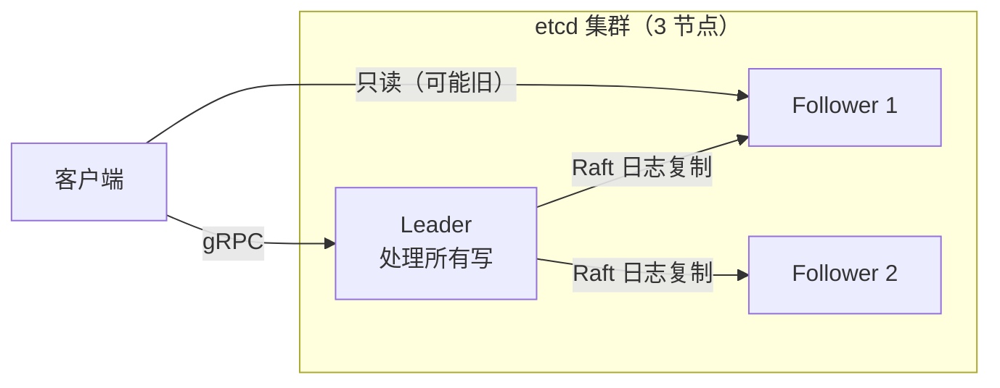
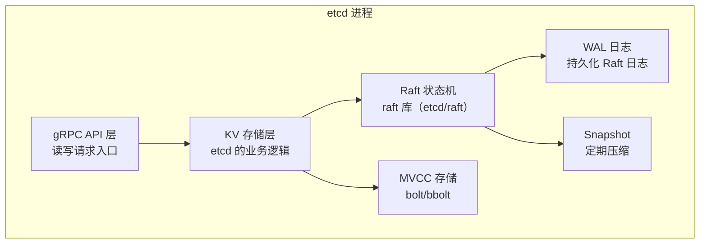
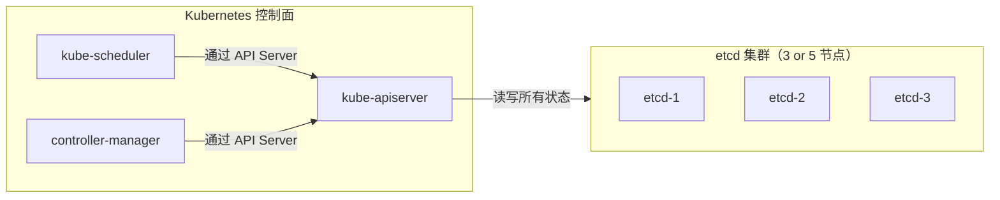
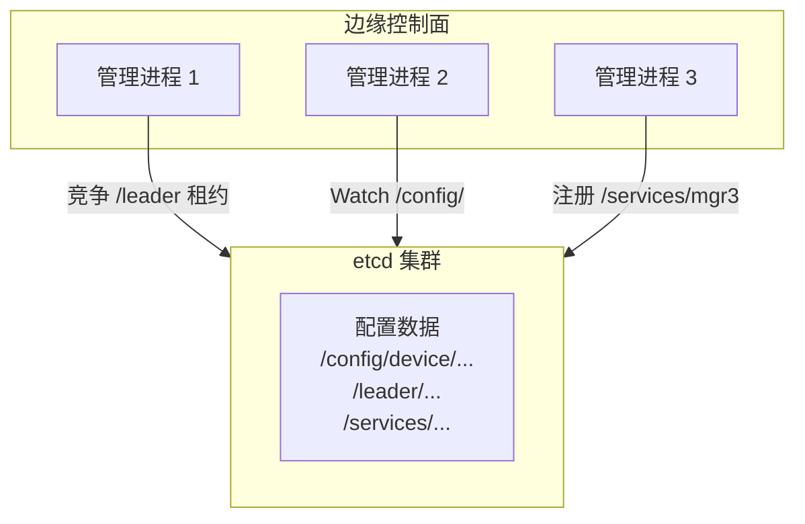

---
tags:
  - 分布式
  - 共识
  - Raft
  - etcd
title: etcd 与 Raft 案例
description: etcd 的架构、核心 API、Raft 实现细节、与 K8s 的关系及嵌入式控制面应用
date: 2026/06/02
---

# etcd 与 Raft 案例

etcd 是目前工业界最广泛使用的分布式键值存储，也是 **Raft 算法最知名的工程实现之一**。它是 Kubernetes 的核心依赖，负责存储集群的全部元数据。

本文从工程角度讲解 etcd 的架构和 API，帮你理解 Raft 在真实系统中是如何工作的。

---

## 1. etcd 是什么

**一句话**：etcd 是一个分布式的、强一致的**键值存储（Key-Value Store）**，底层用 Raft 保证一致性，对外提供简单的 `Get/Put/Delete/Watch` API。



**核心特点**：
- **强一致性**：写操作经过 Raft 多数派提交，任何节点返回成功后数据不会丢
- **Watch 机制**：可以监听某个 key 的变化，实时推送通知（服务发现、配置热更新的基础）
- **租约（Lease）**：TTL 机制，用于实现分布式锁和选主
- **事务（Txn）**：支持 CAS（Compare-And-Swap）操作

---

## 2. 核心 API

### 2.1 基础读写

```bash
# 写入
etcdctl put /config/db_host "192.168.1.10"

# 读取
etcdctl get /config/db_host

# 删除
etcdctl del /config/db_host

# 列出前缀
etcdctl get /config/ --prefix
```

### 2.2 Watch（监听变更）

Watch 是 etcd 最强大的特性，客户端可以订阅 key 的变化：

```bash
# 监听某个 key（会阻塞，收到变更时打印）
etcdctl watch /config/db_host

# 另一个终端修改 key
etcdctl put /config/db_host "192.168.1.20"

# watch 端会收到：
# PUT
# /config/db_host
# 192.168.1.20
```

**Go SDK 示例**：

```go
client, _ := clientv3.New(clientv3.Config{
    Endpoints: []string{"localhost:2379"},
})

// 监听前缀下所有 key 的变化
watchChan := client.Watch(ctx, "/services/", clientv3.WithPrefix())
for resp := range watchChan {
    for _, event := range resp.Events {
        fmt.Printf("Type: %s, Key: %s, Value: %s\n",
            event.Type, event.Kv.Key, event.Kv.Value)
    }
}
```

### 2.3 租约（Lease）与 TTL

租约用于**临时 key**——key 与租约绑定，租约到期 key 自动消失：

```bash
# 创建 10 秒的租约
etcdctl lease grant 10
# 输出：lease 694d6ac2f2a5805b granted with TTL(10s)

# 绑定 key 到租约
etcdctl put /services/node1 "192.168.1.11" --lease=694d6ac2f2a5805b

# 续约（保持存活）
etcdctl lease keepalive 694d6ac2f2a5805b
```

**典型用途**：服务注册时，服务实例把自己的地址注册为一个带租约的 key，进程崩溃后租约到期 key 自动消失，其他服务通过 Watch 感知到下线。

### 2.4 事务（Txn / CAS）

实现**分布式锁**的基础：

```bash
# 原子操作：如果 /lock 不存在，则写入（抢锁）
etcdctl txn <<EOF
compares:
version("/lock") = "0"

success requests:
put /lock "node1"

failure requests:
get /lock
EOF
```

---

## 3. etcd 的 Raft 实现

### 3.1 架构层次



etcd 的 Raft 实现（`go.etcd.io/etcd/raft/v3`）是**独立的库**，可以单独使用，不依赖 etcd 的其他部分。它的设计是无状态的——Raft 核心只负责协议逻辑，存储、网络传输都交给使用方实现（符合 Raft 论文的解耦设计）。

### 3.2 关键参数解读

```yaml
# etcd 配置示例
heartbeat-interval: 100    # 心跳间隔（ms）
election-timeout: 1000     # 选举超时（ms），通常是心跳的 10 倍

# 读一致性配置
read-index: true           # 使用 ReadIndex 保证线性一致读
```

### 3.3 线性一致读（ReadIndex）

默认情况下，直接读 Follower 可能读到旧数据。etcd 的**串行读（Serializable）**允许读本地状态，**线性读（Linearizable）**需要确认 Leader 最新提交：

```text
线性读流程：
1. 客户端请求任意节点
2. 节点向 Leader 询问当前 commitIndex（ReadIndex）
3. 等待自己的 applyIndex >= commitIndex
4. 读取本地状态返回给客户端
```

这样既保证了线性一致性，又能让 Follower 分担读压力。

---

## 4. etcd 在 Kubernetes 中的角色

K8s 的所有集群状态都存在 etcd 里：



**etcd 里存了什么**：

```bash
# 查看 etcd 中所有 K8s 数据的 key 前缀
etcdctl get / --prefix --keys-only | head -30

# 典型输出：
/registry/configmaps/default/my-config
/registry/deployments/production/nginx
/registry/namespaces/kube-system
/registry/pods/default/nginx-xxx
/registry/services/endpoints/default/kubernetes
```

**性能注意**：etcd 不是为高吞吐存储设计的，K8s 生产环境建议：
- etcd 独立部署（不与 kube-apiserver 混跑）
- SSD 存储（WAL 写盘是关键路径）
- 定期压缩（`etcdctl compact`）和碎片整理（`etcdctl defrag`）

---

## 5. 分布式锁实现

etcd 常被用来实现分布式锁，通过**事务 + 租约**组合：

```go
import "go.etcd.io/etcd/client/v3/concurrency"

// 创建 session（内部维护租约，自动续期）
session, _ := concurrency.NewSession(client, concurrency.WithTTL(10))
defer session.Close()

// 创建 mutex
mutex := concurrency.NewMutex(session, "/my-lock/")

// 加锁（会阻塞直到获取锁）
if err := mutex.Lock(ctx); err != nil {
    // 处理错误
}
defer mutex.Unlock(ctx)

// --- 临界区 ---
fmt.Println("持有锁，执行关键操作")
```

**内部原理**：
1. 写入 `/my-lock/{session_id}` 这个 key（带租约）
2. 用 `Watch` 监听同一前缀下比自己序号小的 key
3. 当比自己小的 key 都消失时，自己持有锁
4. 进程崩溃 → 租约到期 → key 消失 → 下一个等待者自动获得锁

---

## 6. 服务注册与发现

etcd 实现服务发现的标准模式：

```go
// 服务注册（服务启动时）
lease, _ := client.Grant(ctx, 10) // 10秒租约
client.Put(ctx, "/services/web/node1", "192.168.1.11:8080",
    clientv3.WithLease(lease.ID))

// 自动续租（后台 goroutine）
client.KeepAlive(ctx, lease.ID)

// 服务发现（客户端启动时）
resp, _ := client.Get(ctx, "/services/web/", clientv3.WithPrefix())
for _, kv := range resp.Kvs {
    fmt.Printf("Found: %s → %s\n", kv.Key, kv.Value)
}

// 监听服务变更（实时感知上下线）
watchChan := client.Watch(ctx, "/services/web/", clientv3.WithPrefix())
```

---

## 7. 运维关键命令

```bash
# 查看集群健康状态
etcdctl endpoint health --cluster

# 查看各节点状态（谁是 Leader？）
etcdctl endpoint status --cluster -w table

# 查看当前 Leader
etcdctl endpoint status --cluster | grep true

# 手动触发 Leader 切换（维护用）
etcdctl move-leader <target-member-id>

# 压缩旧版本（释放空间）
ETCD_REVISION=$(etcdctl endpoint status --write-out json | python3 -c \
  "import json,sys; print(json.load(sys.stdin)[0]['Status']['header']['revision'])")
etcdctl compact $ETCD_REVISION

# 碎片整理（需要停服或滚动）
etcdctl defrag --cluster

# 添加新成员
etcdctl member add <name> --peer-urls=http://new-host:2380

# 备份（快照）
etcdctl snapshot save backup.db
```

---

## 8. 与控制面 RPC 的结合

在嵌入式/边缘系统的控制面中，etcd 常作为**配置中心**和**选主组件**：



**典型场景**：
- **配置热更新**：所有管理进程 Watch `/config/` 前缀，配置变更时自动收到通知
- **选主**：多个进程竞争 `/leader` key 的租约，持有租约的进程是主，宕机后其他进程自动竞争
- **健康检查**：每个进程维护带租约的 key，key 消失说明进程宕机

---

## 9. 面试快答

| 问题 | 要点 |
|------|------|
| etcd 用什么算法？ | Raft |
| etcd 的强一致性如何保证？ | 写入经过 Raft 多数派提交，读需要 ReadIndex 或读 Leader |
| 什么是 Watch？ | 监听 key 变更的流式 API，基于 gRPC streaming |
| 什么是租约？ | TTL 机制，key 与租约绑定，租约到期 key 消失，用于分布式锁和服务注册 |
| K8s 为什么用 etcd？ | 需要强一致的元数据存储 + Watch 机制（控制器依赖变更通知） |
| etcd 能处理多大规模？ | 建议单集群 < 8GB 数据，写吞吐 < 1万 QPS；大规模 K8s 需要分 etcd 集群 |
| 和 ZooKeeper 比有什么优势？ | etcd 更简单（只有 KV），API 更现代（gRPC），Watch 更高效，Go 生态更好 |

---

## 延伸阅读

- [[分布式系统/共识算法/Raft 原理与工程实现]]
- [[分布式系统/共识算法/共识与复制边界]]
- [[网络与DPDK/实践/RPC 技术与分层详解]]（服务发现如何使用 etcd）
- [[数据库/PostgreSQL 中的物理复制与逻辑复制：机制、差异与选型]]
- [etcd 官方文档](https://etcd.io/docs/)
