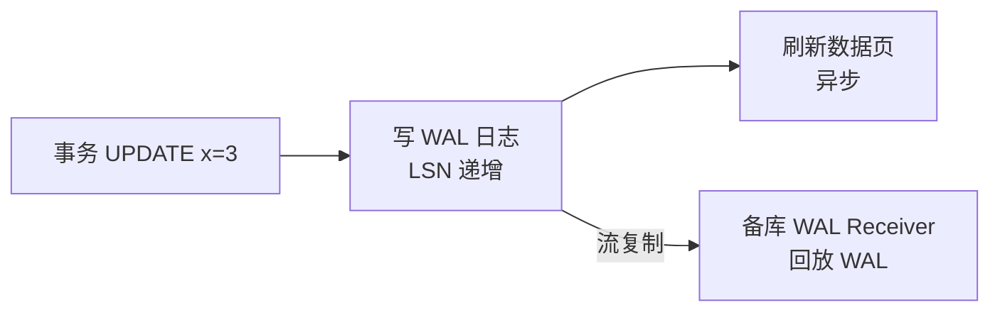
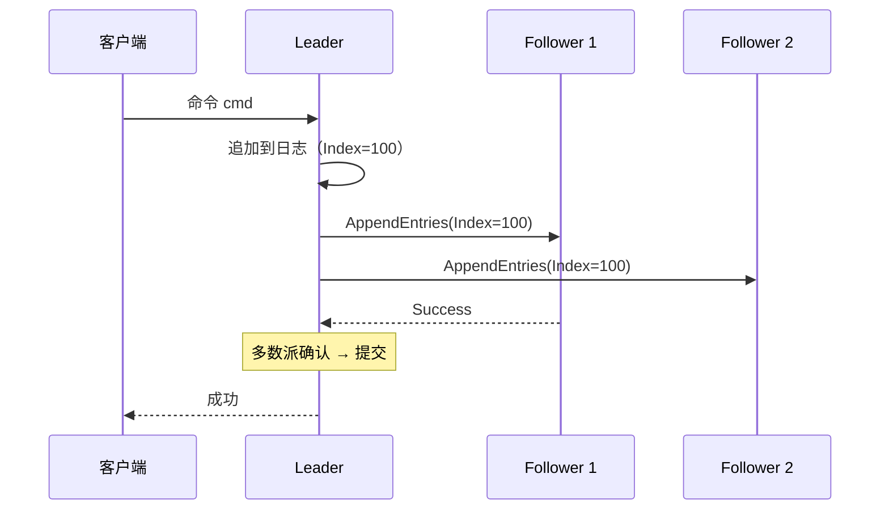
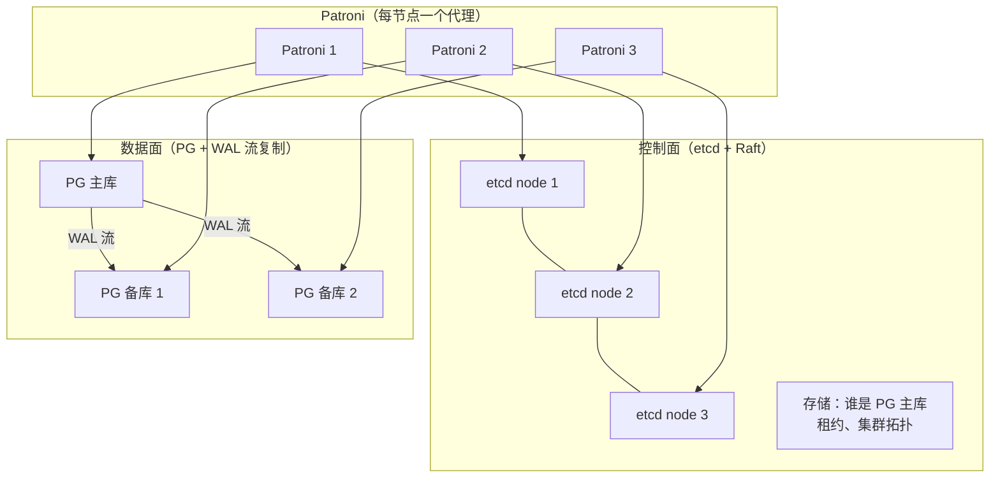
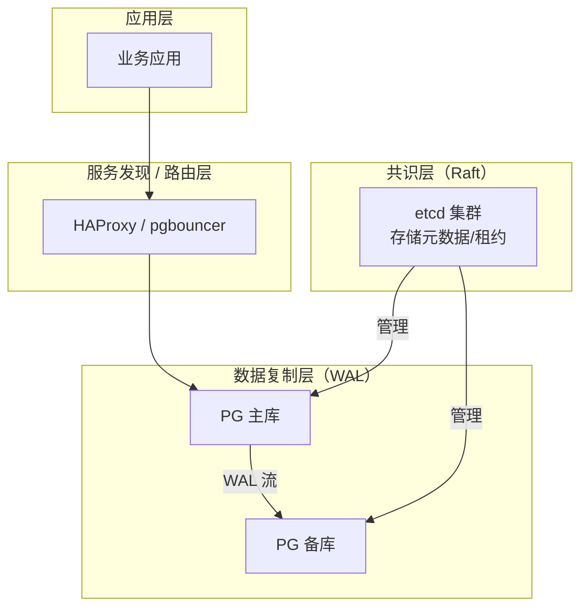

---
tags:
  - 分布式
  - 共识
  - Raft
  - PostgreSQL
title: 共识与复制边界
description: Raft 共识日志 vs PostgreSQL WAL 流复制：解决什么、如何配合、不要混淆
date: 2026/06/02
---

# 共识与复制边界

在分布式系统学习中，有一个常见的混淆：**Raft/Paxos 共识** 和 **PostgreSQL WAL 流复制** 是不是同一回事？这篇文章把两者的边界说清楚，帮你在选型和面试中准确表达。

---

## 1. 一句话先说结论

| 机制 | 解决什么 | 层次 |
|------|----------|------|
| **Raft / Paxos** | **通用共识**：让多个节点就一组有序操作达成一致，保证一致性和容错 | 通用基础设施层 |
| **PostgreSQL WAL 流复制** | **数据库专属复制**：把主库的物理/逻辑变更传给备库，保证数据冗余 | 数据库存储引擎层 |

**它们不是同一回事，但都依赖相似的底层原理（有序日志 + 持久化 + 多副本）。**

---

## 2. PostgreSQL 流复制回顾

### 2.1 WAL 是什么

**WAL（Write-Ahead Log，预写日志）**：PostgreSQL 每次修改数据页之前，先把操作记录写入 WAL 日志。WAL 日志是数据库崩溃恢复的基础。



**LSN（Log Sequence Number）**：WAL 中每条记录的唯一顺序号，类似 Raft 的 Log Index。

### 2.2 流复制工作原理

```mermaid
sequenceDiagram
  participant C as 客户端
  participant M as 主库 (Primary)
  participant S1 as 备库 1 (Standby)
  participant S2 as 备库 2 (Standby)

  C->>M: BEGIN; UPDATE ...; COMMIT;
  M->>M: 写 WAL（LSN=100）
  M-->>C: 事务提交成功

  M->>S1: WAL 流（LSN=100）
  M->>S2: WAL 流（LSN=100）
  S1->>S1: 回放 WAL → 更新数据页
  S2->>S2: 回放 WAL → 更新数据页

  Note over M,S2: 异步复制默认：主库不等备库确认
```

**同步复制模式**（`synchronous_commit = on`）：主库等至少一个备库确认写入 WAL，才返回提交成功——这在形式上接近 Raft 的多数派提交。

---

## 3. Raft 共识日志回顾



---

## 4. 深度对比：三个维度

### 4.1 目的不同

| | Raft 共识 | PG 流复制 |
|--|-----------|-----------|
| **核心目标** | 让一组节点对**任意状态机命令序列**达成一致 | 让备库**跟上主库的数据状态** |
| **适用场景** | 配置存储、锁服务、键值存储、任意复制状态机 | PostgreSQL 数据库的高可用和读扩展 |
| **通用性** | 通用协议，与应用语义无关 | 与 PostgreSQL 内部数据格式（数据页、WAL 格式）强绑定 |

### 4.2 故障转移（Failover）机制不同

**PG 流复制**没有内置的 Leader 选举，需要外部工具（Patroni、Repmgr）来决定谁升为新主库：

```text
PG 主库宕机
    ↓
需要 DBA 或 Patroni 判断：
  1. 哪个备库 LSN 最大（数据最新）？
  2. 避免脑裂（老主库可能还活着）
  3. 执行 pg_promote() 升为新主
    ↓
旧主库恢复后，作为备库接回
```

**Raft（如 etcd）** 内置了完整的选举协议，不需要外部工具介入：

```text
etcd Leader 宕机
    ↓
剩余节点自动检测（选举超时）
    ↓
选出新 Leader（日志最新的节点）
    ↓
客户端重试连接新 Leader
（整个过程通常 < 1 秒）
```

### 4.3 一致性级别不同

| | PG 流复制 | Raft |
|--|-----------|------|
| **默认一致性** | 异步复制，读备库可能有延迟（主备不一致） | **线性一致**（读 Leader 保证看到最新写） |
| **同步模式** | `synchronous_commit=on`，类似 Raft 但没有多数派概念 | 天生多数派提交 |
| **备库读** | 允许（可能读到旧数据） | 需要 ReadIndex 保证线性一致读 |

---

## 5. 它们如何配合：Patroni + etcd 架构

现代生产系统常用 **etcd 存储 PG 集群元数据**，用 Raft 保证元数据一致性，从而安全地管理 PG 流复制集群：



**工作流**：
1. Patroni 通过 etcd 持有**主库租约（leader key）**，有租约的节点才能当 PG 主库
2. 主库宕机 → etcd 租约过期 → 其他 Patroni 竞争租约（通过 etcd 的分布式锁）
3. 竞争到租约的备库执行 `pg_promote()` 升为新主
4. 整个过程用 **etcd 的共识**保证不会有两个节点同时认为自己是主库（避免脑裂）

**两层职责清晰**：
- **etcd（Raft）**：保证"谁是主库"这个元数据的**强一致性**
- **PG 流复制**：保证数据的**高效复制和冗余**

---

## 6. 用一张表看清楚



| 问题 | 谁来解决 |
|------|----------|
| 谁是当前主库？ | **etcd（Raft）** |
| 主库宕机时如何避免脑裂？ | **etcd 租约 + Raft 共识** |
| 数据如何从主库同步到备库？ | **PG WAL 流复制** |
| 备库读的数据有多新？ | **PG 复制延迟**（与 Raft 无关） |
| 数据写入是否持久？ | **PG WAL 持久化**（`fsync`） |

---

## 7. 常见混淆点澄清

**混淆 1**：「PG 同步复制 = Raft 共识」  
→ **不完全对**。PG 同步复制可以配置等一个或多个备库确认，但没有 Leader 选举和日志序号保证，故障转移仍需外部介入。

**混淆 2**：「用了 etcd 就不需要 PG 流复制了」  
→ **错**。etcd 只管元数据（谁是主库），数据还是在 PG 里，数据复制还是靠 WAL。

**混淆 3**：「Raft 可以直接替代 PG 流复制」  
→ **理论可以**（基于 Raft 构建存储引擎，如 TiKV）；但对于 PostgreSQL 这个具体系统，流复制是内置机制，改造成本极高。

---

## 8. 选型决策

| 我需要... | 用什么 |
|-----------|--------|
| 数据库高可用（自动故障转移） | PG 流复制 + Patroni + etcd |
| 分布式配置存储 / 服务发现 | etcd / ZooKeeper（纯共识） |
| 分布式数据库（NewSQL） | TiDB（TiKV 用 Raft，PD 用 etcd） |
| 边缘设备 + 轻量元数据同步 | etcd 嵌入式 / 单节点 + 备份即可 |

---

## 延伸阅读

- [[分布式系统/共识算法/Raft 原理与工程实现]]
- [[分布式系统/共识算法/etcd 与 Raft 案例]]
- [[数据库/PostgreSQL 中的物理复制与逻辑复制：机制、差异与选型]]
- [[网络与DPDK/实践/RPC 技术与分层详解]]（服务发现依赖 etcd）
