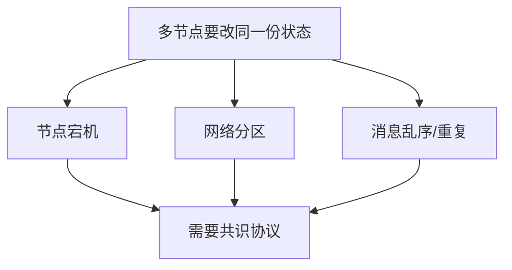
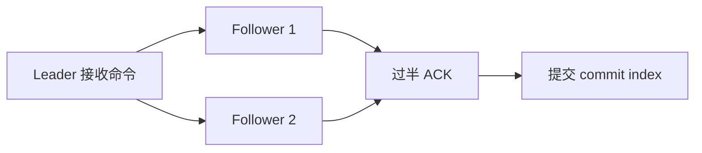
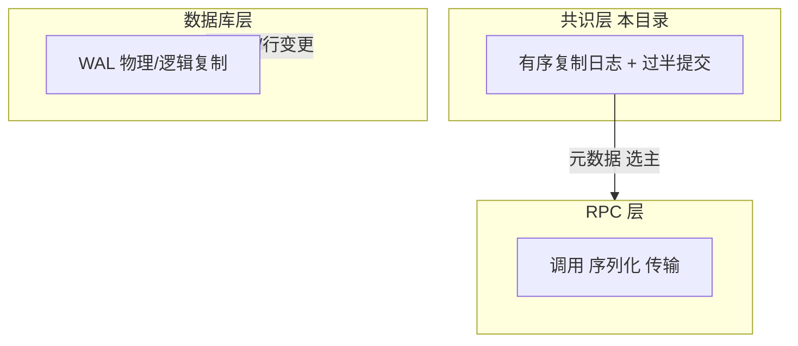

---
tags:
  - 分布式
  - 共识
  - CAP
title: 分布式共识算法概览
description: 为何需要共识、CAP、Quorum、Paxos/Raft 选型与和复制/WAL 的边界
date: 2026/05/21
---

# 分布式共识算法概览

单机程序靠 **锁 + 内存** 保证状态一致；多机要靠 **消息 + 超时 + 多数派规则**。本篇建立 **共识问题** 的心智模型，并标出与本站 [[RPC 技术与分层详解]]、[[PostgreSQL 中的物理复制与逻辑复制：机制、差异与选型]] 的边界。细节算法分篇见 [[分布式系统/共识算法/index]]。

---

## 1. 读完能带走什么

- 能说清 **共识要解决什么**（一致的决定、容错、可恢复）。  
- 理解 **CAP** 在工程里的含义（不是背三选二口号）。  
- 知道 **Quorum（法定人数）** 与 **leader + 复制日志** 的常见形态。  
- 能区分 **共识日志** 与 **数据库 WAL 流复制**。

---

## 2. 问题从哪来

典型场景：

| 场景 | 需要一致的内容 | 常见实现 |
|------|----------------|----------|
| **配置 / 元数据** | 谁是谁的 leader、路由表 | etcd、ZooKeeper、Consul |
| **分布式锁 / 租约** | 同一时刻只有一个持有者 | etcd、`fencing token` |
| **复制状态机** | 有序命令在各副本上同序执行 | Raft in TiKV、etcd |

**不解决共识会怎样**：双主、脑裂、丢更新、读到过期配置——RPC 集群可能把流量打到错误实例上。

---

## 3. CAP 与一致性级别（工程视角）

**CAP 定理（CAP theorem）**：在 **网络分区（Partition）** 发生时，**一致性（Consistency）** 与 **可用性（Availability）** 无法同时满足（在常见形式化定义下）。

| 术语 | 工程里常指 |
|------|------------|
| **C** | 读到的数据像「刚写完」或来自单一逻辑副本 |
| **A** | 无分区时请求能在有限时间内得到非错误响应 |
| **P** | 分区必然发生，协议必须显式处理 |

实际系统多在 **CP**（etcd、ZooKeeper：分区时少数派不可写）与 **AP**（最终一致的缓存、DNS）之间选型，而不是「三选二」一张表结束。

与 **嵌入式 / 边缘**：设备侧多数 **不跑集群共识**，而是 **连接** 已有控制面（K8s + etcd、云 API）。

---

## 4. Quorum 与复制日志

**Quorum（法定人数）**：$N$ 个副本中，读写至少各需 $W$、$R$ 个应答，且常满足 $W + R > N$（或写需过半）以避免读到未提交的旧值。

**复制状态机（replicated state machine）**：

1. 客户端把 **命令** 交给 leader（或候选 leader）。  
2. leader 把命令 **追加** 到本地日志，并复制到 follower。  
3. **过半提交** 后，各节点按 **相同顺序** 应用到状态机。

共识算法（Paxos、Raft）的核心差异多在 **如何选 leader、如何选举、日志如何对齐**，而不是「要不要复制」。

---

## 5. Paxos 与 Raft（如何选型）

| 维度 | Paxos / Multi-Paxos | Raft |
|------|---------------------|------|
| **理论** | 经典、较抽象 | 为 **可理解性** 设计 |
| **工程** | Chubby、早期 ZooKeeper 思想 | **etcd、TiKV、Consul** 等 |
| **学习曲线** | 两阶段提交直觉后仍易晕 | 角色与任期清晰 |
| **本站后续** | [[分布式系统/共识算法/index#2. 推荐阅读顺序|待写：Paxos 速览]] | 待写：Raft 工程实现 |

嵌入式 / DPDK 业务开发：**通常实现 Raft 协议本身的机会很少**；更需要会 **使用** etcd/K8s API、理解 **leader 切换对 RPC 发现的影响**。

---

## 6. 与 PostgreSQL 复制、RPC 的边界

| 机制 | 层次 | 典型产物 |
|------|------|----------|
| **Raft / Paxos** | 通用共识 | etcd `key=value`、配置版本 |
| **PG 流复制** | 单产品存储引擎 | 备库与主库 **同构数据目录** |
| **RPC** | 应用通信 | Protobuf + HTTP/2；**不保证**全局一致状态 |

一篇文讲清 PG 复制：**不替代** Raft 教程；反之，学会 Raft **不自动** 会配流复制。待写对照文：[[分布式系统/共识算法/index#2. 推荐阅读顺序|共识与复制边界]]。

RPC 文中 **服务发现** 依赖 etcd 时，本质是 **共识维护的键值树**；超时与重试策略要假设 **leader 可能切换**。

---

## 7. 检查清单

| 问题 | 应能回答 |
|------|----------|
| 我要的是 **元数据一致** 还是 **业务库一致**？ | 前者 → 共识组件；后者 → DB 复制 / 应用层 |
| 分区时宁可 **停写** 还是 **允许旧读**？ | CP vs AP 选型 |
| 副本数 $N$ 与容忍故障数？ | 常见 $N=3$ 容忍 1 故障，需 **奇数** 避免平票 |
| 嵌入式是否自研 Raft？ | 默认 **否**，用成熟控制面 |

---

## 8. 相关链接

- [[分布式系统/共识算法/index]]
- [[分布式系统/index]]
- [[网络与DPDK/实践/RPC 技术与分层详解]]
- [[数据库/PostgreSQL 中的物理复制与逻辑复制：机制、差异与选型]]
- [[成长路径/index#十一·五、分布式系统]]

---

*分篇（Paxos、Raft、etcd 案例）按 [[分布式系统/共识算法/index]] 顺序补全后回链此处。*
