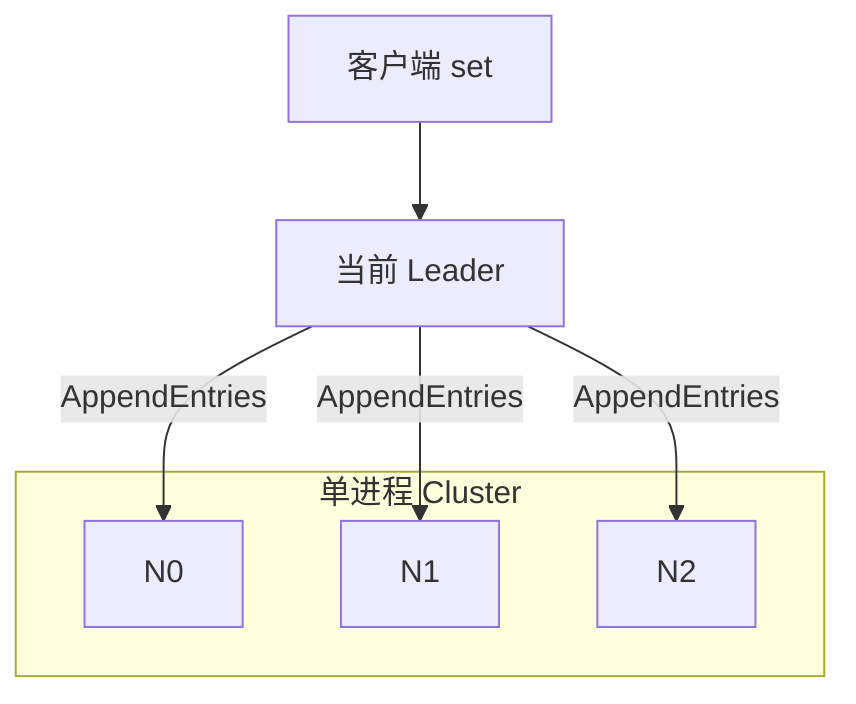
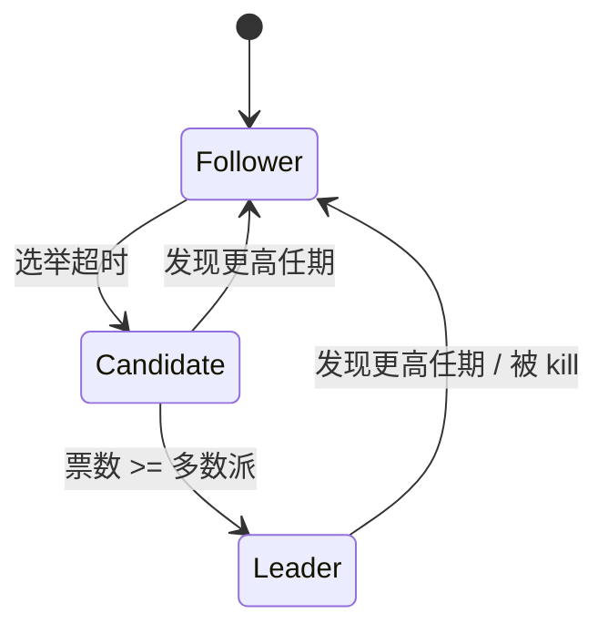
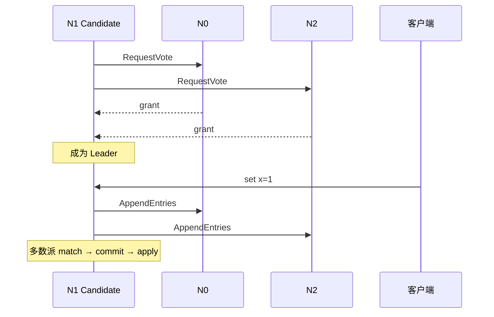
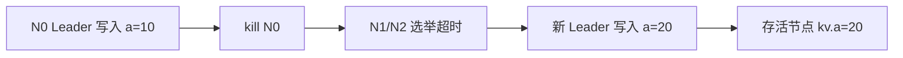

---
tags:
  - 分布式
  - 共识
  - Raft
title: 玩具 Raft 三节点实验
description: 单进程模拟 3 节点：选举、日志复制、多数派提交与 Leader 宕机重选
date: 2026/07/21
---

# 玩具 Raft 三节点实验

读完 [[Raft 原理与工程实现]] 和 [[etcd 与 Raft 案例]] 后，仍容易停留在「能讲术语、不会动手」。本篇用仓库里的 **单进程 3 节点玩具**，把 **选举（Leader election）**、**日志复制（log replication）**、**多数派提交（majority commit）** 跑出可复现的时间线，并故意弄死 Leader 看重选。

代码不在站点发布目录：`labs/raft-toy/`（见 [[成长路径/index#十一·五、分布式系统]]）。

---

## 1. 读完能带走什么

- 能对照日志说出：**谁在何时变成 Leader、条目何时被 commit/apply**。  
- 理解玩具与生产的边界：**无持久化、无真实网络、无快照/成员变更**。  
- 能解释为何 **奇数节点**、以及 **只提交当前任期日志** 的安全规则在代码里落在哪一行逻辑。

---

## 2. 场景与问题

| 约束 | 含义 |
|------|------|
| 单机学习 | 不想先搭 3 个 etcd 容器也能看到协议因果 |
| 可断言 | 写入后存活节点 KV 一致；宕机后新 Leader 仍可写 |
| 可对照论文 | 角色 / 任期 / `RequestVote` / `AppendEntries` 名字对齐 |

不解决：磁盘崩溃恢复、脑裂下的生产级调参、线性一致读优化。



RPC 是 **进程内函数调用**，不是 socket；时间轴由 `tick(dt_ms)` 推进，便于打印 `t=…ms`。

---

## 3. 核心概念（只保留本实验用到的）

| 概念 | 本玩具中的落点 |
|------|----------------|
| **任期（Term）** | `Node.current_term`；选举时 +1 |
| **角色** | `Follower` / `Candidate` / `Leader` |
| **选举超时** | 随机 150–300ms；到期则 `RequestVote` |
| **日志条目** | `(term, command)`，命令形如 `set x=1` |
| **commitIndex** | 多数派 `matchIndex` 覆盖后推进；再 `apply` 到 KV |
| **心跳** | Leader 周期性空/非空 `AppendEntries`，重置 Follower 超时 |

状态机极简：只认 `set key=value`。



---

## 4. 仓库里有什么

| 路径 | 作用 |
|------|------|
| `labs/raft-toy/raft.py` | 节点、RPC、Cluster 事件循环、两个 Demo |
| `labs/raft-toy/README.md` | 运行说明 |

环境：**Python 3.10+**，仅标准库。

```bash
cd labs/raft-toy
python3 raft.py            # basic + failover
python3 raft.py basic
python3 raft.py failover --seed 7
```

期望：打印时间线后出现「断言通过」。

---

## 5. Demo A：选举 + 写入提交

### 5.1 预期因果链



### 5.2 对照输出（示例）

跑 `python3 raft.py basic` 时，典型片段类似：

```text
t=  160.0ms  N1 发起选举 term=1 ...
t=  160.0ms  N1 成为 Leader term=1
t=  160.0ms  客户端 → N1 追加 set x=1
t=  160.0ms  N1(L) commit/apply ['set x=1'] kv={'x': '1'}
...
t=  360.0ms  状态 N0/N1/N2 ... kv={'x': '1', 'y': '2'}
断言通过：存活节点 KV 一致
```

要点：

1. **先有 Leader**，客户端才写得进日志。  
2. Leader 本地追加后立刻广播；**commit 条件是多数派已复制**（含自己）。  
3. Follower 在后续心跳里把 `leaderCommit` 跟上，再 `apply`。

### 5.3 代码里该盯的函数

| 步骤 | 函数 |
|------|------|
| 超时选举 | `Cluster._start_election` |
| 投票与「日志够新」 | `Cluster.request_vote` |
| 复制与一致性检查 | `Cluster.append_entries` |
| 多数派提交 | `_broadcast_append` 末尾扫 `match_index` |
| 应用到 KV | `Node.apply_committed` |

「日志至少一样新」：比较 **最后一条的 term**，相同再比 **长度**——与 [[Raft 原理与工程实现#3. Leader 选举]] 一致。

---

## 6. Demo B：Leader 宕机与重选



```bash
python3 raft.py failover --seed 7
```

观察顺序：

1. 旧 Leader 宕机后，**一段时间内无 Leader**（选举窗口）。  
2. 持有较新日志的节点更容易获胜（投票规则里的 up-to-date）。  
3. 新任期写入 `a=20` 后，**存活节点** KV 一致；宕机节点可仍停在旧值——直到 `revive` 再同步（本 Demo 未自动 revive）。

这与生产里「少数派分区不能冒充可写主」是同一类直觉；玩具没有模拟双向分区，只做了 **进程 alive 标志**。

---

## 7. 自己改一改（加深）

| 实验 | 做法 | 期望现象 |
|------|------|----------|
| 改种子 | `--seed` 换值 | 谁先当选可能变，但最终一致 |
| 写后立刻 kill | 在 `client_set` 后马上 `kill(leader)` | 未达多数派的条目可能丢失（正常） |
| 拉长心跳 | 改 tick 里 Leader 广播周期 | 选举更易被误触发 |
| 偶数节点 | 改 `n=4` | 初始化会拒绝；可临时放开观察平票风险 |

提交规则里有一句注释：**只推进「当前任期」已复制的条目**——对应 Raft 论文里避免用旧任期条目单独提交的安全性约束；完整证明见原理文，玩具只保留最小实现。

---

## 8. 与 etcd / 生产的边界

| 维度 | 玩具 | etcd / 生产 Raft |
|------|------|------------------|
| 传输 | 函数调用 | gRPC / 专用 RPC |
| 持久化 | 无 | WAL + 快照 |
| 时间 | 虚拟 `now_ms` | 真实时钟 + 抖动 |
| 成员变更 | 无 | 联合共识等 |
| 读路径 | 不建模 | lease / linearizable read |

嵌入式控制面多数是 **消费** etcd，而不是自研 Raft；本 lab 的价值是：**面试/排障时能把「选主慢、提交卡住」映射回协议步骤**。工程使用见 [[etcd 与 Raft 案例]]；与数据库复制的层次差见 [[共识与复制边界]]。

---

## 9. 检查清单

- [ ] 本地 `python3 labs/raft-toy/raft.py` 两段 Demo 均断言通过  
- [ ] 能指着日志解释一次 **RequestVote → Leader → AppendEntries → commit**  
- [ ] 能说明为何 Demo B 里宕机节点 KV 可以暂时落后  
- [ ] 知道下一步若要「真 3 进程」：把 RPC 换成 localhost UDP/TCP，并加持久化——仍建议先读 etcd 源码路径而非从零写生产库  

---

*本文对应 [[成长路径/index|成长路径]] §11.5 **玩具 Raft / lab**。原理复习：[[Raft 原理与工程实现]]；目录：[[分布式系统/共识算法/index]]。*
