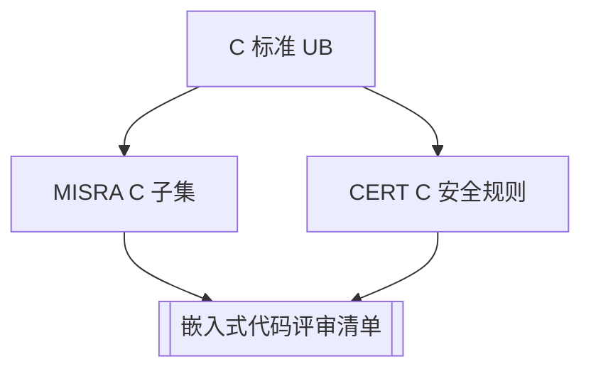

---
tags:
  - C
  - 规范
  - 嵌入式
  - 评审
title: MISRA C 与 CERT C 编码规范对照
description: 可执行规则子集、与嵌入式评审清单的映射及静态分析落地
date: 2026/05/21
---

# MISRA C 与 CERT C 编码规范对照

**MISRA C**（汽车/安全相关 C 子集）与 **CERT C**（CERT 安全编码标准）不是「语法教程」，而是 **降低 UB 与漏洞** 的规则集。本篇抽 **与本站嵌入式/DPDK 路径最相关的子集**，并映射到 [[工程基础/嵌入式代码评审清单]]，便于 Review 与 **静态分析** 落地。

---

## 1. 读完能带走什么

- 知道 **MISRA vs CERT** 各自解决什么问题。  
- 有一份 **可勾选的高频规则表**（不必背全标准）。  
- 知道如何用 **cppcheck / 编译器警告** 辅助执行。

---

## 2. 三套东西怎么分工



| 体系 | 侧重 | 典型行业 |
|------|------|----------|
| **C 标准 + [[C 内存模型与未定义行为]]** | 语言正确性 | 全部 |
| **MISRA C** | 可判定、可审计、禁危险构造 | 汽车、轨交、工业控制 |
| **CERT C** | 安全漏洞（注入、整数、并发） | 通用安全关键 |
| **本站评审清单** | 嵌入式/Linux/DPDK 实践坑 | 本博客主线 |

**结论**：不必全量认证 MISRA；把 **与项目风险相关的规则** 写进 Review + CI 即可。

---

## 3. MISRA C 高频规则（子集）

> 编号随 MISRA 版本（C:2012 / C:2023）略有差异；此处按 **意图** 归纳，便于记忆。

### 3.1 强制级（Mandatory 精神）

| 规则意图 |  bad | good | 对应本站 |
|----------|------|------|----------|
| 禁止隐式有害转换 | 有符号溢出假设 | 显式范围检查 | [[编程中非常关键、非常常用的数学技巧]] |
| 禁止 `goto`（除统一 exit） |  spaghetti | 结构化控制流 | — |
| 禁止动态内存于部分安全级 | 任意 `malloc` | 静态/池化 | [[PMR 与自定义分配器]] |
| 函数应有原型 | K&R 旧式 | 原型声明 | [[C 编译链接与 ABI]] |
| 外部对象唯一声明 | 头文件定义全局变量 | 一处定义 + extern | 链接 ODR |

### 3.2 必需级（Required 精选）

| 意图 | 要求 |
|------|------|
| **`switch` 完整** | 所有 `enum` 值有 `case` 或 `default` |
| **无死代码** | 可达性；Review 时删不可达分支 |
| **无未使用变量** | `-Wunused` |
| **限制指针运算** | 仅同一数组对象内；见 [[C 内存模型与未定义行为]] |
| **限制标准库** | 安全级项目禁用 `setjmp/longjmp`、部分 `stdio` |

### 3.3 建议级（Advisory 精选）

| 意图 | 实践 |
|------|------|
| 单一出口 | 驱动错误路径 `goto err_free` 可接受（Linux 风格） |
| 限制宏 | 用 `static inline`、`_Generic` 代替复杂宏 [[C99-C11 实用特性]] |
| 注释与复杂度 | 圈复杂度上限（如 ≤ 15） |

---

## 4. CERT C 高频规则（子集）

| CERT 类 | 示例规则 | 嵌入式场景 |
|---------|----------|------------|
| **INT** 整数 | 溢出、截断、符号转换 | 协议长度、DMA 计数 |
| **ARR** 数组 | 越界、长度 off-by-one | 缓冲区、FAM |
| **MEM** 内存 | UAF、double-free、泄漏 | 驱动 probe/remove |
| **STR** 字符串 | 无界拷贝 | 用 `snprintf` [[C 字符串与 POSIX I/O 精读]] |
| **CON** 并发 | 数据竞争 | mutex/atomic，非 volatile [[内核同步机制总览]] |
| **FIO** 文件 I/O | 路径遍历、权限 | OTA、配置加载 |
| **API** 误用 | 忽略返回值 | 检查 `read`/`malloc` 返回值 |

**与 MISRA 重叠**：许多 INT/MEM/STR 两条标准都覆盖；**CERT 更偏安全 exploit**，MISRA 更偏 **工程可证明性**。

---

## 5. 与嵌入式评审清单的映射

| [[嵌入式代码评审清单]] 节 | MISRA/CERT 加强点 |
|---------------------------|-------------------|
| 内存与对齐 | INT30-C、ARR30-C；DMA 对齐非 MISRA 独有 |
| volatile 与原子 | CON 系列；MISRA 禁 volatile 用于并发同步 |
| 中断上下文 | 等价于「无阻塞、无未定义重入」；CERT CON |
| 驱动生命周期 | MEM31-C 无泄漏；错误路径对称 |
| 用户态嵌入式 | STR、FIO；ABI 见 [[C 编译链接与 ABI]] |
| 可维护性 | MISRA 文档/复杂度建议 |

Review 时：**先过本站清单，再扫下表「本次 MR 相关」CERT/MISRA 行**。

---

## 6. 静态分析与工具

| 工具 | 用途 |
|------|------|
| **gcc/clang `-Wall -Wextra -Werror`** | 基线 |
| **cppcheck** | CERT 部分、越界模式 |
| **Coverity / PC-lint / Polyspace** | 商业 MISRA 合规报告 |
| **sparse**（内核） | 内核特有 |
| **clang-tidy** | CERT 部分 check |

见 [[工程基础/静态分析入门]]。MISRA **全量** 常需商业工具出正式合规报告；学习阶段 **自选规则 + 警告当错误** 即可。

```bash
cppcheck --enable=all --suppress=missingIncludeSystem src/
gcc -std=c11 -Wall -Wextra -Wconversion -Werror=implicit-function-declaration ...
```

---

## 7. DPDK / 内核驱动的特殊说明

| 环境 | 规范现实 |
|------|----------|
| **Linux 内核** | 自有 style + sparse；**不是** MISRA 项目，但可借鉴规则 |
| **DPDK** | C + 宏密集；MISRA 全量 **不现实**；对 **自研控制面 C++** 可部分采用 |
| **AUTOSAR / 功能安全** | 必须按项目选定 MISRA 版本 + 偏离流程 |

**偏离（deviation）**：正式 MISRA 项目允许 documented deviation；个人/一般嵌入式 **直接写团队规范** 更轻。

---

## 8. 团队最小规范模板（10 条）

可直接贴进 CONTRIBUTING：

1. 禁止无界 `strcpy`/`sprintf`；外部输入必限长。  
2. 所有 `malloc`/`read`/`write` 检查返回值。  
3. 有符号运算考虑溢出；长度用 `size_t` 一致。  
4. 共享数据 mutex 或 `_Atomic`；MMIO 用 `volatile`。  
5. ISR 不睡眠、不长临界区。  
6. 结构体与寄存器 map 显式对齐/ packed 文档化。  
7. 错误路径释放资源（probe/remove 对称）。  
8. 禁用未文档化的 `goto`（除统一 cleanup）。  
9. `-Wall -Wextra` CI 不过不合并。  
10. 新代码跑 **cppcheck** 或 clang-tidy 相关项。

---

## 9. 检查清单

- [ ] Review 同时使用 **本站清单 + 本节映射**  
- [ ] CI 至少 **警告级 -Werror** 子集  
- [ ] 协议/解析代码对照 **CERT STR/INT**  
- [ ] 安全级项目再评估 **商业 MISRA 工具** 需求  

---

## 延伸阅读

- [[工程基础/嵌入式代码评审清单]]
- [[C/C++ Sanitizer 与单元测试入门]]
- [[C 内存模型与未定义行为]]
