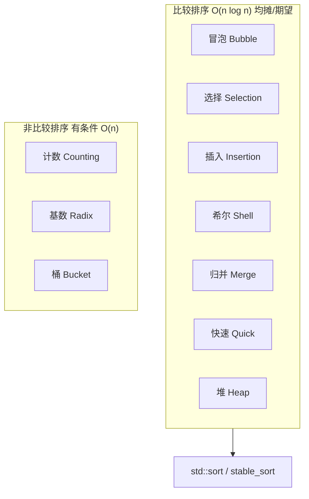
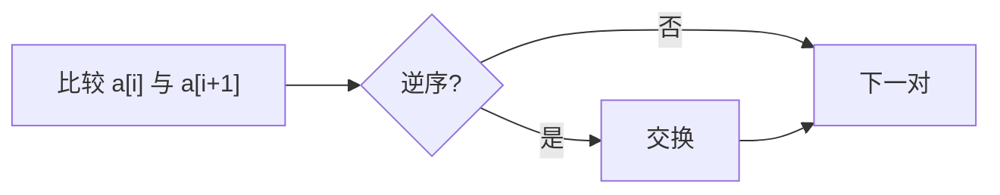
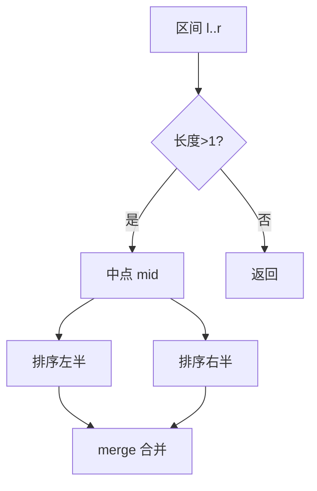
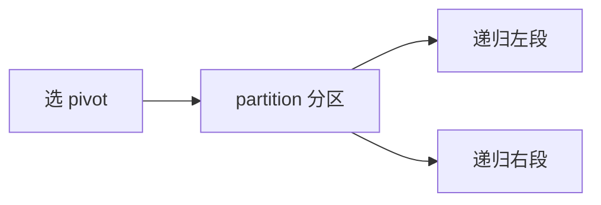
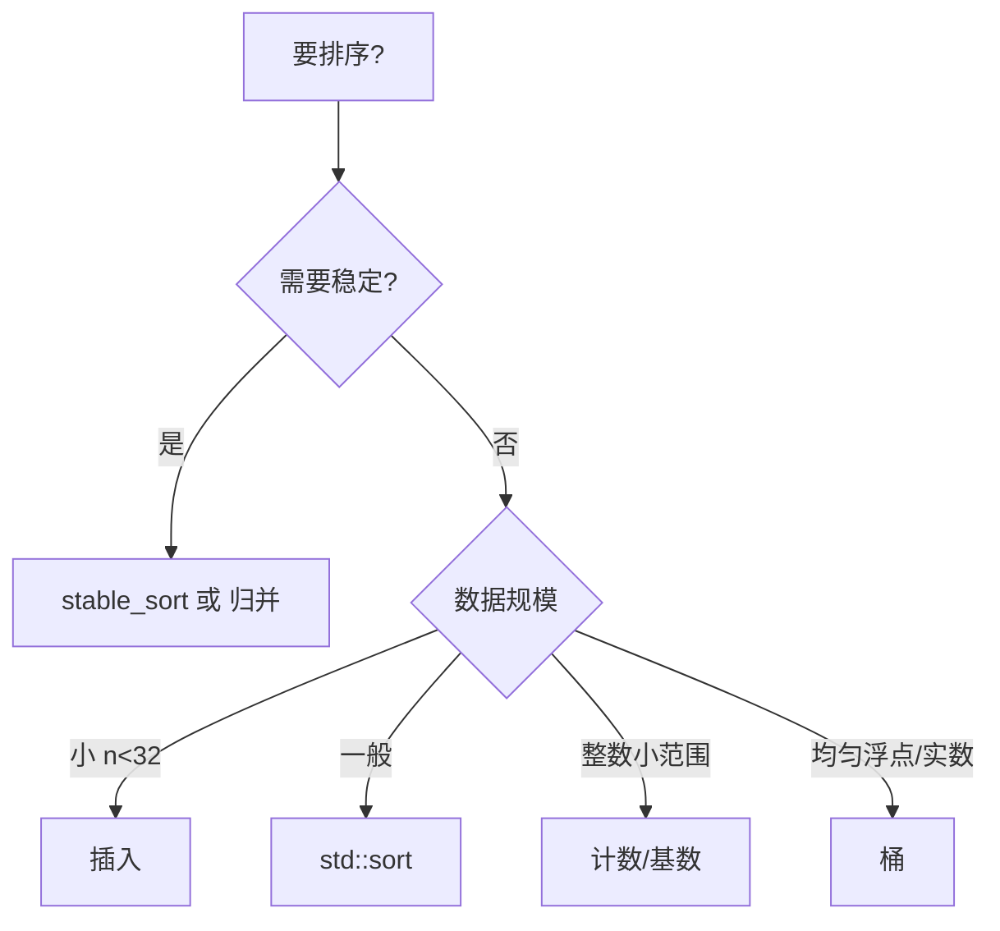

---
tags:
  - 算法
  - C++
  - 排序
title: 排序算法大全与 C++ 实现
description: 比较排序与非比较排序的原理、复杂度、稳定性及可运行示例
date: 2026/05/21
---

# 1 排序算法大全与 C++ 实现

**排序（sorting）** 是把序列按关键字 **非降序 / 非升序** 重排。本文覆盖常见 **比较排序（comparison sort）** 与 **非比较排序（non-comparison sort）**，每类给出 **C++ 实现** 与选型表；工程里优先用 **`std::sort` / `std::stable_sort`**，手写版本用于面试与理解底层。

---

## 1.1 读完能带走什么

- 知道各算法 **时间 / 空间 / 稳定性** 与 **适用场景**。  
- 能手写 **快排、归并、堆排** 与 **计数 / 基数** 的典型实现。  
- 理解比较排序 **下界** $O(n \log n)$ 与何时可突破（非比较排序）。

---

## 1.2 总览



| 算法 | 平均时间 | 最坏 | 额外空间 | 稳定 | 原地 |
|------|----------|------|----------|------|------|
| 冒泡 Bubble | $O(n^2)$ | $O(n^2)$ | $O(1)$ | 是 | 是 |
| 选择 Selection | $O(n^2)$ | $O(n^2)$ | $O(1)$ | 否 | 是 |
| 插入 Insertion | $O(n^2)$ | $O(n^2)$ | $O(1)$ | 是 | 是 |
| 希尔 Shell | 依赖 gap | $O(n^2)$* | $O(1)$ | 否 | 是 |
| 归并 Merge | $O(n \log n)$ | $O(n \log n)$ | $O(n)$ | 是 | 否 |
| 快速 Quick | $O(n \log n)$ | $O(n^2)$ | $O(\log n)$ 栈 | 否 | 是 |
| 堆 Heap | $O(n \log n)$ | $O(n \log n)$ | $O(1)$ | 否 | 是 |
| 计数 Counting | $O(n+k)$ | $O(n+k)$ | $O(k)$ | 是 | 否 |
| 基数 Radix | $O(d(n+k))$ | 同左 | $O(n+k)$ | 是 | 否 |
| 桶 Bucket | $O(n)$ 期望 | $O(n^2)$ | $O(n)$ | 是 | 否 |

* Shell 最坏与增量序列有关；常用 Sedgewick 增量均摊接近 $O(n^{4/3})$。

**比较排序下界**：仅通过 `<` 比较，最坏至少 $O(n \log n)$ 次比较（决策树高度）。

---

## 1.3 通用测试框架

```cpp
#include <iostream>
#include <vector>
#include <algorithm>
#include <functional>

template <class F>
void demo(const char* name, F sort_fn, std::vector<int> a) {
    sort_fn(a);
    std::cout << name << ": ";
    for (int x : a) std::cout << x << ' ';
    std::cout << (std::is_sorted(a.begin(), a.end()) ? " OK\n" : " FAIL\n");
}
```

下文函数签名统一为：`void sort_name(std::vector<int>& a)`。

---

## 1.4 冒泡排序（Bubble Sort）

相邻比较交换，大元素像气泡上浮。



```cpp
void bubble_sort(std::vector<int>& a) {
    const int n = static_cast<int>(a.size());
    for (int i = 0; i < n - 1; ++i) {
        bool swapped = false;
        for (int j = 0; j < n - 1 - i; ++j) {
            if (a[j] > a[j + 1]) {
                std::swap(a[j], a[j + 1]);
                swapped = true;
            }
        }
        if (!swapped) break;  /* 已有序 */
    }
}
```

**用途**：教学；几乎不用于生产（除极短、几乎有序且代码极简场景）。

---

## 1.5 选择排序（Selection Sort）

每轮在未排序段选最小，放到左端。

```cpp
void selection_sort(std::vector<int>& a) {
    const int n = static_cast<int>(a.size());
    for (int i = 0; i < n - 1; ++i) {
        int min_i = i;
        for (int j = i + 1; j < n; ++j)
            if (a[j] < a[min_i]) min_i = j;
        if (min_i != i) std::swap(a[i], a[min_i]);
    }
}
```

**特点**：交换次数少（最多 $n-1$ 次），但不稳定。

---

## 1.6 插入排序（Insertion Sort）

维护左端有序，逐个插入新元素。

```cpp
void insertion_sort(std::vector<int>& a) {
    for (size_t i = 1; i < a.size(); ++i) {
        int key = a[i];
        size_t j = i;
        while (j > 0 && a[j - 1] > key) {
            a[j] = a[j - 1];
            --j;
        }
        a[j] = key;
    }
}
```

**用途**：小规模、**近乎有序** 时很快；TimSort（`std::sort` 在 libstdc++ 等实现中）对小段用插入。

---

## 1.7 希尔排序（Shell Sort）

按 **gap（增量）** 做分组插入排序，gap 逐步缩小至 1。

```cpp
void shell_sort(std::vector<int>& a) {
    const int n = static_cast<int>(a.size());
    for (int gap = n / 2; gap > 0; gap /= 2) {
        for (int i = gap; i < n; ++i) {
            int key = a[i];
            int j = i;
            while (j >= gap && a[j - gap] > key) {
                a[j] = a[j - gap];
                j -= gap;
            }
            a[j] = key;
        }
    }
}
```

---

## 1.8 归并排序（Merge Sort）

分治：两半分别排好，再 **合并（merge）** 两个有序数组。



```cpp
void merge(std::vector<int>& a, int l, int mid, int r, std::vector<int>& tmp) {
    int i = l, j = mid + 1, k = l;
    while (i <= mid && j <= r)
        tmp[k++] = (a[i] <= a[j]) ? a[i++] : a[j++];
    while (i <= mid) tmp[k++] = a[i++];
    while (j <= r) tmp[k++] = a[j++];
    for (int t = l; t <= r; ++t) a[t] = tmp[t];
}

void merge_sort_impl(std::vector<int>& a, int l, int r, std::vector<int>& tmp) {
    if (l >= r) return;
    int mid = l + (r - l) / 2;
    merge_sort_impl(a, l, mid, tmp);
    merge_sort_impl(a, mid + 1, r, tmp);
    merge(a, l, mid, r, tmp);
}

void merge_sort(std::vector<int>& a) {
    if (a.empty()) return;
    std::vector<int> tmp(a.size());
    merge_sort_impl(a, 0, static_cast<int>(a.size()) - 1, tmp);
}
```

**用途**：需要 **稳定** $O(n \log n)$、链表排序、外部排序（大文件分块归并）。

---

## 1.9 快速排序（Quick Sort）

选 **基准 pivot**，分区使左 $\le$ pivot $\le$ 右，递归。



```cpp
int partition(std::vector<int>& a, int l, int r) {
    int pivot = a[r];
    int i = l;
    for (int j = l; j < r; ++j) {
        if (a[j] <= pivot) std::swap(a[i++], a[j]);
    }
    std::swap(a[i], a[r]);
    return i;
}

void quick_sort_impl(std::vector<int>& a, int l, int r) {
    if (l >= r) return;
    int p = partition(a, l, r);
    quick_sort_impl(a, l, p - 1);
    quick_sort_impl(a, p + 1, r);
}

void quick_sort(std::vector<int>& a) {
    if (a.empty()) return;
    quick_sort_impl(a, 0, static_cast<int>(a.size()) - 1);
}
```

**注意**：最坏 $O(n^2)$（已有序 + 固定选末尾 pivot）；工程用 **随机 pivot / 三数取中**；`std::sort` 多为 **IntroSort**（快排 + 堆排 + 插入）。

---

## 1.10 堆排序（Heap Sort）

建 **大根堆（max-heap）**，反复把堆顶（最大值）换到末尾并下沉。

```cpp
void sift_down(std::vector<int>& a, int n, int i) {
    while (true) {
        int largest = i;
        int l = 2 * i + 1, r = 2 * i + 2;
        if (l < n && a[l] > a[largest]) largest = l;
        if (r < n && a[r] > a[largest]) largest = r;
        if (largest == i) break;
        std::swap(a[i], a[largest]);
        i = largest;
    }
}

void heap_sort(std::vector<int>& a) {
    const int n = static_cast<int>(a.size());
    for (int i = n / 2 - 1; i >= 0; --i) sift_down(a, n, i);
    for (int end = n - 1; end > 0; --end) {
        std::swap(a[0], a[end]);
        sift_down(a, end, 0);
    }
}
```

**特点**：原地 $O(n \log n)$ 最坏保证，不稳定；IntroSort 在快排退化时切堆排。

---

## 1.11 计数排序（Counting Sort）

值域 $[0, k]$ 时统计频次再写回。

```cpp
void counting_sort(std::vector<int>& a, int k_max) {
    std::vector<int> cnt(k_max + 1, 0);
    for (int x : a) ++cnt[x];
    for (int i = 1; i <= k_max; ++i) cnt[i] += cnt[i - 1];
    std::vector<int> out(a.size());
    for (int i = static_cast<int>(a.size()) - 1; i >= 0; --i) {
        int x = a[i];
        out[--cnt[x]] = x;
    }
    a = std::move(out);
}
```

**条件**：关键字为 **小范围整数**（或能映射到索引）；$k$ 很大时不适用。

---

## 1.12 基数排序（Radix Sort）

按位（或按进制 digit）从 **低位到高位** 多轮 **稳定** 计数排序。

```cpp
void counting_sort_by_digit(std::vector<int>& a, int exp, int base) {
    const int n = static_cast<int>(a.size());
    std::vector<int> out(n), cnt(base, 0);
    for (int x : a) ++cnt[(x / exp) % base];
    for (int i = 1; i < base; ++i) cnt[i] += cnt[i - 1];
    for (int i = n - 1; i >= 0; --i) {
        int d = (a[i] / exp) % base;
        out[--cnt[d]] = a[i];
    }
    a = std::move(out);
}

void radix_sort(std::vector<int>& a) {
    if (a.empty()) return;
    int max_val = *std::max_element(a.begin(), a.end());
    for (int exp = 1; max_val / exp > 0; exp *= 10)
        counting_sort_by_digit(a, exp, 10);
}
```

**条件**：固定宽度整数或可分解 digit；$d$ 为位数时约 $O(d \cdot (n + base))$。

---

## 1.13 桶排序（Bucket Sort）

元素映射到若干 **桶（bucket）**，桶内再排序（常用插入）。

```cpp
void bucket_sort(std::vector<int>& a, int bucket_count) {
    if (a.empty()) return;
    int lo = *std::min_element(a.begin(), a.end());
    int hi = *std::max_element(a.begin(), a.end());
    if (lo == hi) return;
    std::vector<std::vector<int>> buckets(bucket_count);
    const double width = (hi - lo + 1.0) / bucket_count;
    for (int x : a) {
        int idx = static_cast<int>((x - lo) / width);
        if (idx >= bucket_count) idx = bucket_count - 1;
        buckets[idx].push_back(x);
    }
    size_t pos = 0;
    for (auto& b : buckets) {
        insertion_sort(b);
        for (int x : b) a[pos++] = x;
    }
}
```

**条件**：数据 **均匀分布** 在区间上时期望 $O(n)$；分布偏斜时退化。

---

## 1.14 C++ 标准库（工程首选）

```cpp
#include <algorithm>
#include <vector>

void stl_sorts(std::vector<int>& a) {
    std::sort(a.begin(), a.end());                    /* 不稳定，IntroSort 等 */
    std::stable_sort(a.begin(), a.end());             /* 稳定 O(n log n)，额外内存 */
    std::partial_sort(a.begin(), a.begin() + 10, a.end()); /* 只要前 k 小 */
}

// 自定义比较
struct Item { int key; std::string name; };
void sort_items(std::vector<Item>& v) {
    std::sort(v.begin(), v.end(),
              [](const Item& x, const Item& y) { return x.key < y.key; });
}
```

| API | 说明 |
|-----|------|
| `std::sort` | 一般数组；Move 语义、随机访问迭代器 |
| `std::stable_sort` | 相等元素保持相对顺序 |
| `std::partial_sort` | Top-k |
| `std::nth_element` | 只要第 k 小，平均 $O(n)$ |

---

## 1.15 如何选型



| 场景 | 推荐 |
|------|------|
| 日常 C++ | `std::sort` / `stable_sort` |
| 链表 | 归并 |
| 外部大文件 | 多路归并 |
| 0..1000 整数 | 计数 |
| 面试手写 | 快排 + 归并 + 堆排 |
| LeetCode 区间题 | 先排序再双指针/扫描 |

---

## 1.16 完整 main 示例

```cpp
#include <iostream>
#include <vector>

/* 上文 bubble_sort ... bucket_sort 声明在此 */

int main() {
    std::vector<int> base{5, 1, 4, 2, 8, 0, 2};
    demo("bubble", bubble_sort, base);
    demo("selection", selection_sort, base);
    demo("insertion", insertion_sort, base);
    demo("shell", shell_sort, base);
    demo("merge", merge_sort, base);
    demo("quick", quick_sort, base);
    demo("heap", heap_sort, base);
    auto c = base; counting_sort(c, 10); demo("counting", [&](auto& v){ counting_sort(v,10); }, base);
    demo("radix", radix_sort, base);
    demo("bucket", bucket_sort, base);
    return 0;
}
```

编译：`g++ -std=c++17 -O2 sort_demo.cpp -o sort_demo`

---

## 1.17 检查清单

- [ ] 能说出快排最坏与 IntroSort 对策  
- [ ] 能区分稳定 / 不稳定对「相等元素原顺序」的影响  
- [ ] 知道计数排序对 **值域** 的要求  
- [ ] 工程代码默认 `std::sort`，不重复造轮子  

---

## 1.18 延伸阅读

- [[工程基础/编程中非常关键、非常常用的数学技巧#1.5 对数：复杂度、二分、树高]]
- [[编程语言/C++/STL 容器算法手册]]
- [[leetcode/题目列表]] — 二分、区间扫描等「先排序」题型
