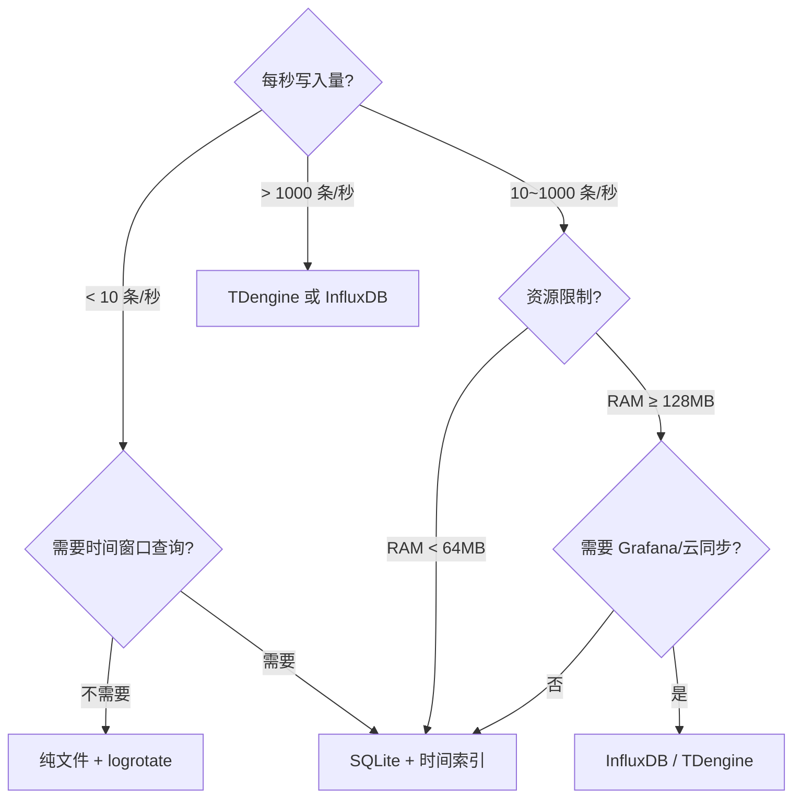

---
tags:
  - 数据库
  - 嵌入式
title: 时序库与边缘存储选型
description: 指标、日志与时序数据的存储方案对比——SQLite、TDengine、InfluxDB、文件轮转
date: 2026/05/16
---

# 时序库与边缘存储选型

嵌入式/边缘设备上的数据可以分为三类：**配置**（键值、拓扑）、**时序指标**（CPU 温度、PPS、丢包率）、**日志/事件**（文本行、告警）。不同类型适合不同存储方案，本文帮你做选型决策。

---

## 1. 数据分类与存储匹配

| 数据类型 | 特点 | 推荐存储 |
|----------|------|----------|
| **配置** | 键值，低频写，高频读，需要关系查询 | SQLite（见 [[数据库/SQLite 嵌入式配置库]]）|
| **时序指标** | 高频写（每秒多条），时间索引查询，需聚合 | 时序库 / SQLite + 时间索引 |
| **日志文本** | 顺序追加，偶尔查询，需要轮转 | 文件 + logrotate |
| **告警事件** | 离散，低频，需要查询历史 | SQLite |
| **大量历史指标** | 需要降采样、云端同步 | TDengine / InfluxDB 边缘版 / 云 |

---

## 2. 方案一：纯文件 + 轮转（最简单）

```bash
# /etc/logrotate.d/myapp
/var/log/myapp.log {
    daily           # 每天轮转
    rotate 7        # 保留 7 份
    compress        # gzip 压缩旧文件
    missingok       # 文件不存在时不报错
    notifempty      # 文件为空时不轮转
    postrotate
        kill -HUP $(cat /var/run/myapp.pid)  # 通知程序重新打开日志文件
    endscript
}
```

**适合：**
- 日志量不大（< 10MB/天）
- 不需要按时间查询
- 资源极其有限

**不适合：**
- 需要"查过去 1 小时的丢包统计"
- 需要按字段过滤

---

## 3. 方案二：SQLite + 时间索引

用 SQLite 存时序数据，加时间列索引：

```sql
CREATE TABLE metrics (
    ts      INTEGER NOT NULL,   -- Unix 时间戳（秒或毫秒）
    name    TEXT NOT NULL,      -- 指标名，如 "cpu_temp"
    value   REAL NOT NULL,
    PRIMARY KEY (ts, name)
);

-- 时间查询索引
CREATE INDEX idx_ts ON metrics(ts);

-- 写入（批量，用事务）
BEGIN TRANSACTION;
INSERT INTO metrics VALUES (1717000000, 'cpu_temp', 68.5);
INSERT INTO metrics VALUES (1717000000, 'pps_rx',   123456);
COMMIT;

-- 查询过去 1 小时的平均温度
SELECT AVG(value) FROM metrics
WHERE name = 'cpu_temp'
  AND ts >= strftime('%s','now','-1 hour');

-- 查询并降采样（每分钟一个点）
SELECT ts / 60 AS minute, AVG(value)
FROM metrics
WHERE name = 'cpu_temp'
GROUP BY minute
ORDER BY minute DESC
LIMIT 60;
```

**适合：**
- 指标数量少（< 20 种）
- 写入频率低（< 100 条/秒）
- 需要 SQL 查询灵活性

**维护：定期清理旧数据**

```sql
-- 只保留最近 7 天
DELETE FROM metrics WHERE ts < strftime('%s','now','-7 days');

-- 压缩碎片
VACUUM;
```

---

## 4. 方案三：TDengine（边缘时序库）

TDengine 是专为时序场景设计的数据库，有轻量的**边缘版（TDengine Edge）**：

```sql
-- 建超级表（模板）
CREATE STABLE devices (
    ts TIMESTAMP,
    cpu_temp FLOAT,
    pps_rx BIGINT
) TAGS (device_id VARCHAR(20));

-- 每个设备建子表
CREATE TABLE device_001 USING devices TAGS ("dev_001");

-- 写入
INSERT INTO device_001 VALUES (NOW, 68.5, 123456);

-- 时间窗口聚合（内置，无需手写 GROUP BY）
SELECT LAST(cpu_temp), AVG(pps_rx)
FROM device_001
INTERVAL(1m)        -- 1 分钟窗口
SLIDING(30s)        -- 滑动步长 30 秒
WHERE ts >= NOW - 1h;
```

**TDengine 特点：**

| 特性 | 说明 |
|------|------|
| **写入性能** | 百万级 rows/s（边缘版 ~ 10 万级）|
| **压缩** | 时序数据压缩比约 10:1 |
| **保留策略** | 内置 TTL，自动删除旧数据 |
| **REST API** | 可直接上云同步 |
| **资源占用** | 边缘版 ~128MB RAM 起步 |

---

## 5. 方案四：InfluxDB（OSS/Edge）

InfluxDB 采用 **Line Protocol** 写入，适合 Grafana 可视化栈：

```bash
# Line Protocol 格式：measurement,tag=val field=val timestamp
curl -X POST "http://localhost:8086/api/v2/write?bucket=edge&org=myorg" \
  -H "Authorization: Token mytoken" \
  --data-raw "cpu_temp,device=dev001 value=68.5 $(date +%s)000000000"
```

**与 TDengine 对比：**

| 维度 | InfluxDB | TDengine |
|------|----------|----------|
| 生态 | Grafana 原生支持，Telegraf 集成 | 有 Grafana 插件，生态较小 |
| SQL | 类 SQL（Flux）| 标准 SQL 扩展 |
| 中国社区 | 较少 | 活跃（国内项目）|
| 资源 | 较重（~256MB+）| 较轻 |

---

## 6. 选型决策树



---

## 7. 实践问题清单

在选型前先回答这些问题：

- **保留多久的数据？**（1天/7天/30天 → 影响存储规划）
- **单台设备有多少种指标，写入频率多高？**（决定方案边界）
- **断网时缓冲多久？**（边缘写本地，上云则需消息队列）
- **是否需要降采样？**（分钟/小时聚合 → 时序库内置支持）
- **是否需要 Grafana 可视化？**（InfluxDB / TDengine 有插件）
- **RAM 限制是多少？**（决定能否跑时序库进程）

---

## 8. 推荐搭配

**轻量嵌入式（RAM < 64MB）**：文件轮转（日志）+ SQLite（配置 + 少量指标）

**中等嵌入式（RAM 128~512MB）**：SQLite（配置）+ TDengine Edge（指标）+ 文件（系统日志）

**边缘网关（RAM > 512MB，有云同步需求）**：SQLite（配置）+ InfluxDB/TDengine（指标 + 告警）+ Grafana 本地看板

---

## 延伸阅读

- [[数据库/SQLite 嵌入式配置库]]（配置类数据的首选）
- [[linux/OTA/远程日志与最小可观测]]（日志上云架构）
- [[数据库/PostgreSQL 中的物理复制与逻辑复制：机制、差异与选型]]（云端/中心侧数据库）
