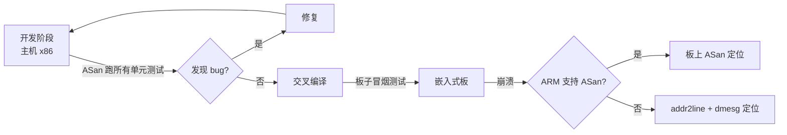

---
tags:
  - 调试
title: ASan 与 Valgrind 桌面验证
description: 在主机侧用 ASan 和 Valgrind 发现内存错误，再移植到嵌入式
date: 2026/05/16
---

# ASan 与 Valgrind 桌面验证

嵌入式的内存 bug（越界、use-after-free、泄漏）在板子上极难复现，因为没有调试工具、日志有限、甚至崩溃现象完全随机。

**正确策略**：先在 **x86 主机**上用 AddressSanitizer（ASan）和 Valgrind 做充分验证，再交叉编译上板。大多数内存 bug 在桌面上能被这两个工具精确定位。

---

## 1. AddressSanitizer（ASan）

ASan 是 LLVM/GCC 内置的内存错误检测工具，编译时插桩，**运行时**检测。

### 1.1 开启方式

```bash
# GCC / Clang 均支持
gcc -fsanitize=address -g -O1 -o app app.c
# 或 C++
g++ -fsanitize=address -g -O1 -o app app.cpp

# 运行（ASan 错误会打印到 stderr）
./app
```

**注意**：`-O1` 或更高可以保留大多数调试信息，同时让 ASan 的误报减少；`-O0` 也可以用。

### 1.2 能检测什么

| 错误类型 | 典型场景 |
|----------|----------|
| **堆越界写** | `buf[size] = 0;`（off-by-one） |
| **堆越界读** | `int x = buf[size];` |
| **栈越界** | 超出栈数组边界 |
| **use-after-free** | `free(p); *p = 1;` |
| **use-after-return** | 返回栈变量的指针后再用 |
| **double-free** | `free(p); free(p);` |
| **内存泄漏**（需 LSan） | `malloc` 后不 `free` |

### 1.3 典型错误报告解读

```text
=================================================================
==12345==ERROR: AddressSanitizer: heap-buffer-overflow on address 0x602000000010
READ of size 4 at 0x602000000010 thread T0
    #0 0x5555555551a8 in process_array /home/user/app.c:23
    #1 0x555555555102 in main /home/user/app.c:10
    #2 0x7f8a3c4b1082 in __libc_start_main

0x602000000010 is located 0 bytes to the right of 10-byte region [0x602000000006, 0x602000000010)
allocated by thread T0 here:
    #0 0x7f8a... in malloc
    #1 0x55555555510a in main /home/user/app.c:8
```

**解读**：
- `heap-buffer-overflow`：堆越界读
- `READ of size 4`：读了 4 字节
- `#0 process_array /home/user/app.c:23`：发生在这行
- `0 bytes to the right of 10-byte region`：正好越过了一个 10 字节 buffer 的末尾（off-by-one）

### 1.4 内存泄漏检测（LeakSanitizer）

ASan 内置了 LeakSanitizer，程序正常退出时报告泄漏：

```bash
# 默认开启，或显式设置
ASAN_OPTIONS=detect_leaks=1 ./app

# 退出时输出：
# =================================================================
# ==12345==ERROR: LeakSanitizer: detected memory leaks
#
# Direct leak of 1024 byte(s) in 1 object(s) allocated from:
#     #0 0x... in malloc
#     #1 0x... in create_buffer /app.c:15
```

---

## 2. Valgrind

Valgrind 是一个虚拟机框架，**无需重新编译**即可检测内存错误，但速度比 ASan 慢（约 10-50x）。

### 2.1 开启方式

```bash
# 基本内存检测（Memcheck 工具）
valgrind --leak-check=full --show-leak-kinds=all --track-origins=yes ./app

# 常用选项说明：
# --leak-check=full      显示每处泄漏的完整调用栈
# --show-leak-kinds=all  包括 definitely/indirectly/possibly lost
# --track-origins=yes    跟踪未初始化值的来源（速度更慢但信息更丰富）
# --error-exitcode=1     检测到错误时退出码非零（方便 CI）
```

### 2.2 典型报告解读

**use-after-free：**
```text
==12345== Invalid read of size 4
==12345==    at 0x108697: process (app.c:25)
==12345==    by 0x10868B: main (app.c:15)
==12345==  Address 0x5204040 is 0 bytes inside a block of size 10 free'd
==12345==    at 0x4C2FB0F: free (vg_replace_malloc.c:540)
==12345==    by 0x108686: main (app.c:12)
```

**内存泄漏：**
```text
==12345== LEAK SUMMARY:
==12345==    definitely lost: 1,024 bytes in 1 blocks
==12345==    indirectly lost: 0 bytes in 0 blocks
==12345==      possibly lost: 0 bytes in 0 blocks
==12345==    still reachable: 0 bytes in 0 blocks
==12345==         suppressed: 0 bytes in 0 blocks
```

- `definitely lost`：明确泄漏，必须修复
- `indirectly lost`：被泄漏指针指向的内存
- `possibly lost`：可能泄漏（指针指向内存中间部分）
- `still reachable`：程序退出时仍可访问，通常是全局对象，可以忽略

### 2.3 未初始化值

```text
==12345== Conditional jump or move depends on uninitialised value(s)
==12345==    at 0x108670: process (app.c:20)
```

这是很常见但容易忽略的 bug——使用了未初始化的变量。加 `--track-origins=yes` 可以追踪变量在哪里分配但没有初始化。

---

## 3. ASan vs Valgrind 选型

| 维度 | ASan | Valgrind |
|------|------|----------|
| **速度** | 2~5x 减速 | 10~50x 减速 |
| **需要重新编译** | 是（需 `-fsanitize=address`） | 否 |
| **嵌入式可用** | 部分支持（工具链和目标板需支持） | 只模拟 x86，不支持 ARM |
| **能检测的错误** | 更全（含栈越界） | 更全（含未初始化值） |
| **CI 友好** | 非常适合（速度快） | 适合（无需改编译命令） |
| **典型用途** | 开发阶段每次构建都跑 | 怀疑有内存问题时深度分析 |

**推荐组合**：
- 日常 CI：ASan（速度快，几乎不影响开发流程）
- 深度排查：Valgrind + `--track-origins`

---

## 4. 嵌入式场景的策略



### 4.1 ARM 板上使用 ASan

部分工具链和内核支持在 ARM 上使用 ASan：

```bash
# 交叉编译时开启 ASan
arm-linux-gnueabihf-gcc -fsanitize=address -g -O1 -o app app.c

# 需要 libasan.so 在目标板上
# 通常在 toolchain 的 sysroot/lib 里
# 复制到板子的 /usr/lib/
```

### 4.2 嵌入式不支持 ASan 时

退回到 KASAN（内核内存检测，需配置内核）+ addr2line + 用户态 ASan 在主机上验证逻辑：

```bash
# 内核侧：
CONFIG_KASAN=y
CONFIG_KASAN_INLINE=y
# 用于检测内核内存越界，与用户态 ASan 无关
```

---

## 5. CI 集成

```yaml
# GitHub Actions 示例
- name: Build with ASan
  run: |
    cmake -DCMAKE_C_FLAGS="-fsanitize=address -g" -DCMAKE_EXE_LINKER_FLAGS="-fsanitize=address" ..
    make -j$(nproc)

- name: Run tests with ASan
  run: |
    ASAN_OPTIONS=detect_leaks=1:abort_on_error=1 ./run_tests
```

`abort_on_error=1` 让 ASan 检测到错误时直接崩溃（产生 core），便于 CI 捕获。

---

## 延伸阅读

- [[系统调试/coredump 分析基础]]（结合 core 分析 ASan 发现的崩溃）
- [[编程语言/C/C++ Sanitizer 与单元测试入门]]（ASan + UBSan + MSan 组合）
- [[工程基础/GitHub Actions 与嵌入式 CI 入门]]（CI 集成）
- [[系统调试/排障 SOP：日志、perf 与反汇编]]
