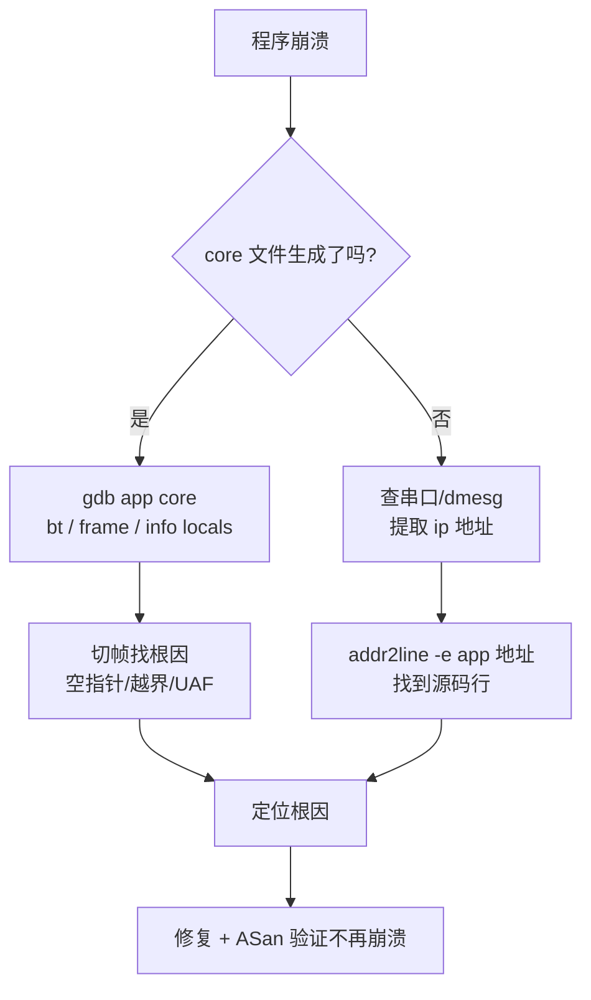

---
tags:
  - 调试
title: coredump 分析基础
description: ulimit、core_pattern、GDB 分析崩溃栈、嵌入式限制与 addr2line 替代
date: 2026/05/16
---

# coredump 分析基础

程序崩溃时，内核可以把进程的内存快照转储到文件——这就是 **core dump**（核心转储）。借助 GDB 或 `addr2line`，可以精确定位崩溃发生在哪行代码，**而不需要复现**。

---

## 1. 启用 core dump

默认情况下，很多系统把 core dump 大小限制为 0（不产生）：

```bash
# 查看当前限制（0 = 禁用）
ulimit -c

# 临时开启（当前 shell 有效）
ulimit -c unlimited

# 永久开启（/etc/security/limits.conf）
echo "* soft core unlimited" >> /etc/security/limits.conf
echo "* hard core unlimited" >> /etc/security/limits.conf
```

### 1.1 配置输出路径

`/proc/sys/kernel/core_pattern` 控制 core 文件的命名和存放位置：

```bash
# 查看当前配置
cat /proc/sys/kernel/core_pattern
# systemd 默认接管：|/usr/lib/systemd/systemd-coredump %P %u %g %s %t %c %h

# 改为固定路径（嵌入式常用）
echo "/tmp/core.%e.%p.%t" | sudo tee /proc/sys/kernel/core_pattern
```

**格式说明：**

| 占位符 | 含义 |
|--------|------|
| `%e` | 可执行文件名 |
| `%p` | 进程 PID |
| `%t` | 时间戳（Unix 时间） |
| `%s` | 触发 core 的信号编号 |
| `%u` / `%g` | UID / GID |

### 1.2 验证配置生效

```bash
# 触发一个 SIGSEGV，检查 core 是否生成
sleep 100 &
kill -SIGSEGV $!
ls /tmp/core.*
```

---

## 2. GDB 分析 core dump

### 2.1 基本分析流程

```bash
# 加载可执行文件和 core
gdb ./app /tmp/core.app.12345

# 常用命令序列：
(gdb) bt              # 打印崩溃时的调用栈（backtrace）
(gdb) bt full         # 包含所有帧的局部变量
(gdb) frame 3         # 切换到第 3 帧
(gdb) info locals     # 查看当前帧的局部变量
(gdb) info args       # 查看当前帧的函数参数
(gdb) p my_var        # 打印变量值
(gdb) x/10x 0xdeadbeef  # 查看内存（16进制，10个字）
(gdb) info registers  # 查看所有寄存器
```

### 2.2 典型 backtrace 解读

```text
Program received signal SIGSEGV, Segmentation fault.
0x00007f8a3c4b12a3 in std::string::size() const ()
   from /lib/x86_64-linux-gnu/libstdc++.so.6

(gdb) bt
#0  0x00007f8a3c4b12a3 in std::string::size() const ()
#1  0x0000555555555261 in process_data (data=0x0) at main.cpp:42
#2  0x0000555555555199 in main () at main.cpp:18
```

**解读：**
- 崩溃在 `std::string::size()`，但这只是触发点
- 往上看：`process_data` 在 `main.cpp:42` 传了一个 `data=0x0`（空指针）
- 真正的 bug 在 `main.cpp:18`，没有检查指针是否为空就传给了 `process_data`

### 2.3 多线程程序

```bash
(gdb) info threads          # 查看所有线程
(gdb) thread 3              # 切换到线程 3
(gdb) thread apply all bt   # 打印所有线程的栈（排查死锁很有用）
```

---

## 3. 编译时必须保留调试信息

**没有调试信息，backtrace 只有地址，没有行号：**

```bash
# 没有 -g，backtrace 里只有 ??
gcc -O2 -o app app.c
(gdb) bt
#0  0x0000555555554a1b in ?? ()

# 加 -g，有行号有变量
gcc -g -O1 -o app app.c
(gdb) bt
#0  crash_func (p=0x0) at app.c:15
#1  0x000055555555491f in main () at app.c:30
```

**生产环境最佳实践**：
- 生产版本：`-O2`，不带 `-g`（体积小）
- 同时保留一份**带 `-g` 的 debug 符号包**（`.debug` 文件）
- GDB 加载：`gdb --symbols app.debug core`

---

## 4. addr2line：没有 GDB 时的替代

嵌入式板子上往往没有 GDB，只有崩溃日志里的地址：

```bash
# 从 dmesg / 串口日志获取崩溃地址
# [12345.678] myapp[1234]: segfault at 0 ip 000000000040152a sp ...

# 在主机上用 addr2line 解析（需要有调试符号的二进制）
addr2line -e ./app 0x000000000040152a
# 输出：/home/user/project/src/network.c:124

# 加 -f 同时显示函数名
addr2line -e ./app -f 0x000000000040152a
# 输出：
# process_packet
# /home/user/project/src/network.c:124
```

**交叉编译场景**：用目标架构的工具链前缀：

```bash
# ARM 目标
arm-linux-gnueabihf-addr2line -e ./app 0x00012345

# aarch64 目标
aarch64-linux-gnu-addr2line -e ./app 0x00012345
```

---

## 5. 嵌入式环境的限制与应对

| 挑战 | 解决方案 |
|------|----------|
| 存储空间不足，无法保存完整 core | 压缩后上传（`gzip core`），或只保留最后一次 |
| 内存太小，core 不完整 | 结合串口日志 + `addr2line` 定位关键帧 |
| rootfs 只读，无法写 core | 挂载 tmpfs 或配置写入 eMMC data 分区 |
| 生产版本 strip 了符号 | 交叉编译时同时出 `.debug` 包，主机侧分析 |
| 没有 GDB | `addr2line` + 崩溃地址 + 串口调用栈日志 |

### 5.1 嵌入式 core_pattern 配置

```bash
# 写到可写数据分区
echo "/data/core.%e.%p" | tee /proc/sys/kernel/core_pattern

# 或用压缩管道
echo "|/usr/bin/gzip -c > /data/core.%e.%p.gz" | tee /proc/sys/kernel/core_pattern
```

### 5.2 从 dmesg 提取用户态崩溃信息

```bash
dmesg | grep "segfault at"
# 示例输出：
# [12345.678] myapp[1234]: segfault at 0 ip 000000000040152a sp 00007ffd12345678 error 4 in myapp[400000+5000]
#
# ip = 崩溃指令地址（直接喂给 addr2line）
# myapp[400000+5000] = 映射基址+大小（ASLR 关闭时用 ip 即可）
```

---

## 6. 完整调试流程



---

## 延伸阅读

- [[系统调试/ASan 与 Valgrind 桌面验证]]（在崩溃前就发现内存错误）
- [[系统调试/反汇编在嵌入式问题定位中的应用：环境、工具与可读性]]（没有行号时看汇编）
- [[系统调试/排障 SOP：日志、perf 与反汇编]]
