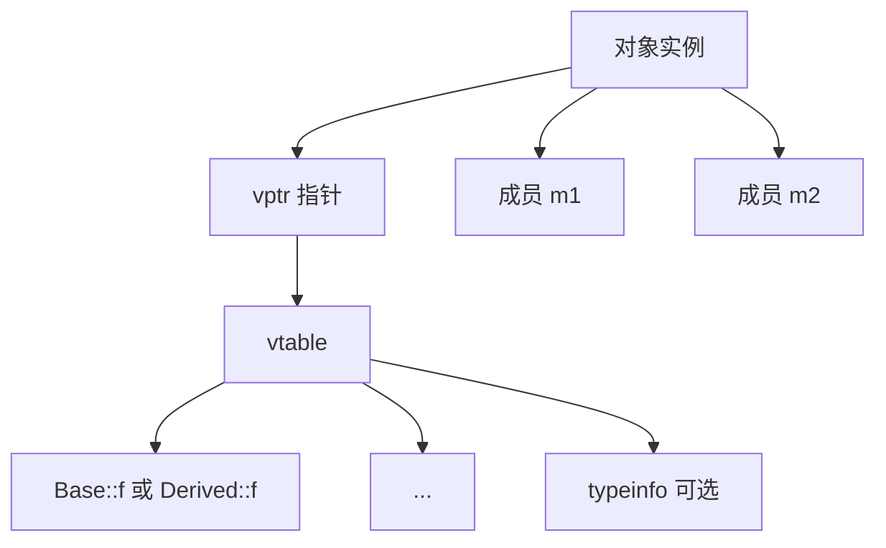

---
tags:
  - C++
  - ABI
  - 调试
title: C++ ABI 深读
description: vtable、Itanium ABI、name mangling 与 coredump 对照
date: 2026/05/21
---

# C++ ABI 深读

**ABI（Application Binary Interface）** 规定 **对象在内存中的布局、符号名、调用约定**。读 [[系统调试/coredump 分析基础]]、混用 [[C 与 C++ 混用]] 时，必须能看懂 **vtable（虚函数表）** 与 **mangled 符号**。

---

## 1. 读完能带走什么

- 能解释 **多态如何实现**（vtable + vptr）。  
- 会用 `c++filt` / `nm` 读符号。  
- 知道 **虚继承、RTTI** 对布局的额外影响。

---

## 2. C vs C++ 链接名

| 语言 | 符号 `void foo(int)` |
|------|----------------------|
| **C** | `foo` |
| **C++** | `_Z3fooi`（Itanium mangling） |

```bash
nm -C app          # demangle
c++filt _Z3fooi
```

**`extern "C"`** 强制 C 链接，见 [[C 编译链接与 ABI]]。

---

## 3. 无虚函数：POD 布局

```cpp
struct Point { int x; int y; };
```

与 C struct **通常** 一致（同对齐 pragma 下）；可用于 **C API 头**。

---

## 4. 单继承 + 虚函数



| 部分 | 说明 |
|------|------|
| **vptr** | 对象 **开头**（常见实现）指向 vtable |
| **vtable** | 函数指针数组 + RTTI 信息 |
| **派生** | 新增成员在基类子对象之后 |

```cpp
struct Base {
    virtual void f();
    int b;
};
struct Derived : Base {
    void f() override;
    int d;
};
```

**sizeof(Derived)** ≥ 基类 + `d` + 可能 vptr 已含在基类布局。

---

## 5. 多继承

- 每个 **有虚函数的基类** 可能有 **独立 vptr**。  
- **指针转换**：`Derived*` → `Base2*` 可能需要 **调整 this 指针**（thunk）。  
- **不要** 把多继承对象当 C struct 传给 C。

---

## 6. 虚继承

解决 **菱形继承** 下基类子对象重复；布局 **更复杂**（vbptr 等）。  
日常工程：**优先组合** 代替复杂虚继承；读 coredump 时再查具体编译器布局。

---

## 7. RTTI

| 机制 | 需要 | 开销 |
|------|------|------|
| `typeid` | `-frtti` | typeinfo 数据 |
| `dynamic_cast` | 多态类 + RTTI | 运行期查表 |

嵌入式常 **`-fno-rtti`**，见 [[嵌入式 C++ 编译约束]]。

---

## 8. 调用约定（x86-64 简表）

System V AMD64 ABI（Linux/macOS 常见）：

| 参数 | 传递 |
|------|------|
| 前 6 个整型/指针 | `RDI, RSI, RDX, RCX, R8, R9` |
| 浮点 | `XMM0-7` |
| 返回值 | `RAX` / `XMM0` |
| 栈 | 第 7 个起参数、对齐 16B |

与 [[linux/学习路径/嵌入式体系结构入门]] ARM EABI 不同；**交叉调试** 时核对目标 ISA。

---

## 9. coredump 对照

```bash
gdb ./app core
(gdb) bt
(gdb) info vtbl obj
(gdb) p *(Derived*)ptr
```

| 现象 | 可能 |
|------|------|
| crash 在 `0x0` 附近 | 空 vptr / 已销毁对象 |
| `pure virtual method called` | 构造/析构中调虚函数 |
| 符号 `_ZTV...` | vtable 相关 |

流程见 [[系统调试/排障 SOP：日志、perf 与反汇编]]、[[反汇编在嵌入式问题定位中的应用：环境、工具与可读性]]。

---

## 10. 与对象模型规则

- **Rule of 0/5** 管理资源；**虚析构** 当基类指针 `delete` 派生对象。  
- **多态基类** 析构函数 **virtual**，否则 UB。

见 [[C++ 对象模型与 Rule of Zero-Three-Five]]。

---

## 11. 检查清单

- [ ] 公共导出 API 用 **`extern "C"`** 或 stable C 布局  
- [ ] 基类指针释放派生对象 → **虚析构**  
- [ ] 用 `nm -C` 确认链接的是预期符号  
- [ ] 嵌入式是否 **关闭 RTTI** 与代码一致  

---

## 延伸阅读

- [[C 编译链接与 ABI]]
- [[C 与 C++ 混用]]
- [[PMR 与自定义分配器]]
