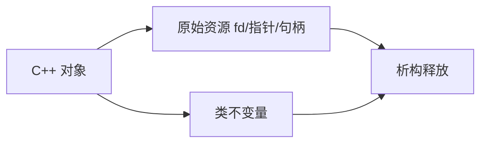
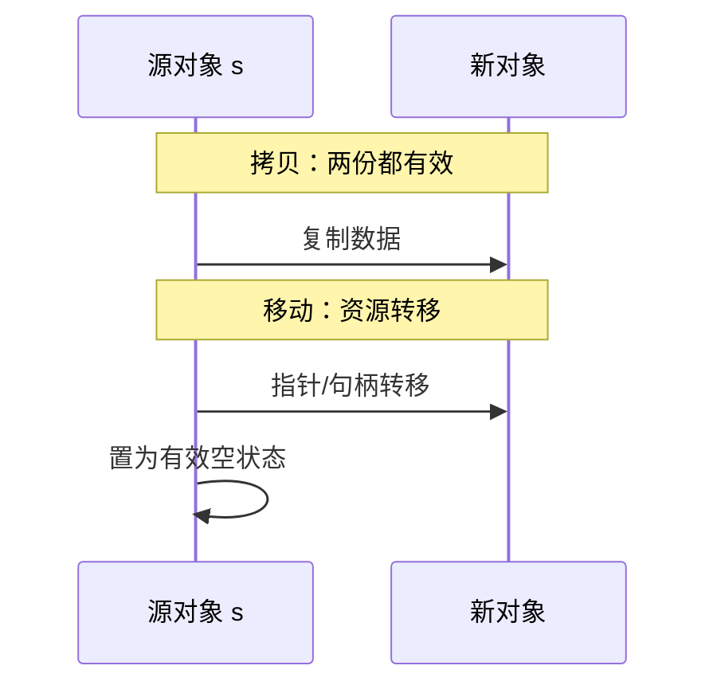

---
tags:
  - C++
  - RAII
  - 对象模型
title: C++ 对象模型与 Rule of Zero-Three-Five
description: 特殊成员、值类别、资源管理与 RAII 深化
date: 2026/05/21
---

# C++ 对象模型与 Rule of Zero-Three-Five

[[RAII]] 是原则；本篇讲 **对象在内存里是什么、编译器默认生成什么、何时手写/禁用什么**。与 [[C 内存模型与未定义行为]] 对照：C++ 用 **析构 + 移动** 把资源生命周期绑进类型系统。

---

## 1. 读完能带走什么

- 能解释 **Rule of 0 / 3 / 5 / 6** 选型。  
- 理解 **拷贝 vs 移动** 与资源唯一性。  
- 能写出 **异常安全** 的基本保证。

---

## 2. 对象 = 资源 + 不变量



**类不变量**：任意 public 方法调用前后为真（如 `size <= capacity`）。**RAII** 保证离开作用域时不变量仍成立且资源已释放。

---

## 3. 特殊成员函数（Rule of 5）

编译器可 **隐式生成** 或你 **= default / = delete / 自定义**：

| 函数 | 典型职责 |
|------|----------|
| **析构 ~T()** | 释放资源 |
| **拷贝构造 T(const T&)** | 深拷贝 |
| **拷贝赋值 operator=(const T&)** | 深拷贝 + 释放旧资源 |
| **移动构造 T(T&&)** | 窃取资源，源置空 |
| **移动赋值 operator=(T&&)** | 同上 |

### 3.1 Rule of 3

若你 **自定义析构、拷贝构造、拷贝赋值之一**，通常 **三个都要** 自定义（管理资源的类）。

### 3.2 Rule of 5

C++11 起加上 **移动构造 / 移动赋值**；资源类应五者一致或 **= default** 委托给成员。

### 3.3 Rule of 0（优先）

**成员全是** 已有 RAII 类型（`std::string`、`std::vector`、`std::unique_ptr`）→ **不要** 写任何特殊成员，编译器生成的就正确。

```cpp
class Session {
    std::string name_;
    std::vector<uint8_t> buf_;
    std::unique_ptr<Connection> conn_;
    /* Rule of 0：无需手写 ~ 拷贝 移动 */
};
```

### 3.4 Rule of 6（C++11）

若 **= delete** 拷贝，常同时 **= default** 移动，或全 delete 成 **不可拷贝类型**。

---

## 4. 拷贝 vs 移动



| 操作 | 源对象之后 | 成本 |
|------|------------|------|
| **拷贝** | 仍有效 | 分配 + 复制 |
| **移动** | 可析构的空壳 | 常 O(1) |

```cpp
std::vector<int> a = {1,2,3};
std::vector<int> b = std::move(a);  /* a 仍可析构，但不应再读 a 的内容 */
```

详见 [[C++11#0.1.4 右值引用 + move]]。

---

## 5. 值类别与 forwarding

| 类别 | 例子 | 可绑定 |
|------|------|--------|
| **lvalue** | 有名变量 | `T&` |
| **rvalue** | 临时量、`std::move(x)` | `T&&` |
| **xvalue** | 将亡值 | `T&&` |

**完美转发**：模板 `T&&` + `std::forward<T>`，见 [[模板元编程基础]]。

---

## 6. 三/五法则示例（管理 fd）

```cpp
class Fd {
    int fd_ = -1;
public:
    explicit Fd(int fd) : fd_(fd) {}
    ~Fd() { if (fd_ >= 0) ::close(fd_); }

    Fd(const Fd&) = delete;
    Fd& operator=(const Fd&) = delete;

    Fd(Fd&& o) noexcept : fd_(o.fd_) { o.fd_ = -1; }
    Fd& operator=(Fd&& o) noexcept {
        if (this != &o) {
            if (fd_ >= 0) ::close(fd_);
            fd_ = o.fd_;
            o.fd_ = -1;
        }
        return *this;
    }
    int get() const { return fd_; }
};
```

**更优**：直接用 **unique_ptr 自定义 deleter** 或第三方 RAII wrapper → 回到 **Rule of 0**。

---

## 7. 异常安全

| 等级 | 保证 |
|------|------|
| **basic** | 异常后无泄漏，对象仍可析构 |
| **strong** | 失败则状态不变 |
| **nothrow** | 不抛异常 |

**copy-and-swap** 惯用法实现 strong 赋值：

```cpp
Friend& operator=(Friend other) noexcept {
    swap(*this, other);
    return *this;
}
```

嵌入式禁用异常时用 **expected/错误码**，见 [[嵌入式 C++ 编译约束]]。

---

## 8. 与 C / DPDK 边界

- C++ 类 **不要** 作为参数穿过 `extern "C"` API；在 shim 里 **unwrap** 成 C 指针。  
- **不要** 把含 C++ 虚表的指针交给 C 长期保存（除非全链路 C++）。见 [[C 与 C++ 混用]]。

---

## 9. 检查清单

- [ ] 资源类先考虑 **Rule of 0**  
- [ ] 需要独占资源时 **delete 拷贝**、实现 **移动**  
- [ ] 移动操作标 **noexcept**（STL 容器优化）  
- [ ] 赋值实现 **自赋值安全**  
- [ ] 与 C API 交界用 **薄包装**，不在边界抛异常  

---

## 延伸阅读

- [[RAII]]
- [[内存模型]]
- [[STL 容器算法手册]]
- [[C/C++ Sanitizer 与单元测试入门]]
