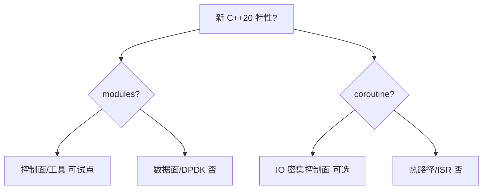
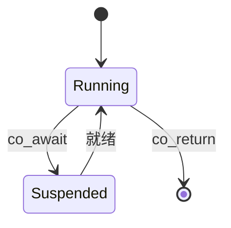
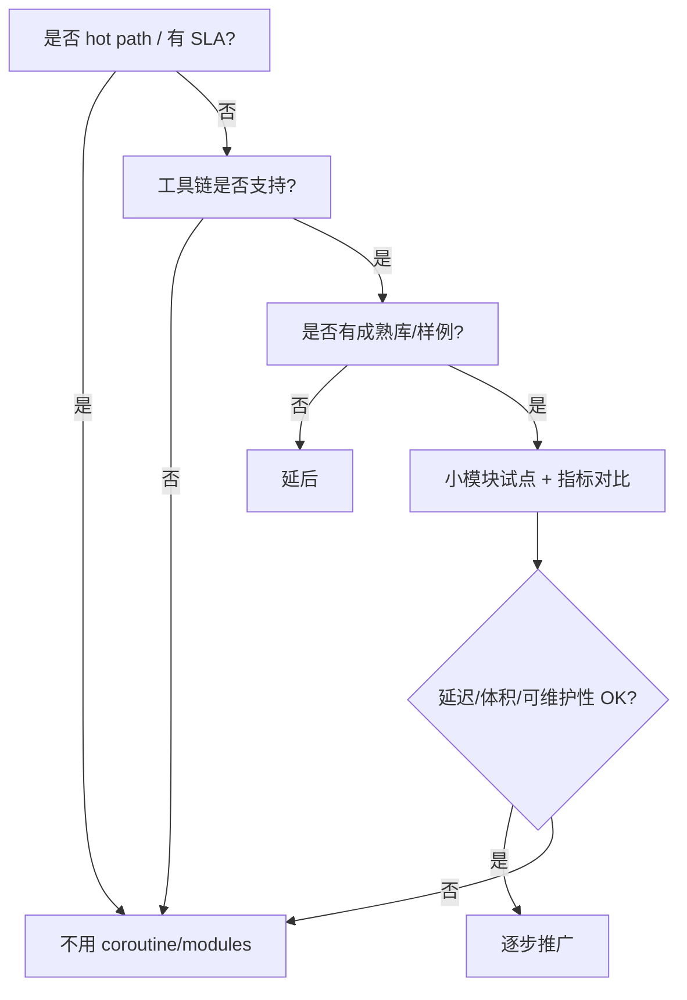

---
tags:
  - C++
  - C++20
  - 嵌入式
  - DPDK
title: C++20 协程与 Modules 选用决策
description: 嵌入式 Linux 与 DPDK 数据面是否引入 coroutine/modules
date: 2026/05/21
---

# C++20 协程与 Modules 选用决策

[[C++20]] 已介绍 **coroutine（协程）** 与 **modules（模块）** 语法；本篇回答：**在嵌入式 Linux 与 DPDK 项目里要不要用、用在哪一层**。结论先行：**控制面可评估，数据面默认不用**。

---

## 1. 读完能带走什么

- **协程 / Modules** 各解决什么、代价是什么。  
- **嵌入式 / DPDK** 下的 **默认建议** 与例外。  
- 若采用，需要的 **工具链与团队** 条件。

---

## 2. 决策总览

| 特性 | 数据面 / DPDK hot path | 嵌入式 Linux 控制面 | 内核/驱动 |
|------|------------------------|---------------------|-----------|
| **coroutine** | ❌ 默认否 | ⚠️ 可选 | ❌ |
| **modules** | ❌ 默认否 | ⚠️ 试点 | ❌ |

---

## 3. Coroutine（协程）

### 3.1 是什么

**可挂起/恢复的函数**（`co_await` / `co_yield` / `co_return`），编译器展开为 **状态机**。见 [[C++20#3 coroutine 协程]]。

### 3.2 优势

| 点 | 说明 |
|----|------|
| 异步 IO 表达 | 少回调嵌套 |
| 状态机代码量 | 生成器、协议解析状态 |

### 3.3 代价与风险

| 风险 | 说明 |
|------|------|
| **堆分配** | 默认 promise 可能 `new`；嵌入式需定制 allocator |
| **异常** | 与 `-fno-exceptions` 冲突 → [[嵌入式 C++ 编译约束]] |
| **调试** | 栈与状态机难读；coredump 分析成本高 [[C++ ABI 深读]] |
| **确定性** | 挂起点增加 **延迟上界** 分析难度；不适合 hard RT |
| **生态** | 标准库协程设施仍薄；需第三方（libunifex、asio 等） |

### 3.4 建议

| 场景 | 建议 |
|------|------|
| **DPDK 转发环** | **不用**；用 run-to-completion + 状态机显式 |
| **管理面 HTTP/配置** | 可评估 **Asio + co_await**（GCC 10+ / Clang） |
| **资源极紧 MCU** | **不用** |
| **已有 epoll reactor** | 维持 [[网络与DPDK/网络编程/IO 多路复用：select、poll、epoll 与并发模型]]，协程非必须 |

**若采用**：统一 promise 分配策略（**PMR / 静态池** [[PMR 与自定义分配器]]）、全项目 **异常策略** 一致、benchmark 对比 **p99 延迟**。

---

## 4. Modules（模块）

### 4.1 是什么

用 **`import`** 替代 `#include` 文本展开，**编译期模块边界**。见 [[C++20#4 modules 替代头文件]]。

### 4.2 优势

- 编译加速（大项目）  
- 减少宏污染  
- 接口与实现分离更清晰  

### 4.3 代价与风险

| 风险 | 说明 |
|------|------|
| **工具链** | 需 **GCC 11+ / Clang 16+** 成熟模块；CMake 3.28+ 改善 |
| **交叉编译** | 目标 sysroot 模块 BMI 分发复杂 |
| **与 C 混用** | DPDK **C 头** 仍要 include；边界混乱 [[C 与 C++ 混用]] |
| **生态** | 第三方库多数仍 header-only / include |
| **调试/IDE** | 索引与跳转仍不如头文件普及 |

### 4.4 建议

| 场景 | 建议 |
|------|------|
| **DPDK + 大量 C API** | **不用 modules** 包数据面 |
| **纯 C++ 工具/CLI** | 可 **试点** 一个 module |
| **Yocto/Buildroot 老 toolchain** | **等** 升级后再议 |
| **库作者** | 观察上游；生产仍以 include 为主 |

**若试点**：从 **无宏、无 C 头依赖** 的纯 C++ 工具开始；**不要** 第一个 module 就包 `rte_ethdev.h`。

---

## 5. 与现有技术选型对照

| 需求 | 更成熟替代 | 协程/modules 位置 |
|------|------------|-------------------|
| 多 worker 数据面 | DPDK lcore + ring | 不引入 |
| 控制面并发 | epoll + 线程池 [[线程池技术详解]] | 协程可选 |
| 编译速度 | ccache、PCH、减少头文件依赖 | modules 长期选项 |
| 异步 RPC | [[RPC 技术与分层详解]] + 线程/事件 | 协程可简化客户端 |

---

## 6. 工具链最低线（若采用）

| 特性 | 建议最低 |
|------|----------|
| coroutine | GCC ≥ 10，Clang ≥ 14；明确 `-std=c++20` |
| modules | GCC ≥ 13 或 Clang ≥ 16；CMake ≥ 3.28 |
| 嵌入式 | 与 **目标 BSP** 编译器版本表对齐 |

在 [[linux/学习路径/应用交叉编译实战指南]] 中记录 **宿主机 vs 目标** 版本，避免「桌面能编、交叉不能」。

---

## 7. 决策流程（团队用）

---

## 8. 一句话建议

> **DPDK 数据面**：C + 显式状态机 + 绑核，**不要** coroutine/modules。  
> **Linux 用户态控制面**：C++17/20 常规特性 + epoll 足够；协程 **可选** 于 IO 密集新服务；modules **仅工具链就绪后小范围试点**。

语法细节继续看 [[C++20]]；对象模型与 ABI 见 [[C++ 对象模型与 Rule of Zero-Three-Five]]、[[C++ ABI 深读]]。

---

## 9. 检查清单

- [ ] hot path 无 `co_await`、无 module 边界挡 DPDK 头  
- [ ] 若用协程：promise 分配可测、异常策略文档化  
- [ ] 若用 modules：交叉编译路径已验证  
- [ ] 性能对比有 **baseline 数字** [[C/C++ 性能优化方法论]]  

---

## 延伸阅读

- [[编程语言/C++/嵌入式 C++ 编译约束]]
- [[编程语言/C++/C++ 封装 DPDK 数据面]]
- [[编程语言/Rust/是否纳入嵌入式主线]]（语言选型对照）
