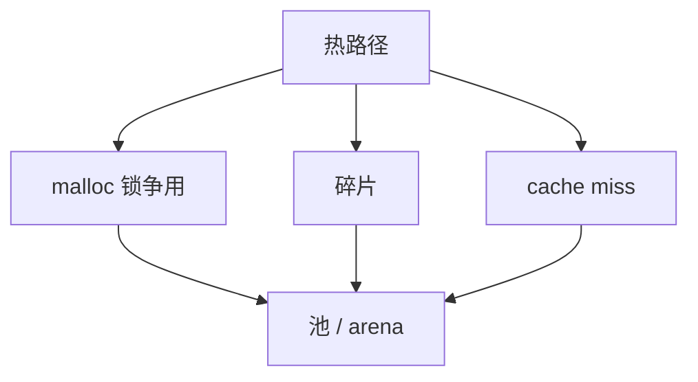

---
tags:
  - C++
  - 内存
  - DPDK
title: PMR 与自定义分配器
description: std::pmr、arena 池化与 DPDK mempool 对照
date: 2026/05/21
---

# PMR 与自定义分配器

热路径上 **频繁 `malloc/free`** 是性能与碎片来源。**C++17 PMR（polymorphic memory resource，多态内存资源）** 提供标准层 **池化 / arena**；**DPDK `rte_mempool`** 是数据面极致方案。本篇对照 **何时用哪一层**。

---

## 1. 读完能带走什么

- 理解 **分配器作为策略注入**。  
- 会用 **`std::pmr::monotonic_buffer_resource`** 做栈旁 arena。  
- 能对照 **PMR vs rte_mempool** 的边界与所有权。

---

## 2. 为什么需要自定义分配



| 场景 | 策略 |
|------|------|
| 请求处理临时对象 | **arena**：批量释放 |
| 固定大小包 buffer | **mempool** |
| 通用容器 | `std::pmr::vector` + 上游 resource |

见 [[C/C++ 性能优化方法论]]、[[C 内存模型与未定义行为#4. 对象生命周期]]。

---

## 3. C++ 标准分配器脉络

| 版本 | 机制 |
|------|------|
| C++98 | `allocator<T>`、`std::vector` 默认 |
| C++11 | `allocator_traits` |
| C++17 | **`std::pmr::*`** 类型擦除 resource |

**Rule of 0** 容器已带 allocator；**换 allocator 不换容器 API**（pmr 版本）。

---

## 4. PMR 核心类型

```cpp
#include <memory_resource>
#include <vector>

char buffer[4096];
std::pmr::monotonic_buffer_resource pool{
    buffer, sizeof buffer,
    std::pmr::null_memory_resource()  /* 溢出则抛 bad_alloc */
};

std::pmr::vector<int> v{&pool};
for (int i = 0; i < 1000; ++i)
    v.push_back(i);
/* pool 析构或 pool.release() 前，不单独 free 元素 */
```

| Resource | 行为 |
|----------|------|
| **monotonic_buffer_resource** | 只增不减；**一次 release** 清空 |
| **unsynchronized_pool_resource** | 固定块大小池；单线程 |
| **synchronized_pool_resource** | 池 + 锁 |
| **new_delete_resource** | 转发 `::operator new` |

---

## 5. 与 arena / 对象池模式


| 模式 | C 实现 | C++ PMR |
|------|--------|---------|
| 线性 arena | bump pointer + chunk | `monotonic_buffer_resource` |
| 固定块池 | free list | `pool_resource` |
| 全局 malloc | `malloc` | `new_delete_resource` |

嵌入式可 **静态 char buf[]** 作 backing store，零堆依赖。

---

## 6. DPDK rte_mempool 对照

| 维度 | std::pmr | **rte_mempool** |
|------|----------|-----------------|
| 对象 | 任意 C++ 类型 | **固定 elt_size**（如 mbuf） |
| 线程 | `synchronized_pool` | **per-lcore cache** |
| 生命周期 | RAII / scope | **手动 get/put** |
| DMA | 不负责 | **IOVA 连续、预注册** |

```cpp
/* C++ 封装见 [[C++ 封装 DPDK 数据面]] */
struct rte_mbuf *m = rte_pktmbuf_alloc(mp);
/* ... */
rte_pktmbuf_free(m);
```

**原则**：**包 buffer 用 DPDK**；**控制面临时 STL 结构** 可用 PMR；**不要** 在 mbuf data 里 `new` 复杂 C++ 对象。

并发假设见 [[多 worker 与 mempool 并发假设]]。

---

## 7. 自定义 allocator 模板（C++03 风格）

仍见于旧代码：

```cpp
template <typename T>
struct PoolAllocator {
    using value_type = T;
    T* allocate(std::size_t n) { /* 从池取 */ }
    void deallocate(T* p, std::size_t n) { /* 还池 */ }
};
```

C++17 起 **优先 PMR**，少写新 template allocator。

---

## 8. 异常与嵌入式

- PMR 耗尽 → `bad_alloc`（若未设 null resource）。  
- **`-fno-exceptions`** 时需保证 pool 足够大或自定义 resource。见 [[嵌入式 C++ 编译约束]]。

---

## 9. 检查清单

- [ ] 热路径无 **无界 malloc**  
- [ ] 请求级临时对象 → **arena**  
- [ ] 网络 buffer → **mempool / mbuf**  
- [ ] 谁分配谁释放 **不跨 API**（与 [[C 与 C++ 混用]] 一致）  

---

## 延伸阅读

- [[C++ 对象模型与 Rule of Zero-Three-Five]]
- [[网络与DPDK/内存子系统/DPDK 内存与子系统]]
- [[编程语言/C++/C++ 封装 DPDK 数据面]]
