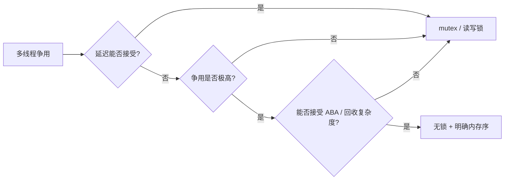
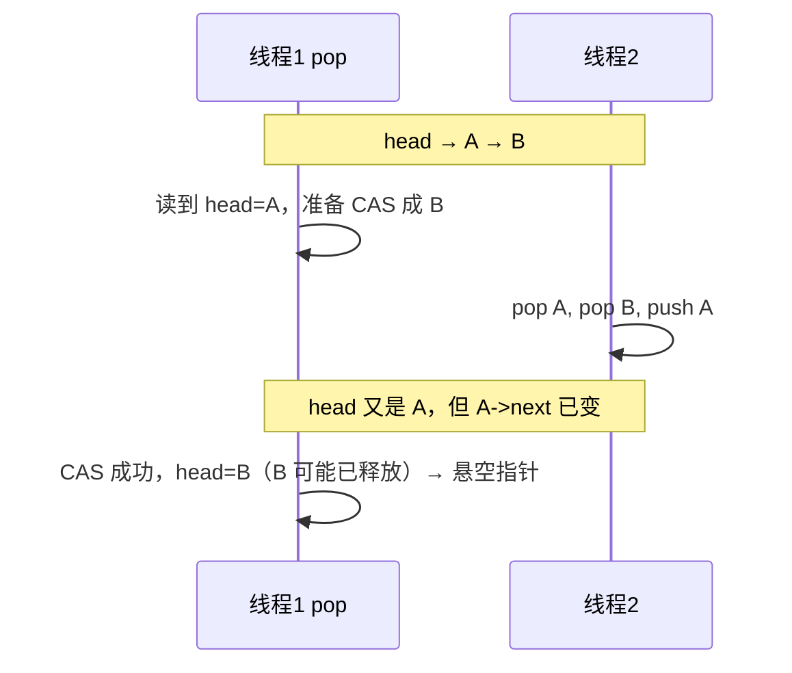

# 1 无锁编程

## 1.1 前言

### 1.1.1 什么时候需要无锁

多线程里默认工具是 **互斥锁**（`std::mutex`）：实现简单、语义清晰。但在这些场景里，锁可能成为瓶颈或风险点：

- **极高频路径**：每包/每事件都要抢同一把锁（例如数据面转发、统计计数）。
- **持锁时间必须极短**：持锁期间不能调用可能阻塞的代码（分配器、日志、I/O）。
- **读多写少**：大量读者、少量写者，希望读者互不阻塞（统计、配置快照）。

**无锁（lock-free）** 并不等于「更快」，而是：**至少有一个线程在系统范围内能持续推进**（不会因别的线程在锁上睡眠而全体卡住）。实现成本、正确性难度、内存回收问题都会显著上升。

读完本篇，你应能：

- 区分 **无锁 / 无等待 / 有锁** 的适用边界。
- 用 `std::atomic` + **CAS** 写出常见的 **SPSC 队列**、**计数器** 模式。
- 知道 **ABA**、**内存序配对**、**节点何时能 `delete`** 为什么是硬骨头。
- 在写不动或测不过时，**退回有锁或专用库**，而不是硬扛。

> 内存序、`happens-before`、CAS 细节见 [[内存模型]]；线程创建与 `mutex` 用法见 [[C++多线程与多进程编程]]。

### 1.1.2 三个层次：有锁、无锁、无等待

| 层次 | 含义 | 典型手段 |
|------|------|----------|
| 阻塞（blocking） | 拿不到锁就睡眠 | `mutex`、`condition_variable` |
| 无锁（lock-free） | 系统整体总能推进；个别线程可能重试很久 | `atomic` + CAS 循环 |
| 无等待（wait-free） | 每个线程有限步内完成自己的操作 | 少见，设计更难 |

实践中 **无锁** 已足够难；**无等待** 多用于理论或极专用结构。



---

## 1.2 核心工具：`std::atomic` 与 CAS

### 1.2.1 无锁不等于「普通变量」

对共享变量，若多线程同时读写且至少一方写，**必须用原子类型或锁**，否则是数据竞争（未定义行为）。

```cpp
#include <atomic>

std::atomic<int> counter{0};

void worker() {
    for (int i = 0; i < 100000; ++i)
        counter.fetch_add(1, std::memory_order_relaxed);
}
```

- **纯计数、统计**：`memory_order_relaxed` 通常够用。
- **发布数据给别的线程**：写端 `release`，读端 `acquire`（见 [[内存模型]]）。

### 1.2.2 CAS：无锁结构的基石

**Compare-And-Swap**：当前值等于 `expected` 则改为 `desired`，否则把最新值写回 `expected`。

```cpp
std::atomic<int> x{10};
int expected = 10;
bool ok = x.compare_exchange_strong(expected, 20);
// ok == true → x 为 20

expected = 10;
ok = x.compare_exchange_strong(expected, 30);
// ok == false → expected 被更新为 20，x 仍为 20
```

在 **重试循环** 里更常用 `compare_exchange_weak`（允许伪失败，往往更快）：

```cpp
int expected = x.load(std::memory_order_relaxed);
int desired;
do {
    desired = expected * 2;
} while (!x.compare_exchange_weak(
    expected, desired,
    std::memory_order_acq_rel,
    std::memory_order_relaxed));
```

### 1.2.3 是否真无锁：`is_lock_free`

```cpp
std::atomic<int> a;
assert(a.is_lock_free());  // 常见平台为 true

struct Big { int data[32]; };
std::atomic<Big> b;
// b.is_lock_free() 可能为 false → 内部用锁，性能等同加锁
```

大对象、非平凡类型要谨慎；无锁结构里节点通常是指针 + 小标量。

---

## 1.3 模式一：原子计数与统计

**场景**：请求数、字节数、错误数；写多、读少或偶尔快照。

```cpp
class Stats {
    std::atomic<uint64_t> requests_{0};
    std::atomic<uint64_t> errors_{0};

public:
    void on_request(bool ok) {
        requests_.fetch_add(1, std::memory_order_relaxed);
        if (!ok)
            errors_.fetch_add(1, std::memory_order_relaxed);
    }

    uint64_t requests() const {
        return requests_.load(std::memory_order_relaxed);
    }
};
```

**注意**：若需要「三个计数器在同一时刻一致」，单次 `relaxed` 分别 load 可能看到中间态；快照可用 `seq_cst` 或版本号（见 [[内存模型]] 中 Statistics / Seqlock）。

---

## 1.4 模式二：SPSC 无锁环形队列

**约束**：**单生产者、单消费者**（一个线程只 `push`，另一个只 `pop`）。这是工程里**性价比最高**的无锁队列形态。


```cpp
#include <atomic>
#include <optional>
#include <vector>

template<typename T>
class SpscRing {
    std::vector<T> buf_;
    const size_t cap_;
    std::atomic<size_t> head_{0};  // 消费者独占写
    std::atomic<size_t> tail_{0};  // 生产者独占写

public:
    explicit SpscRing(size_t capacity)
        : buf_(capacity), cap_(capacity) {}

  // 仅生产者调用
    bool try_push(T v) {
        const size_t t = tail_.load(std::memory_order_relaxed);
        const size_t next = (t + 1) % cap_;
        if (next == head_.load(std::memory_order_acquire))  // 队满
            return false;
        buf_[t] = std::move(v);
        tail_.store(next, std::memory_order_release);
        return true;
    }

  // 仅消费者调用
    std::optional<T> try_pop() {
        const size_t h = head_.load(std::memory_order_relaxed);
        if (h == tail_.load(std::memory_order_acquire))  // 队空
            return std::nullopt;
        T v = std::move(buf_[h]);
        head_.store((h + 1) % cap_, std::memory_order_release);
        return v;
    }
};
```

**容量**：`cap` 个槽位通常只能存 **`cap - 1` 个元素**（用 head==next 表示满，避免与空混淆）。

**扩展**：DPDK / 网络栈里大量 **每核一条队列、核间不共享写指针**，本质就是 SPSC 或「每核池 + 批量交接」；见 [[DPDK 教程 2：mbuf、mempool、ethdev 的数据路径]]。

---

## 1.5 模式三：无锁栈（教学用，生产需谨慎）

用 CAS 更新链表头，适合理解 **release/acquire** 与 **ABA**；生产环境要处理 **节点回收**。

```cpp
template<typename T>
class LockFreeStack {
    struct Node {
        T data;
        Node* next;
        explicit Node(T d) : data(std::move(d)), next(nullptr) {}
    };
    std::atomic<Node*> head_{nullptr};

public:
    void push(T v) {
        Node* n = new Node(std::move(v));
        n->next = head_.load(std::memory_order_relaxed);
        while (!head_.compare_exchange_weak(
            n->next, n,
            std::memory_order_release,
            std::memory_order_relaxed)) {}
    }

    std::optional<T> pop() {
        Node* old = head_.load(std::memory_order_relaxed);
        while (old && !head_.compare_exchange_weak(
            old, old->next,
            std::memory_order_acquire,
            std::memory_order_relaxed)) {}
        if (!old) return std::nullopt;
        T out = std::move(old->data);
        delete old;  // 危险：其他线程可能仍持有指向该节点的逻辑引用
        return out;
    }
};
```

**push**：`release` 保证节点数据在成为 `head` 之前对消费者可见。  
**pop**：`acquire` 保证读到 `old->data` 时，发布该节点的写入已可见。

---

## 1.6 ABA 与内存回收

### 1.6.1 什么是 ABA



**缓解思路**（选其一，都非 trivial）：

1. **Tagged pointer**：指针 + 版本号一起 CAS（需 `compare_exchange` 支持足够宽的 `atomic`，或 128 位 DCAS）。
2. **Hazard pointer / Epoch 回收**：延迟 `delete`，直到没有线程再引用该节点。
3. **不 `delete`，用内存池**：节点来自 [[DPDK 教程 2：mbuf、mempool、ethdev 的数据路径]] 式 mempool，只归还池、不归还系统堆。

无锁 **栈/队列 + `new`/`delete`** 在工业界很少裸写，多用 **moodycamel::ConcurrentQueue**、**folly**、**DPDK rte_ring** 等经过验证的实现。

---

## 1.7 MPMC 与「看起来无锁」的库

**多生产者多消费者（MPMC）** 无锁队列实现复杂（索引、缓存行伪共享、回收）。除非有实测证明锁是瓶颈，否则优先考虑：

| 方案 | 特点 |
|------|------|
| `mutex` + `std::deque` | 正确性最好，多数业务足够快 |
| 每线程队列 + 合并 | 逻辑无锁，结构简单（日志、任务投递） |
| `boost::lockfree` / 专用 MPMC 库 | 用成熟实现，别手写 |
| DPDK `rte_ring` | 数据面、固定元素、NUMA 感知 |

---

## 1.8 性能与正确性：实践清单

### 1.8.1 设计前

- [ ] 能否用 **SPSC** 或 **每核队列** 代替 MPMC？
- [ ] 热点是否真是锁？（`perf` / 火焰图）
- [ ] 是否可用 **`static` 局部变量**、`call_once` 代替双重检查锁？（见 [[内存模型]]）

### 1.8.2 实现时

- [ ] 共享状态是否全部为 `std::atomic` 或受锁保护？
- [ ] `release` / `acquire` 是否成对（发布-消费）？
- [ ] 是否避免在 CAS 循环里分配内存、打日志？
- [ ] 是否考虑 **false sharing**（`alignas(64)` 分离热原子）？

### 1.8.3 验证时

- [ ] **ThreadSanitizer**（`-fsanitize=thread`）跑压测。
- [ ] 在 **ARM** 或弱内存序机器上测（x86 上「碰巧能跑」很常见）。
- [ ] 长时间压力 + 不同线程数（1P1C、2P1C、MPMC）。

```bash
g++ -std=c++20 -O2 -pthread -fsanitize=thread spsc_demo.cpp -o spsc_demo
./spsc_demo
```

---

## 1.9 何时不要无锁

以下情况 **优先用锁或专用框架**：

1. 业务逻辑复杂，临界区需要遍历容器、回调用户代码。
2. 团队无法维护 hazard pointer / epoch 等回收协议。
3. 只需要「偶尔更新配置」，读多写少 → **读写锁** 或 **Seqlock**（见 [[内存模型]]）往往更简单。
4. 无锁结构只占 5% 时间，锁竞争不在热点——**过早优化**。

**结论**：无锁是 **在可证明的瓶颈上**，用 **受限并发模型（SPSC）** 或 **成熟库** 换延迟；不是默认风格。

---

## 1.10 相关阅读

- [[内存模型]] — `memory_order`、happens-before、CAS、Seqlock、双重检查锁
- [[C++多线程与多进程编程]] — `thread`、`mutex`、条件变量
- [[DPDK 教程 2：mbuf、mempool、ethdev 的数据路径]] — 数据面无锁池化、mempool
- [[DPDK 教程 3：多队列 + RSS + 多 worker 的最小转发 or Echo]] — 多 worker 与 mempool 并发假设
