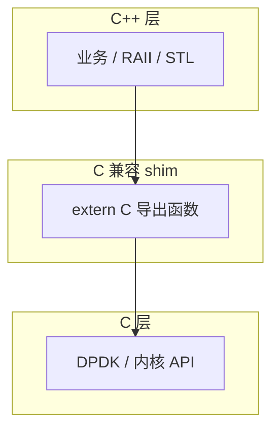

---
tags:
  - C
  - C++
  - 互操作
title: C 与 C++ 混用
description: extern C、链接符号、内存所有权与 DPDK/内核边界
date: 2026/05/21
---

# C 与 C++ 混用

生产代码常见 **C 内核/DPDK + C++ 业务封装**。混用失败点集中在：**链接名不一致、ABI 不匹配、谁 malloc 谁 free、异常穿过 C 边界**。本篇给出可执行的边界规则。

---

## 1. 读完能带走什么

- 会写 **`extern "C"`** 头文件与回调。  
- 能说明 **C++ 异常 / RTTI / mangling** 对 C 调用方的影响。  
- 能在 **DPDK / 驱动** 项目里划清 C API 层与 C++ 层。

---

## 2. 为什么需要 `extern "C"`

C++ 支持 **重载**，链接符号经 **name mangling（名称改编）**；C 符号即函数名本身。

```mermaid
flowchart LR
  CPP[C++ 编译 foo(int)] --> M["_Z3fooi"]
  C[C 编译 foo(int)] --> S["foo"]
  M -.->|链接失败| S
```

**`extern "C"`** 告诉 C++ 编译器：该声明用 **C 链接**，符号与 C 一致。

```cpp
#ifdef __cplusplus
extern "C" {
#endif

int dpdk_port_init(uint16_t port_id);
void c_callback(void *arg);

#ifdef __cplusplus
}
#endif
```

`.c` 文件 **不要** 包含 C++ 头（除非极小心）；C++ 调 C 用 `extern "C"` 头，C 调 C++ 需 **C 包装层**。

---

## 3. 分层架构（推荐）



| 层 | 允许 | 避免 |
|----|------|------|
| **C++** | 异常、模板、STL | 直接 `#include <rte_*.h>` 进大量模板头 |
| **shim** | `extern "C"` 薄包装 | 复杂逻辑 |
| **C API** | DPDK、POSIX、内核 | C++ 类型出现在 API 参数 |

见 [[编程语言/C++/C++ 封装 DPDK 数据面]]。

---

## 4. 内存所有权

| 规则 | 示例 |
|------|------|
| **谁分配谁释放** | C 层 `rte_malloc` → C 层 `rte_free` |
| 不要跨边界 **delete[]** C 数组 | C++ `new` 的内存勿交给 `free` |
| 回调里 **不抛异常** | C 调用方无法 catch |
| 字符串 | 约定 **拷贝** 或 **只读借用** 生命周期 |

```cpp
extern "C" void process_packet(struct rte_mbuf *m)
{
    try {
        /* ... */
    } catch (...) {
        /* 必须吞掉或 abort；不能穿过 C */
    }
}
```

嵌入式常 **`-fno-exceptions`**，见 [[编程语言/C++/嵌入式 C++ 编译约束]]。

---

## 5. 回调与函数指针

C 注册 C++ 成员函数 **不能** 直接当 C 函数指针：

```cpp
class Handler {
public:
    void on_event(int x);
    static void c_trampoline(void *ctx, int x) {
        static_cast<Handler *>(ctx)->on_event(x);
    }
};

/* 注册：Handler::c_trampoline, &handler_instance */
```

内核 **file_operations**、DPDK **回调** 同理：静态函数 + `void *private_data`。

---

## 6. 类型与 `void*`

| 场景 | 做法 |
|------|------|
| 不透明 handle | C 侧 `typedef struct X *X_handle` |
| 传 C++ 对象 | `void*` 存指针，只在 shim 转回 |
| 结构体布局 | C 与 C++ 共用 **POD 头**；C++ 侧 `#pragma pack` 与 C 一致 |
| 枚举 | C++ **enum class** 与 C `enum` 宽度可能不同；API 用 **固定宽度整数** |

---

## 7. 构造 / 析构边界

**不要** 在 C 可调用的函数里依赖 **静态 C++ 对象初始化顺序** 的副作用。

| 模式 | 说明 |
|------|------|
| **显式 init/fini** | `libfoo_init()` / `libfoo_fini()` 由 main 调用 |
| **单例延迟初始化** | 函数内 `static` + `std::once_flag` |
| 避免 | DLL 加载时复杂全局 ctor |

---

## 8. 与内核模块

- 内核 **几乎全是 C**；C++ 模块需 **特殊编译选项** 且团队规范严格，多数项目 **C 写驱动、C++ 写用户态**。  
- **ioctl / netlink** 是天然边界：内核 C 结构 ↔ 用户态 C++ 解析。

---

## 9. 排障

| 症状 | 方向 |
|------|------|
| `undefined reference` 带 `_Z` 前缀 | 缺 `extern "C"` 或链接 C++ 库顺序 |
| 运行崩溃在边界 | 检查 ABI、结构体 padding、所有权 |
| 偶发堆错 | 跨边界 free、double free |

`nm -C`、`c++filt` 解码符号；见 [[系统调试/coredump 分析基础]]。

---

## 10. 检查清单

- [ ] 公共头对 C/C++ 都有 `extern "C"` guard  
- [ ] 无异常、无 RTTI 类型穿过 C API  
- [ ] 文档写清 **内存所有权**  
- [ ] 回调用 **static trampoline + void***  
- [ ] 交叉编译 C/C++ 用 **同一 ABI toolchain**  

---

## 延伸阅读

- [[C 编译链接与 ABI]]
- [[编程语言/C++/C++ 对象模型与 Rule of Zero-Three-Five]]
- [[linux/驱动与模块/Linux 内核模块开发实战]]
