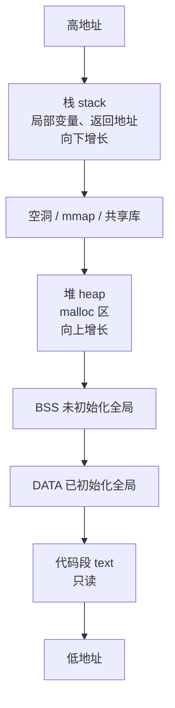
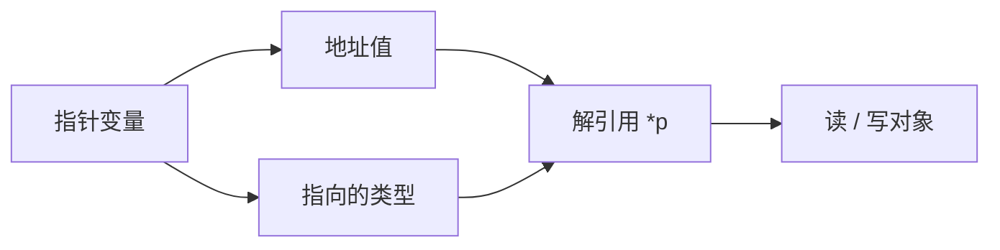
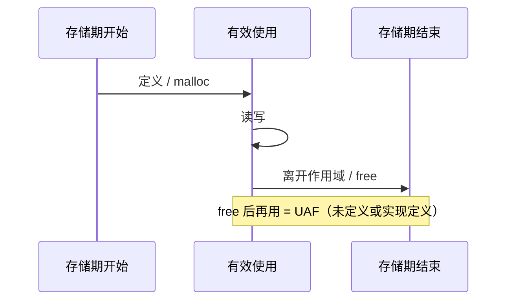

---
tags:
  - C
  - 内存
  - UB
title: C 内存模型与未定义行为
description: 栈堆静态区、指针、生命周期与常见 UB 清单
date: 2026/05/21
---

# C 内存模型与未定义行为

**C 内存模型** 描述对象放在哪、活多久、如何通过指针访问。**UB（Undefined Behavior，未定义行为）** 是违反语言规则后编译器 **不再保证任何结果**——优化可能让 bug 「消失」或变得更怪。精通 C 的第一关：写代码时 **默认假设 UB 等于定时炸弹**。

---

## 1. 读完能带走什么

- 能画 **栈 / 堆 / 静态区 / 映射区** 与典型对象归属。  
- 能列举 **Top 10 用户态 C UB** 及安全写法。  
- 知道 **严格别名（strict aliasing）** 与 **未初始化读取** 在内核/驱动里的后果。

---

## 2. 进程地址空间（用户态直觉）



| 区域 | 典型对象 | 生命周期 |
|------|----------|----------|
| **栈** | 局部变量、参数 | 函数调用期间 |
| **堆** | `malloc` 返回块 | 直到 `free` |
| **静态** | 全局 / `static` | 程序整个生命周期 |
| **线程栈** | 各 `pthread` 私有栈 | 线程存活期间 |

内核态没有完整「堆」语义时仍适用 **栈 vs 静态 vs kmalloc** 直觉，见 [[linux/内核机制/kmalloc 与 vmalloc]]。

---

## 3. 指针：能做什么、不能做什么



| 规则 | 说明 |
|------|------|
| 只解引用 **有效对象** | 悬空指针、越界 → UB |
| **类型** 决定步长与别名 | `(char*)` 与 `(int*)` 混用需 `memcpy` / `char*` 字节视图 |
| **`void*`** | 可存任意对象地址；解引用前须转回正确类型 |
| **函数指针** | 回调、驱动 ops；签名必须完全匹配 |

### 3.1 常见合法 idiom

```c
/* 不透明指针：头文件只暴露 struct device; 定义在 .c */
struct device;
void probe(struct device *dev);

/* 灵活数组成员 FAM：C99 */
struct pkt {
    uint16_t len;
    uint8_t  data[];   /* 变长尾部 */
};
```

---

## 4. 对象生命周期



| 错误 | 名称 | 后果 |
|------|------|------|
| `free` 后继续用 | **UAF** | 崩溃 / 被利用 |
| 忘记 `free` | **泄漏** | OOM（见 [[linux/内核机制/小内存板 OOM 行为]]） |
| 返回局部变量地址 | **悬空** | 栈槽被复写 |
| 双重 `free` | **堆破坏** | 随机崩溃 |

**口诀**：谁分配谁释放；API 文档写清 **ownership（所有权）**。

---

## 5. 未定义行为（UB）Top 清单

| # | UB | 安全替代 |
|---|-----|----------|
| 1 | 有符号整数溢出 `INT_MAX+1` | 用 `uint` 或检查再算 |
| 2 | 越界访问 `a[n]` | 边界检查；`sizeof`/元素个数 |
| 3 | 未初始化读取 | 初始化；`calloc`；编译器 `-Wuninitialized` |
| 4 | 空指针解引用 | 先判空 |
| 5 | **严格别名** violation | `memcpy`；`-fno-strict-aliasing` 仅作权宜 |
| 6 | 数据竞争（无 `_Atomic/锁） | `mutex` / C11 `_Atomic` |
| 7 | `shift` 位数 ≥ 类型宽度 | 限制 shift 范围 |
| 8 | 修改 `const` 对象 | 不要 cast 掉 const 乱写 |
| 9 | 违反有效指针算术 | 只在同一数组对象内 `ptr+1` |
| 10 | 错误 `printf` 格式 | 匹配 `%` 与实参类型 |

**实现定义（implementation-defined）** 与 **未指定（unspecified）** 行为仍可能有多种结果，但编译器文档会说明；**UB 则没有保证**。

---

## 6. 严格别名（strict aliasing）

编译器假设：**不同类型对象不会通过指针互相别名**，从而做激进优化。

```c
/* 危险：通过 int* 写 float 对象 */
float f = 1.0f;
*(int *)&f = 0;   /* 可能 UB */

/* 安全：字节拷贝 */
float f = 1.0f;
int i;
memcpy(&i, &f, sizeof i);
```

驱动里读 **MMIO 寄存器** 常用 `volatile` + 正确宽度类型，见 [[linux/内核机制/DMA 与 Cache 一致性入门]]。

---

## 7. `const` / `volatile` / `restrict`（C99）

| 关键字 | 含义 |
|--------|------|
| **const** | 通过该 lvalue 不可改（对象本身仍可能在别处非 const 访问） |
| **volatile** | 每次从内存读/写，禁止优化掉（硬件寄存器、信号 handler 共享变量） |
| **restrict** | 指针为访问该对象的 **唯一途径**（优化提示；违反则 UB） |

**误用**：把 `volatile` 当 **线程同步** —— 不行，需 `_Atomic` 或锁。

---

## 8. 字符串与缓冲区

| 函数 | 风险 |
|------|------|
| `strcpy` / `strcat` | 无边界 → 栈溢出 |
| `strncpy` | 可能 **不** 以 `\0` 结尾 |
| `sprintf` | 同上 |
| **推荐** | `snprintf(buf, sizeof buf, ...)`；长度前缀协议 |

网络粘包、驱动 `copy_from_user` 都要 **显式长度**，见 [[网络与DPDK/网络编程/TCP 连接、粘包与常见陷阱]]。

---

## 9. 与 C++ 的边界

- C++ 中很多 C 规则更严；**混用时按更严一侧写**，见 [[C 与 C++ 混用]]。  
- C++ **RAII** 解决部分泄漏；C 侧靠 **配对 malloc/free** 与清晰 API。

---

## 10. 自检与工具

| 手段 | 作用 |
|------|------|
| `-Wall -Wextra -Werror=implicit` | 编译期 |
| **UBSan** | 运行期抓 UB | 
| **ASan** | 越界、UAF | 
| **Valgrind** | 堆错误 |

见 [[C/C++ Sanitizer 与单元测试入门]]、[[系统调试/ASan 与 Valgrind 桌面验证]]。

---

## 11. 检查清单

- [ ] 每个指针能说出 **谁分配、谁释放、有效期**  
- [ ] 无 `strcpy` 类无边界 API（或已证明安全）  
- [ ] 有符号运算考虑溢出  
- [ ] 多线程共享数据有 **锁或 _Atomic**  
- [ ] MMIO / DMA 用 **volatile + 正确映射**，不靠 C 别名 hack  

---

## 延伸阅读

- [[编程语言/C/index|C 语言目录]]
- [[C 编译链接与 ABI]]
- [[C 字符串与 POSIX I/O 精读]]
- [[C99-C11 实用特性]]
- [[工程基础/编程中非常关键、非常常用的数学技巧#1.2 位运算与 2 的幂（最高频）]]
- [[linux/内核机制/如何通过虚拟地址查找物理地址]]
