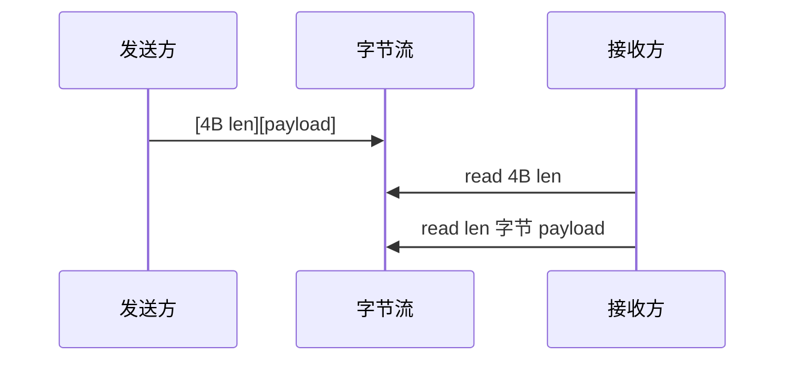

---
tags:
  - C
  - POSIX
  - I/O
title: C 字符串与 POSIX I/O 精读
description: read/write、mmap、fcntl、缓冲区安全与长度前缀协议
date: 2026/05/21
---

# C 字符串与 POSIX I/O 精读

用户态 C 程序与内核的常规交界是 **文件描述符（file descriptor，fd）** 上的 **POSIX I/O**。本篇把 **字符串安全** 与 **`read`/`write`/`mmap`/`fcntl`** 串成一条线，并对接 [[网络与DPDK/网络编程/TCP 连接、粘包与常见陷阱]] 里的 **长度前缀 / 粘包** 问题。

---

## 1. 读完能带走什么

- 能正确写 **部分读写的循环** 与 **EINTR 重试**。  
- 能选型 **read/write vs mmap** 与 **`fcntl` 常用 flag**。  
- 协议层用 **长度前缀** 替代裸 `strcpy` 拼接。

---

## 2. C 字符串：安全基线

| API | 问题 | 推荐 |
|-----|------|------|
| `strcpy` / `strcat` | 无边界 | **禁用**于外部输入 |
| `strncpy` | 可能无 `\0` | 手动 `buf[n-1]='\0'` 或不用 |
| `sprintf` | 溢出 | `snprintf(buf, sizeof buf, ...)` |
| `strlen` | 需 `\0` 结尾 | 二进制数据用 **显式长度** |

```c
char line[256];
if (fgets(line, sizeof line, fp) == NULL)
    /* EOF 或错误 */;
/* line 保证 \0 结尾（若未超长） */
```

**二进制协议**：缓冲区 **不假设** 以 `\0` 结尾；用 `uint32_t len` + payload，见 §6。

与 [[C 内存模型与未定义行为#8. 字符串与缓冲区]] 一致。

---

## 3. 一切皆 fd

```mermaid
flowchart LR
  APP[应用程序]
  APP -->|read/write| FD[fd]
  FD --> FILE[普通文件]
  FD --> PIPE[pipe/FIFO]
  FD --> SOCK[socket]
  FD --> TTY[终端]
  FD --> DEV[/dev/* 设备]
```

| fd | 来源 |
|----|------|
| 0,1,2 | stdin/stdout/stderr |
| `open()` | 路径 |
| `pipe()` / `socket()` | 内核创建 |
| `dup()` | 复制 fd 表项 |

**一切皆文件** 在实现上 = **统一 read/write 接口**（socket 另有 `send/recv` 优化路径）。

---

## 4. read / write 语义

```c
#include <unistd.h>

ssize_t n = read(fd, buf, count);
ssize_t m = write(fd, buf, count);
```

| 要点 | 说明 |
|------|------|
| **返回值** | 成功：字节数；`0` = EOF（read）；`-1` + `errno` |
| **部分读写** | **常见**；必须循环直到读满/写完或 EOF/错误 |
| **EINTR** | 信号打断 → **重试** |
| **非阻塞** | `EAGAIN` / `EWOULDBLOCK` |

### 4.1 读满 count 字节（或 EOF）

```c
ssize_t read_full(int fd, void *buf, size_t count)
{
    size_t off = 0;
    while (off < count) {
        ssize_t n = read(fd, (char *)buf + off, count - off);
        if (n < 0) {
            if (errno == EINTR) continue;
            return -1;
        }
        if (n == 0) return (ssize_t)off; /* EOF，可能短读 */
        off += (size_t)n;
    }
    return (ssize_t)off;
}
```

### 4.2 写满

```c
ssize_t write_full(int fd, const void *buf, size_t count)
{
    size_t off = 0;
    while (off < count) {
        ssize_t n = write(fd, (const char *)buf + off, count - off);
        if (n < 0) {
            if (errno == EINTR) continue;
            return -1;
        }
        off += (size_t)n;
    }
    return (ssize_t)off;
}
```

---

## 5. open 与 fcntl

```c
#include <fcntl.h>

int fd = open("cfg.bin", O_RDONLY);
int fdw = open("out.log", O_WRONLY | O_CREAT | O_APPEND, 0644);
```

| `fcntl` 常用 | 作用 |
|--------------|------|
| `F_GETFL` / `F_SETFL` | 读/写 flag |
| `O_NONBLOCK` | 非阻塞（配合 epoll） |
| `F_DUPFD` | 复制 fd |
| `F_SETFD` + `FD_CLOEXEC` | `exec` 时关闭（防泄漏） |

与 [[网络与DPDK/网络编程/IO 多路复用：select、poll、epoll 与并发模型]] 中非阻塞 socket 配合。

---

## 6. 长度前缀协议（防粘包）



```c
#include <stdint.h>
#include <arpa/inet.h>  /* 或自定义 endian 宏 */

/* 发送：先写网络序长度，再写 body */
uint32_t len = htonl((uint32_t)body_len);
write_full(fd, &len, 4);
write_full(fd, body, body_len);

/* 接收 */
uint32_t net_len;
if (read_full(fd, &net_len, 4) != 4) /* 错误 */;
uint32_t len = ntohl(net_len);
if (len > MAX_PAYLOAD) /* 拒绝 */;
/* 分配或栈缓冲，再 read_full(fd, buf, len) */
```

**原则**：帧边界由 **长度或分隔符** 定义，不靠 `\0` 或「一次 read 刚好一条消息」。

---

## 7. mmap：何时用

```c
#include <sys/mman.h>

void *p = mmap(NULL, length, PROT_READ | PROT_WRITE,
               MAP_SHARED, fd, offset);
/* 使用 p[0..length) */
munmap(p, length);
```

| 场景 | 适合 mmap |
|------|-----------|
| 大文件随机读、配置只读映射 | 是 |
| 小文件读一次 | `read` 更简单 |
| 进程间共享 | `MAP_SHARED` + 文件或 **shm** |
| 设备寄存器 | **慎用**；常配合 `volatile` + 驱动文档 |

与 [[linux/内核机制/如何通过虚拟地址查找物理地址]]、[[C 编译链接与 ABI]] 中的虚拟内存概念衔接。

**注意**：`mmap` 失败返回 `MAP_FAILED`，不是 `NULL`（虽常相同）。

---

## 8. 标准 I/O vs 系统 I/O

| 层 | API | 特点 |
|----|-----|------|
| **stdio** | `fopen` `fread` `fprintf` | 缓冲；嵌入式大 `iostream` 体积见 [[嵌入式 C++ 编译约束]] |
| **POSIX** | `open` `read` `write` | 无 stdio 缓冲，适合网络/精确控制 |

驱动/高性能路径倾向 **POSIX** 或 **直接 buffer**；日志可用 `fprintf`/`snprintf` 到 fd。

---

## 9. 与内核 copy_from_user

用户态 **read/write** 最终进入内核 **vfs → 驱动**；内核模块里对应 ** `copy_from_user` / `copy_to_user`**，不能假设用户指针可直接解引用，见 [[linux/学习路径/字符设备驱动入门]]。

---

## 10. 常见坑

| 坑 | 对策 |
|----|------|
| 不循环 read | 短读、粘包 |
| 忽略 EINTR | 偶发失败 |
| `strncpy` 无 `\0` | `snprintf` 或显式终止 |
| mmap 长度不对齐 | 按页 `sysconf(_SC_PAGE_SIZE)` |
| 泄漏 fd | `FD_CLOEXEC`、RAII 包装（C++） |

---

## 11. 检查清单

- [ ] 外部输入全部 **有界** 拷贝  
- [ ] read/write 循环 + EINTR  
- [ ] 二进制协议 **长度前缀 + 上限**  
- [ ] 长连接用 epoll + 非阻塞 + 状态机  

---

## 延伸阅读

- [[linux/内核机制/传统 IPC：System V 与 POSIX]]
- [[网络与DPDK/网络编程/Socket 编程基础：TCP、UDP 与字节序]]
- [[C99-C11 实用特性]]
