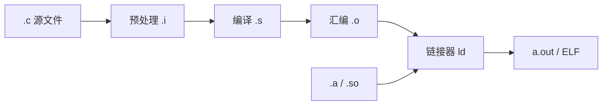
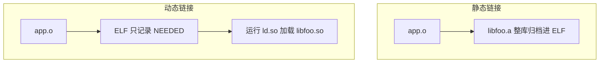

---
tags:
  - C
  - 链接
  - ABI
title: C 编译链接与 ABI
description: 翻译单元、符号、静态/动态链接与交叉编译 ABI 核对
date: 2026/05/21
---

# C 编译链接与 ABI

**编译（compile）** 把 `.c` 变成 **目标文件（object file）**；**链接（link）** 把多个目标与库拼成可执行文件或 `.so`。**ABI（Application Binary Interface，应用二进制接口）** 规定 **调用约定、类型大小、符号命名**，跨模块必须一致。本篇把 [[linux/学习路径/应用交叉编译实战指南]] 里的碎片收成 **C 程序员视角** 的完整图。

---

## 1. 读完能带走什么

- 能画 **预处理 → 编译 → 汇编 → 链接** 流水线。  
- 能解释 **链接错误 vs 运行缺库** 的区别。  
- 交叉编译时能核对 **triplet、float ABI、word size**。

---

## 2. 从源码到可执行文件



| 阶段 | 产物 | 典型命令 |
|------|------|----------|
| 预处理 | 展开 `#include` / `#define` | `gcc -E` |
| 编译 | 汇编 | `gcc -S` |
| 汇编 | `.o` 重定位目标 | `gcc -c` |
| 链接 | ELF 可执行 / 共享库 | `gcc` / `ld` |

**翻译单元（translation unit）**：每个 `.c` 经预处理后 **独立编译**；跨文件靠 **链接** 解析符号。

---

## 3. 符号与 linkage（链接属性）

| 关键字 | 链接 | 含义 |
|--------|------|------|
| **extern** | 外部 | 声明在其他 TU 定义 |
| **static**（文件作用域） | 内部 | 仅本 `.c` 可见 |
| **static**（局部） | 无 | 延长生命周期，块内私有 |
| **inline** | 视情况 | 内联或外部符号（C99） |

```c
/* foo.c */
int counter = 0;           /* 全局，外部链接，其他 TU 可 extern */
static int helper(void);   /* 仅 foo.c */

/* bar.c */
extern int counter;        /* 引用 foo.c 的定义 */
```

**重复定义**：同一 **外部链接** 全局对象/函数只能 **一处定义**（**ODR 在 C 中的类比**）。

---

## 4. 静态链接 vs 动态链接



| 方式 | 优点 | 缺点 |
|------|------|------|
| **静态 `.a`** | 部署简单、无运行缺库 | 体积大、升级需重链 |
| **动态 `.so`** | 共享、省内存 | 依赖 rootfs 版本 |

```bash
readelf -d a.out | grep NEEDED    # 动态依赖
ldd ./a.out                        # 目标机解析路径
nm -C a.out | head                   # 符号表
```

---

## 5. ABI 要核对什么

| 项 | 错配后果 |
|----|----------|
| **ISA** | ARM vs AArch64 vs x86 |
| **浮点 ABI** | hard-float `hf` vs soft — **非法指令** |
| **字长 / 对齐** | 32 vs 64 位 `long`、指针大小 |
| **调用约定** | 参数寄存器、栈对齐 |
| **符号名** | C 无 mangling；C++ 有（见 [[C 与 C++ 混用]]） |

**triplet 示例**：`aarch64-linux-gnu-gcc` → 架构 + OS + libc 约定。

与 [[linux/学习路径/嵌入式体系结构入门]]、[[linux/概览/嵌入式Linux基础知识]] 中 ABI 表一致。

---

## 6. 头文件与 include _guard

```c
#ifndef FOO_H
#define FOO_H
/* declarations */
#endif
```

| 实践 | 说明 |
|------|------|
| **头文件** | 声明、内联短函数、`static inline` |
| **源文件** | 定义、全局对象唯一定义 |
| **`#pragma once`** | 非标准但广泛支持 |

避免在头文件定义 **非 static 全局变量**（除非 `inline` C17 变量）。

---

## 7. 常见错误对照

| 现象 | 阶段 | 典型原因 |
|------|------|----------|
| `undefined reference to foo` | 链接 | 缺 `.o` / 缺 `-lfoo` |
| `multiple definition of foo` | 链接 | 头文件里定义全局变量 |
| `error while loading shared libraries` | 运行 | rootfs 缺 `.so` 或 `rpath` |
| `Illegal instruction` | 运行 | float ABI / CPU 指令集不匹配 |
| 结构体大小不对 | 运行 | 32/64 位混链、`-fpack-struct` 不一致 |

---

## 8. 交叉编译 checklist

- [ ] 编译器 triplet 与目标板一致  
- [ ] `-sysroot` 指向目标 rootfs  
- [ ] `readelf -h`：**Machine** 正确  
- [ ] ARM 32：确认 **gnueabi vs gnueabihf**  
- [ ] 动态程序：目标机 `ldd` 与构建机 **NEEDED** 一致  

详见 [[linux/学习路径/应用交叉编译实战指南]]、[[工程基础/CMake 与交叉编译入门]]。

---

## 9. 与内核模块

内核模块是 **特殊链接**：`modpost`、EXPORT_SYMBOL、与用户态 **完全不同 ABI**。用户态 C 经验 **不能** 直接套 `insmod` 的符号规则，见 [[linux/驱动与模块/Linux 内核模块开发实战]]。

---

## 延伸阅读

- [[C 内存模型与未定义行为]]
- [[C 与 C++ 混用]]
- [[工程基础/静态分析入门]]
