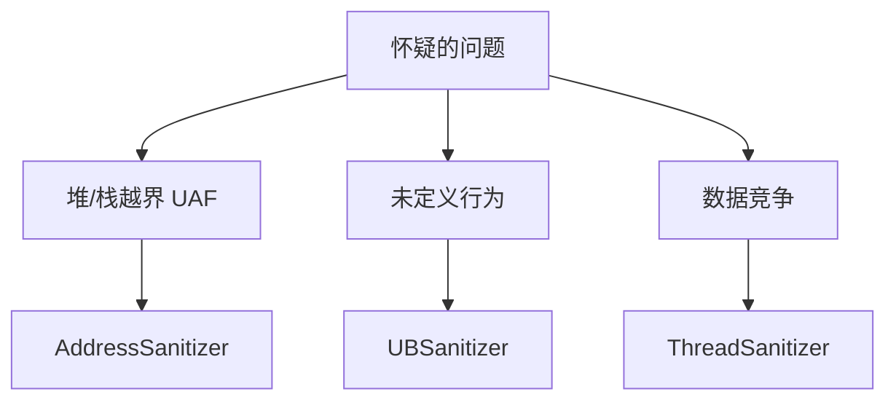

---
tags:
  - C
  - C++
  - 测试
  - Sanitizer
title: C/C++ Sanitizer 与单元测试入门
description: ASan/UBSan/TSan 与 GoogleTest 最小闭环
date: 2026/05/21
---

# C/C++ Sanitizer 与单元测试入门

**Sanitizer** 在编译期插桩，运行期抓 **内存与并发错误**；**单元测试** 把 [[C 内存模型与未定义行为]] 里的规则变成 **可回归的断言**。二者合起来，是从「能编译」到 **「写对」** 的最低工程闭环。

---

## 1. 读完能带走什么

- 能选 **ASan / UBSan / TSan** 场景并编译运行。  
- 能用 **GoogleTest** 写最小测试 + CMake 集成。  
- 知道嵌入式/DPDK 目标上 **哪些 Sanitizer 可开、哪些只能桌面**。

---

## 2. 工具选型



| 工具 | 抓什么 | 典型编译 flag |
|------|--------|---------------|
| **ASan** | 越界、UAF、double-free | `-fsanitize=address` |
| **UBSan** | 溢出、非法 shift、空指针 | `-fsanitize=undefined` |
| **TSan** | 数据竞争 | `-fsanitize=thread` |
| **MSan** | 未初始化读 | `-fsanitize=memory`（mostly Clang） |
| **Valgrind** | 无插桩、慢 | `valgrind --tool=memcheck` |

桌面验证详见 [[系统调试/ASan 与 Valgrind 桌面验证]]。

---

## 3. 最小 ASan + UBSan 构建

```bash
export CXX=clang++
export SAN_FLAGS="-fsanitize=address,undefined -fno-omit-frame-pointer -g -O1"

$CXX $SAN_FLAGS -std=c++17 main.cpp -o app
./app
# 出错时打印 stack + shadow memory 提示
```

| 注意 | 说明 |
|------|------|
| **与 -O0/-O2** | Sanitizer 常用 **-O1** |
| **与 DPDK** | 数据面常 **不能** 全量 ASan 上生产路径；**算法/协议** 层桌面测 |
| **交叉编译** | 需目标 libc 支持；多数 **在 x86 宿主机测逻辑** |

---

## 4. TSan 与多线程

对 [[C++多线程与多进程编程]]、[[无锁编程]] 写的代码：

```bash
$CXX -fsanitize=thread -g -O1 test.cpp -pthread -o test
./test
```

**假阳性**：某些 lock-free 算法需 **注解** 或改用 mutex 验证逻辑后再优化。

---

## 5. GoogleTest 最小示例

```cpp
#include <gtest/gtest.h>

int add(int a, int b) { return a + b; }

TEST(Math, Add) {
    EXPECT_EQ(add(1, 2), 3);
    EXPECT_NE(add(-1, 1), 0);
}

int main(int argc, char **argv) {
    ::testing::InitGoogleTest(&argc, argv);
    return RUN_ALL_TESTS();
}
```

**CMakeLists.txt 片段**：

```cmake
enable_testing()
find_package(GTest REQUIRED)
add_executable(unit_tests test.cpp)
target_link_libraries(unit_tests GTest::gtest_main)
include(GoogleTest)
gtest_discover_tests(unit_tests)
```

与 [[工程基础/CMake 与交叉编译入门]] 合并进 CI，见 [[工程基础/GitHub Actions 与嵌入式 CI 入门]]。

---

## 6. 测什么、不测什么

| 适合单测 | 不适合硬单测 |
|----------|--------------|
| 纯函数、解析器、状态机 | 直接硬件寄存器 |
| 环形缓冲区逻辑 | 真实 DPDK PMD 性能 |
| 错误码路径 | 全系统集成 |

**Mock**：硬件用 **假 fd / 内存 buffer**；内核接口用 **函数指针注入**。

---

## 7. 与静态分析配合

| 层次 | 工具 |
|------|------|
| 编译 | `-Wall -Werror` |
| 静态 | `clang-tidy`、`cppcheck` | 
| 运行 | Sanitizer |
| 集成 | 单测 + CI |

见 [[工程基础/静态分析入门]]、[[工程基础/嵌入式代码评审清单]]。

---

## 8. 推荐工作流


1. 新模块 **先写测试**（至少 happy path + 边界）。  
2. 本地 **ASan+UBSan** 跑一遍。  
3. 多线程模块加 **TSan** 配置（可选 job）。  
4. 合入前 **clang-tidy** 扫 diff。

---

## 9. 检查清单

- [ ] 项目有 `ctest` / `ninja test` 可跑  
- [ ] 至少一个 CI job 开 **UBSan**  
- [ ] 协议/解析类有 **边界用例**  
- [ ] Sanitizer 失败能 **addr2line** 定位 | 见 [[系统调试/排障工具链一张图]] |

---

## 延伸阅读

- [[C/C++ 性能优化方法论]]
- [[系统调试/coredump 分析基础]]
- [[C 内存模型与未定义行为]]
