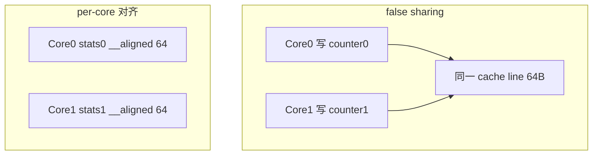

---
tags:
  - C
  - C++
  - 性能
title: C/C++ 性能优化方法论
description: 测量优先、CPU cache、false sharing 与系统向优化闭环
date: 2026/05/21
---

# C/C++ 性能优化方法论

**精通** 的最后一环：在 **正确**（[[C/C++ Sanitizer 与单元测试入门]]）之上 **写快**。原则：**先测量，再优化；先算法/布局，再微优化**。与 DPDK/嵌入式路径直接衔接。

---

## 1. 读完能带走什么

- 掌握 **测量 → 定位 → 改动 → 再测量** 闭环。  
- 能解释 **cache line、false sharing、分支预测** 对 C/C++ 的影响。  
- 知道何时 **Stop optimizing**（已够快 / IO  bound）。

---

## 2. 优化闭环


| 指标 | 工具 |
|------|------|
| CPU 热点 | `perf record`、火焰图 → [[系统调试/perf 与火焰图读 C++ 热点]] |
| 缓存 miss | `perf stat -e cache-misses` |
| 分配 | `heaptrack`、ASan 统计 |
| 延迟分布 | `cyclictest` → [[linux/内核机制/PREEMPT_RT 与 cyclictest 入门]] |
| DPDK | `testpmd` stats、PMD xstats → [[DPDK 性能剖析与绑核 checklist]] |

流程见 [[系统调试/排障 SOP：日志、perf 与反汇编]]。

---

## 3. 层次：先哪后哪

| 优先级 | 手段 | 典型收益 |
|--------|------|----------|
| 1 | **算法 / 复杂度** | 数量级 |
| 2 | **IO 减少、批处理** | 数量级 |
| 3 | **数据布局、cache 友好** | 数倍 |
| 4 | **并行、绑核、无锁** | 随核数 |
| 5 | **编译器 -O2/-O3、LTO** | 10~30% |
| 6 | **SIMD / 内联汇编** | 热点循环 |

**反模式**：未测量就上 `-O3` + 乱改 `volatile`。

---

## 4. CPU cache 与 false sharing



| 技巧 | 说明 |
|------|------|
| **结构体按 cache line 对齐** | `alignas(64)` |
| **热字段分离** | 读多写少分开 |
| **per-core 计数** | 见 [[per-CPU 与 per-core 数据结构]] |

DPDK：`__rte_cache_aligned`；与 [[多 worker 与 mempool 并发假设]] 一致。

---

## 5. 分支与内存

| 主题 | 建议 |
|------|------|
| **分支预测** | 热路径减少不可预测 `if`；查表代替分支 |
| **内存分配** | 热路径 **不 malloc**；池化、arena |
| **指针追踪** | 少间接层；SoA vs AoS 按访问模式选 |
| **预取** | `__builtin_prefetch` 仅 profile 后使用 |

---

## 6. 并发与绑核

| 场景 | 做法 |
|------|------|
| DPDK worker | 1 线程 1 核，`isolcpus` |
| 普通多线程 | 线程池、工作窃取适度 |
| 锁 | 缩短临界区；读多写少 **RCU**（内核）|

见 [[进程调度与绑核]]、[[无锁编程]]。

---

## 7. 编译器与内联

```bash
# 查看是否内联
objdump -d -C app | less
# 或 compiler explorer (godbolt) 看 IR/asm
```

| 选项 | 用途 |
|------|------|
| `-O2` | 默认生产 |
| `-O3` | 热点模块；可能增大体积 |
| `-flto` | 跨 TU 内联 |
| `-march=native` | 桌面 benchmark 慎用；发布用目标 CPU |

**嵌入式**：`-Os` 与 `-O2` 按体积/速度权衡，见 [[嵌入式 C++ 编译约束]]。

---

## 8. C vs C++ 性能注意

| C | C++ |
|---|-----|
| 透明、无异常开销 | 异常路径 `-fno-exceptions` 可零成本 |
| 手动内联 `static inline` | `constexpr` 编译期算 |
| 函数指针回调 | `std::function` 可能有堆分配 |

热路径 DPDK 封装优先 **C API + 薄 C++**，见 [[C++ 封装 DPDK 数据面]]。

---

## 9. 何时停

- 指标已达 **SLA**（延迟、pps、CPU%）。  
- 瓶颈在 **网卡 / PCIe / 磁盘** —— 代码优化无效。  
- 改动 **损害可读性** 且收益 < 5% —— 写进文档即可，不合并。

---

## 10. 检查清单

- [ ] 有 **baseline 数字** 与复现命令  
- [ ] 用 perf 确认 **top 3 热点** 再改  
- [ ] 多核计数无 **false sharing**  
- [ ] 优化后 **Sanitizer 测试仍过**  
- [ ] 结论写入 PR / 笔记（A/B 数据）  

---

## 延伸阅读

- [[工程基础/排序算法大全与 C++ 实现#15. 如何选型]]
- [[网络与DPDK/实践/DPDK 性能剖析与绑核 checklist]]
- [[编程语言/C/index|C 精通路径]]
